# Agent智能体框架

<cite>
**本文档引用的文件**
- [agents/base_agent.py](file://agents/base_agent.py)
- [agents/skills/example_skill.py](file://agents/skills/example_skill.py)
- [agents/skills/__init__.py](file://agents/skills/__init__.py)
- [core/config.py](file://core/config.py)
- [core/llm_init.py](file://core/llm_init.py)
- [scripts/03_langgraph_agent.py](file://scripts/03_langgraph_agent.py)
- [README.md](file://README.md)
- [requirements.txt](file://requirements.txt)
</cite>

## 目录
1. [简介](#简介)
2. [项目结构](#项目结构)
3. [核心组件](#核心组件)
4. [架构概览](#架构概览)
5. [详细组件分析](#详细组件分析)
6. [依赖关系分析](#依赖关系分析)
7. [性能考虑](#性能考虑)
8. [故障排除指南](#故障排除指南)
9. [结论](#结论)
10. [附录](#附录)

## 简介

Agent智能体框架是一个基于LangGraph构建的LLM智能体系统，提供了完整的Agent设计架构，包括状态管理、工作流编排和工具调用机制。该框架支持多种大语言模型提供商，具备可扩展的工具系统和技能模块化设计，能够实现复杂的多轮对话和工具调用场景。

框架的核心特性包括：
- 基于LangGraph的状态图工作流
- 支持工具调用的智能体节点
- 可扩展的技能模块系统
- 流式输出支持
- 多模型提供商集成

## 项目结构

该项目采用模块化的组织方式，主要分为以下几个核心模块：

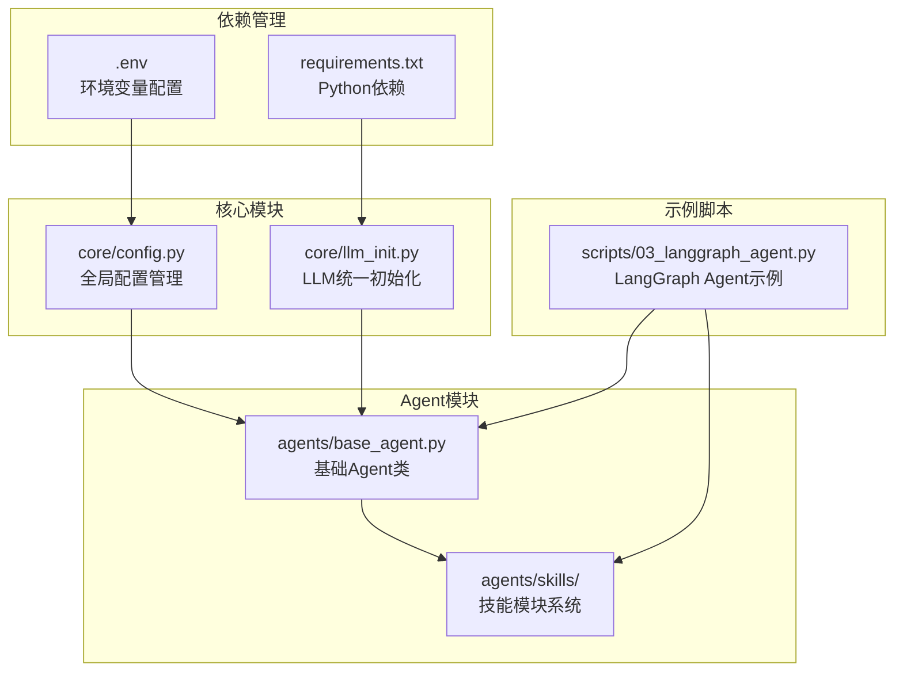

**图表来源**
- [README.md:7-39](file://README.md#L7-L39)
- [requirements.txt:1-34](file://requirements.txt#L1-L34)

**章节来源**
- [README.md:1-80](file://README.md#L1-L80)
- [requirements.txt:1-34](file://requirements.txt#L1-L34)

## 核心组件

### Agent状态管理系统

框架定义了标准的Agent状态结构，用于维护对话历史和执行状态：

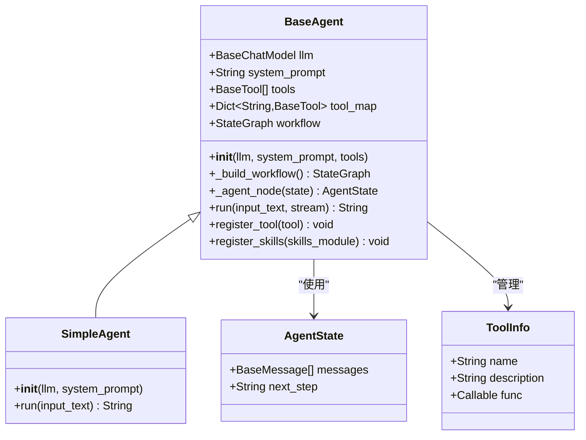

**图表来源**
- [agents/base_agent.py:12-50](file://agents/base_agent.py#L12-L50)
- [agents/base_agent.py:26-178](file://agents/base_agent.py#L26-L178)

### 工具系统架构

工具系统采用模块化设计，支持动态加载和注册：

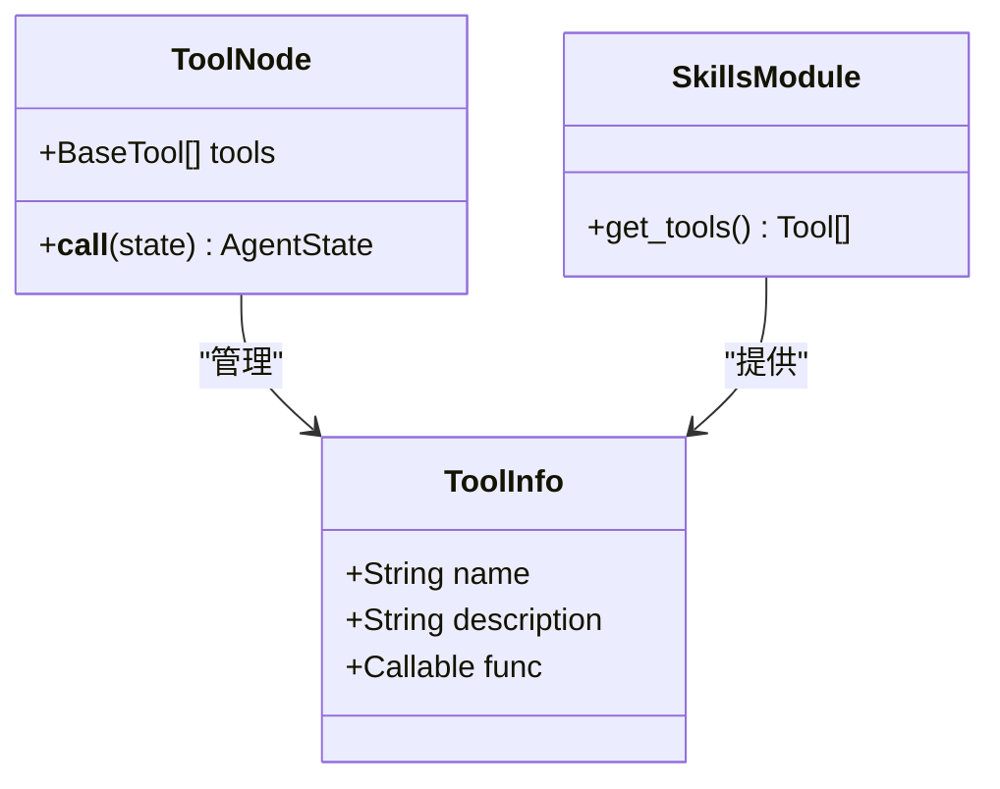

**图表来源**
- [agents/base_agent.py:58-74](file://agents/base_agent.py#L58-L74)
- [agents/skills/example_skill.py:59-82](file://agents/skills/example_skill.py#L59-L82)

**章节来源**
- [agents/base_agent.py:12-178](file://agents/base_agent.py#L12-L178)
- [agents/skills/example_skill.py:1-95](file://agents/skills/example_skill.py#L1-L95)

## 架构概览

Agent智能体框架的整体架构基于LangGraph的状态图设计模式：

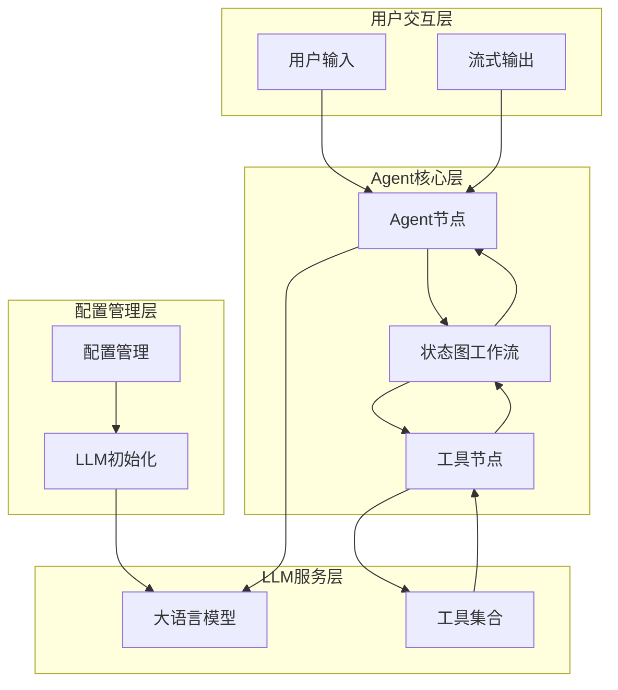

**图表来源**
- [agents/base_agent.py:51-74](file://agents/base_agent.py#L51-L74)
- [core/llm_init.py:18-48](file://core/llm_init.py#L18-L48)

### 状态流转机制

Agent的工作流遵循严格的条件分支逻辑：

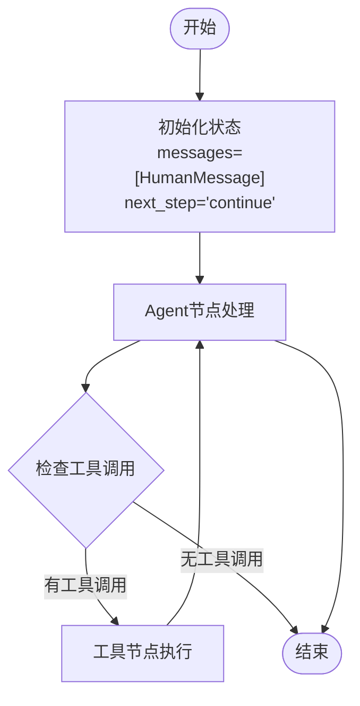

**图表来源**
- [agents/base_agent.py:76-98](file://agents/base_agent.py#L76-L98)
- [agents/base_agent.py:92-94](file://agents/base_agent.py#L92-L94)

## 详细组件分析

### BaseAgent类详解

BaseAgent是整个框架的核心类，实现了完整的Agent生命周期管理：

#### 初始化流程

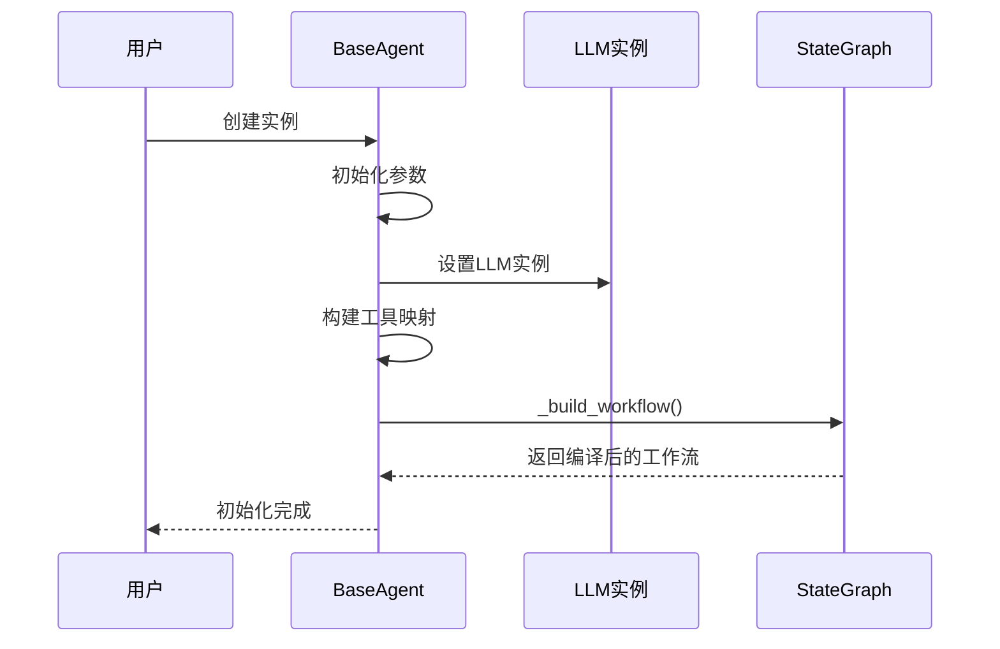

**图表来源**
- [agents/base_agent.py:29-49](file://agents/base_agent.py#L29-L49)
- [agents/base_agent.py:51-74](file://agents/base_agent.py#L51-L74)

#### 工作流构建策略

BaseAgent采用条件分支的工作流设计，支持动态工具调用：

| 节点类型 | 功能描述 | 条件逻辑 |
|---------|----------|----------|
| agent节点 | 主要推理节点 | 检查是否有工具调用 |
| tools节点 | 工具执行节点 | 仅当存在工具时启用 |
| 条件边 | 状态转换控制 | "continue"/"end"分支 |

#### 工具注册机制

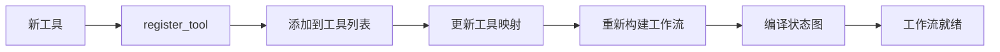

**图表来源**
- [agents/base_agent.py:138-148](file://agents/base_agent.py#L138-L148)

**章节来源**
- [agents/base_agent.py:26-178](file://agents/base_agent.py#L26-L178)

### 技能模块系统

技能模块系统提供了模块化的工具组织方式：

#### 技能模块规范

每个技能模块必须遵循以下规范：
- 提供`get_tools()`函数返回工具列表
- 工具函数应有清晰的文档字符串
- 支持参数验证和错误处理

#### 示例技能实现

示例技能模块展示了三种不同类型的工具：

| 工具名称 | 功能描述 | 参数类型 | 安全考虑 |
|---------|----------|----------|----------|
| get_current_time | 获取当前时间 | 无 | 无风险 |
| calculate | 计算数学表达式 | 字符串表达式 | 输入验证 |
| search_knowledge | 搜索知识库 | 关键词查询 | 无风险 |

**章节来源**
- [agents/skills/example_skill.py:1-95](file://agents/skills/example_skill.py#L1-L95)
- [agents/skills/__init__.py:1-13](file://agents/skills/__init__.py#L1-L13)

### LLM集成架构

框架支持多种LLM提供商，通过统一的初始化接口实现：

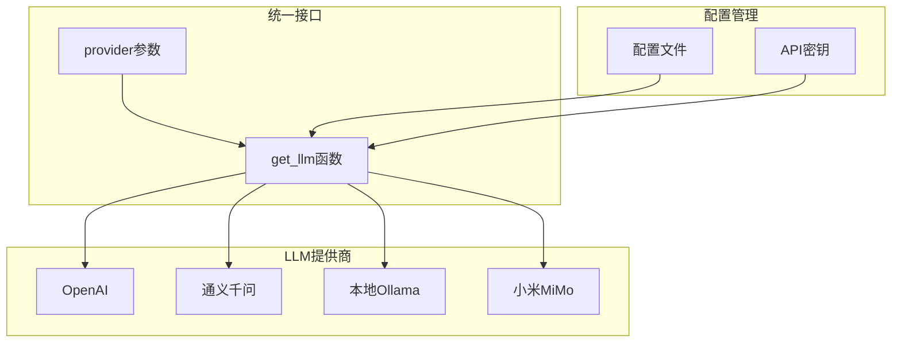

**图表来源**
- [core/llm_init.py:18-48](file://core/llm_init.py#L18-L48)
- [core/config.py:24-47](file://core/config.py#L24-L47)

**章节来源**
- [core/llm_init.py:1-131](file://core/llm_init.py#L1-L131)
- [core/config.py:1-68](file://core/config.py#L1-L68)

## 依赖关系分析

### 核心依赖关系

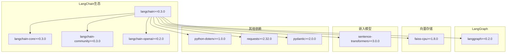

**图表来源**
- [requirements.txt:1-34](file://requirements.txt#L1-L34)

### 内部模块依赖

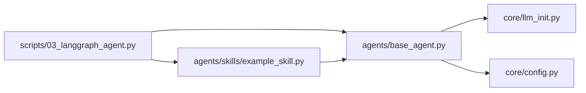

**图表来源**
- [scripts/03_langgraph_agent.py:10-13](file://scripts/03_langgraph_agent.py#L10-L13)

**章节来源**
- [requirements.txt:1-34](file://requirements.txt#L1-L34)

## 性能考虑

### 流式输出优化

框架支持流式输出，适用于长文本生成场景：

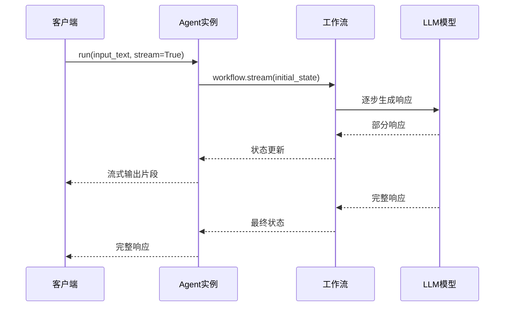

**图表来源**
- [agents/base_agent.py:129-136](file://agents/base_agent.py#L129-L136)

### 工具调用性能

工具调用的性能取决于多个因素：
- LLM推理时间
- 工具执行时间
- 网络延迟（外部API）
- 缓存策略

## 故障排除指南

### 常见问题诊断

#### API密钥配置问题

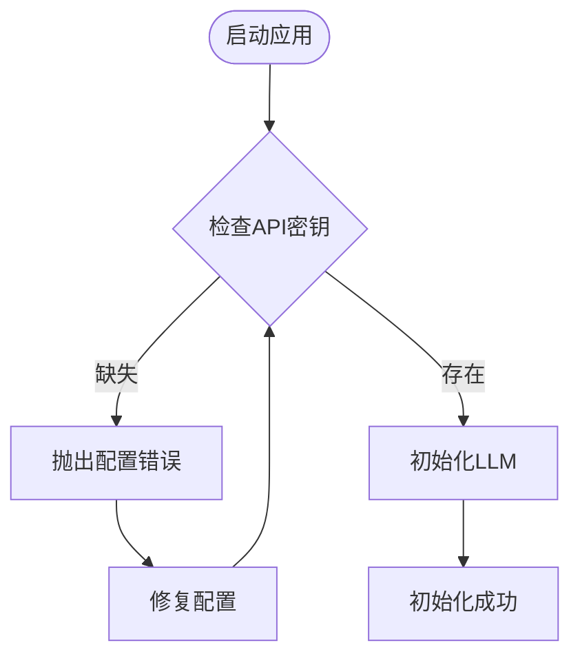

**图表来源**
- [core/llm_init.py:52-53](file://core/llm_init.py#L52-L53)
- [core/llm_init.py:67-68](file://core/llm_init.py#L67-L68)

#### 工具调用失败处理

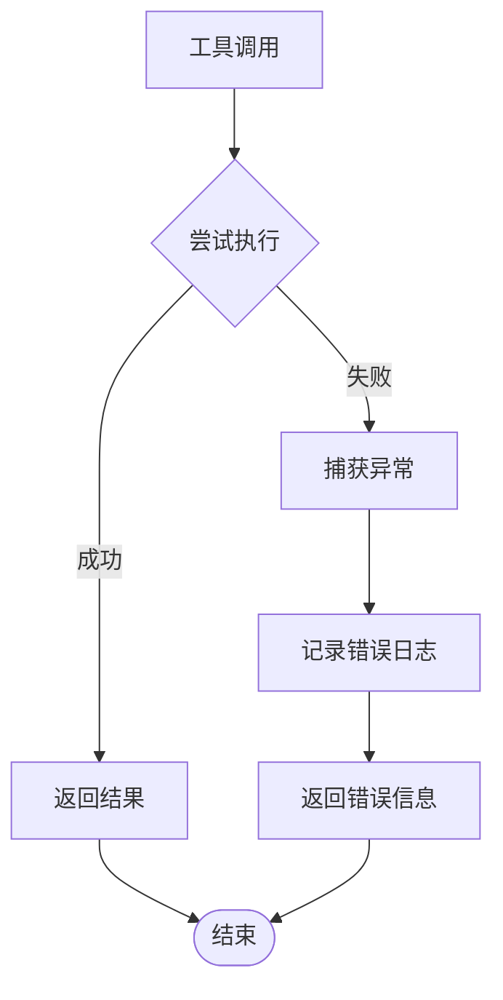

**图表来源**
- [agents/skills/example_skill.py:20-29](file://agents/skills/example_skill.py#L20-L29)

### 调试技巧

1. **启用LangSmith追踪**：通过环境变量启用详细的LLM调用追踪
2. **检查工作流状态**：使用`workflow.get_state()`检查中间状态
3. **验证工具映射**：确认工具名称和函数映射正确
4. **监控内存使用**：定期清理不必要的对话历史

**章节来源**
- [core/config.py:31-34](file://core/config.py#L31-L34)
- [agents/base_agent.py:138-148](file://agents/base_agent.py#L138-L148)

## 结论

Agent智能体框架提供了一个完整、可扩展的LLM智能体解决方案。通过LangGraph的状态图设计，框架实现了灵活的工作流编排；通过模块化的技能系统，实现了工具的动态管理和扩展；通过统一的LLM初始化接口，支持多种模型提供商。

框架的主要优势包括：
- **模块化设计**：清晰的职责分离和可扩展性
- **状态管理**：完善的对话历史和执行状态跟踪
- **工具系统**：灵活的工具注册和调用机制
- **多模型支持**：统一接口支持多种LLM提供商
- **性能优化**：支持流式输出和异步处理

## 附录

### 开发工作流程

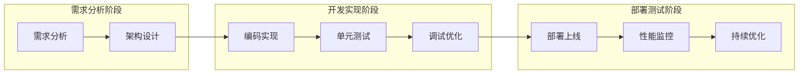

### 安全最佳实践

1. **API密钥管理**：使用环境变量存储敏感信息
2. **输入验证**：对所有用户输入进行验证和清理
3. **工具权限控制**：限制工具调用的权限范围
4. **日志脱敏**：避免在日志中记录敏感信息
5. **资源限制**：设置合理的超时和重试机制

### 性能监控指标

- **响应时间**：从接收请求到返回结果的时间
- **吞吐量**：每秒处理的请求数量
- **错误率**：工具调用和LLM调用的失败比例
- **内存使用**：Agent实例和工作流的状态占用
- **并发处理**：同时处理的用户数量