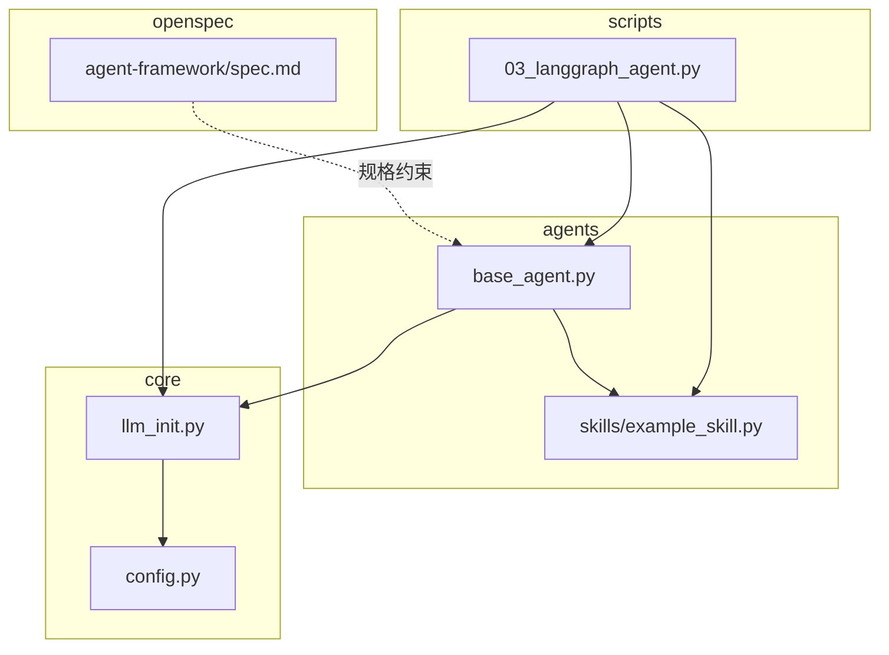
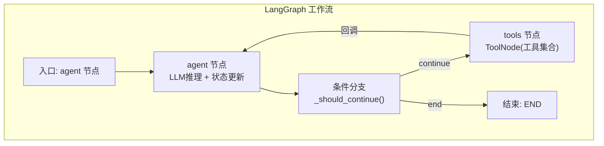
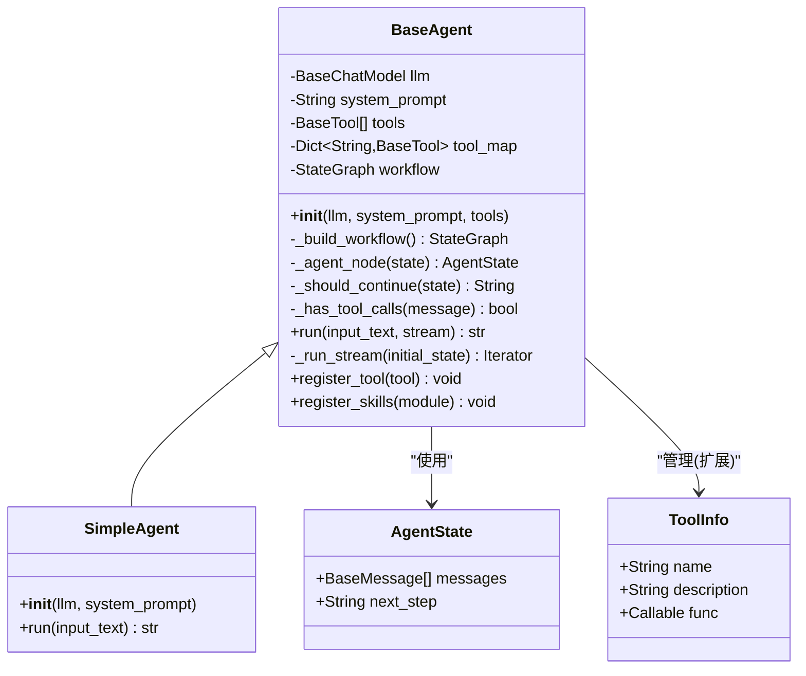
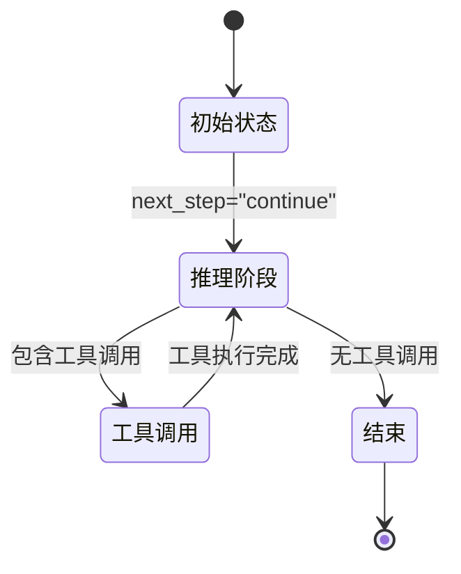
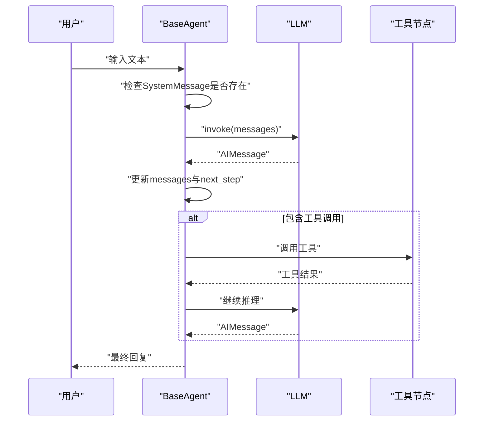
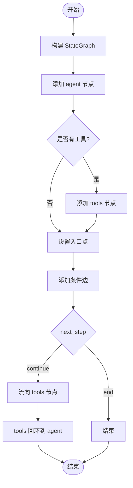
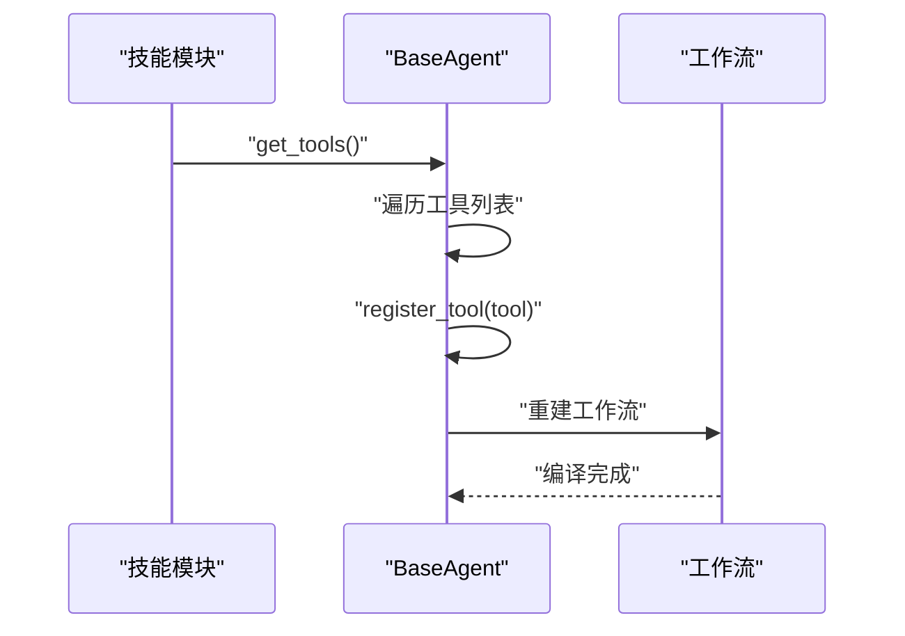
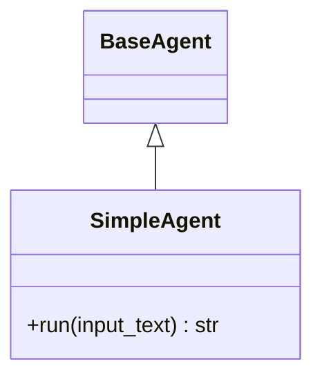
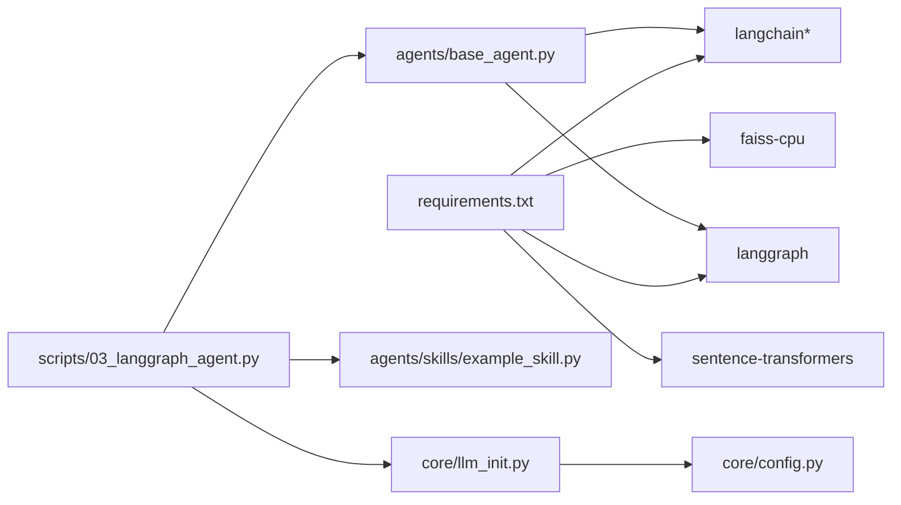

# 基础Agent架构设计

<cite>
**本文档引用的文件**
- [agents/base_agent.py](file://agents/base_agent.py)
- [agents/skills/example_skill.py](file://agents/skills/example_skill.py)
- [scripts/03_langgraph_agent.py](file://scripts/03_langgraph_agent.py)
- [core/config.py](file://core/config.py)
- [core/llm_init.py](file://core/llm_init.py)
- [README.md](file://README.md)
- [requirements.txt](file://requirements.txt)
- [openspec/changes/archive/2026-03-24-init-llm-project/specs/agent-framework/spec.md](file://openspec/changes/archive/2026-03-24-init-llm-project/specs/agent-framework/spec.md)
</cite>

## 目录
1. [简介](#简介)
2. [项目结构](#项目结构)
3. [核心组件](#核心组件)
4. [架构总览](#架构总览)
5. [详细组件分析](#详细组件分析)
6. [依赖关系分析](#依赖关系分析)
7. [性能考虑](#性能考虑)
8. [故障排除指南](#故障排除指南)
9. [结论](#结论)
10. [附录](#附录)

## 简介
本文件面向基础Agent架构设计，围绕BaseAgent类的设计理念与架构模式进行深入解析，涵盖状态管理机制（AgentState）、消息传递协议、工作流编排原理，并详细分析LangGraph集成方式（StateGraph构建、节点定义、边连接逻辑、条件分支处理）。同时文档化状态转换规则、消息类型处理、系统提示词集成，提供完整的类继承体系说明（包含SimpleAgent的简化实现），并给出架构图表、状态流转图、消息传递流程图，解释设计决策的技术考量与性能优化策略。

## 项目结构
该项目采用模块化组织方式，核心模块如下：
- agents：智能体实现与技能系统
  - base_agent.py：基础Agent类与工作流编排
  - skills/：技能模块目录，提供可插拔工具集合
- core：通用配置与LLM初始化
  - config.py：全局配置与API密钥管理
  - llm_init.py：多提供商统一LLM初始化
- scripts：示例脚本与演示
  - 03_langgraph_agent.py：LangGraph Agent示例
- openspec：规格说明与需求文档
- README.md：项目说明与快速开始
- requirements.txt：依赖清单

**图表来源**
- [agents/base_agent.py:1-178](file://agents/base_agent.py#L1-L178)
- [agents/skills/example_skill.py:1-95](file://agents/skills/example_skill.py#L1-L95)
- [scripts/03_langgraph_agent.py:1-184](file://scripts/03_langgraph_agent.py#L1-L184)
- [core/config.py:1-68](file://core/config.py#L1-L68)
- [core/llm_init.py:1-131](file://core/llm_init.py#L1-L131)
- [openspec/changes/archive/2026-03-24-init-llm-project/specs/agent-framework/spec.md:1-31](file://openspec/changes/archive/2026-03-24-init-llm-project/specs/agent-framework/spec.md#L1-L31)

**章节来源**
- [README.md:1-80](file://README.md#L1-L80)
- [requirements.txt:1-34](file://requirements.txt#L1-L34)

## 核心组件
本节聚焦于基础Agent的核心组成与职责边界：
- AgentState：定义智能体的状态结构，包含消息列表与下一步动作标记
- BaseAgent：封装LLM调用、工具注册、工作流编排与消息处理
- SimpleAgent：继承自BaseAgent，提供无工具场景下的简化实现
- ToolInfo：工具元信息载体（用于扩展或工具管理）
- 技能模块：通过标准接口提供工具集合，便于动态注册

关键职责划分：
- 状态管理：维护消息历史与控制流转标志
- 消息协议：统一处理HumanMessage、AIMessage、SystemMessage
- 工作流编排：基于LangGraph构建StateGraph，定义节点与边
- 工具集成：动态注册工具，支持条件分支与循环调用
- 流式输出：支持增量响应输出

**章节来源**
- [agents/base_agent.py:12-24](file://agents/base_agent.py#L12-L24)
- [agents/base_agent.py:26-178](file://agents/base_agent.py#L26-L178)
- [agents/skills/example_skill.py:59-82](file://agents/skills/example_skill.py#L59-L82)

## 架构总览
整体架构基于LangGraph的StateGraph，采用“Agent节点 + 工具节点”的双节点工作流，配合条件分支实现“是否继续”的决策逻辑。系统通过LLM驱动推理，必要时调用工具获取信息或执行操作，最终生成回复。

**图表来源**
- [agents/base_agent.py:51-74](file://agents/base_agent.py#L51-L74)
- [agents/base_agent.py:92-94](file://agents/base_agent.py#L92-L94)

## 详细组件分析

### BaseAgent类设计与实现
BaseAgent是整个Agent框架的核心，负责：
- 初始化与配置：接收LLM实例、系统提示词、工具列表
- 工作流构建：使用StateGraph定义节点与边，编译为可执行工作流
- 消息处理：在Agent节点中注入系统提示词，调用LLM生成响应
- 条件控制：根据响应是否包含工具调用决定是否继续
- 工具注册：支持动态注册工具并重建工作流
- 运行模式：支持同步与流式两种执行模式

**图表来源**
- [agents/base_agent.py:12-24](file://agents/base_agent.py#L12-L24)
- [agents/base_agent.py:26-178](file://agents/base_agent.py#L26-L178)

**章节来源**
- [agents/base_agent.py:29-49](file://agents/base_agent.py#L29-L49)
- [agents/base_agent.py:51-74](file://agents/base_agent.py#L51-L74)
- [agents/base_agent.py:76-90](file://agents/base_agent.py#L76-L90)
- [agents/base_agent.py:92-94](file://agents/base_agent.py#L92-L94)
- [agents/base_agent.py:96-98](file://agents/base_agent.py#L96-L98)
- [agents/base_agent.py:100-127](file://agents/base_agent.py#L100-L127)
- [agents/base_agent.py:129-136](file://agents/base_agent.py#L129-L136)
- [agents/base_agent.py:138-148](file://agents/base_agent.py#L138-L148)
- [agents/base_agent.py:150-160](file://agents/base_agent.py#L150-L160)
- [agents/base_agent.py:163-178](file://agents/base_agent.py#L163-L178)

### AgentState状态模型
AgentState采用TypedDict定义，包含两个字段：
- messages：消息列表，按时间顺序累积
- next_step：控制流转标志，决定是否继续调用工具

状态转换规则：
- 初始状态：next_step为"continue"
- Agent节点执行后：若响应包含工具调用则next_step="continue"，否则"end"
- 工具节点执行后：回调至Agent节点，继续推理

**图表来源**
- [agents/base_agent.py:12-16](file://agents/base_agent.py#L12-L16)
- [agents/base_agent.py:92-94](file://agents/base_agent.py#L92-L94)
- [agents/base_agent.py:87-90](file://agents/base_agent.py#L87-L90)

**章节来源**
- [agents/base_agent.py:12-16](file://agents/base_agent.py#L12-L16)
- [agents/base_agent.py:87-90](file://agents/base_agent.py#L87-L90)

### 消息传递协议
消息类型与处理策略：
- SystemMessage：系统提示词，仅在消息列表中不存在时自动注入
- HumanMessage：用户输入，作为对话历史的起点
- AIMessage：LLM生成的回复，作为后续推理的基础

消息处理流程：
- 在Agent节点执行前，检查是否已存在SystemMessage；若不存在则插入
- 调用LLM后，将新生成的AIMessage追加到消息列表
- 最终输出时，从消息列表末尾向前查找第一条AIMessage作为最终回复

**图表来源**
- [agents/base_agent.py:76-90](file://agents/base_agent.py#L76-L90)
- [agents/base_agent.py:100-127](file://agents/base_agent.py#L100-L127)

**章节来源**
- [agents/base_agent.py:76-90](file://agents/base_agent.py#L76-L90)
- [agents/base_agent.py:100-127](file://agents/base_agent.py#L100-L127)

### LangGraph集成与工作流编排
工作流构建步骤：
- 定义StateGraph并指定AgentState
- 添加agent节点：绑定内部方法作为节点逻辑
- 条件性添加tools节点：当存在工具时添加ToolNode
- 设置入口点为agent节点
- 添加条件边：根据_next_step决定流向tools或结束
- 若存在工具，添加从tools到agent的回环边

条件分支处理：
- _should_continue：读取state["next_step"]，返回"continue"或"end"
- _has_tool_calls：检查AIMessage是否包含tool_calls属性

**图表来源**
- [agents/base_agent.py:51-74](file://agents/base_agent.py#L51-L74)
- [agents/base_agent.py:92-94](file://agents/base_agent.py#L92-L94)
- [agents/base_agent.py:96-98](file://agents/base_agent.py#L96-L98)

**章节来源**
- [agents/base_agent.py:51-74](file://agents/base_agent.py#L51-L74)
- [agents/base_agent.py:92-94](file://agents/base_agent.py#L92-L94)
- [agents/base_agent.py:96-98](file://agents/base_agent.py#L96-L98)

### 工具系统与技能模块
工具注册与动态加载：
- register_tool：向工具列表与映射表添加工具，并重建工作流
- register_skills：从技能模块动态加载工具并批量注册
- ToolNode：LangGraph预置节点，封装工具调用逻辑

技能模块示例：
- example_skill提供三个工具：获取当前时间、计算表达式、搜索知识库
- 工具通过Tool包装，包含名称、描述与函数引用

**图表来源**
- [agents/base_agent.py:138-148](file://agents/base_agent.py#L138-L148)
- [agents/base_agent.py:150-160](file://agents/base_agent.py#L150-L160)
- [agents/skills/example_skill.py:59-82](file://agents/skills/example_skill.py#L59-L82)

**章节来源**
- [agents/base_agent.py:138-148](file://agents/base_agent.py#L138-L148)
- [agents/base_agent.py:150-160](file://agents/base_agent.py#L150-L160)
- [agents/skills/example_skill.py:59-82](file://agents/skills/example_skill.py#L59-L82)

### SimpleAgent简化实现
SimpleAgent继承BaseAgent，提供无工具场景的简化版本：
- run方法直接构造消息列表并调用LLM
- 无需工作流编排，适合纯对话场景
- 保持与BaseAgent一致的消息处理语义

**图表来源**
- [agents/base_agent.py:163-178](file://agents/base_agent.py#L163-L178)

**章节来源**
- [agents/base_agent.py:163-178](file://agents/base_agent.py#L163-L178)

## 依赖关系分析
- 外部依赖：LangChain、LangGraph、FAISS、sentence-transformers等
- 内部依赖：agents依赖core提供的LLM初始化与配置；scripts演示脚本依赖agents与skills

**图表来源**
- [requirements.txt:1-34](file://requirements.txt#L1-L34)
- [agents/base_agent.py:1-10](file://agents/base_agent.py#L1-L10)
- [scripts/03_langgraph_agent.py:1-14](file://scripts/03_langgraph_agent.py#L1-L14)
- [core/llm_init.py:1-15](file://core/llm_init.py#L1-L15)
- [core/config.py:1-47](file://core/config.py#L1-L47)

**章节来源**
- [requirements.txt:1-34](file://requirements.txt#L1-L34)
- [agents/base_agent.py:1-10](file://agents/base_agent.py#L1-L10)
- [scripts/03_langgraph_agent.py:10-13](file://scripts/03_langgraph_agent.py#L10-L13)
- [core/llm_init.py:1-15](file://core/llm_init.py#L1-L15)
- [core/config.py:1-47](file://core/config.py#L1-L47)

## 性能考虑
- 工作流编译：StateGraph.compile()一次性编译，避免重复构建开销
- 动态工具注册：注册工具会重建工作流，建议批量注册或在应用启动时完成
- 流式输出：stream模式逐段输出，降低首屏延迟，提升用户体验
- 消息累积：消息列表随对话增长，建议在业务层限制最大长度或定期清理
- LLM调用：根据提供商选择合适模型与温度参数，平衡质量与成本

[本节为通用性能指导，不直接分析具体文件]

## 故障排除指南
- API密钥缺失：检查.env配置与core/config.py中的密钥读取逻辑
- 模型不可用：确认core/llm_init.py中提供商与模型名称正确
- 工具调用失败：验证工具描述与函数签名，确保ToolNode正确识别
- 工作流异常：检查StateGraph节点与边连接逻辑，确认条件分支返回值

**章节来源**
- [core/config.py:24-67](file://core/config.py#L24-L67)
- [core/llm_init.py:50-108](file://core/llm_init.py#L50-L108)
- [agents/base_agent.py:51-74](file://agents/base_agent.py#L51-L74)

## 结论
本架构以LangGraph为核心，通过明确的状态模型与消息协议，实现了可扩展、可演进的Agent工作流。BaseAgent提供了完善的工具集成与动态注册能力，SimpleAgent满足纯对话场景。整体设计兼顾了灵活性与性能，为后续扩展（如记忆、多轮对话、复杂条件分支）奠定了坚实基础。

[本节为总结性内容，不直接分析具体文件]

## 附录

### 设计决策与技术考量
- 采用LangGraph StateGraph：标准化工作流定义，支持条件分支与循环
- TypedDict状态模型：类型安全与清晰的数据契约
- ToolNode封装：复用LangGraph预置能力，减少自定义复杂度
- 动态工具注册：提升可扩展性，支持插件化技能系统
- 流式输出：改善交互体验，适用于实时对话场景

**章节来源**
- [agents/base_agent.py:51-74](file://agents/base_agent.py#L51-L74)
- [agents/base_agent.py:138-148](file://agents/base_agent.py#L138-L148)

### 规格约束与需求
- 基础Agent类需支持LangGraph StateGraph构建、工具注册、记忆功能与流式输出
- 技能系统需支持独立模块、工具函数与描述、动态加载

**章节来源**
- [openspec/changes/archive/2026-03-24-init-llm-project/specs/agent-framework/spec.md:1-31](file://openspec/changes/archive/2026-03-24-init-llm-project/specs/agent-framework/spec.md#L1-L31)