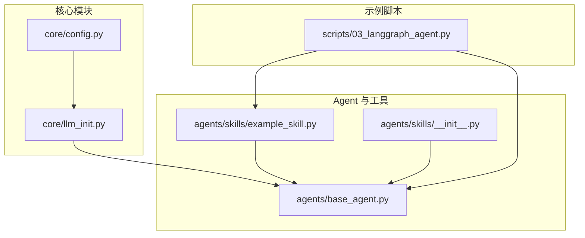
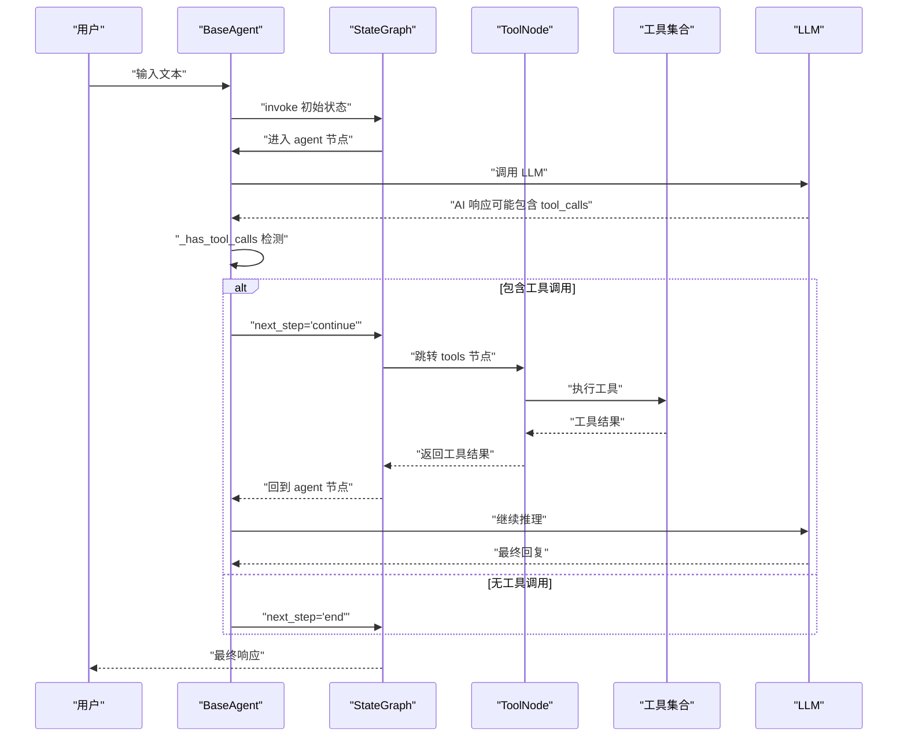
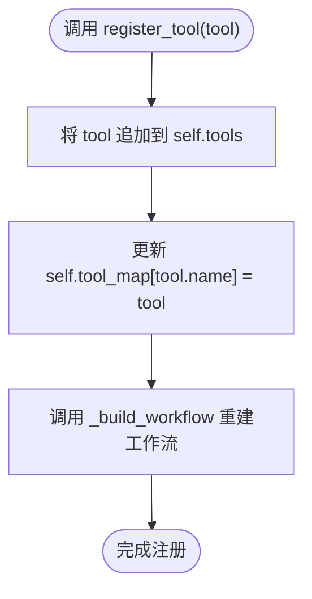
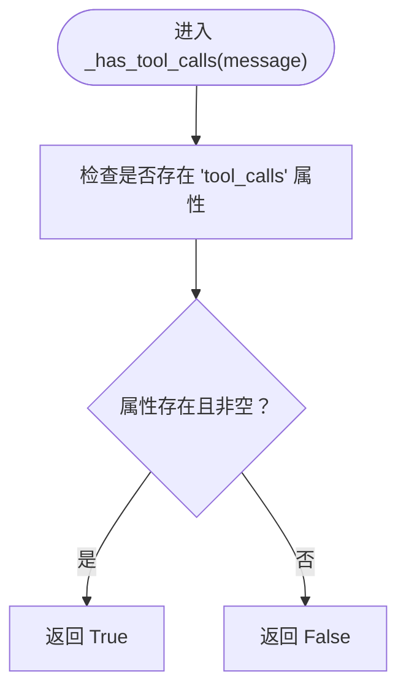
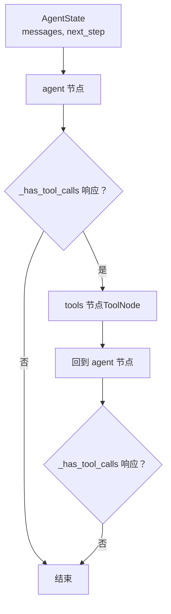
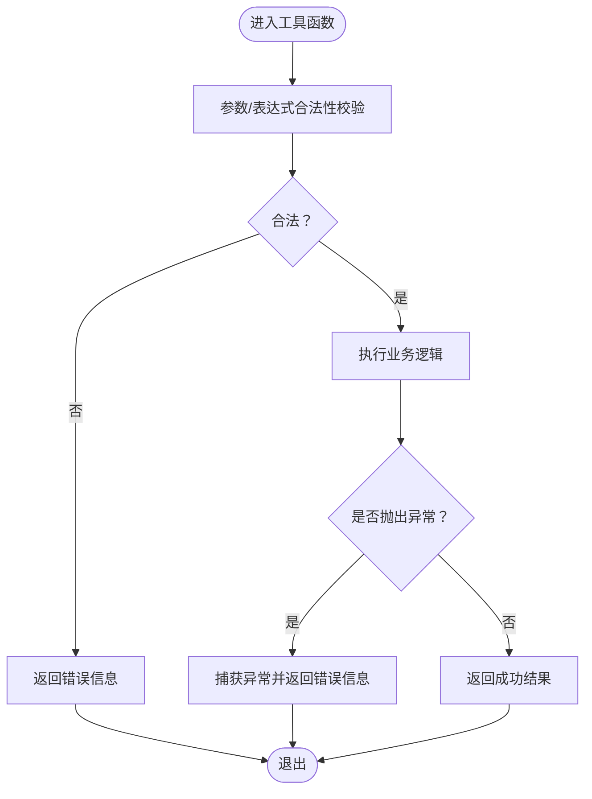
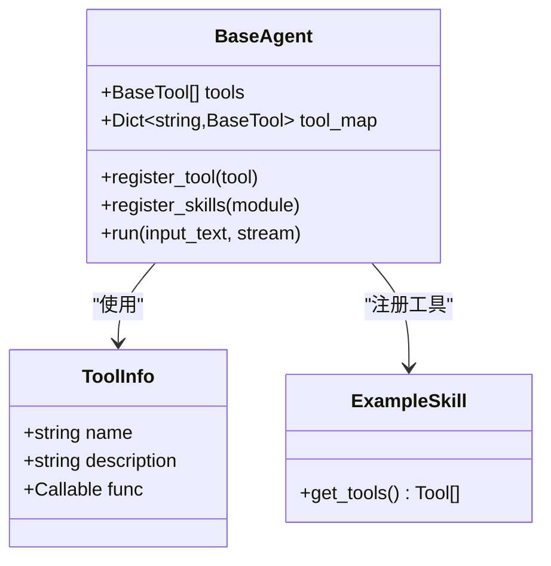
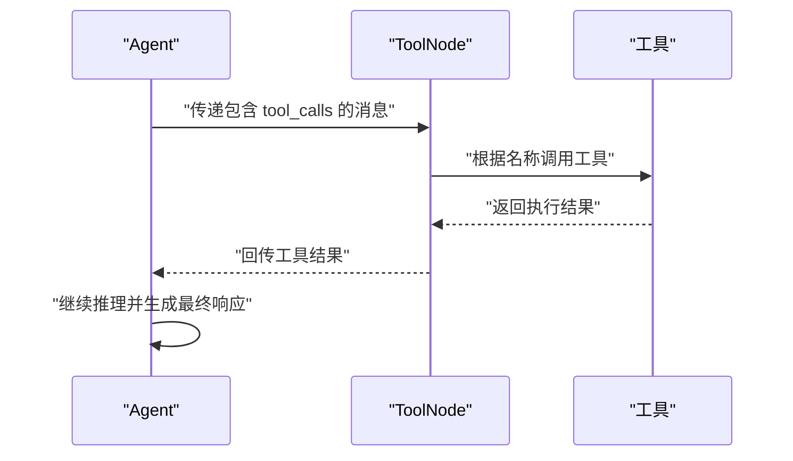
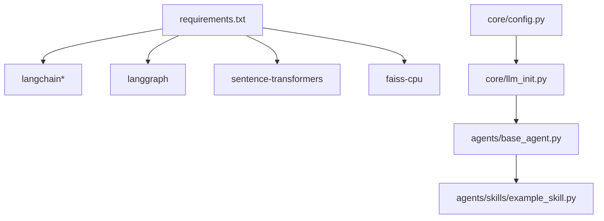

# 工具系统集成

<cite>
**本文引用的文件**
- [README.md](file://README.md)
- [requirements.txt](file://requirements.txt)
- [core/config.py](file://core/config.py)
- [core/llm_init.py](file://core/llm_init.py)
- [agents/base_agent.py](file://agents/base_agent.py)
- [agents/skills/example_skill.py](file://agents/skills/example_skill.py)
- [agents/skills/__init__.py](file://agents/skills/__init__.py)
- [scripts/03_langgraph_agent.py](file://scripts/03_langgraph_agent.py)
</cite>

## 目录
1. [简介](#简介)
2. [项目结构](#项目结构)
3. [核心组件](#核心组件)
4. [架构总览](#架构总览)
5. [详细组件分析](#详细组件分析)
6. [依赖分析](#依赖分析)
7. [性能考量](#性能考量)
8. [故障排查指南](#故障排查指南)
9. [结论](#结论)
10. [附录](#附录)

## 简介
本文件面向工具系统集成，围绕以下主题展开：工具注册机制（register_tool 方法）、工具映射管理（tool_map 字典）、工具调用检测（_has_tool_calls 方法），以及与 ToolNode 的集成方式、工具参数验证与错误处理策略。同时，文档化工具接口规范、工具包装机制、工具执行流程，并提供工具开发最佳实践、调试技巧、性能监控与安全考虑，以及从设计到集成测试的完整工作流程。

## 项目结构
该项目采用模块化组织，核心与工具系统主要分布在以下模块：
- 核心配置与模型初始化：core/config.py、core/llm_init.py
- Agent 与工具系统：agents/base_agent.py、agents/skills/example_skill.py、agents/skills/__init__.py
- 示例脚本：scripts/03_langgraph_agent.py
- 项目说明与依赖：README.md、requirements.txt

图表来源
- [core/config.py:1-50](file://core/config.py#L1-L50)
- [core/llm_init.py:1-131](file://core/llm_init.py#L1-L131)
- [agents/base_agent.py:26-178](file://agents/base_agent.py#L26-L178)
- [agents/skills/example_skill.py:1-95](file://agents/skills/example_skill.py#L1-L95)
- [agents/skills/__init__.py:1-12](file://agents/skills/__init__.py#L1-L12)
- [scripts/03_langgraph_agent.py:1-184](file://scripts/03_langgraph_agent.py#L1-L184)

章节来源
- [README.md:1-80](file://README.md#L1-L80)
- [requirements.txt:1-34](file://requirements.txt#L1-L34)

## 核心组件
- BaseAgent：封装 LangGraph StateGraph 工作流，负责工具注册、工具映射、工具调用检测、Agent 节点逻辑与运行流程。
- ToolNode：LangGraph 内置工具节点，接收工具列表并执行工具调用。
- ToolInfo：工具元信息容器（字段包含名称、描述、可调用对象）。
- 示例技能模块 example_skill：提供三个具体工具函数及 get_tools 工具工厂，展示工具包装与导出方式。
- LLM 初始化：统一管理多提供商模型实例化，确保 Agent 可以在不同后端间切换。

章节来源
- [agents/base_agent.py:26-178](file://agents/base_agent.py#L26-L178)
- [agents/skills/example_skill.py:59-82](file://agents/skills/example_skill.py#L59-L82)
- [core/llm_init.py:18-131](file://core/llm_init.py#L18-L131)

## 架构总览
工具系统集成的关键在于：Agent 在初始化时建立 StateGraph，其中包含“agent”节点与可选的“tools”节点；当 LLM 响应包含工具调用时，工作流会将控制权交给 ToolNode，执行工具并回传结果，再回到 Agent 继续推理。

图表来源
- [agents/base_agent.py:51-98](file://agents/base_agent.py#L51-L98)
- [agents/base_agent.py:138-148](file://agents/base_agent.py#L138-L148)
- [agents/skills/example_skill.py:59-82](file://agents/skills/example_skill.py#L59-L82)

## 详细组件分析

### 工具注册机制（register_tool 方法）
- 作用：向 Agent 注册单个工具，更新内部工具列表与工具名到工具实例的映射，并重新编译工作流以启用新工具。
- 关键行为：
  - 将工具追加到 tools 列表
  - 更新 tool_map[name] = tool
  - 调用 _build_workflow 重建 StateGraph
- 影响范围：影响后续工作流编译与运行路径，确保 ToolNode 能识别新增工具。

图表来源
- [agents/base_agent.py:138-148](file://agents/base_agent.py#L138-L148)

章节来源
- [agents/base_agent.py:138-148](file://agents/base_agent.py#L138-L148)

### 工具映射管理（tool_map 字典）
- 作用：维护工具名到工具实例的快速查找映射，便于动态注册与访问。
- 初始化：在构造函数中由 tools 列表构建。
- 使用场景：注册新工具时同步更新，保证名称唯一性与快速定位。

章节来源
- [agents/base_agent.py:46](file://agents/base_agent.py#L46)

### 工具调用检测（_has_tool_calls 方法）
- 作用：判断 LLM 响应消息是否包含工具调用（tool_calls）。
- 判定依据：检查消息对象是否存在 tool_calls 属性且非空。
- 控制流影响：决定工作流是否跳转至 ToolNode 执行工具。

图表来源
- [agents/base_agent.py:96-98](file://agents/base_agent.py#L96-L98)

章节来源
- [agents/base_agent.py:96-98](file://agents/base_agent.py#L96-L98)

### ToolNode 集成方式
- 集成点：当 Agent 拥有工具时，在工作流中添加 ToolNode(self.tools) 节点。
- 触发条件：_should_continue 返回 "continue" 时，工作流跳转至 ToolNode。
- 执行顺序：ToolNode 执行工具后将结果回传给工作流，再回到 Agent 继续推理。

图表来源
- [agents/base_agent.py:51-74](file://agents/base_agent.py#L51-L74)
- [agents/base_agent.py:92-94](file://agents/base_agent.py#L92-L94)

章节来源
- [agents/base_agent.py:51-74](file://agents/base_agent.py#L51-L74)
- [agents/base_agent.py:92-94](file://agents/base_agent.py#L92-L94)

### 工具参数验证与错误处理
- 参数验证策略：
  - 计算工具对表达式字符集进行白名单校验，限制仅允许数字、基本运算符与括号，避免危险字符。
  - 对异常进行捕获并返回明确的错误信息，避免崩溃传播。
- 错误处理策略：
  - 工具函数内部捕获异常，返回可读的错误字符串，保持 Agent 的稳定性。
  - Agent 层面通过工具调用检测与工作流控制，避免死循环或无限重试。

图表来源
- [agents/skills/example_skill.py:13-29](file://agents/skills/example_skill.py#L13-L29)

章节来源
- [agents/skills/example_skill.py:13-29](file://agents/skills/example_skill.py#L13-L29)

### 工具接口规范与包装机制
- 接口规范：
  - 工具需具备名称（name）、描述（description）与可调用函数（func）。
  - 工具工厂函数 get_tools 返回工具列表，便于批量注册。
- 包装机制：
  - 使用 LangChain 的 Tool 类型进行封装，确保与 ToolNode 的兼容性。
  - 示例中通过 lambda 或直接绑定函数作为工具的实现。

图表来源
- [agents/base_agent.py:18-24](file://agents/base_agent.py#L18-L24)
- [agents/base_agent.py:138-160](file://agents/base_agent.py#L138-L160)
- [agents/skills/example_skill.py:59-82](file://agents/skills/example_skill.py#L59-L82)

章节来源
- [agents/base_agent.py:18-24](file://agents/base_agent.py#L18-L24)
- [agents/base_agent.py:138-160](file://agents/base_agent.py#L138-L160)
- [agents/skills/example_skill.py:59-82](file://agents/skills/example_skill.py#L59-L82)

### 工具执行流程
- 工具执行由 ToolNode 负责，Agent 仅负责触发与结果回传。
- 典型流程：Agent 节点生成包含 tool_calls 的响应 → 工作流跳转至 ToolNode → ToolNode 执行工具 → 工具结果回传 → Agent 继续推理。

图表来源
- [agents/base_agent.py:58-72](file://agents/base_agent.py#L58-L72)
- [agents/base_agent.py:96-98](file://agents/base_agent.py#L96-L98)

章节来源
- [agents/base_agent.py:58-72](file://agents/base_agent.py#L58-L72)
- [agents/base_agent.py:96-98](file://agents/base_agent.py#L96-L98)

### 工具开发最佳实践
- 命名规范：
  - 工具名称应语义清晰、唯一，避免与已有工具冲突。
  - 建议使用动词短语或动宾结构，便于 LLM 选择。
- 描述编写：
  - 描述需简洁明确，说明用途、输入格式与预期输出。
  - 可包含典型输入示例，帮助 LLM 正确调用。
- 参数设计：
  - 明确必填/可选参数，提供默认值或占位符。
  - 对输入进行白名单校验或严格解析，避免注入风险。
- 安全考虑：
  - 严禁在工具中执行任意代码或系统命令。
  - 对外部 API 调用增加超时与重试策略，避免阻塞。
- 可测试性：
  - 为工具提供单元测试，覆盖正常与异常路径。
  - 提供最小可复现的示例，便于集成验证。

章节来源
- [agents/skills/example_skill.py:13-29](file://agents/skills/example_skill.py#L13-L29)
- [agents/skills/example_skill.py:59-82](file://agents/skills/example_skill.py#L59-L82)

### 工具调试技巧
- 开启流式输出：通过 Agent.run(stream=True) 观察中间响应，定位工具调用时机。
- 日志与追踪：结合 LangSmith 或日志系统记录工具调用参数与结果。
- 逐步隔离：先单独测试工具函数，再集成到 Agent 工作流。
- 模拟 LLM：在缺少支持 function calling 的模型时，可通过系统提示词模拟工具调用过程，验证 Agent 逻辑。

章节来源
- [agents/base_agent.py:129-136](file://agents/base_agent.py#L129-L136)
- [scripts/03_langgraph_agent.py:77-79](file://scripts/03_langgraph_agent.py#L77-L79)

### 性能监控
- 工具执行耗时：记录每个工具的执行时间，识别瓶颈。
- LLM 调用成本：统计 tokens 与调用次数，优化提示词与工具调用频率。
- 并发与缓存：对重复查询结果进行缓存，减少重复调用。
- 资源限制：为工具设置最大执行时间与内存上限，防止资源耗尽。

章节来源
- [core/llm_init.py:18-131](file://core/llm_init.py#L18-L131)

### 安全考虑
- 输入验证：对所有外部输入进行白名单过滤与长度限制。
- 权限控制：工具访问外部系统时遵循最小权限原则。
- 传输加密：对外部 API 调用使用 HTTPS，保护敏感数据。
- 审计日志：记录工具调用与关键操作，便于审计与回溯。

章节来源
- [agents/skills/example_skill.py:20-29](file://agents/skills/example_skill.py#L20-L29)

### 工具开发工作流程（从设计到集成测试）
- 设计阶段：
  - 明确工具职责与输入输出，编写接口规范与示例。
- 实现阶段：
  - 实现工具函数，加入参数校验与异常处理。
  - 提供 get_tools 工厂函数，统一导出工具集合。
- 验证阶段：
  - 单元测试：覆盖正常、边界与异常场景。
  - 集成测试：在 Agent 中注册工具，验证工作流与调用链路。
- 部署与监控：
  - 上线前进行性能与安全评估。
  - 持续监控工具调用成功率与耗时。

章节来源
- [agents/skills/example_skill.py:59-82](file://agents/skills/example_skill.py#L59-L82)
- [scripts/03_langgraph_agent.py:55-75](file://scripts/03_langgraph_agent.py#L55-L75)

## 依赖分析
- LangChain/LangGraph：提供 LLM、消息类型、工具节点与工作流编排能力。
- 多提供商模型：通过统一初始化模块支持 OpenAI、通义千问、Ollama、MiMo 等。
- 环境变量与配置：集中管理 API Key、默认模型与向量存储路径。

图表来源
- [requirements.txt:1-34](file://requirements.txt#L1-L34)
- [core/config.py:1-50](file://core/config.py#L1-L50)
- [core/llm_init.py:18-131](file://core/llm_init.py#L18-L131)
- [agents/base_agent.py:26-178](file://agents/base_agent.py#L26-L178)
- [agents/skills/example_skill.py:1-95](file://agents/skills/example_skill.py#L1-L95)

章节来源
- [requirements.txt:1-34](file://requirements.txt#L1-L34)
- [core/config.py:1-50](file://core/config.py#L1-L50)
- [core/llm_init.py:18-131](file://core/llm_init.py#L18-L131)

## 性能考量
- 工具调用频率：尽量合并多次调用，减少往返开销。
- LLM 调用成本：优化提示词与工具调用时机，降低 tokens 使用。
- 缓存策略：对静态或低频变更的数据进行缓存，提升响应速度。
- 并发控制：限制并发工具数量，避免资源争用。

## 故障排查指南
- 工具未生效：
  - 检查是否正确调用 register_tool 或 register_skills。
  - 确认工具名称唯一且与 LLM 期望一致。
- 工具调用失败：
  - 查看工具函数异常信息与日志。
  - 验证输入参数格式与范围。
- 工作流卡住：
  - 检查 _has_tool_calls 判定逻辑与 ToolNode 是否正确接入。
  - 确认工作流边条件与节点连接。

章节来源
- [agents/base_agent.py:138-160](file://agents/base_agent.py#L138-L160)
- [agents/base_agent.py:96-98](file://agents/base_agent.py#L96-L98)
- [agents/base_agent.py:51-74](file://agents/base_agent.py#L51-L74)

## 结论
本项目提供了清晰的工具系统集成方案：通过 BaseAgent 的 register_tool 与 register_skills，结合 tool_map 与 ToolNode，实现了可扩展、可维护的工具调用链路。配合严格的参数验证与错误处理策略，工具系统在安全性与稳定性方面得到保障。建议在实际工程中遵循命名与描述规范、加强单元与集成测试，并持续监控性能与安全指标。

## 附录
- 示例脚本展示了工具工厂函数的使用与手动调用演示，便于理解工具包装与调用流程。
- LLM 初始化模块支持多提供商切换，便于在不同环境下部署与测试。

章节来源
- [scripts/03_langgraph_agent.py:55-75](file://scripts/03_langgraph_agent.py#L55-L75)
- [core/llm_init.py:18-131](file://core/llm_init.py#L18-L131)