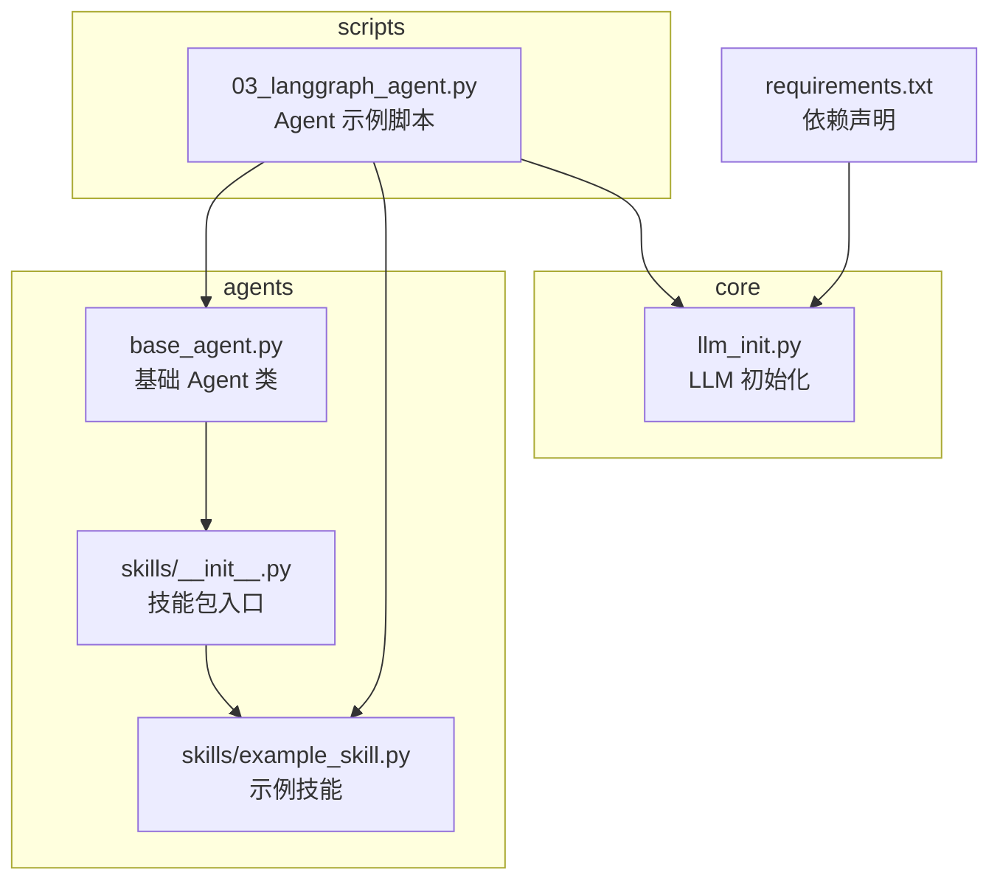
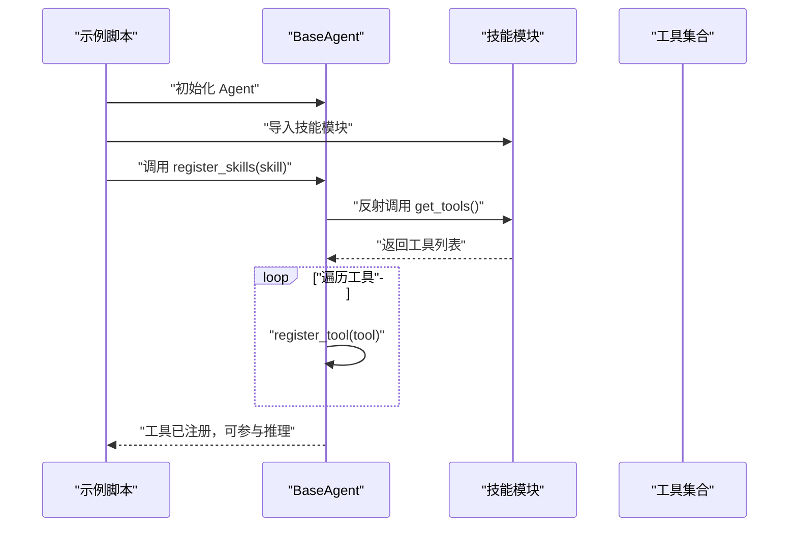
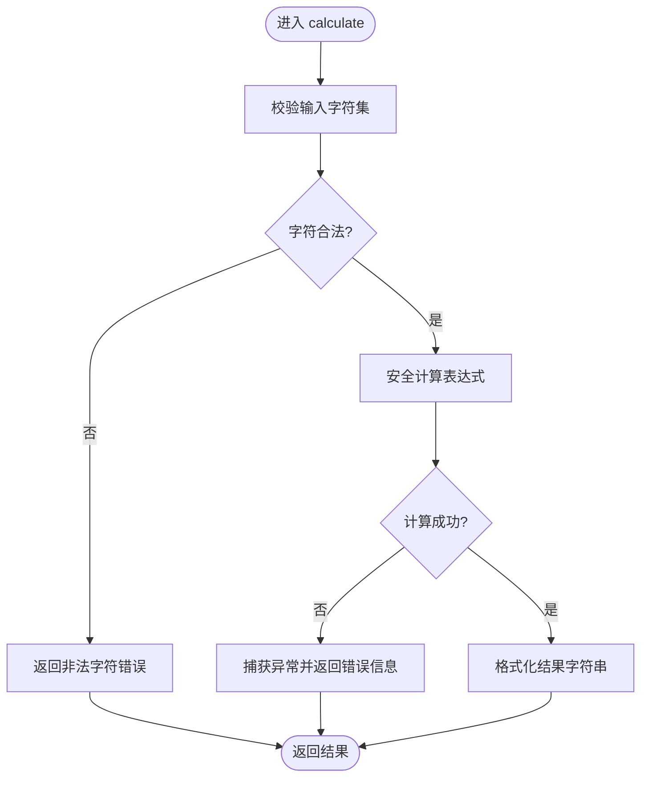
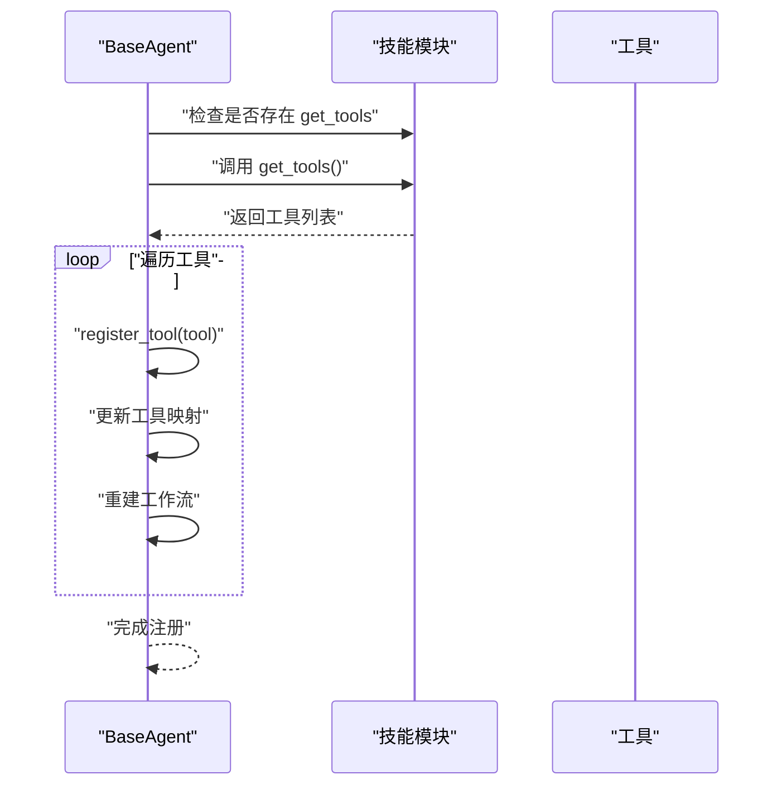
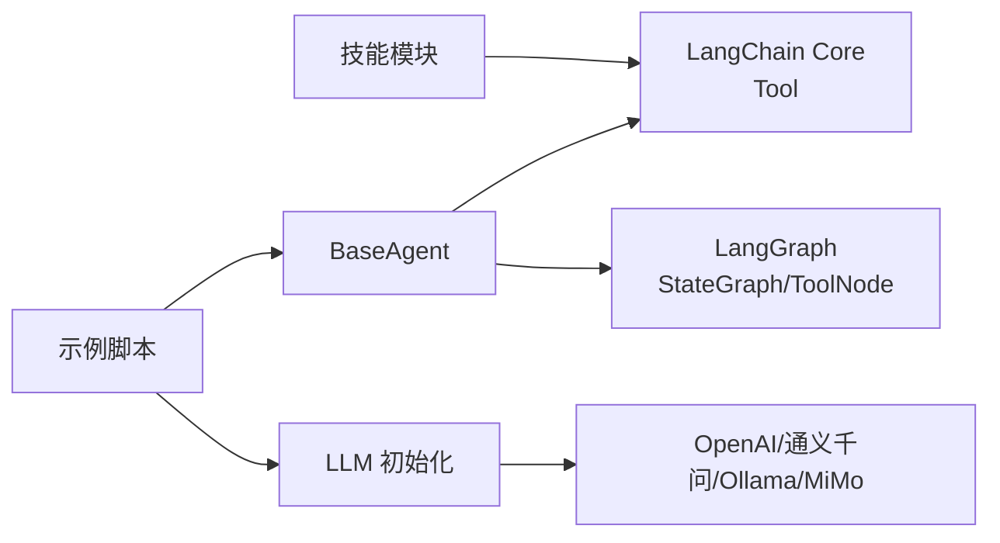

# 技能模块开发

<cite>
**本文引用的文件**
- [agents/skills/__init__.py](file://agents/skills/__init__.py)
- [agents/skills/example_skill.py](file://agents/skills/example_skill.py)
- [agents/base_agent.py](file://agents/base_agent.py)
- [scripts/03_langgraph_agent.py](file://scripts/03_langgraph_agent.py)
- [core/llm_init.py](file://core/llm_init.py)
- [README.md](file://README.md)
- [requirements.txt](file://requirements.txt)
</cite>

## 目录
1. [简介](#简介)
2. [项目结构](#项目结构)
3. [核心组件](#核心组件)
4. [架构总览](#架构总览)
5. [详细组件分析](#详细组件分析)
6. [依赖分析](#依赖分析)
7. [性能考虑](#性能考虑)
8. [故障排查指南](#故障排查指南)
9. [结论](#结论)
10. [附录](#附录)

## 简介
本指南面向技能模块开发者，系统阐述技能模块的设计模式与实现规范，重点覆盖以下主题：
- get_tools 函数规范与工具集合组织
- 技能模块导入机制与动态加载
- 示例技能的实现方式（工具函数定义、参数处理、返回值格式）
- 技能注册流程（register_skills 方法）
- 模块化设计原则与最佳实践（命名约定、文档编写、测试策略）
- 常见技能类型示例（时间查询、计算器、知识搜索）
- 开发调试技巧、性能优化建议与安全编码规范

## 项目结构
该项目采用模块化分层组织，技能模块位于 agents/skills 目录，基础 Agent 类位于 agents/base_agent.py，示例脚本位于 scripts/ 目录，核心 LLM 初始化位于 core/llm_init.py。

图表来源
- [agents/base_agent.py:1-178](file://agents/base_agent.py#L1-L178)
- [agents/skills/__init__.py:1-13](file://agents/skills/__init__.py#L1-L13)
- [agents/skills/example_skill.py:1-95](file://agents/skills/example_skill.py#L1-L95)
- [scripts/03_langgraph_agent.py:1-184](file://scripts/03_langgraph_agent.py#L1-L184)
- [core/llm_init.py:1-131](file://core/llm_init.py#L1-L131)
- [requirements.txt:1-34](file://requirements.txt#L1-L34)

章节来源
- [README.md:1-80](file://README.md#L1-L80)

## 核心组件
- 技能模块（Skill Module）
  - 角色：封装一组工具函数与描述，供 Agent 动态注册使用
  - 关键要求：提供 get_tools() -> List[Tool] 函数，返回工具列表
  - 示例：agents/skills/example_skill.py
- 基础 Agent 类（BaseAgent）
  - 角色：管理 LLM、工具集合、LangGraph 工作流，并提供 register_skills 动态注册接口
  - 关键方法：register_skills(skills_module)，内部通过反射调用 get_tools 并逐个注册
  - 示例：agents/base_agent.py
- 示例脚本（scripts/03_langgraph_agent.py）
  - 角色：演示如何初始化 LLM、获取工具、手动调用工具以及简单 Agent 对话
  - 示例：展示 tools 的使用与 Agent 的交互流程
- LLM 初始化（core/llm_init.py）
  - 角色：统一管理不同提供商的 LLM 实例创建
  - 示例：根据 provider 选择 OpenAI、通义千问、Ollama 或 MiMo

章节来源
- [agents/skills/__init__.py:1-13](file://agents/skills/__init__.py#L1-L13)
- [agents/skills/example_skill.py:1-95](file://agents/skills/example_skill.py#L1-L95)
- [agents/base_agent.py:150-161](file://agents/base_agent.py#L150-L161)
- [scripts/03_langgraph_agent.py:41-101](file://scripts/03_langgraph_agent.py#L41-L101)
- [core/llm_init.py:18-47](file://core/llm_init.py#L18-L47)

## 架构总览
技能模块与 Agent 的交互遵循“模块化导入 + 动态注册”的设计模式。Agent 通过 register_skills 动态发现并注册技能模块中的工具，工具以 LangChain Tool 形式存在，便于与 LLM 的函数调用能力集成。

图表来源
- [agents/base_agent.py:150-161](file://agents/base_agent.py#L150-L161)
- [agents/skills/example_skill.py:59-82](file://agents/skills/example_skill.py#L59-L82)
- [scripts/03_langgraph_agent.py:55-59](file://scripts/03_langgraph_agent.py#L55-L59)

## 详细组件分析

### 技能模块设计规范
- get_tools 函数规范
  - 必须提供 get_tools() -> List[Tool]，返回该模块提供的所有工具
  - 工具名称必须唯一，描述清晰，便于 Agent 和 LLM 理解
  - 工具函数签名建议为 (input: str) -> str，便于统一处理
- 工具集合组织
  - 每个技能模块聚焦单一领域（如时间查询、计算器、知识搜索）
  - 工具函数应具备明确的输入参数校验与异常处理
  - 返回值格式统一为字符串，便于 Agent 与 LLM 直接消费
- 模块导入机制
  - 通过 Python 模块导入技能模块，再调用 register_skills 动态注册
  - 支持多技能模块叠加注册，最终形成统一工具集

章节来源
- [agents/skills/__init__.py:1-13](file://agents/skills/__init__.py#L1-L13)
- [agents/skills/example_skill.py:59-82](file://agents/skills/example_skill.py#L59-L82)

### 示例技能实现解析
- 工具函数定义
  - 时间查询：返回当前时间字符串
  - 计算器：接收表达式字符串，进行安全计算并返回结果或错误信息
  - 知识搜索：基于关键词在内置知识库中检索并返回匹配项
- 参数处理
  - 计算器对输入字符集进行白名单校验，避免危险字符
  - 知识搜索对输入进行小写化处理，提升匹配鲁棒性
- 返回值格式
  - 统一返回字符串，便于 Agent 与 LLM 直接使用
- 工具注册
  - get_tools 返回三个 Tool 实例，分别对应上述函数

图表来源
- [agents/skills/example_skill.py:13-29](file://agents/skills/example_skill.py#L13-L29)

章节来源
- [agents/skills/example_skill.py:8-56](file://agents/skills/example_skill.py#L8-L56)

### 技能注册流程（register_skills 方法）
- 流程概述
  - Agent 检查传入模块是否包含 get_tools 属性
  - 调用 get_tools 获取工具列表
  - 逐个调用 register_tool 注册工具，并重建工作流
- 动态工具加载
  - 通过反射机制自动发现工具，无需硬编码工具清单
  - 支持运行时叠加多个技能模块

图表来源
- [agents/base_agent.py:150-161](file://agents/base_agent.py#L150-L161)

章节来源
- [agents/base_agent.py:150-161](file://agents/base_agent.py#L150-L161)

### 示例脚本中的工具使用
- 脚本演示了如何：
  - 初始化 LLM（支持 OpenAI、通义千问、Ollama、MiMo）
  - 获取工具列表并打印工具描述
  - 手动调用工具函数验证功能
  - 构造系统提示词，引导 Agent 使用工具

章节来源
- [scripts/03_langgraph_agent.py:41-101](file://scripts/03_langgraph_agent.py#L41-L101)
- [core/llm_init.py:18-47](file://core/llm_init.py#L18-L47)

### 常见技能类型示例
- 时间查询类
  - 功能：返回当前日期与时间
  - 实现要点：使用标准库时间模块，格式化输出
- 计算器类
  - 功能：安全计算数学表达式
  - 实现要点：白名单校验 + 异常捕获；返回格式化字符串
- 知识搜索类
  - 功能：基于关键词检索内置知识库
  - 实现要点：大小写不敏感匹配；返回多条匹配结果或提示信息

章节来源
- [agents/skills/example_skill.py:8-56](file://agents/skills/example_skill.py#L8-L56)

## 依赖分析
- 技能模块依赖
  - LangChain Core 工具接口：Tool
  - 类型注解：List
- Agent 依赖
  - LangChain Core 消息与工具接口
  - LangGraph StateGraph 与 ToolNode
  - 数据类与类型字典用于状态管理
- LLM 初始化依赖
  - 不同提供商的客户端适配（OpenAI、通义千问、Ollama、MiMo）

图表来源
- [agents/skills/example_skill.py](file://agents/skills/example_skill.py#L5)
- [agents/base_agent.py:1-10](file://agents/base_agent.py#L1-L10)
- [scripts/03_langgraph_agent.py:10-13](file://scripts/03_langgraph_agent.py#L10-L13)
- [core/llm_init.py:50-108](file://core/llm_init.py#L50-L108)
- [requirements.txt:1-34](file://requirements.txt#L1-L34)

章节来源
- [requirements.txt:1-34](file://requirements.txt#L1-L34)

## 性能考虑
- 工具函数复杂度控制
  - 计算器：线性时间复杂度与输入长度相关，建议限制表达式长度
  - 知识搜索：线性扫描知识库，建议预构建索引或缓存
- 工作流重建成本
  - register_tool 会重建工作流，频繁注册时建议批量注册后再一次性生效
- LLM 调用开销
  - 仅在必要时启用工具调用，避免不必要的函数调用往返
- 内存与缓存
  - 对热点数据建立缓存，减少重复计算与检索

## 故障排查指南
- 工具未生效
  - 检查技能模块是否提供 get_tools 函数且返回非空列表
  - 确认已调用 register_skills 并传入正确的模块对象
- 工具调用失败
  - 检查工具函数签名与参数类型是否一致
  - 查看异常处理逻辑，确保错误信息可读
- LLM 不支持函数调用
  - 确认所选模型支持函数调用能力
  - 在示例脚本中切换到支持工具调用的模型版本
- 环境变量缺失
  - 检查 OPENAI_API_KEY、DASHSCOPE_API_KEY、MIMO_API_KEY 等配置

章节来源
- [agents/base_agent.py:150-161](file://agents/base_agent.py#L150-L161)
- [scripts/03_langgraph_agent.py:47-53](file://scripts/03_langgraph_agent.py#L47-L53)
- [core/llm_init.py:52-53](file://core/llm_init.py#L52-L53)

## 结论
本指南总结了技能模块的设计模式与实现规范，强调了 get_tools 函数的重要性、工具集合的组织方式、动态注册机制与模块化设计原则。通过示例技能与示例脚本，读者可以快速上手开发自定义技能，并将其无缝集成到 Agent 工作流中。建议在实际项目中遵循命名约定、文档编写与测试策略，持续优化性能与安全性。

## 附录

### 技能模块开发模板与最佳实践
- 模板结构
  - 模块文件：提供 get_tools() -> List[Tool]
  - 工具函数：(input: str) -> str，统一返回字符串
  - 文档字符串：清晰描述用途、参数与返回值
- 命名约定
  - 工具函数：语义化英文命名，避免特殊字符
  - 模块文件：小写下划线风格，与技能领域相关
- 文档编写
  - 为每个工具函数编写 docstring，包含用途、参数说明与示例
  - 在模块级 docstring 中说明技能领域与适用场景
- 测试策略
  - 单元测试：覆盖正常路径与边界条件
  - 集成测试：在 Agent 中注册工具并验证工作流
  - 性能测试：评估工具在高并发下的表现
- 安全编码规范
  - 计算器：严格白名单校验，避免 eval 等危险函数
  - 输入校验：对所有外部输入进行最小化与格式化处理
  - 错误处理：捕获异常并返回可读错误信息，避免泄露内部细节

章节来源
- [agents/skills/example_skill.py:13-29](file://agents/skills/example_skill.py#L13-L29)
- [agents/skills/example_skill.py:32-56](file://agents/skills/example_skill.py#L32-L56)