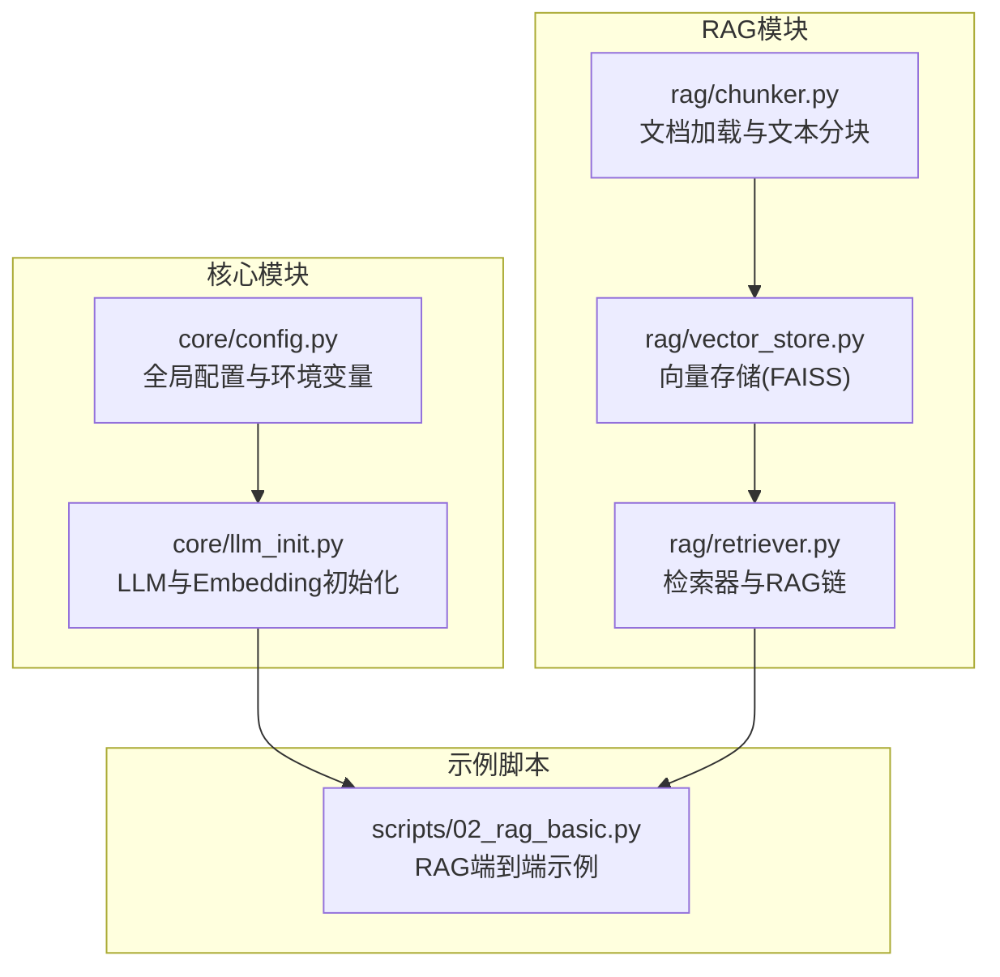
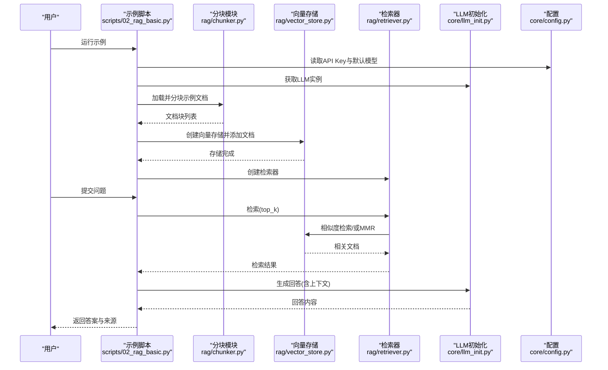
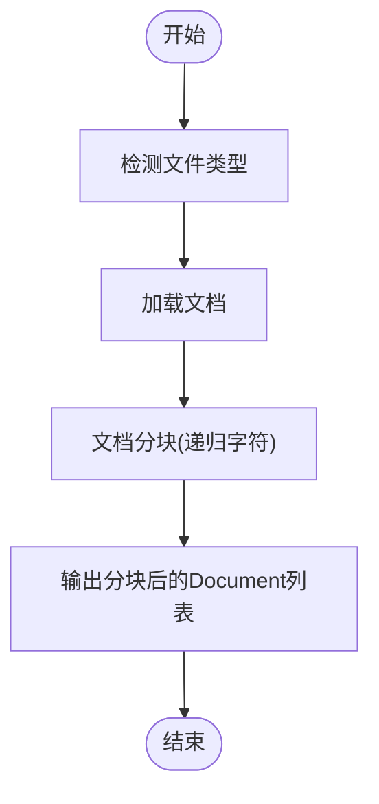
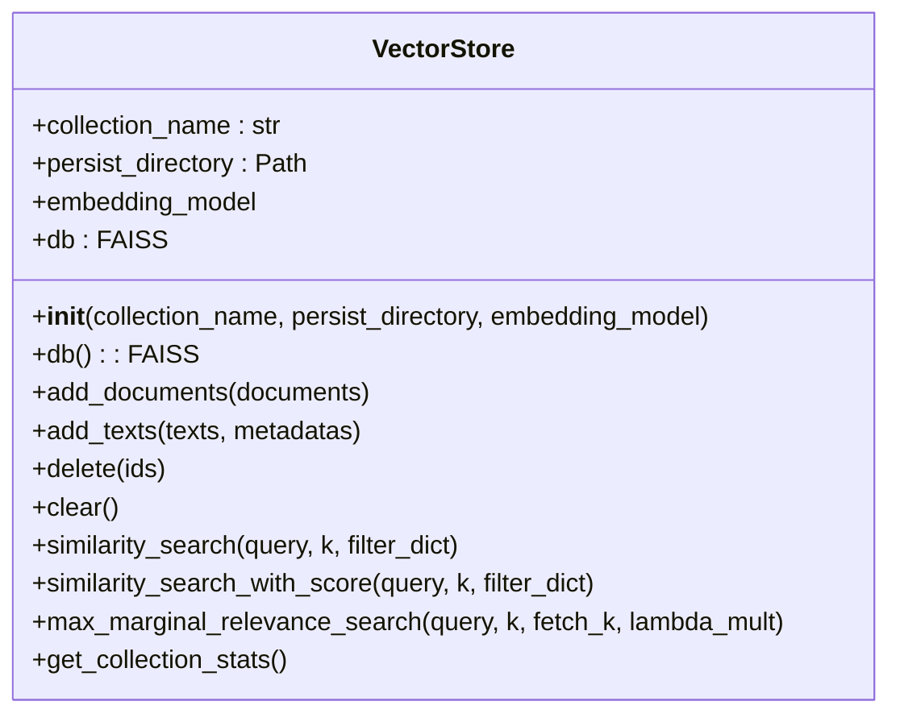
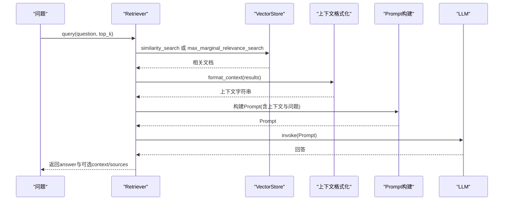
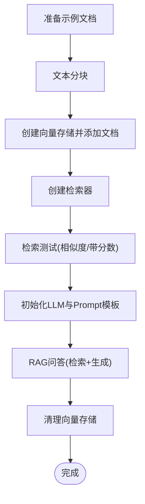
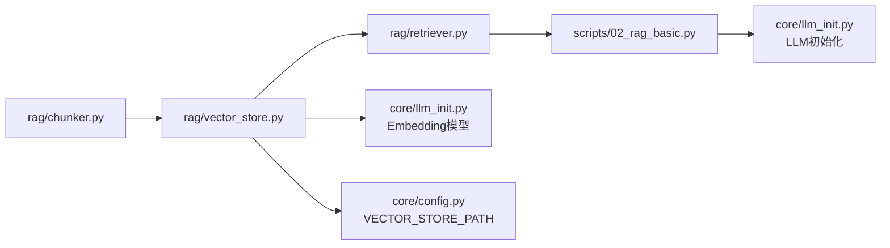

# RAG检索增强系统

<cite>
**本文引用的文件**
- [rag/chunker.py](file://rag/chunker.py)
- [rag/vector_store.py](file://rag/vector_store.py)
- [rag/retriever.py](file://rag/retriever.py)
- [scripts/02_rag_basic.py](file://scripts/02_rag_basic.py)
- [core/config.py](file://core/config.py)
- [core/llm_init.py](file://core/llm_init.py)
- [requirements.txt](file://requirements.txt)
- [README.md](file://README.md)
</cite>

## 目录
1. [简介](#简介)
2. [项目结构](#项目结构)
3. [核心组件](#核心组件)
4. [架构总览](#架构总览)
5. [详细组件分析](#详细组件分析)
6. [依赖关系分析](#依赖关系分析)
7. [性能考虑](#性能考虑)
8. [故障排查指南](#故障排查指南)
9. [结论](#结论)
10. [附录](#附录)

## 简介
本文件为RAG（检索增强生成）系统的完整技术文档，围绕文档加载与文本分块（chunker.py）、向量存储（vector_store.py）、检索器设计（retriever.py）三大核心模块展开，结合示例脚本（scripts/02_rag_basic.py）给出从文档预处理到最终问答的端到端实现流程，并提供性能调优、内存优化与召回率提升的最佳实践建议。系统采用LangChain生态与FAISS向量数据库，结合HuggingFaceEmbeddings进行向量化，支持多提供商LLM（OpenAI、通义千问、Ollama、MiMo）统一初始化。

## 项目结构
项目采用模块化组织，RAG相关逻辑集中在rag目录，核心配置与LLM初始化位于core目录，示例脚本位于scripts目录，便于快速上手与验证。

图表来源
- [core/config.py:1-68](file://core/config.py#L1-L68)
- [core/llm_init.py:1-131](file://core/llm_init.py#L1-L131)
- [rag/chunker.py:1-175](file://rag/chunker.py#L1-L175)
- [rag/vector_store.py:1-252](file://rag/vector_store.py#L1-L252)
- [rag/retriever.py:1-203](file://rag/retriever.py#L1-L203)
- [scripts/02_rag_basic.py:1-149](file://scripts/02_rag_basic.py#L1-L149)

章节来源
- [README.md:1-80](file://README.md#L1-L80)
- [requirements.txt:1-34](file://requirements.txt#L1-L34)

## 核心组件
- 文档加载与文本分块（chunker.py）
  - 提供通用文本分块、文档分块、多格式文件加载（PDF、Markdown、文本）以及目录批量处理能力。
  - 支持自定义分隔符、块大小与重叠策略，确保上下文连贯性。
- 向量存储（vector_store.py）
  - 基于FAISS封装VectorStore，支持懒加载、持久化、增量添加、MMR检索与简单过滤。
  - 集成Embedding模型初始化，提供统计信息查询。
- 检索器与RAG链（retriever.py）
  - 提供相似度检索、带分数检索、MMR检索与上下文格式化。
  - RAGChain负责检索-提示词构建-生成-结果封装，支持返回参考来源。

章节来源
- [rag/chunker.py:12-175](file://rag/chunker.py#L12-L175)
- [rag/vector_store.py:13-252](file://rag/vector_store.py#L13-L252)
- [rag/retriever.py:17-203](file://rag/retriever.py#L17-L203)

## 架构总览
下图展示RAG系统从文档预处理到问答输出的端到端流程，以及各模块间的交互关系。

图表来源
- [scripts/02_rag_basic.py:44-144](file://scripts/02_rag_basic.py#L44-L144)
- [rag/chunker.py:64-175](file://rag/chunker.py#L64-L175)
- [rag/vector_store.py:13-252](file://rag/vector_store.py#L13-L252)
- [rag/retriever.py:17-203](file://rag/retriever.py#L17-L203)
- [core/llm_init.py:18-131](file://core/llm_init.py#L18-L131)
- [core/config.py:24-68](file://core/config.py#L24-L68)

## 详细组件分析

### 文档加载与文本分块（chunker.py）
- 功能概览
  - 文本分块：基于字符级分割器，支持自定义分隔符、块大小与重叠。
  - 文档分块：递归字符分割器，优先按段落、换行、中文标点、空格等分隔，保持语义完整性。
  - 文件加载：支持PDF、Markdown、文本等格式；目录批量加载。
  - 组合流程：根据文件扩展名选择加载器，再进行文档分块。
- 关键参数与策略
  - 分隔符与重叠：重叠有助于跨块上下文连贯，需平衡召回与碎片化。
  - 分割顺序：先按大段落，再按句子/单词，最后按字符，避免破坏语义。
  - 元数据保留：分块后Document对象携带page_content与metadata，便于后续检索过滤与溯源。
- 复杂度与性能
  - 时间复杂度：与输入长度线性相关；重叠越大，分块数量越多，向量库规模增大。
  - 空间复杂度：与分块数量及Embedding维度相关。
- 最佳实践
  - 对长文档采用更细粒度的分隔符序列，确保语义边界清晰。
  - 控制chunk_size与chunk_overlap比例，避免过小导致过度碎片化。
  - 对多语言混合内容，优先使用中文标点与换行作为分隔符。

图表来源
- [rag/chunker.py:39-61](file://rag/chunker.py#L39-L61)
- [rag/chunker.py:112-143](file://rag/chunker.py#L112-L143)

章节来源
- [rag/chunker.py:12-175](file://rag/chunker.py#L12-L175)

### 向量存储（vector_store.py）
- 设计要点
  - 基于FAISS封装，支持懒加载、本地持久化（.faiss文件）、增量添加与删除标记。
  - 集成Embedding模型初始化，支持CPU设备与向量归一化。
  - 提供相似度检索、带分数检索与MMR检索；过滤通过后处理实现。
- 关键方法与行为
  - add_documents/add_texts：首次创建索引或增量添加；自动保存。
  - similarity_search/similarity_search_with_score：相似度检索与打分。
  - max_marginal_relevance_search：MMR多样性检索，lambda_mult控制相关性与多样性的权衡。
  - delete/clear：删除标记与清空集合（实际删除需重建索引）。
  - get_collection_stats：统计文档数量与持久化路径。
- 与Embedding模型的关系
  - 通过core/llm_init.py的get_embedding_model提供Sentence Transformers模型，默认使用中文小模型，支持CPU与向量归一化。
- 性能与内存
  - FAISS索引占用与向量维度、分块数量成正比；合理设置top_k与fetch_k可降低计算开销。
  - 持久化目录位置由core/config.py的VECTOR_STORE_PATH决定。

图表来源
- [rag/vector_store.py:13-252](file://rag/vector_store.py#L13-L252)
- [core/llm_init.py:111-131](file://core/llm_init.py#L111-L131)
- [core/config.py:48-51](file://core/config.py#L48-L51)

章节来源
- [rag/vector_store.py:13-252](file://rag/vector_store.py#L13-L252)
- [core/llm_init.py:111-131](file://core/llm_init.py#L111-L131)
- [core/config.py:48-51](file://core/config.py#L48-L51)

### 检索器与RAG链（retriever.py）
- 检索器（Retriever）
  - retrieve/retrieve_with_scores：相似度检索与带分数检索。
  - retrieve_with_mmr：MMR多样性检索，适合提升召回质量与覆盖度。
  - format_context：将检索结果格式化为上下文字符串，支持包含相似度分数。
- RAG链（RAGChain）
  - query：执行检索-构建提示词-生成回答-封装结果；可选择返回上下文与来源元数据。
  - 支持自定义Prompt模板或默认模板。
- 与VectorStore的协作
  - 检索器持有VectorStore实例，统一调用相似度与MMR检索接口。
  - 上下文格式化时仅使用page_content，元数据用于溯源。

图表来源
- [rag/retriever.py:29-189](file://rag/retriever.py#L29-L189)
- [rag/vector_store.py:116-217](file://rag/vector_store.py#L116-L217)

章节来源
- [rag/retriever.py:17-203](file://rag/retriever.py#L17-L203)

### 端到端RAG工作流程示例（scripts/02_rag_basic.py）
- 流程步骤
  - 准备示例文档（多段落文本）。
  - 文档分块：对每篇文档进行文本分块，汇总为文本块列表。
  - 创建向量存储：初始化FAISS向量库并添加分块后的文档。
  - 创建检索器：基于向量存储创建检索器。
  - 检索测试：对多个问题执行相似度检索与带分数检索。
  - RAG问答：初始化LLM与Prompt模板，执行RAGChain查询，返回答案与来源。
  - 清理：清空向量存储索引文件。
- 关键调用路径
  - 文档分块：调用chunk_text与Document构造。
  - 向量存储：调用create_vector_store与add_documents。
  - 检索：调用create_retriever与retrieve_with_scores。
  - 问答：调用RAGChain.query并传入top_k与return_context。

图表来源
- [scripts/02_rag_basic.py:44-144](file://scripts/02_rag_basic.py#L44-L144)
- [rag/chunker.py:12-61](file://rag/chunker.py#L12-L61)
- [rag/vector_store.py:231-251](file://rag/vector_store.py#L231-L251)
- [rag/retriever.py:192-202](file://rag/retriever.py#L192-L202)

章节来源
- [scripts/02_rag_basic.py:44-144](file://scripts/02_rag_basic.py#L44-L144)

## 依赖关系分析
- 模块耦合
  - rag/chunker.py独立于其他RAG模块，仅依赖LangChain文本分割与加载器。
  - rag/vector_store.py依赖core/config.py的VECTOR_STORE_PATH与core/llm_init.py的Embedding模型。
  - rag/retriever.py依赖VectorStore与LangChain Document对象。
  - scripts/02_rag_basic.py串联上述模块，体现端到端流程。
- 外部依赖
  - LangChain生态（Core、Community、OpenAI适配器）。
  - FAISS（CPU版）。
  - Sentence Transformers（Embedding模型）。
  - PDF与Markdown解析库（PyPDF、Unstructured）。

图表来源
- [rag/chunker.py:1-175](file://rag/chunker.py#L1-L175)
- [rag/vector_store.py:1-252](file://rag/vector_store.py#L1-L252)
- [rag/retriever.py:1-203](file://rag/retriever.py#L1-L203)
- [scripts/02_rag_basic.py:1-149](file://scripts/02_rag_basic.py#L1-L149)
- [core/llm_init.py:1-131](file://core/llm_init.py#L1-L131)
- [core/config.py:1-68](file://core/config.py#L1-L68)

章节来源
- [requirements.txt:1-34](file://requirements.txt#L1-L34)

## 性能考虑
- 分块策略
  - 合理设置chunk_size与chunk_overlap：较大chunk_size提升语义完整性，但增加向量维度与检索成本；较小overlap易丢失跨块上下文。
  - 优先按段落与中文标点分隔，减少跨句切分带来的语义断裂。
- 向量存储与检索
  - 使用MMR检索提升多样性与召回覆盖，适当调整lambda_mult与fetch_k。
  - 控制top_k与fetch_k，避免过多候选导致延迟与内存压力。
  - 定期清理无效索引与冗余文档，保持索引规模可控。
- Embedding与设备
  - 在CPU上运行Embedding模型可节省GPU资源，但耗时较长；可考虑批处理与缓存中间向量。
  - 启用向量归一化以提升相似度计算稳定性。
- 内存优化
  - 懒加载FAISS索引，仅在需要时加载，避免常驻内存。
  - 对大规模集合采用分片索引或外部向量库替代方案。
- 召回率提升
  - 结合领域术语与关键词构建元数据过滤，配合后处理过滤提升相关性。
  - 引入重排（Re-ranking）模型对候选结果进行二次排序（需扩展实现）。

## 故障排查指南
- API Key与模型配置
  - 检查core/config.py中的API Key是否正确配置；不同提供商需对应设置。
  - 若未配置，LLM初始化会抛出异常，需在.env中补充相应Key。
- Embedding模型下载与加载
  - 首次运行会下载默认Embedding模型，网络不稳定可能导致失败；可在离线环境提前下载模型。
  - 模型加载失败时检查模型名称与设备配置。
- FAISS索引加载
  - 若索引损坏或版本不兼容，FAISS加载可能失败；可通过clear清空后重建。
  - 持久化路径需具备写权限，VECTOR_STORE_PATH应指向可写目录。
- 检索结果为空
  - 检查分块是否过小或重叠不足导致语义不完整；适当增大chunk_size与chunk_overlap。
  - 确认向量存储中已成功添加文档，且索引已保存。
- MMR与过滤
  - MMR参数lambda_mult过大偏向相关性，过小偏向多样性；根据业务目标调整。
  - 过滤条件需与Document.metadata一致，否则会被后处理过滤掉。

章节来源
- [core/config.py:24-68](file://core/config.py#L24-L68)
- [core/llm_init.py:50-131](file://core/llm_init.py#L50-L131)
- [rag/vector_store.py:38-57](file://rag/vector_store.py#L38-L57)
- [rag/vector_store.py:92-115](file://rag/vector_store.py#L92-L115)

## 结论
本RAG系统以LangChain与FAISS为核心，实现了从文档加载、文本分块、向量存储到检索与生成的完整闭环。通过可配置的分块策略、MMR多样性检索与灵活的上下文格式化，系统在准确性与多样性之间取得平衡。结合最佳实践与故障排查指南，可在不同规模与场景下稳定落地。

## 附录
- 快速开始
  - 安装依赖：pip install -r requirements.txt
  - 配置API Key：复制.env.example为.env并填入Key
  - 运行示例：python scripts/02_rag_basic.py
- 支持的模型提供商
  - OpenAI、通义千问、Ollama、MiMo（均通过core/llm_init.py统一封装）

章节来源
- [README.md:41-80](file://README.md#L41-L80)