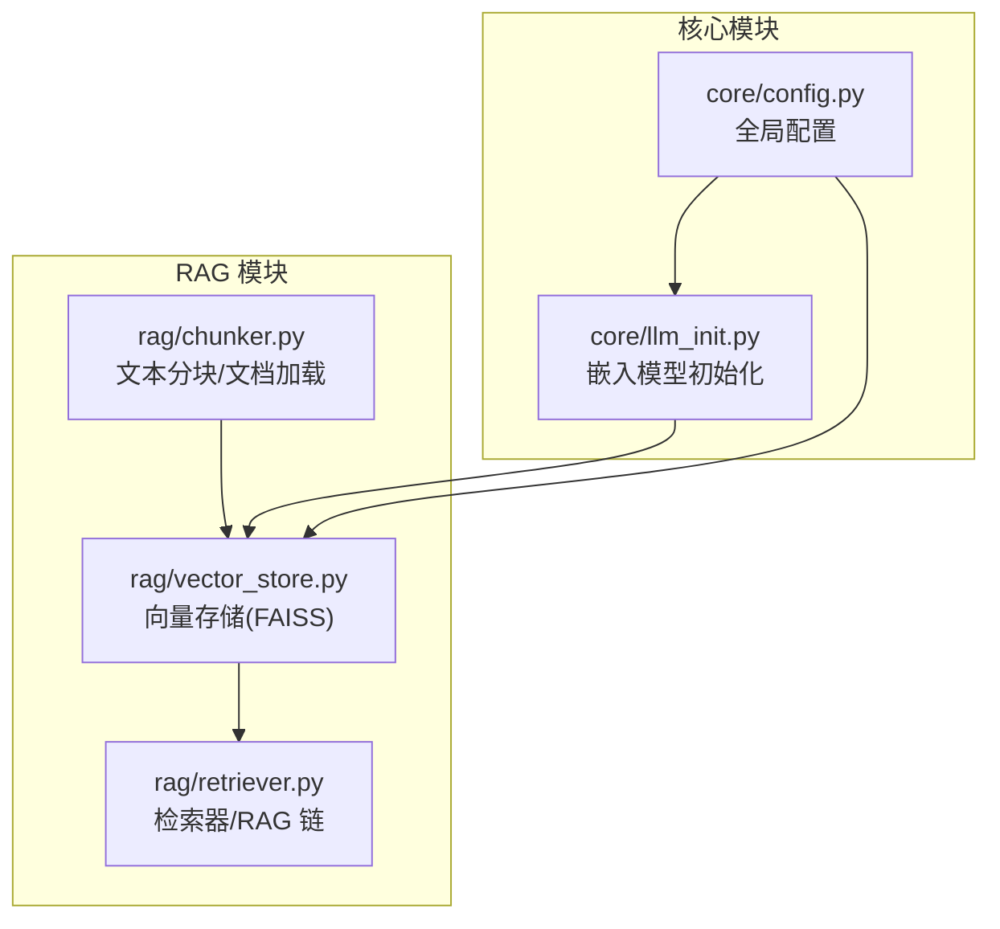
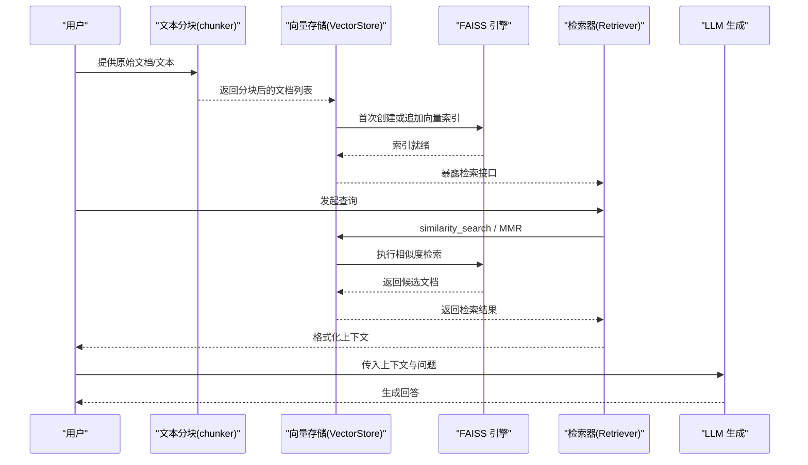
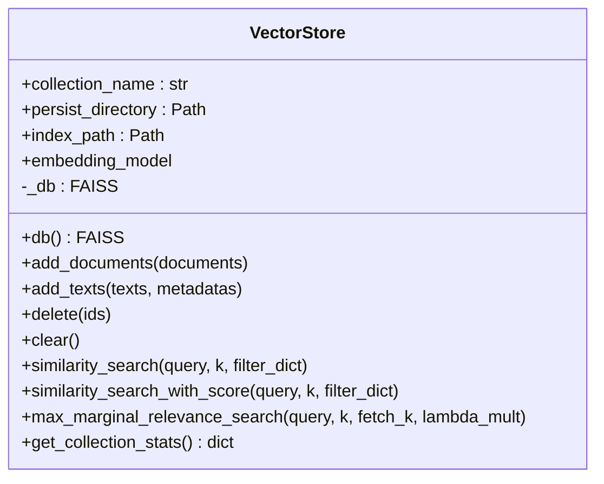
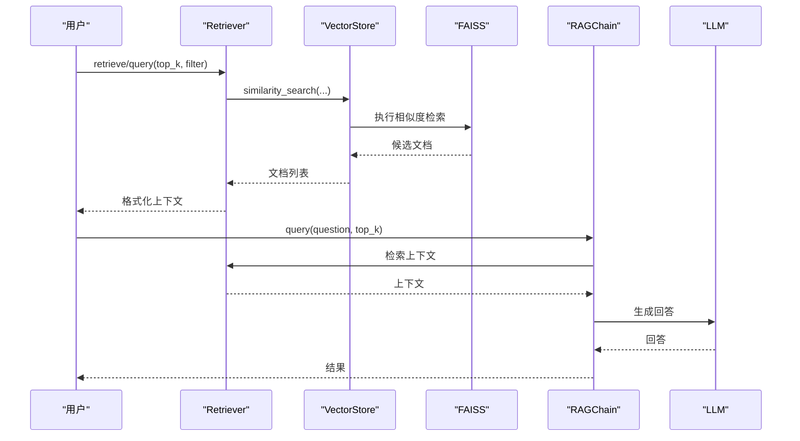
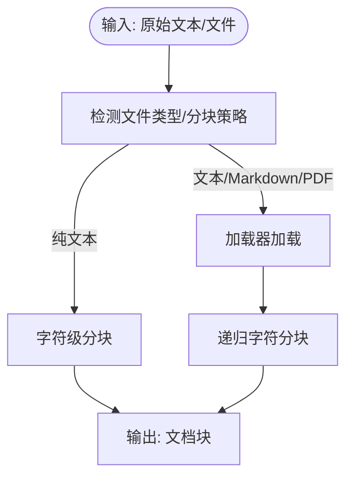
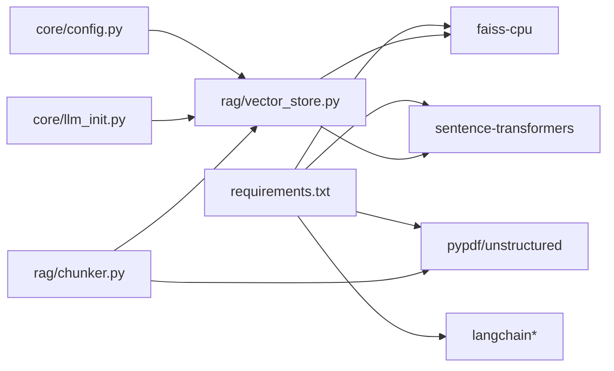

# 向量存储与嵌入

<cite>
**本文引用的文件**
- [rag/vector_store.py](file://rag/vector_store.py)
- [rag/retriever.py](file://rag/retriever.py)
- [rag/chunker.py](file://rag/chunker.py)
- [core/config.py](file://core/config.py)
- [core/llm_init.py](file://core/llm_init.py)
- [scripts/02_rag_basic.py](file://scripts/02_rag_basic.py)
- [requirements.txt](file://requirements.txt)
- [README.md](file://README.md)
</cite>

## 目录
1. [简介](#简介)
2. [项目结构](#项目结构)
3. [核心组件](#核心组件)
4. [架构总览](#架构总览)
5. [详细组件分析](#详细组件分析)
6. [依赖分析](#依赖分析)
7. [性能考量](#性能考量)
8. [故障排查指南](#故障排查指南)
9. [结论](#结论)
10. [附录](#附录)

## 简介
本文件围绕向量存储与嵌入模块进行系统化技术文档整理，重点覆盖：
- FAISS 向量数据库的集成与封装，包括索引创建、持久化、懒加载与删除策略
- 嵌入模型的选择与配置，涵盖模型名称、设备与归一化设置
- 文本分块策略与多格式文档加载
- 检索接口与 RAG 链路集成
- 性能优化建议（索引压缩、批量插入、缓存与内存管理）
- 增量更新与持久化机制的实现细节

## 项目结构
该项目采用“功能域”组织方式，向量存储与嵌入相关的核心代码集中在 rag 与 core 目录：
- rag/vector_store.py：向量存储封装（基于 FAISS）
- rag/retriever.py：检索器与 RAG 链
- rag/chunker.py：文本分块与多格式文档加载
- core/config.py：全局配置（含向量存储路径与默认嵌入模型）
- core/llm_init.py：嵌入模型初始化（HuggingFaceEmbeddings）

图表来源
- [core/config.py:1-68](file://core/config.py#L1-L68)
- [core/llm_init.py:111-131](file://core/llm_init.py#L111-L131)
- [rag/chunker.py:12-175](file://rag/chunker.py#L12-L175)
- [rag/vector_store.py:13-252](file://rag/vector_store.py#L13-L252)
- [rag/retriever.py:17-203](file://rag/retriever.py#L17-L203)

章节来源
- [README.md:1-80](file://README.md#L1-L80)
- [requirements.txt:1-34](file://requirements.txt#L1-L34)

## 核心组件
- 向量存储 VectorStore：封装 FAISS，提供懒加载、持久化、添加/删除/清空、相似度检索与 MMR 检索、统计查询等能力
- 检索器 Retriever：对 VectorStore 的检索接口进行封装，并提供格式化上下文输出
- RAGChain：将检索与 LLM 生成串联，形成检索增强生成流程
- 文本分块 Chunker：支持多种格式文档加载与递归字符分块
- 嵌入模型初始化：默认使用 HuggingFaceEmbeddings，模型名称来自配置，设备设置为 CPU，启用向量归一化

章节来源
- [rag/vector_store.py:13-252](file://rag/vector_store.py#L13-L252)
- [rag/retriever.py:17-203](file://rag/retriever.py#L17-L203)
- [rag/chunker.py:12-175](file://rag/chunker.py#L12-L175)
- [core/llm_init.py:111-131](file://core/llm_init.py#L111-L131)

## 架构总览
下图展示从“文档分块”到“向量存储”，再到“检索器/RAG 链”的完整流程。

图表来源
- [rag/chunker.py:39-61](file://rag/chunker.py#L39-L61)
- [rag/vector_store.py:59-90](file://rag/vector_store.py#L59-L90)
- [rag/retriever.py:29-102](file://rag/retriever.py#L29-L102)

## 详细组件分析

### 向量存储 VectorStore（基于 FAISS）
- 懒加载与持久化
  - 首次访问 db 属性时，若索引文件存在则本地加载；否则保持空状态以便后续批量构建
  - 写入完成后自动保存至本地 FAISS 文件
- 索引操作
  - add_documents/add_texts：首次构建或增量追加
  - delete：FAISS 不支持直接按 ID 删除，当前实现通过调用底层删除接口并保存；实际应用中如需频繁删除，建议重建索引
  - clear：清空并删除持久化文件
- 检索接口
  - similarity_search/similarity_search_with_score：标准向量相似度检索，支持简单后处理过滤
  - max_marginal_relevance_search：MMR 搜索，提升结果多样性
- 统计信息
  - get_collection_stats：返回集合名、文档数量与持久化目录

图表来源
- [rag/vector_store.py:13-252](file://rag/vector_store.py#L13-L252)

章节来源
- [rag/vector_store.py:16-115](file://rag/vector_store.py#L16-L115)
- [rag/vector_store.py:116-228](file://rag/vector_store.py#L116-L228)

### 检索器 Retriever 与 RAG 链
- Retriever
  - 对 VectorStore 的检索接口进行封装，支持带分数检索与 MMR 检索
  - format_context：将检索结果格式化为可注入 LLM 的上下文字符串
- RAGChain
  - 组合检索器与 LLM，构建 Prompt 并生成最终回答
  - 可选返回检索上下文与来源元数据

图表来源
- [rag/retriever.py:29-102](file://rag/retriever.py#L29-L102)
- [rag/retriever.py:150-189](file://rag/retriever.py#L150-L189)

章节来源
- [rag/retriever.py:17-203](file://rag/retriever.py#L17-L203)

### 文本分块与文档加载
- chunk_text：基于字符级分块，适合快速原型
- chunk_documents：基于递归字符分块，优先按段落、换行、标点等分隔符切分，更贴合自然语言结构
- load_*_file：支持 PDF、Markdown、文本等格式的加载
- load_and_chunk_file：根据文件后缀自动选择加载器并执行分块
- load_directory：批量加载目录内文件并分块

图表来源
- [rag/chunker.py:12-61](file://rag/chunker.py#L12-L61)
- [rag/chunker.py:112-143](file://rag/chunker.py#L112-L143)
- [rag/chunker.py:146-175](file://rag/chunker.py#L146-L175)

章节来源
- [rag/chunker.py:12-175](file://rag/chunker.py#L12-L175)

### 嵌入模型初始化与配置
- 默认嵌入模型：中文场景推荐的中文模型
- 设备与归一化：默认在 CPU 上运行，开启向量归一化，便于余弦相似度计算
- 模型名称可覆盖，便于切换不同维度与语种的嵌入模型

章节来源
- [core/config.py:48-51](file://core/config.py#L48-L51)
- [core/llm_init.py:111-131](file://core/llm_init.py#L111-L131)

## 依赖分析
- 向量存储依赖 FAISS（CPU 版本）与 LangChain 的 FAISS 适配
- 嵌入模型依赖 sentence-transformers 与 HuggingFaceEmbeddings
- 文档加载依赖 PyPDF、Unstructured 等第三方库
- 配置与环境变量通过 python-dotenv 管理

图表来源
- [requirements.txt:1-34](file://requirements.txt#L1-L34)
- [core/config.py:48-51](file://core/config.py#L48-L51)
- [core/llm_init.py:111-131](file://core/llm_init.py#L111-L131)
- [rag/vector_store.py:9-10](file://rag/vector_store.py#L9-L10)
- [rag/chunker.py:6-9](file://rag/chunker.py#L6-L9)

章节来源
- [requirements.txt:1-34](file://requirements.txt#L1-L34)

## 性能考量
- 索引类型与相似度
  - 当前使用 FAISS 默认索引类型（由 LangChain 适配层决定）。FAISS 支持多种索引类型（如 Flat、IVF、HNSW 等），可通过自定义 FAISS Index 参数进行优化。对于大规模数据，建议使用 IVF 或 HNSW，并结合量化（如 SQ、PQ）降低内存占用与加速检索。
- 维度与模型选择
  - 嵌入维度越高，语义表达能力越强但内存与计算成本更高。中文场景可考虑小模型以平衡性能与精度。
- 批量处理
  - add_documents/add_texts 为批量写入入口；建议在入库前先进行去重与清洗，避免重复向量导致索引膨胀。
- 持久化与懒加载
  - 懒加载避免冷启动时的 IO 开销；每次写入后立即保存，确保断电/异常时不丢失进度。
- 内存优化
  - 嵌入模型默认在 CPU 上运行，避免 GPU 内存压力；如需 GPU，可在模型初始化时调整 device。
  - 对于超大数据集，可考虑分批构建索引并定期合并。
- 过滤与后处理
  - FAISS 原生不支持元数据过滤，当前实现通过后处理过滤；建议在入库时将常用过滤字段放入元数据，或在上层维护倒排索引以加速过滤。
- MMR 与多样性
  - MMR 在保证相关性的同时提升多样性，lambda_mult 控制相关性与多样性的权衡，可根据业务需求调参。

章节来源
- [rag/vector_store.py:116-228](file://rag/vector_store.py#L116-L228)
- [core/llm_init.py:126-130](file://core/llm_init.py#L126-L130)

## 故障排查指南
- 未配置 API Key
  - 若使用云端 LLM，需在 .env 中配置对应 Key；若使用本地 Ollama，无需 Key。
- 嵌入模型首次下载缓慢
  - 首次初始化会下载模型权重，建议在网络稳定时提前触发初始化或离线准备模型文件。
- 持久化路径权限问题
  - 确认 VECTOR_STORE_PATH 目录可读写；默认位于项目根目录下的隐藏目录。
- 删除无效
  - FAISS 不支持直接按 ID 删除，当前实现仅调用底层删除接口；如需频繁删除，建议重建索引。
- 相似度分数为空
  - similarity_search_without_score 接口不会返回分数；如需分数，请使用 similarity_search_with_score。
- MMR 结果与期望不符
  - 调整 lambda_mult 与 fetch_k 参数；lambda_mult 越大越偏向相关性，越小越偏向多样性。

章节来源
- [core/config.py:24-30](file://core/config.py#L24-L30)
- [core/config.py:48-51](file://core/config.py#L48-L51)
- [rag/vector_store.py:92-106](file://rag/vector_store.py#L92-L106)
- [rag/vector_store.py:153-188](file://rag/vector_store.py#L153-L188)

## 结论
本项目以 FAISS 为核心实现了轻量、可扩展的向量存储方案，配合 HuggingFaceEmbeddings 与 LangChain 的检索接口，能够满足中小规模知识库的检索增强生成需求。通过懒加载、批量写入与本地持久化，兼顾了易用性与性能。针对大规模场景，建议引入 FAISS 自定义索引、量化与分片策略，并完善元数据过滤与增量更新机制。

## 附录
- 快速运行示例
  - 参考示例脚本演示从“文档分块”到“向量存储”再到“RAG 问答”的完整流程
- 依赖安装
  - 使用 requirements.txt 安装所需依赖

章节来源
- [scripts/02_rag_basic.py:44-144](file://scripts/02_rag_basic.py#L44-L144)
- [requirements.txt:1-34](file://requirements.txt#L1-L34)