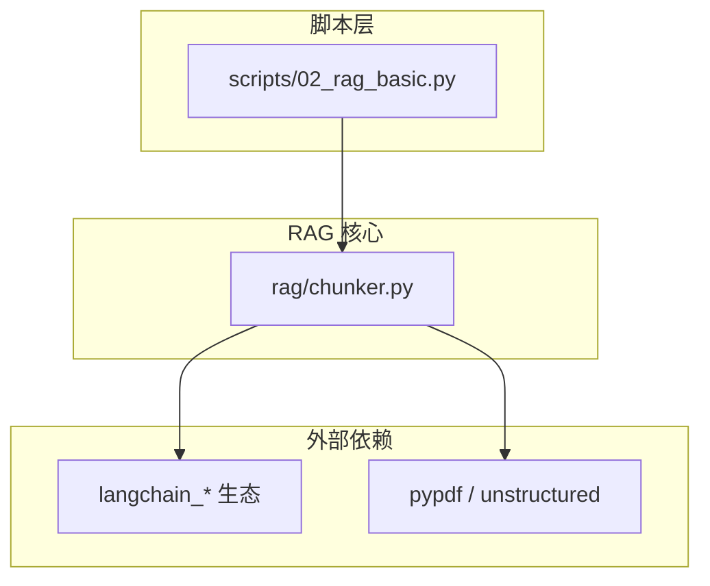
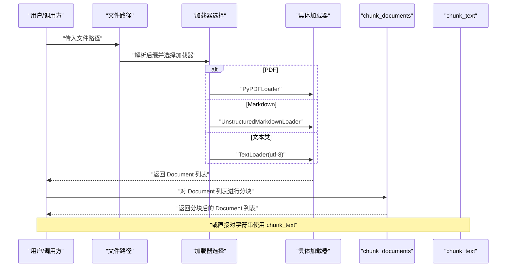
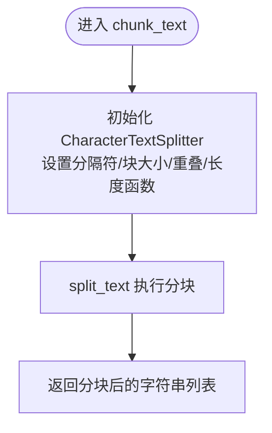
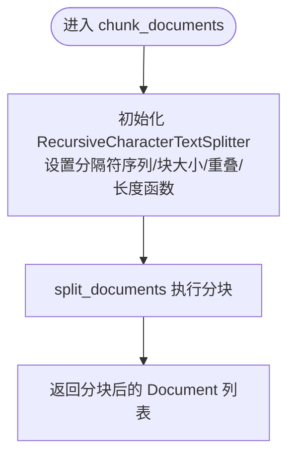
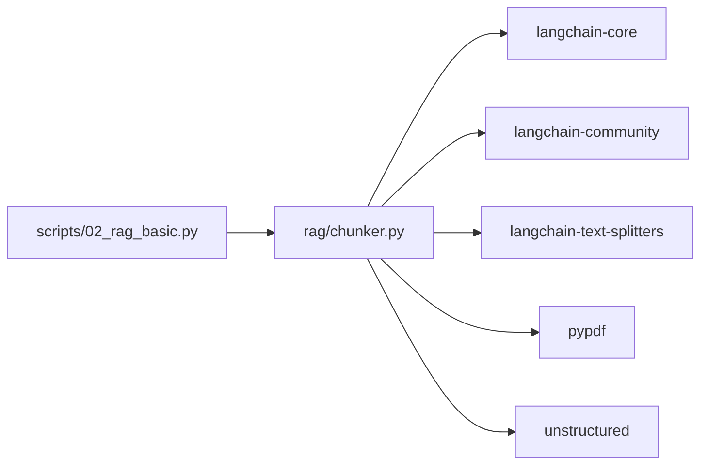

# 文本分块与文档加载

<cite>
**本文引用的文件**
- [rag/chunker.py](file://rag/chunker.py)
- [scripts/02_rag_basic.py](file://scripts/02_rag_basic.py)
- [README.md](file://README.md)
- [requirements.txt](file://requirements.txt)
</cite>

## 目录
1. [简介](#简介)
2. [项目结构](#项目结构)
3. [核心组件](#核心组件)
4. [架构总览](#架构总览)
5. [详细组件分析](#详细组件分析)
6. [依赖分析](#依赖分析)
7. [性能考虑](#性能考虑)
8. [故障排查指南](#故障排查指南)
9. [结论](#结论)
10. [附录](#附录)

## 简介
本文件聚焦于文本分块与文档加载模块，系统性阐述以下内容：
- 文本分块算法 chunk_text 与文档分块算法 chunk_documents 的区别与适用场景
- CharacterTextSplitter 与 RecursiveCharacterTextSplitter 的实现原理、参数配置与性能特点
- 各类文件加载器（PDF、Markdown、文本文件）的加载策略与编码处理
- 文件路径自动识别机制与目录批量处理功能的使用方式
- 分块大小优化、重叠策略调整、分隔符选择的最佳实践与性能调优建议

## 项目结构
本项目采用按功能域划分的组织方式，文本分块与文档加载位于 rag/chunker.py；示例脚本 scripts/02_rag_basic.py 展示了如何使用文本分块接口进行 RAG 流程演示。

图表来源
- [rag/chunker.py:1-175](file://rag/chunker.py#L1-L175)
- [scripts/02_rag_basic.py:1-149](file://scripts/02_rag_basic.py#L1-L149)

章节来源
- [README.md:1-80](file://README.md#L1-L80)

## 核心组件
- 文本分块函数 chunk_text：对纯文本字符串进行分块，支持自定义分隔符、块大小与重叠。
- 文档分块函数 chunk_documents：对已加载的 Document 列表进行分块，内置多级分隔符序列，适合结构化文档。
- 文件加载器：load_text_file、load_pdf_file、load_markdown_file，分别处理不同格式文件。
- 文件自动识别与批量处理：load_and_chunk_file 根据扩展名选择加载器；load_directory 批量加载目录并统一分块。

章节来源
- [rag/chunker.py:12-175](file://rag/chunker.py#L12-L175)

## 架构总览
下图展示了从输入文件到分块文档的整体流程，以及各组件之间的依赖关系。

图表来源
- [rag/chunker.py:112-175](file://rag/chunker.py#L112-L175)

## 详细组件分析

### 文本分块算法 chunk_text
- 功能定位：对单段纯文本进行分块，适用于已预处理的文本片段。
- 实现要点：
  - 使用 CharacterTextSplitter，按指定分隔符切分。
  - 参数包括：分隔符、块大小、重叠大小、长度函数。
- 典型应用场景：
  - 对长文本进行固定窗口滑动分块，便于后续嵌入与检索。
  - 在 RAG 流程中，先对原始文档字符串进行分块，再转换为 Document 列表。

图表来源
- [rag/chunker.py:12-36](file://rag/chunker.py#L12-L36)

章节来源
- [rag/chunker.py:12-36](file://rag/chunker.py#L12-L36)

### 文档分块算法 chunk_documents
- 功能定位：对 Document 对象列表进行分块，适合结构化文档（如 PDF、Markdown）。
- 实现要点：
  - 使用 RecursiveCharacterTextSplitter，内置多级分隔符序列，优先按更“粗粒度”的分隔符切分。
  - 参数包括：块大小、重叠大小、长度函数、分隔符序列。
- 典型应用场景：
  - 结构化文档（段落、标题、列表等）的自然分块，保留语义完整性。
  - RAG 知识库构建时的标准流程。

图表来源
- [rag/chunker.py:39-61](file://rag/chunker.py#L39-L61)

章节来源
- [rag/chunker.py:39-61](file://rag/chunker.py#L39-L61)

### 文件加载器与编码处理
- 文本文件加载器 load_text_file
  - 使用 TextLoader，显式指定编码为 utf-8，确保跨平台一致性。
- PDF 文件加载器 load_pdf_file
  - 使用 PyPDFLoader，适合结构化抽取与纯文本提取。
- Markdown 文件加载器 load_markdown_file
  - 使用 UnstructuredMarkdownLoader，保留 Markdown 语法与结构信息。
- 目录批量加载 load_directory
  - 使用 DirectoryLoader，遍历目录并按 glob 模式匹配文件，默认使用 TextLoader 与 utf-8 编码。

章节来源
- [rag/chunker.py:64-175](file://rag/chunker.py#L64-L175)

### 文件路径自动识别机制
- 依据文件扩展名选择加载器：
  - .pdf → PyPDFLoader
  - .md/.markdown → UnstructuredMarkdownLoader
  - .txt/.py/.json/.yaml/.yml → TextLoader
  - 其他 → 默认使用 TextLoader
- 该机制简化了调用方逻辑，提升易用性。

章节来源
- [rag/chunker.py:112-144](file://rag/chunker.py#L112-L144)

### 目录批量处理功能
- load_directory 提供目录扫描、文件匹配与批量加载能力，并统一进行文档分块。
- 关键参数：目录路径、glob 匹配模式、块大小、重叠大小。
- 适合大规模知识库构建场景。

章节来源
- [rag/chunker.py:146-175](file://rag/chunker.py#L146-L175)

### 文本分块与文档分块的区别与选择
- 选择原则：
  - 若输入为纯文本字符串，优先使用 chunk_text，简单高效。
  - 若输入为已加载的 Document（含元数据、页码等），优先使用 chunk_documents，能更好地保持结构与语义。
- 两者共同点：
  - 均支持块大小与重叠参数，便于平衡召回与上下文连贯性。

章节来源
- [rag/chunker.py:12-61](file://rag/chunker.py#L12-L61)

## 依赖分析
- 内部依赖：scripts/02_rag_basic.py 引入 rag/chunker.py 的 chunk_text 接口，用于演示文本分块。
- 外部依赖：langchain_* 生态（langchain-core、langchain-community、langchain-text-splitters）、pypdf、unstructured 等，支撑加载器与分块器实现。

图表来源
- [requirements.txt:1-34](file://requirements.txt#L1-L34)
- [scripts/02_rag_basic.py:10-15](file://scripts/02_rag_basic.py#L10-L15)
- [rag/chunker.py:1-9](file://rag/chunker.py#L1-L9)

章节来源
- [requirements.txt:1-34](file://requirements.txt#L1-L34)

## 性能考虑
- 分块大小（chunk_size）
  - 较小块：提升检索精度与上下文局部性，但增加向量化与存储开销。
  - 较大块：降低存储与计算成本，但可能丢失局部语义细节。
- 重叠策略（chunk_overlap）
  - 适度重叠有助于跨块检索时的连续性，建议占块大小的 10%~20%。
- 分隔符序列（RecursiveCharacterTextSplitter）
  - 优先按“段落”“换行”“中文句号/逗号”“空格”等顺序切分，有利于保留语义边界。
- 编码处理
  - 文本文件统一使用 utf-8，避免乱码与跨平台差异。
- 目录批量处理
  - 使用 DirectoryLoader 时注意 glob 模式与文件数量，必要时限制匹配范围或分批处理。

## 故障排查指南
- 编码错误
  - 现象：中文乱码或解码异常。
  - 处理：确认 TextLoader 的 encoding 设置为 utf-8；若文件非 utf-8，请先转换编码。
- PDF 解析失败
  - 现象：PDF 加载为空或报错。
  - 处理：检查 pypdf 版本与 PDF 文件完整性；必要时更换加载器或预处理 PDF。
- Markdown 结构丢失
  - 现象：Markdown 语法被忽略。
  - 处理：使用 UnstructuredMarkdownLoader 以保留结构；如需纯文本，可改用 TextLoader 或后处理。
- 分块过多或过少
  - 现象：检索效果不佳或存储压力大。
  - 处理：调整 chunk_size 与 chunk_overlap；对 RecursiveCharacterTextSplitter 的分隔符序列进行微调。
- 目录加载性能低
  - 现象：批量加载耗时长。
  - 处理：缩小 glob 匹配范围、过滤无关文件类型、分批加载与分块。

章节来源
- [rag/chunker.py:64-175](file://rag/chunker.py#L64-L175)

## 结论
本模块通过统一的分块接口与自动化的文件识别机制，为 RAG 系统提供了稳定高效的文本分块与文档加载能力。在实际应用中，应根据输入数据形态与业务目标选择合适的分块策略与加载器，并结合性能参数进行调优，以获得最佳的检索与生成效果。

## 附录

### 使用示例与最佳实践
- 单文件分块
  - 使用 load_and_chunk_file，自动识别扩展名并分块。
- 目录批量分块
  - 使用 load_directory，统一加载与分块，适合知识库构建。
- 文本字符串分块
  - 使用 chunk_text，适合预处理后的纯文本。
- 文档对象分块
  - 使用 chunk_documents，适合已加载的 Document 列表。

章节来源
- [rag/chunker.py:112-175](file://rag/chunker.py#L112-L175)
- [scripts/02_rag_basic.py:62-69](file://scripts/02_rag_basic.py#L62-L69)