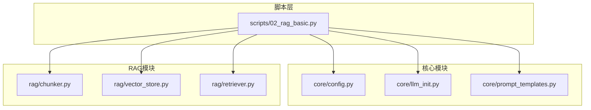
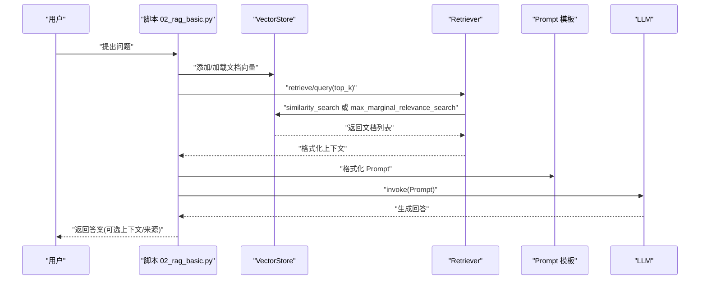
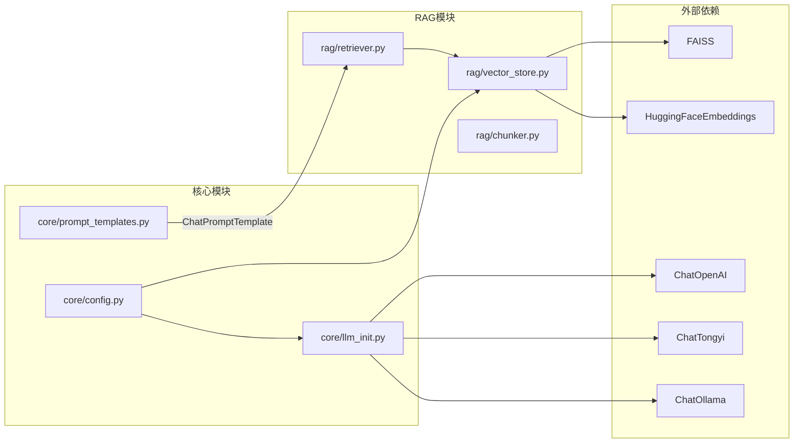

# 检索器与RAG链

<cite>
**本文引用的文件**
- [rag/retriever.py](file://rag/retriever.py)
- [rag/vector_store.py](file://rag/vector_store.py)
- [rag/chunker.py](file://rag/chunker.py)
- [scripts/02_rag_basic.py](file://scripts/02_rag_basic.py)
- [core/config.py](file://core/config.py)
- [core/llm_init.py](file://core/llm_init.py)
- [core/prompt_templates.py](file://core/prompt_templates.py)
- [README.md](file://README.md)
- [requirements.txt](file://requirements.txt)
</cite>

## 目录
1. [简介](#简介)
2. [项目结构](#项目结构)
3. [核心组件](#核心组件)
4. [架构总览](#架构总览)
5. [详细组件分析](#详细组件分析)
6. [依赖关系分析](#依赖关系分析)
7. [性能考量](#性能考量)
8. [故障排查指南](#故障排查指南)
9. [结论](#结论)
10. [附录](#附录)

## 简介
本文件围绕检索器与RAG链模块，系统阐述：
- 检索器核心算法：相似度搜索、MMR（最大边际相关性）排序、上下文构建策略
- RAG链完整工作流：从查询向量化、相似度计算到最终答案生成的端到端实现
- 不同检索策略对比：BM25、语义相似度、混合检索的适用场景与效果评估
- 检索质量评估指标、召回率优化、响应时间优化的实践指南
- RAG链配置参数、错误处理机制、性能监控与故障排除方法

## 项目结构
该项目采用“脚本驱动 + 模块化”的组织方式，RAG相关逻辑集中在 rag/ 目录，核心配置与LLM初始化在 core/ 目录，示例脚本在 scripts/ 目录。

图表来源
- [scripts/02_rag_basic.py:1-149](file://scripts/02_rag_basic.py#L1-L149)
- [core/config.py:1-68](file://core/config.py#L1-L68)
- [core/llm_init.py:1-131](file://core/llm_init.py#L1-L131)
- [core/prompt_templates.py:1-112](file://core/prompt_templates.py#L1-L112)
- [rag/chunker.py:1-175](file://rag/chunker.py#L1-L175)
- [rag/vector_store.py:1-252](file://rag/vector_store.py#L1-L252)
- [rag/retriever.py:1-203](file://rag/retriever.py#L1-L203)

章节来源
- [README.md:1-80](file://README.md#L1-L80)
- [requirements.txt:1-34](file://requirements.txt#L1-L34)

## 核心组件
- 向量存储（VectorStore）：基于 FAISS 的封装，负责文档/文本的向量化、持久化、相似度搜索、MMR 排序、统计信息获取。
- 检索器（Retriever）：面向用户的检索接口，提供相似度检索、带分数检索、MMR 检索与上下文格式化。
- RAG链（RAGChain）：将检索与生成串联，支持自定义 Prompt 模板，输出答案与可选上下文与来源元数据。
- 文本分块（Chunker）：支持多种文件格式加载与递归字符分块，便于后续向量化入库。
- 配置与LLM初始化：统一管理 API Key、默认模型、Embedding 模型与 LLM Provider。

章节来源
- [rag/vector_store.py:13-252](file://rag/vector_store.py#L13-L252)
- [rag/retriever.py:17-203](file://rag/retriever.py#L17-L203)
- [rag/chunker.py:12-175](file://rag/chunker.py#L12-L175)
- [core/config.py:48-68](file://core/config.py#L48-L68)
- [core/llm_init.py:18-131](file://core/llm_init.py#L18-L131)

## 架构总览
RAG链的端到端流程如下：
- 数据准备：加载/分块文档，构建向量索引
- 检索阶段：根据查询执行相似度或MMR检索
- 上下文构建：将检索结果格式化为 Prompt 上下文
- 生成阶段：调用 LLM，产出最终答案
- 结果返回：可选返回上下文与来源元数据

图表来源
- [scripts/02_rag_basic.py:70-128](file://scripts/02_rag_basic.py#L70-L128)
- [rag/retriever.py:129-189](file://rag/retriever.py#L129-L189)
- [rag/vector_store.py:116-217](file://rag/vector_store.py#L116-L217)
- [core/prompt_templates.py:16-27](file://core/prompt_templates.py#L16-L27)

## 详细组件分析

### 向量存储（VectorStore）
- 设计要点
  - 基于 FAISS 的懒加载与本地持久化，索引文件按集合名命名
  - 支持首次构建与增量添加，自动保存
  - 提供相似度搜索与带分数搜索；MMR 排序；统计信息查询
  - 过滤逻辑为后处理（因 FAISS 原生不支持过滤）

- 关键方法与复杂度
  - add_documents/add_texts：O(N) 构建/增量添加，N 为新增条目数
  - similarity_search/similarity_search_with_score：O(k log N) 检索（FAISS 内部实现）
  - max_marginal_relevance_search：O(fetch_k) 初始候选 + O(k·fetch_k) 选择，k 为返回数
  - delete/clear：delete 通过 FAISS 删除接口，clear 删除索引文件

- 参数与行为
  - collection_name：集合标识，决定索引文件名
  - persist_directory：持久化目录，默认指向项目根下的 .faiss
  - embedding_model：默认使用 HuggingFaceEmbeddings，中文模型 BAAI/bge-small-zh-v1.5
  - filter_dict：仅在相似度搜索中进行后处理过滤

- 错误处理与边界
  - db 为空时返回空结果
  - FAISS 不支持按 ID 删除，当前实现调用底层删除接口并保存，实际业务中建议重建索引

章节来源
- [rag/vector_store.py:16-252](file://rag/vector_store.py#L16-L252)
- [core/llm_init.py:111-131](file://core/llm_init.py#L111-L131)
- [core/config.py:48-51](file://core/config.py#L48-L51)

### 检索器（Retriever）
- 设计要点
  - 对外暴露三种检索能力：相似度检索、带分数检索、MMR 检索
  - 上下文格式化支持包含/不包含相似度分数
  - 通过 RetrievalResult 统一承载文档与分数

- 方法与流程
  - retrieve/retrieve_with_scores：委托 VectorStore 执行相似度检索
  - retrieve_with_mmr：委托 VectorStore 执行 MMR 检索
  - format_context：将检索结果序列化为字符串，便于注入 Prompt

- 参数与调优
  - top_k：控制返回数量
  - fetch_k：MMR 初始候选规模，影响多样性与性能
  - lambda_mult：MMR 多样性权重，0 关注相关性，1 关注多样性
  - filter_dict：后处理过滤，按元数据字段筛选

- 错误处理
  - 当 VectorStore 为空时返回空结果
  - 分数缺失时格式化上下文不显示分数

章节来源
- [rag/retriever.py:17-127](file://rag/retriever.py#L17-L127)

### RAG链（RAGChain）
- 设计要点
  - 将检索与生成解耦，支持自定义 Prompt 模板
  - query 接口统一返回答案，可选返回上下文与来源元数据

- 工作流程
  - 检索：调用 Retriever.retrieve 获取文档
  - 上下文：调用 Retriever.format_context 构建 Prompt 上下文
  - Prompt：使用模板或默认模板拼接上下文与问题
  - 生成：调用 LLM.invoke 生成回答
  - 结果：返回 answer，若开启 return_context 则附加 context 与 sources

- 参数与配置
  - retriever：检索器实例
  - llm：LangChain 聊天模型实例
  - prompt_template：可选的 ChatPromptTemplate

- 错误处理
  - LLM 返回对象可能无 content 属性，兼容字符串形式
  - 若未启用 return_context，则不返回上下文与来源

章节来源
- [rag/retriever.py:129-189](file://rag/retriever.py#L129-L189)
- [core/prompt_templates.py:16-27](file://core/prompt_templates.py#L16-L27)

### 文本分块（Chunker）
- 设计要点
  - 支持字符级与递归字符级分块
  - 支持多格式文件加载（PDF、Markdown、文本等）
  - 提供目录批量加载与分块

- 方法与用途
  - chunk_text：对纯文本进行字符级分块
  - chunk_documents：对 Document 列表进行递归字符级分块
  - load_*_file：加载特定格式文件
  - load_and_chunk_file：按文件扩展名选择加载器并分块
  - load_directory：批量加载目录并分块

- 参数与调优
  - chunk_size、chunk_overlap：控制分块粒度与重叠
  - separators：递归分块的优先级分隔符

章节来源
- [rag/chunker.py:12-175](file://rag/chunker.py#L12-L175)

### 示例脚本（02_rag_basic.py）
- 设计要点
  - 展示完整的 RAG 流程：准备文档、分块、向量化、检索、问答
  - 支持多 Provider 的 LLM 初始化与 API Key 检查
  - 输出检索分数与参考来源，便于评估

- 关键步骤
  - 文档准备与分块
  - 创建 VectorStore 并添加文档
  - 创建 Retriever 与 RAGChain
  - 执行检索与问答
  - 清理向量存储

章节来源
- [scripts/02_rag_basic.py:18-149](file://scripts/02_rag_basic.py#L18-L149)

## 依赖关系分析

图表来源
- [rag/vector_store.py:1-252](file://rag/vector_store.py#L1-L252)
- [rag/retriever.py:1-203](file://rag/retriever.py#L1-L203)
- [rag/chunker.py:1-175](file://rag/chunker.py#L1-L175)
- [core/llm_init.py:1-131](file://core/llm_init.py#L1-L131)
- [core/config.py:1-68](file://core/config.py#L1-L68)
- [core/prompt_templates.py:1-112](file://core/prompt_templates.py#L1-L112)

章节来源
- [requirements.txt:1-34](file://requirements.txt#L1-L34)

## 性能考量
- 相似度搜索
  - FAISS 基于向量相似度，通常 O(k log N)，适合大规模语义检索
  - filter_dict 为后处理过滤，对结果集再筛选，注意不要过度限制导致召回下降
- MMR 搜索
  - fetch_k 控制初始候选规模，lambda_mult 控制多样性与相关性平衡
  - fetch_k 越大，多样性越好但耗时增加；lambda_mult 越大越偏向相关性
- 向量存储
  - 首次构建成本高，建议增量更新并定期持久化
  - delete 仅标记删除，建议周期性重建索引以维持性能
- LLM 生成
  - temperature、top_p 等参数影响生成稳定性与多样性
  - Prompt 模板简洁明确有助于提升生成质量与速度

[本节为通用性能指导，无需具体文件分析]

## 故障排查指南
- API Key 未配置
  - 现象：初始化 LLM 抛出异常
  - 处理：在 .env 中配置对应 Provider 的 API Key，并确保 check_api_key 返回 True
- 向量索引加载失败
  - 现象：VectorStore.db 为空或加载异常
  - 处理：确认 persist_directory 与索引文件存在；必要时清理旧索引并重新构建
- 检索结果为空
  - 现象：相似度检索返回空
  - 处理：检查是否已添加文档；确认 embedding 模型可用；调整 top_k 或 filter_dict
- MMR 结果重复
  - 现象：返回结果高度相似
  - 处理：增大 fetch_k 或 lambda_mult；检查分块粒度是否过细
- 生成回答不稳定
  - 现象：温度过高导致答案漂移
  - 处理：降低 temperature；优化 Prompt 模板；固定 seed（如支持）

章节来源
- [core/llm_init.py:50-108](file://core/llm_init.py#L50-L108)
- [core/config.py:65-68](file://core/config.py#L65-L68)
- [rag/vector_store.py:38-57](file://rag/vector_store.py#L38-L57)

## 结论
本项目以 FAISS 为基础的向量存储为核心，结合 LangChain 的检索器与生成链路，实现了从文档分块、向量化、检索到生成的完整 RAG 流程。通过相似度检索与 MMR 排序的组合，可在准确性与多样性之间取得平衡；通过 Prompt 模板与可选上下文输出，便于评估与调试。建议在生产环境中配合缓存、索引重建与监控体系，持续优化检索质量与响应时间。

[本节为总结性内容，无需具体文件分析]

## 附录

### 检索策略对比与评估
- BM25
  - 适用：关键词精确匹配、结构化文档、短查询
  - 优点：速度快、可解释性强
  - 缺点：难以捕捉语义相似
- 语义相似度
  - 适用：长文本、跨句语义理解
  - 优点：语义相关性强
  - 缺点：召回可能稀疏，需合理 top_k 与过滤
- 混合检索
  - 适用：兼顾准确性与多样性
  - 方法：将 BM25 与语义相似度结果融合（如 RRFS、混合打分）
  - 建议：先做 BM25 粗排，再用语义精排，最后 MMR 去重

[本节为概念性内容，无需具体文件分析]

### 检索质量评估指标
- 召回率（Recall@K）：正确相关文档占全部相关文档的比例
- 精确率（Precision@K）：相关文档占返回文档的比例
- 归一化折损累积增益（nDCG@K）：考虑排序位置的相关性加权
- 多样性（Diversity）：MMR 的 lambda_mult 控制，避免结果趋同
- 响应时间（Latency）：检索 + 生成总耗时，关注 P50/P95

[本节为通用评估方法，无需具体文件分析]

### RAG链配置参数清单
- 检索器
  - top_k：返回文档数量
  - fetch_k：MMR 初始候选规模
  - lambda_mult：MMR 多样性权重
  - filter_dict：按元数据过滤
- 向量存储
  - collection_name：集合名
  - persist_directory：持久化目录
  - embedding_model：Embedding 模型名
- RAG 链
  - retriever：检索器实例
  - llm：LLM 实例
  - prompt_template：Prompt 模板
- 配置
  - DEFAULT_EMBEDDING_MODEL：默认中文 Embedding 模型
  - VECTOR_STORE_PATH：向量索引持久化路径
  - API Key：各 Provider 的密钥

章节来源
- [rag/retriever.py:29-102](file://rag/retriever.py#L29-L102)
- [rag/vector_store.py:16-36](file://rag/vector_store.py#L16-L36)
- [core/config.py:48-51](file://core/config.py#L48-L51)
- [core/prompt_templates.py:16-27](file://core/prompt_templates.py#L16-L27)