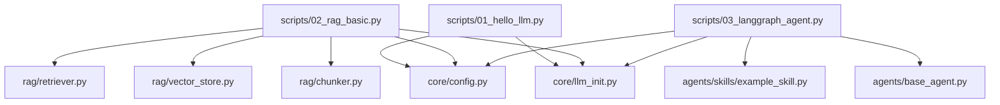
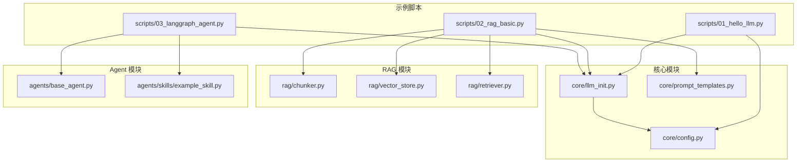
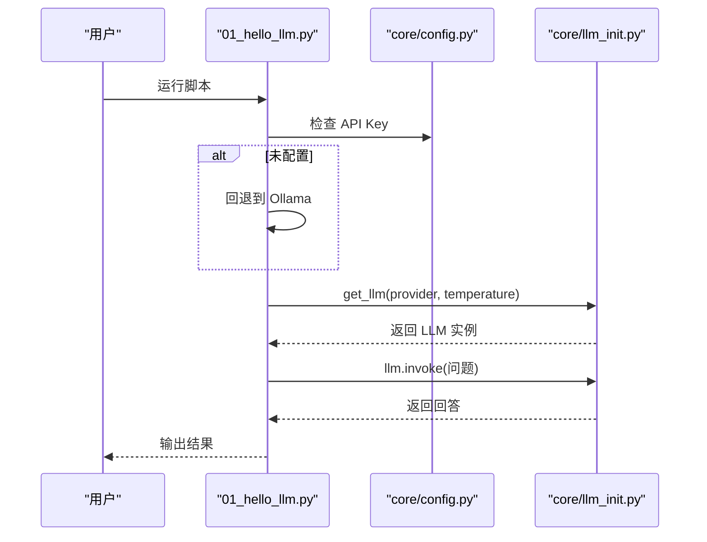
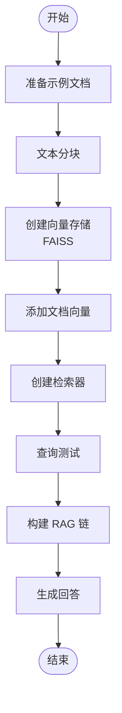
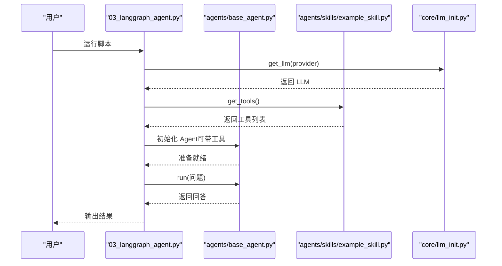
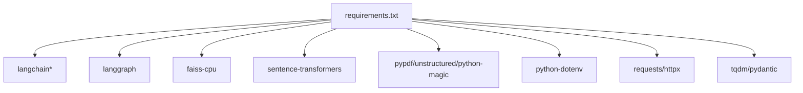

# 快速开始

<cite>
**本文引用的文件**
- [README.md](file://README.md)
- [requirements.txt](file://requirements.txt)
- [scripts/01_hello_llm.py](file://scripts/01_hello_llm.py)
- [scripts/02_rag_basic.py](file://scripts/02_rag_basic.py)
- [scripts/03_langgraph_agent.py](file://scripts/03_langgraph_agent.py)
- [core/config.py](file://core/config.py)
- [core/llm_init.py](file://core/llm_init.py)
- [rag/chunker.py](file://rag/chunker.py)
- [rag/vector_store.py](file://rag/vector_store.py)
- [rag/retriever.py](file://rag/retriever.py)
- [agents/base_agent.py](file://agents/base_agent.py)
- [agents/skills/example_skill.py](file://agents/skills/example_skill.py)
- [openspec/changes/archive/2026-03-24-init-llm-project/specs/project-structure/spec.md](file://openspec/changes/archive/2026-03-24-init-llm-project/specs/project-structure/spec.md)
</cite>

## 目录
1. [简介](#简介)
2. [项目结构](#项目结构)
3. [核心组件](#核心组件)
4. [架构总览](#架构总览)
5. [详细组件分析](#详细组件分析)
6. [依赖关系分析](#依赖关系分析)
7. [性能考虑](#性能考虑)
8. [故障排除指南](#故障排除指南)
9. [结论](#结论)
10. [附录](#附录)

## 简介
本指南面向新手开发者，帮助你在约30分钟内完成环境搭建、依赖安装、环境变量配置，并成功运行第一个示例（Hello LLM）。随后逐步介绍 RAG 基础示例与 LangGraph Agent 示例，涵盖常见问题排查与跨平台注意事项。

## 项目结构
该项目采用模块化组织方式，核心模块包括：
- scripts：示例脚本目录，包含入门、RAG、Agent 等示例
- core：可复用的核心模块（配置、LLM 初始化、Prompt 模板）
- rag：RAG 相关代码（文本分块、向量存储、检索器）
- agents：LangGraph Agent 基础类与技能模块
- data/docs：本地文档存储
- outputs：生成结果输出

**图表来源**
- [scripts/01_hello_llm.py:1-95](file://scripts/01_hello_llm.py#L1-L95)
- [core/llm_init.py:1-131](file://core/llm_init.py#L1-L131)
- [core/config.py:1-68](file://core/config.py#L1-L68)
- [scripts/02_rag_basic.py:1-149](file://scripts/02_rag_basic.py#L1-L149)
- [rag/chunker.py:1-175](file://rag/chunker.py#L1-L175)
- [rag/vector_store.py:1-252](file://rag/vector_store.py#L1-L252)
- [rag/retriever.py:1-203](file://rag/retriever.py#L1-L203)
- [scripts/03_langgraph_agent.py:1-184](file://scripts/03_langgraph_agent.py#L1-L184)
- [agents/base_agent.py:1-178](file://agents/base_agent.py#L1-L178)
- [agents/skills/example_skill.py:1-95](file://agents/skills/example_skill.py#L1-L95)

**章节来源**
- [README.md:7-39](file://README.md#L7-L39)
- [openspec/changes/archive/2026-03-24-init-llm-project/specs/project-structure/spec.md:1-42](file://openspec/changes/archive/2026-03-24-init-llm-project/specs/project-structure/spec.md#L1-L42)

## 核心组件
- 配置模块：负责加载 .env 环境变量、定义默认模型与嵌入模型、管理数据与输出目录
- LLM 初始化模块：根据提供商（OpenAI、通义千问、Ollama、MiMo）统一初始化聊天模型
- RAG 模块：文本分块、向量存储（FAISS）、检索器与 RAG 链
- Agent 模块：基于 LangGraph 的基础 Agent 类与工具注册机制
- 示例脚本：从 Hello LLM 开始，逐步深入到 RAG 与 Agent

**章节来源**
- [core/config.py:1-68](file://core/config.py#L1-L68)
- [core/llm_init.py:18-131](file://core/llm_init.py#L18-L131)
- [rag/chunker.py:12-175](file://rag/chunker.py#L12-L175)
- [rag/vector_store.py:13-252](file://rag/vector_store.py#L13-L252)
- [rag/retriever.py:17-203](file://rag/retriever.py#L17-L203)
- [agents/base_agent.py:26-178](file://agents/base_agent.py#L26-L178)
- [agents/skills/example_skill.py:59-95](file://agents/skills/example_skill.py#L59-L95)

## 架构总览
下图展示了从示例脚本到核心模块与第三方库的调用关系，以及 RAG 与 Agent 的典型数据流。

**图表来源**
- [scripts/01_hello_llm.py:11-12](file://scripts/01_hello_llm.py#L11-L12)
- [scripts/02_rag_basic.py:10-15](file://scripts/02_rag_basic.py#L10-L15)
- [scripts/03_langgraph_agent.py:10-13](file://scripts/03_langgraph_agent.py#L10-L13)
- [core/llm_init.py:5-15](file://core/llm_init.py#L5-L15)
- [core/config.py:1-7](file://core/config.py#L1-L7)
- [rag/chunker.py:6-9](file://rag/chunker.py#L6-L9)
- [rag/vector_store.py:7-10](file://rag/vector_store.py#L7-L10)
- [rag/retriever.py:7](file://rag/retriever.py#L7)
- [agents/base_agent.py:5-9](file://agents/base_agent.py#L5-L9)
- [agents/skills/example_skill.py:5](file://agents/skills/example_skill.py#L5)

## 详细组件分析

### Hello LLM（基础 LLM 调用）
- 功能概述：演示如何初始化不同提供商的 LLM 并进行多轮对话
- 关键流程：
  1) 选择提供商并检查 API Key
  2) 初始化 LLM
  3) 发起单轮与多轮对话
- 异常处理：当 API Key 未配置时自动回退到 Ollama（本地模型）

**图表来源**
- [scripts/01_hello_llm.py:20-50](file://scripts/01_hello_llm.py#L20-L50)
- [core/config.py:65-67](file://core/config.py#L65-L67)
- [core/llm_init.py:18-47](file://core/llm_init.py#L18-L47)

**章节来源**
- [scripts/01_hello_llm.py:15-95](file://scripts/01_hello_llm.py#L15-L95)
- [core/config.py:24-46](file://core/config.py#L24-L46)
- [core/llm_init.py:18-108](file://core/llm_init.py#L18-L108)

### RAG 基础（检索增强生成）
- 功能概述：演示完整的 RAG 流程：准备文档 → 文本分块 → 向量存储 → 检索 → 问答
- 关键流程：
  1) 准备示例文档
  2) 文本分块（CharacterTextSplitter 与 RecursiveCharacterTextSplitter）
  3) 创建 FAISS 向量存储并添加文档
  4) 创建检索器并检索
  5) 构建 RAG 链并生成答案

**图表来源**
- [scripts/02_rag_basic.py:18-144](file://scripts/02_rag_basic.py#L18-L144)
- [rag/chunker.py:12-61](file://rag/chunker.py#L12-L61)
- [rag/vector_store.py:13-71](file://rag/vector_store.py#L13-L71)
- [rag/retriever.py:17-102](file://rag/retriever.py#L17-L102)

**章节来源**
- [scripts/02_rag_basic.py:44-149](file://scripts/02_rag_basic.py#L44-L149)
- [rag/chunker.py:12-175](file://rag/chunker.py#L12-L175)
- [rag/vector_store.py:13-252](file://rag/vector_store.py#L13-L252)
- [rag/retriever.py:17-203](file://rag/retriever.py#L17-L203)

### LangGraph Agent（智能体）
- 功能概述：展示简单 Agent 与带工具的 Agent，演示工具注册与调用
- 关键流程：
  1) 初始化 LLM（优先 OpenAI，否则回退到 Ollama）
  2) 创建 SimpleAgent 或注册工具的 Agent
  3) 执行问答与工具调用演示

**图表来源**
- [scripts/03_langgraph_agent.py:16-101](file://scripts/03_langgraph_agent.py#L16-L101)
- [agents/base_agent.py:26-178](file://agents/base_agent.py#L26-L178)
- [agents/skills/example_skill.py:59-82](file://agents/skills/example_skill.py#L59-L82)
- [core/llm_init.py:18-47](file://core/llm_init.py#L18-L47)

**章节来源**
- [scripts/03_langgraph_agent.py:150-184](file://scripts/03_langgraph_agent.py#L150-L184)
- [agents/base_agent.py:26-178](file://agents/base_agent.py#L26-L178)
- [agents/skills/example_skill.py:59-95](file://agents/skills/example_skill.py#L59-L95)

## 依赖关系分析
- Python 版本与依赖：项目使用 pip 安装依赖，核心依赖包括 LangChain 生态、LangGraph、FAISS、sentence-transformers、pypdf、unstructured、python-dotenv、requests、httpx、tqdm、pydantic 等
- 环境变量：通过 python-dotenv 加载 .env 文件，支持 OPENAI_API_KEY、DASHSCOPE_API_KEY、LANGCHAIN_API_KEY、OLLAMA_BASE_URL 等

**图表来源**
- [requirements.txt:1-34](file://requirements.txt#L1-L34)

**章节来源**
- [requirements.txt:1-34](file://requirements.txt#L1-L34)
- [core/config.py:4-7](file://core/config.py#L4-L7)

## 性能考虑
- 向量存储：首次创建向量索引会下载嵌入模型，后续可复用本地索引；FAISS 索引持久化至 .faiss 目录
- 嵌入模型：默认使用中文小模型，兼顾速度与准确性；可根据需要调整模型名称
- 文本分块：合理设置 chunk_size 与 chunk_overlap，在召回质量与性能之间平衡
- 网络与代理：若使用 OpenAI 或通义千问，确保网络稳定与代理配置正确

[本节为通用指导，无需特定文件来源]

## 故障排除指南
- 未配置 API Key
  - 现象：初始化 LLM 时报错或提示未配置
  - 处理：复制 .env.example 为 .env 并填入对应 API Key；或使用 Ollama（本地模型）
- 网络连接异常
  - 现象：调用远程模型失败
  - 处理：检查网络连通性与代理设置；确认 API Key 有效
- 依赖冲突
  - 现象：安装或运行时报版本冲突
  - 处理：使用虚拟环境隔离依赖；升级 pip、setuptools、wheel；必要时锁定兼容版本
- Windows/macOS/Linux 特殊注意事项
  - Windows：确保安装 Microsoft C++ Build Tools；使用 PowerShell 以管理员权限运行
  - macOS：使用 Homebrew 安装依赖（如 libmagic）；确保 Xcode Command Line Tools 已安装
  - Linux：安装编译工具链与系统依赖（如 libmagic），使用 apt/yum/dnf 安装

**章节来源**
- [scripts/01_hello_llm.py:32-88](file://scripts/01_hello_llm.py#L32-L88)
- [core/llm_init.py:52-62](file://core/llm_init.py#L52-L62)
- [core/llm_init.py:67-77](file://core/llm_init.py#L67-L77)
- [core/llm_init.py:97-108](file://core/llm_init.py#L97-L108)

## 结论
通过本指南，你可以在30分钟内完成环境搭建与依赖安装，成功运行 Hello LLM 示例，并进一步探索 RAG 与 Agent 的实践。遇到问题时，优先检查 API Key、网络与依赖版本，按平台差异安装系统依赖即可解决大多数问题。

[本节为总结，无需特定文件来源]

## 附录

### 环境搭建步骤
- 安装依赖
  - 在项目根目录执行安装命令，安装 requirements.txt 中声明的全部依赖
- 配置环境变量
  - 复制 .env.example 为 .env，并填入所需的 API Key（如 OPENAI_API_KEY、DASHSCOPE_API_KEY）
- 运行示例
  - 从 Hello LLM 开始：运行 scripts/01_hello_llm.py
  - 进阶：运行 scripts/02_rag_basic.py 体验 RAG
  - 进阶：运行 scripts/03_langgraph_agent.py 体验 Agent

**章节来源**
- [README.md:43-60](file://README.md#L43-L60)

### 跨平台注意事项
- Windows
  - 安装 Microsoft C++ Build Tools
  - 使用 PowerShell 以管理员权限运行
- macOS
  - 使用 Homebrew 安装系统依赖（如 libmagic）
  - 确保 Xcode Command Line Tools 已安装
- Linux
  - 安装编译工具链与系统依赖（如 libmagic）
  - 使用 apt/yum/dnf 安装所需包

**章节来源**
- [openspec/changes/archive/2026-03-24-init-llm-project/specs/project-structure/spec.md:31-37](file://openspec/changes/archive/2026-03-24-init-llm-project/specs/project-structure/spec.md#L31-L37)