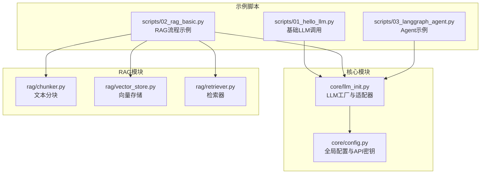
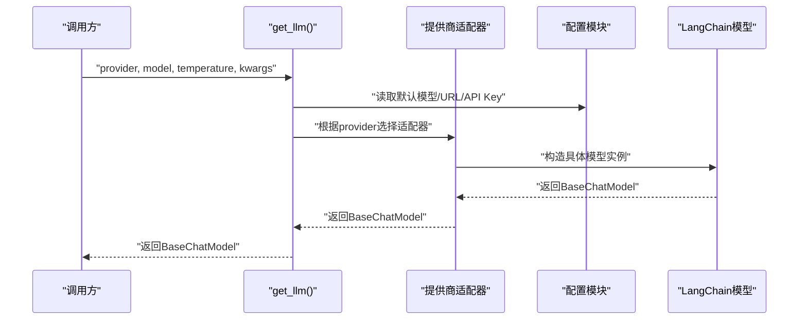
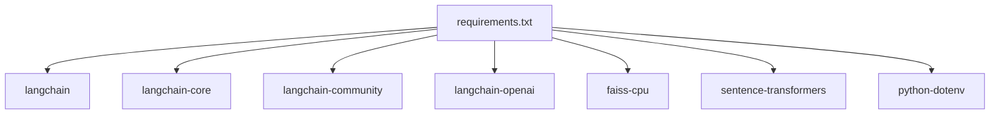

# LLM初始化模块

<cite>
**本文引用的文件**
- [core/llm_init.py](file://core/llm_init.py)
- [core/config.py](file://core/config.py)
- [scripts/01_hello_llm.py](file://scripts/01_hello_llm.py)
- [scripts/02_rag_basic.py](file://scripts/02_rag_basic.py)
- [scripts/03_langgraph_agent.py](file://scripts/03_langgraph_agent.py)
- [rag/vector_store.py](file://rag/vector_store.py)
- [rag/chunker.py](file://rag/chunker.py)
- [rag/retriever.py](file://rag/retriever.py)
- [README.md](file://README.md)
- [requirements.txt](file://requirements.txt)
</cite>

## 目录
1. [简介](#简介)
2. [项目结构](#项目结构)
3. [核心组件](#核心组件)
4. [架构总览](#架构总览)
5. [详细组件分析](#详细组件分析)
6. [依赖分析](#依赖分析)
7. [性能考虑](#性能考虑)
8. [故障排除指南](#故障排除指南)
9. [结论](#结论)
10. [附录](#附录)

## 简介
本文件为LLM初始化模块的技术文档，聚焦于core/llm_init.py的工厂模式实现，涵盖多提供商支持机制（OpenAI、通义千问、Ollama、MiMo）、提供商适配器设计、配置参数传递流程。文档深入解释LLM实例化的完整过程，包括模型选择逻辑、连接参数配置、错误处理机制，并提供扩展新LLM提供商、自定义模型参数、实现提供商切换的具体方法。同时包含性能优化建议、缓存策略和故障恢复机制。

## 项目结构
该项目采用按功能分层的组织方式，核心初始化逻辑集中在core/llm_init.py，全局配置在core/config.py，示例脚本位于scripts/目录，RAG相关模块位于rag/目录。

图表来源
- [core/llm_init.py:1-131](file://core/llm_init.py#L1-L131)
- [core/config.py:1-68](file://core/config.py#L1-L68)
- [scripts/01_hello_llm.py:1-95](file://scripts/01_hello_llm.py#L1-L95)
- [scripts/02_rag_basic.py:1-149](file://scripts/02_rag_basic.py#L1-L149)
- [scripts/03_langgraph_agent.py:1-184](file://scripts/03_langgraph_agent.py#L1-L184)
- [rag/chunker.py:1-175](file://rag/chunker.py#L1-L175)
- [rag/vector_store.py:1-251](file://rag/vector_store.py#L1-L251)
- [rag/retriever.py:1-203](file://rag/retriever.py#L1-L203)

章节来源
- [README.md:1-80](file://README.md#L1-L80)
- [requirements.txt:1-34](file://requirements.txt#L1-L34)

## 核心组件
- LLM工厂函数：根据provider参数选择对应的提供商初始化器，负责模型名称、温度参数、透传kwargs等配置。
- 提供商适配器：针对不同提供商的初始化器，分别处理API Key、Base URL、模型名称等差异。
- 全局配置：集中管理API Key、默认模型、Ollama Base URL、MiMo Base URL、向量存储路径等。
- 嵌入模型：提供HuggingFaceEmbeddings的封装，便于RAG流程使用。

章节来源
- [core/llm_init.py:18-131](file://core/llm_init.py#L18-L131)
- [core/config.py:24-50](file://core/config.py#L24-L50)

## 架构总览
LLM初始化模块采用“工厂+适配器”的架构，通过统一入口get_llm()屏蔽不同提供商的差异，内部根据provider路由到对应适配器，最终返回LangChain的BaseChatModel实例。配置模块负责集中管理环境变量与默认值，确保初始化流程的可配置性与可移植性。

图表来源
- [core/llm_init.py:18-108](file://core/llm_init.py#L18-L108)
- [core/config.py:24-50](file://core/config.py#L24-L50)

## 详细组件分析

### 工厂函数与提供商选择
- get_llm(provider, model, temperature, **kwargs)：统一入口，负责provider标准化、模型选择逻辑、错误处理。
- 支持的provider：openai、qwen/dashscope、ollama、mimo；其他值抛出异常。
- 模型选择：若未显式传入model，则使用对应提供商的默认模型；否则使用传入值。

章节来源
- [core/llm_init.py:18-47](file://core/llm_init.py#L18-L47)
- [core/config.py:38-43](file://core/config.py#L38-L43)

### OpenAI适配器
- 依赖langchain_openai.ChatOpenAI。
- 参数校验：必须配置OPENAI_API_KEY，否则抛出异常。
- 关键参数：model、temperature、api_key。
- kwargs透传：允许传递额外的客户端配置（如超时、代理等）。

章节来源
- [core/llm_init.py:50-62](file://core/llm_init.py#L50-L62)
- [core/config.py:25](file://core/config.py#L25)

### 通义千问适配器
- 依赖langchain_community.chat_models.ChatTongyi。
- 参数校验：必须配置DASHSCOPE_API_KEY，否则抛出异常。
- 关键参数：model、temperature、dashscope_api_key。
- provider别名：支持"qwen"和"dashscope"两种输入。

章节来源
- [core/llm_init.py:65-77](file://core/llm_init.py#L65-L77)
- [core/config.py:26](file://core/config.py#L26)

### Ollama适配器
- 依赖langchain_community.chat_models.ChatOllama。
- 关键参数：model、temperature、base_url（来自OLLAMA_BASE_URL）。
- 无需API Key，适合本地部署场景。

章节来源
- [core/llm_init.py:80-89](file://core/llm_init.py#L80-L89)
- [core/config.py:36](file://core/config.py#L36)

### MiMo适配器
- 依赖langchain_openai.ChatOpenAI，兼容OpenAI格式。
- 参数校验：必须配置MIMO_API_KEY，否则抛出异常。
- 关键参数：model、temperature、api_key、base_url（来自MIMO_BASE_URL）。

章节来源
- [core/llm_init.py:92-108](file://core/llm_init.py#L92-L108)
- [core/config.py:29](file://core/config.py#L29)
- [core/config.py:46](file://core/config.py#L46)

### 嵌入模型与向量存储
- get_embedding_model(model_name)：返回HuggingFaceEmbeddings实例，默认使用BAAI/bge-small-zh-v1.5。
- 向量存储：基于FAISS，支持持久化、懒加载、增量添加、MMR检索等。

章节来源
- [core/llm_init.py:111-131](file://core/llm_init.py#L111-L131)
- [rag/vector_store.py:13-251](file://rag/vector_store.py#L13-L251)

### 使用示例与流程
- 基础调用：scripts/01_hello_llm.py展示了如何选择provider、检查API Key、初始化LLM并进行对话。
- RAG流程：scripts/02_rag_basic.py展示了从文档准备、分块、向量存储、检索到RAG问答的完整流程。
- Agent示例：scripts/03_langgraph_agent.py展示了如何在Agent中使用LLM。

章节来源
- [scripts/01_hello_llm.py:15-95](file://scripts/01_hello_llm.py#L15-L95)
- [scripts/02_rag_basic.py:44-149](file://scripts/02_rag_basic.py#L44-L149)
- [scripts/03_langgraph_agent.py:16-184](file://scripts/03_langgraph_agent.py#L16-L184)

### 扩展新提供商指南
- 新增适配器：在core/llm_init.py中新增_get_your_provider_llm()函数，处理API Key校验、参数映射与kwargs透传。
- 注册工厂分支：在get_llm()中添加elif分支，将新provider映射到适配器。
- 配置项：在core/config.py中新增API Key与Base URL等配置项，并在.env中设置。
- 示例参考：可参照OpenAI/MiMo适配器的实现风格。

章节来源
- [core/llm_init.py:18-108](file://core/llm_init.py#L18-L108)
- [core/config.py:24-50](file://core/config.py#L24-L50)

### 自定义模型参数与提供商切换
- 自定义参数：通过kwargs透传至具体模型构造函数，满足不同提供商的特定配置。
- 切换provider：直接修改get_llm()的provider参数即可在不同提供商间切换，无需改动业务代码。
- 默认模型：可通过core/config.py调整DEFAULT_*_MODEL，影响未显式传入model时的行为。

章节来源
- [core/llm_init.py:18-47](file://core/llm_init.py#L18-L47)
- [core/config.py:38-43](file://core/config.py#L38-L43)

## 依赖分析
- LangChain生态：langchain、langchain-core、langchain-community、langchain-openai。
- 向量存储：faiss-cpu。
- 嵌入模型：sentence-transformers。
- 环境变量：python-dotenv。
- HTTP客户端：requests、httpx。
- 可选：ollama（本地模型）。

图表来源
- [requirements.txt:1-34](file://requirements.txt#L1-L34)

章节来源
- [requirements.txt:1-34](file://requirements.txt#L1-L34)

## 性能考虑
- 模型选择：优先选择轻量级模型（如gpt-3.5-turbo、qwen-turbo、llama2）以降低延迟与成本；对复杂任务再选用更大模型。
- 温度参数：较低温度提升确定性，较高温度增加创造性，应根据应用场景权衡。
- 嵌入模型：BAAI/bge-small-zh-v1.5适合中文场景，但可能较慢；可根据硬件条件选择更小的模型。
- 向量存储：FAISS索引支持持久化，首次构建耗时较长，建议在离线阶段完成索引构建并持久化。
- 网络与超时：通过kwargs透传超时与重试策略，避免阻塞主线程。
- 本地模型：Ollama适合离线与低延迟场景，但需合理分配本地资源。

[本节为通用性能建议，不直接分析具体文件]

## 故障排除指南
- API Key缺失：当未配置OPENAI_API_KEY、DASHSCOPE_API_KEY或MIMO_API_KEY时，对应适配器会抛出异常。请在.env中设置相应KEY。
- Ollama不可达：若provider为ollama，需确保本地Ollama服务已启动且基地址正确。
- Provider不支持：传入未知provider会触发异常。请确认provider拼写或在工厂中注册新分支。
- RAG流程异常：检查向量存储是否已持久化、嵌入模型是否可用、检索top_k参数是否合理。
- 示例脚本报错：参考scripts/01_hello_llm.py中的排错建议，核对.env配置与网络连通性。

章节来源
- [core/llm_init.py:52-53](file://core/llm_init.py#L52-L53)
- [core/llm_init.py:67-68](file://core/llm_init.py#L67-L68)
- [core/llm_init.py:97-98](file://core/llm_init.py#L97-L98)
- [scripts/01_hello_llm.py:82-88](file://scripts/01_hello_llm.py#L82-L88)

## 结论
LLM初始化模块通过工厂+适配器的设计，实现了对多提供商的统一接入与灵活切换。其清晰的职责分离、完善的错误处理与可扩展的配置体系，使得在不同场景下快速替换LLM提供商成为可能。配合RAG与Agent示例，开发者可以在此基础上快速搭建从基础对话到复杂检索增强生成与智能体应用的完整链路。

[本节为总结性内容，不直接分析具体文件]

## 附录

### API定义与参数说明
- get_llm(provider, model=None, temperature=0.7, **kwargs) -> BaseChatModel
  - provider: "openai" | "qwen" | "dashscope" | "ollama" | "mimo"
  - model: 模型名称，未提供时使用默认模型
  - temperature: 采样温度
  - kwargs: 透传至具体模型构造函数
- get_embedding_model(model_name=None) -> Embeddings
  - model_name: 嵌入模型名称，默认"BAAI/bge-small-zh-v1.5"

章节来源
- [core/llm_init.py:18-47](file://core/llm_init.py#L18-L47)
- [core/llm_init.py:111-131](file://core/llm_init.py#L111-L131)

### 配置项一览
- OPENAI_API_KEY：OpenAI API Key
- DASHSCOPE_API_KEY：通义千问 API Key
- MIMO_API_KEY：MiMo API Key
- OLLAMA_BASE_URL：Ollama服务地址，默认"http://localhost:11434"
- MIMO_BASE_URL：MiMo服务地址，默认"https://api.xiaomimimo.com/v1"
- DEFAULT_*_MODEL：各提供商默认模型名称
- DEFAULT_EMBEDDING_MODEL：嵌入模型名称
- VECTOR_STORE_PATH：FAISS索引持久化路径

章节来源
- [core/config.py:24-50](file://core/config.py#L24-L50)

### 示例脚本要点
- 01_hello_llm.py：展示基础LLM调用与多轮对话，包含API Key检查与错误处理。
- 02_rag_basic.py：展示RAG全流程，包含文档分块、向量存储、检索与问答。
- 03_langgraph_agent.py：展示Agent使用LLM与工具调用的基本流程。

章节来源
- [scripts/01_hello_llm.py:15-95](file://scripts/01_hello_llm.py#L15-L95)
- [scripts/02_rag_basic.py:44-149](file://scripts/02_rag_basic.py#L44-L149)
- [scripts/03_langgraph_agent.py:16-184](file://scripts/03_langgraph_agent.py#L16-L184)