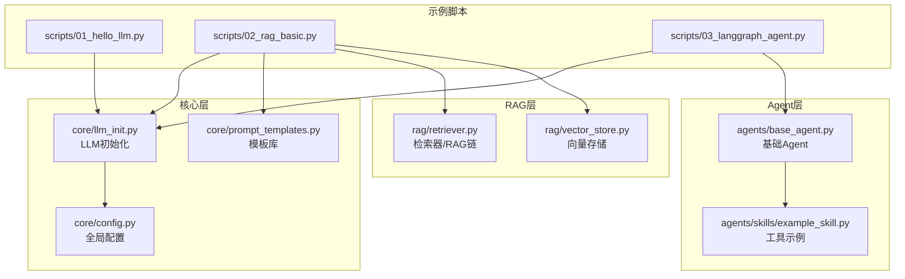
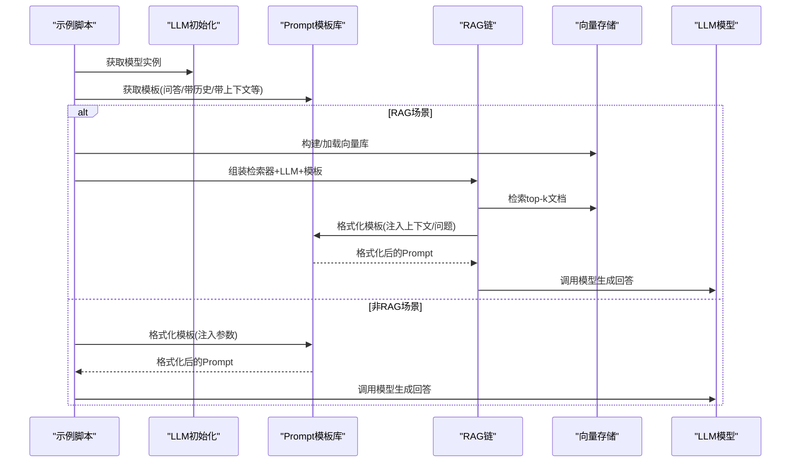
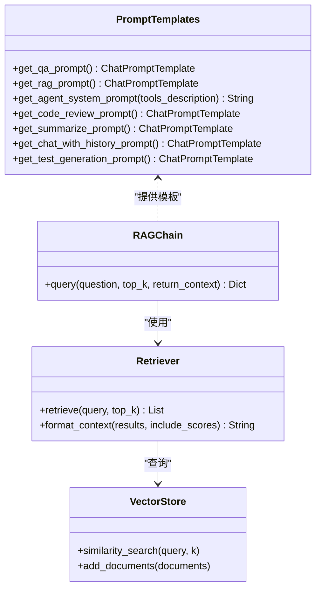

# Prompt模板系统

<cite>
**本文引用的文件**
- [prompt_templates.py](file://core/prompt_templates.py)
- [config.py](file://core/config.py)
- [llm_init.py](file://core/llm_init.py)
- [retriever.py](file://rag/retriever.py)
- [vector_store.py](file://rag/vector_store.py)
- [base_agent.py](file://agents/base_agent.py)
- [example_skill.py](file://agents/skills/example_skill.py)
- [01_hello_llm.py](file://scripts/01_hello_llm.py)
- [02_rag_basic.py](file://scripts/02_rag_basic.py)
- [03_langgraph_agent.py](file://scripts/03_langgraph_agent.py)
- [README.md](file://README.md)
- [requirements.txt](file://requirements.txt)
</cite>

## 目录
1. [简介](#简介)
2. [项目结构](#项目结构)
3. [核心组件](#核心组件)
4. [架构总览](#架构总览)
5. [详细组件分析](#详细组件分析)
6. [依赖分析](#依赖分析)
7. [性能考虑](#性能考虑)
8. [故障排查指南](#故障排查指南)
9. [结论](#结论)
10. [附录](#附录)

## 简介
本文件为 Prompt 模板系统提供权威参考文档，聚焦 core/prompt_templates.py 的设计理念与实现架构，涵盖：
- 模板定义方式与参数化机制
- 模板继承与组合策略
- 预定义模板的用途与使用场景
- 与 LLM 调用的集成方式与参数传递机制
- 自定义模板、动态参数注入、模板复用的最佳实践
- 性能与调试建议

## 项目结构
该项目采用“脚本驱动示例 + 核心模块”的组织方式，Prompt 模板位于 core 层，配合 LLM 初始化、RAG 检索与 Agent 框架共同构成端到端工作流。

图表来源
- [prompt_templates.py:1-112](file://core/prompt_templates.py#L1-L112)
- [config.py:1-68](file://core/config.py#L1-L68)
- [llm_init.py:1-131](file://core/llm_init.py#L1-L131)
- [retriever.py:1-203](file://rag/retriever.py#L1-L203)
- [vector_store.py:1-252](file://rag/vector_store.py#L1-L252)
- [base_agent.py:1-178](file://agents/base_agent.py#L1-L178)
- [example_skill.py:1-95](file://agents/skills/example_skill.py#L1-L95)
- [01_hello_llm.py:1-95](file://scripts/01_hello_llm.py#L1-L95)
- [02_rag_basic.py:1-149](file://scripts/02_rag_basic.py#L1-L149)
- [03_langgraph_agent.py:1-184](file://scripts/03_langgraph_agent.py#L1-L184)

章节来源
- [README.md:1-80](file://README.md#L1-L80)

## 核心组件
- Prompt 模板库：提供多种预定义模板，统一返回 LangChain 的 ChatPromptTemplate 或系统提示词字符串，便于在不同场景复用。
- LLM 初始化：根据配置选择不同提供商的模型实例，统一温度等参数。
- RAG 链：将检索到的上下文注入模板，再交给 LLM 生成最终回答。
- Agent：基于 LangGraph 的工作流，结合系统提示词与工具调用，实现复杂推理与执行。

章节来源
- [prompt_templates.py:1-112](file://core/prompt_templates.py#L1-L112)
- [llm_init.py:1-131](file://core/llm_init.py#L1-L131)
- [retriever.py:129-189](file://rag/retriever.py#L129-L189)
- [base_agent.py:26-178](file://agents/base_agent.py#L26-L178)

## 架构总览
Prompt 模板系统在整体架构中的位置如下：

图表来源
- [02_rag_basic.py:109-122](file://scripts/02_rag_basic.py#L109-L122)
- [retriever.py:150-189](file://rag/retriever.py#L150-L189)
- [prompt_templates.py:5-13](file://core/prompt_templates.py#L5-L13)
- [prompt_templates.py:16-27](file://core/prompt_templates.py#L16-L27)
- [prompt_templates.py:85-91](file://core/prompt_templates.py#L85-L91)
- [prompt_templates.py:30-45](file://core/prompt_templates.py#L30-L45)

## 详细组件分析

### 模板库设计与实现
- 设计理念
  - 统一返回 LangChain 的 ChatPromptTemplate，便于链式调用与消息占位符管理。
  - 对于需要系统提示词的场景，提供字符串模板并通过占位符注入工具描述等动态内容。
  - 通过函数化接口暴露模板，便于在不同模块间共享与替换。

- 关键实现要点
  - 通用问答模板：返回 ChatPromptTemplate，包含用户问题占位符。
  - RAG 问答模板：返回 ChatPromptTemplate，包含上下文与问题占位符。
  - 带历史记录的聊天模板：使用 MessagesPlaceholder，支持历史消息注入。
  - Agent 系统提示词：返回字符串，通过 format 注入工具描述。
  - 其他专用模板：代码审查、文本总结、测试用例生成等，均返回 ChatPromptTemplate。

- 参数化与占位符
  - ChatPromptTemplate.from_template：基于字符串模板自动识别占位符。
  - MessagesPlaceholder：动态插入历史消息列表。
  - 字符串模板的 .format：用于注入工具描述等静态内容。

- 模板继承与组合
  - 通过组合现有模板（例如在 RAG 场景中将检索到的上下文注入到问答模板）实现“模板继承”效果。
  - 在 RAG 链中，模板与检索器、LLM 解耦，便于替换与扩展。

章节来源
- [prompt_templates.py:5-13](file://core/prompt_templates.py#L5-L13)
- [prompt_templates.py:16-27](file://core/prompt_templates.py#L16-L27)
- [prompt_templates.py:30-45](file://core/prompt_templates.py#L30-L45)
- [prompt_templates.py:85-91](file://core/prompt_templates.py#L85-L91)
- [prompt_templates.py:94-111](file://core/prompt_templates.py#L94-L111)

### 预定义模板与使用场景
- 通用问答模板
  - 适用：简单问答、非上下文依赖的任务。
  - 使用方式：在脚本中获取模板并注入问题参数，调用 LLM 即可。
  - 参考路径：[get_qa_prompt:5-13](file://core/prompt_templates.py#L5-L13)

- RAG 问答模板
  - 适用：需要引入外部知识库上下文的问答。
  - 使用方式：在 RAG 链中，先检索上下文，再将上下文与问题注入模板。
  - 参考路径：[get_rag_prompt:16-27](file://core/prompt_templates.py#L16-L27)、[RAGChain.query:150-189](file://rag/retriever.py#L150-L189)

- 带历史记录的聊天模板
  - 适用：多轮对话需要保留上下文的历史信息。
  - 使用方式：通过 MessagesPlaceholder 动态传入历史消息列表。
  - 参考路径：[get_chat_with_history_prompt:85-91](file://core/prompt_templates.py#L85-L91)

- Agent 系统提示词
  - 适用：智能体需要明确工具可用性与调用规则。
  - 使用方式：将工具描述注入到系统提示词字符串中。
  - 参考路径：[get_agent_system_prompt:30-45](file://core/prompt_templates.py#L30-L45)

- 代码审查模板
  - 适用：对代码质量、安全性、性能与最佳实践进行评估。
  - 参考路径：[get_code_review_prompt:48-65](file://core/prompt_templates.py#L48-L65)

- 文本总结模板
  - 适用：提取关键信息并生成要点摘要。
  - 参考路径：[get_summarize_prompt:68-82](file://core/prompt_templates.py#L68-L82)

- 测试用例生成模板
  - 适用：为给定代码生成符合规范的测试用例。
  - 参考路径：[get_test_generation_prompt:94-111](file://core/prompt_templates.py#L94-L111)

章节来源
- [prompt_templates.py:5-111](file://core/prompt_templates.py#L5-L111)
- [retriever.py:150-189](file://rag/retriever.py#L150-L189)

### 与 LLM 调用的集成与参数传递
- LLM 初始化
  - 支持多提供商（OpenAI、通义千问、Ollama、MiMo），统一温度等参数。
  - 参考路径：[get_llm:18-47](file://core/llm_init.py#L18-L47)

- RAG 链集成
  - 检索器负责将上下文格式化为字符串，模板负责将上下文与问题注入到 Prompt。
  - 参考路径：[RAGChain.query:150-189](file://rag/retriever.py#L150-L189)

- Agent 集成
  - Agent 在工作流中将系统提示词与用户消息组合后调用 LLM。
  - 参考路径：[BaseAgent._agent_node:76-90](file://agents/base_agent.py#L76-L90)

- 示例脚本中的使用
  - 基础 LLM 示例：展示如何初始化模型并进行简单对话。
    - 参考路径：[01_hello_llm.py:38-76](file://scripts/01_hello_llm.py#L38-L76)
  - RAG 基础示例：展示如何使用模板与检索器构建完整问答流程。
    - 参考路径：[02_rag_basic.py:109-122](file://scripts/02_rag_basic.py#L109-L122)
  - Agent 示例：展示如何将工具描述注入系统提示词。
    - 参考路径：[03_langgraph_agent.py:82-87](file://scripts/03_langgraph_agent.py#L82-L87)

章节来源
- [llm_init.py:18-108](file://core/llm_init.py#L18-L108)
- [retriever.py:150-189](file://rag/retriever.py#L150-L189)
- [base_agent.py:76-90](file://agents/base_agent.py#L76-L90)
- [01_hello_llm.py:38-76](file://scripts/01_hello_llm.py#L38-L76)
- [02_rag_basic.py:109-122](file://scripts/02_rag_basic.py#L109-L122)
- [03_langgraph_agent.py:82-87](file://scripts/03_langgraph_agent.py#L82-L87)

### 自定义模板与最佳实践
- 自定义模板创建
  - 使用 ChatPromptTemplate.from_template 定义模板字符串，确保占位符命名清晰且与调用时传参一致。
  - 参考路径：[get_qa_prompt:5-13](file://core/prompt_templates.py#L5-L13)

- 动态参数注入
  - 对于 ChatPromptTemplate：通过 format 方法注入参数。
  - 对于系统提示词字符串：通过 .format 注入工具描述等动态内容。
  - 参考路径：[RAGChain.query:172-176](file://rag/retriever.py#L172-L176)、[get_agent_system_prompt:30-45](file://core/prompt_templates.py#L30-L45)

- 模板组合与复用
  - 在 RAG 场景中，将检索到的上下文注入到问答模板，实现“模板继承”。
  - 在 Agent 场景中，将工具描述注入系统提示词，实现“模板复用”。
  - 参考路径：[RAGChain.query:172-176](file://rag/retriever.py#L172-L176)、[get_agent_system_prompt:30-45](file://core/prompt_templates.py#L30-L45)

- 模板继承机制
  - 通过组合现有模板（如问答模板）与上下文注入，达到继承效果。
  - 在 Agent 中，将工具描述注入到系统提示词，形成“工具感知”的系统提示词模板。

- 参数化模板的复杂度与性能
  - ChatPromptTemplate 的解析与格式化开销较小，适合高频调用。
  - 字符串模板的 .format 为 O(n) 复杂度，n 为模板长度，通常可忽略。

- 调试技巧
  - 在调用前打印模板格式化后的 Prompt，便于核对参数注入是否正确。
  - 在 RAG 场景中，先单独打印检索到的上下文，再打印最终 Prompt，定位问题来源。
  - 参考路径：[02_rag_basic.py:118-128](file://scripts/02_rag_basic.py#L118-L128)

章节来源
- [prompt_templates.py:5-13](file://core/prompt_templates.py#L5-L13)
- [prompt_templates.py:30-45](file://core/prompt_templates.py#L30-L45)
- [retriever.py:172-176](file://rag/retriever.py#L172-L176)
- [02_rag_basic.py:118-128](file://scripts/02_rag_basic.py#L118-L128)

### 代码级类图（模板与链的关系）

图表来源
- [prompt_templates.py:5-111](file://core/prompt_templates.py#L5-L111)
- [retriever.py:129-189](file://rag/retriever.py#L129-L189)
- [vector_store.py:13-251](file://rag/vector_store.py#L13-L251)

## 依赖分析
- 外部依赖
  - LangChain 生态：langchain-core、langchain-community、langchain-openai、langgraph。
  - 向量存储：faiss-cpu。
  - 嵌入模型：sentence-transformers。
  - 环境变量：python-dotenv。
  - HTTP 客户端：requests、httpx。
  - 工具库：pydantic、tqdm。

- 内部依赖
  - Prompt 模板库依赖 LangChain 的 ChatPromptTemplate 与 MessagesPlaceholder。
  - RAG 链依赖检索器与向量存储，模板仅负责参数化。
  - Agent 依赖 LangGraph 的 StateGraph 与 ToolNode，模板用于系统提示词注入。

章节来源
- [requirements.txt:1-34](file://requirements.txt#L1-L34)
- [prompt_templates.py:2-2](file://core/prompt_templates.py#L2-L2)
- [retriever.py:1-8](file://rag/retriever.py#L1-L8)
- [vector_store.py:6-10](file://rag/vector_store.py#L6-L10)
- [base_agent.py:5-9](file://agents/base_agent.py#L5-L9)

## 性能考虑
- 模板解析与格式化
  - ChatPromptTemplate 的解析与格式化为轻量操作，适合高频调用。
  - 字符串模板的 .format 为线性复杂度，通常可忽略。

- RAG 场景性能
  - 检索阶段的性能取决于向量库规模与相似度搜索算法；建议合理设置 top_k 与过滤条件。
  - 上下文拼接的成本与检索到的文档数量成正比，可通过截断或 MMR 策略控制。

- 模型调用成本
  - 温度、上下文长度与 token 用量直接影响调用成本；建议在模板中精简冗余信息。

- 本地模型与在线模型
  - Ollama 本地模型延迟低但吞吐有限；在线模型响应快但成本较高。根据场景选择合适的提供商。

## 故障排查指南
- API Key 未配置
  - 现象：初始化 LLM 时报错或调用失败。
  - 排查：检查 .env 文件中对应 Provider 的 API Key 是否正确配置。
  - 参考路径：[config.py:24-30](file://core/config.py#L24-L30)、[llm_init.py:52-53](file://core/llm_init.py#L52-L53)

- 模板参数缺失
  - 现象：格式化模板时报错或输出异常。
  - 排查：确认调用时传入了模板所需的所有参数；在调用前打印格式化后的 Prompt。
  - 参考路径：[retriever.py:172-176](file://rag/retriever.py#L172-L176)、[02_rag_basic.py:118-128](file://scripts/02_rag_basic.py#L118-L128)

- 历史消息未生效
  - 现象：多轮对话未保留上下文。
  - 排查：确认使用了带 MessagesPlaceholder 的模板，并正确传入 history 参数。
  - 参考路径：[prompt_templates.py:85-91](file://core/prompt_templates.py#L85-L91)

- Agent 工具未被调用
  - 现象：Agent 未触发工具调用。
  - 排查：确认模型支持函数调用；检查系统提示词中工具描述是否正确注入。
  - 参考路径：[base_agent.py:96-98](file://agents/base_agent.py#L96-L98)、[03_langgraph_agent.py:82-87](file://scripts/03_langgraph_agent.py#L82-L87)

## 结论
Prompt 模板系统通过标准化的模板定义与参数化机制，实现了在不同场景下的高效复用与组合。结合 LLM 初始化、RAG 检索与 Agent 工作流，形成了从“参数化 Prompt”到“链式调用”的完整闭环。建议在实际项目中：
- 明确模板职责边界，避免过度复杂的模板逻辑。
- 在 RAG 场景中优先控制上下文长度与检索数量。
- 在 Agent 场景中确保系统提示词与工具描述的一致性。
- 通过日志与中间产物验证模板参数注入的正确性。

## 附录
- 快速上手
  - 运行基础示例：[01_hello_llm.py:38-76](file://scripts/01_hello_llm.py#L38-L76)
  - 运行 RAG 示例：[02_rag_basic.py:109-122](file://scripts/02_rag_basic.py#L109-L122)
  - 运行 Agent 示例：[03_langgraph_agent.py:82-87](file://scripts/03_langgraph_agent.py#L82-L87)

- 相关配置
  - 全局配置与 API Key：[config.py:24-30](file://core/config.py#L24-L30)
  - LLM 初始化与提供商选择：[llm_init.py:18-47](file://core/llm_init.py#L18-L47)