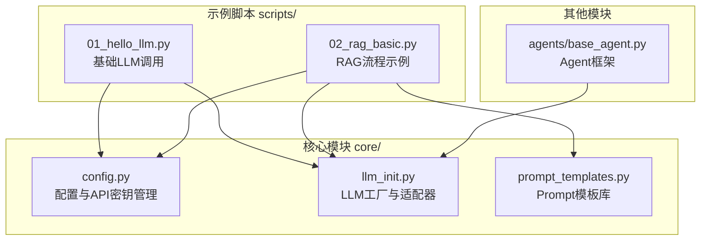
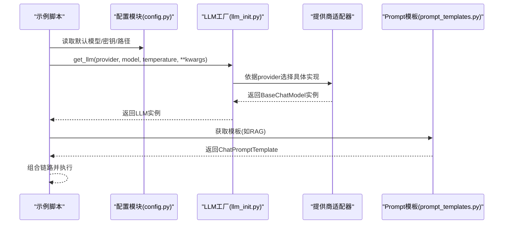
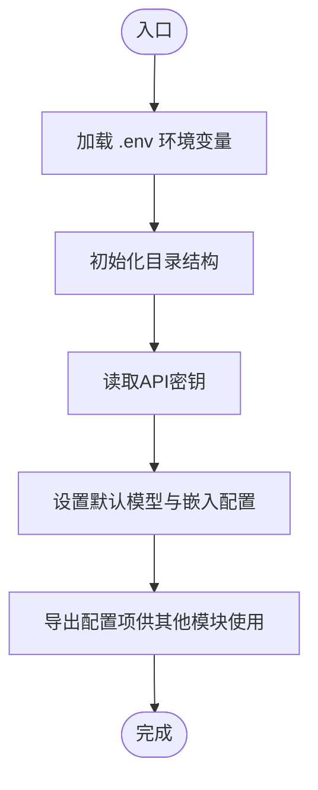
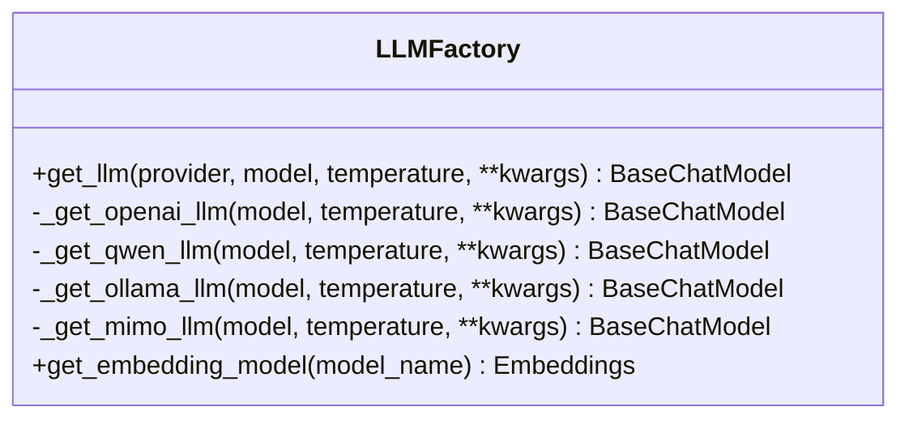
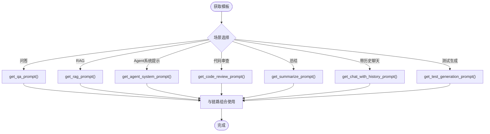
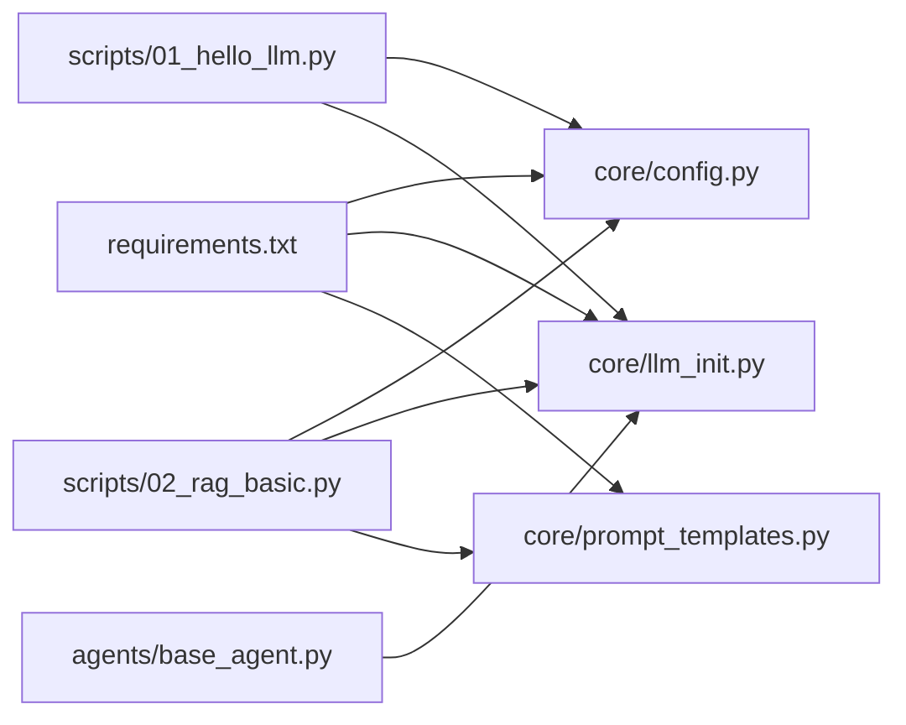

# 核心模块

<cite>
**本文引用的文件**
- [core/config.py](file://core/config.py)
- [core/llm_init.py](file://core/llm_init.py)
- [core/prompt_templates.py](file://core/prompt_templates.py)
- [scripts/01_hello_llm.py](file://scripts/01_hello_llm.py)
- [scripts/02_rag_basic.py](file://scripts/02_rag_basic.py)
- [agents/base_agent.py](file://agents/base_agent.py)
- [README.md](file://README.md)
- [requirements.txt](file://requirements.txt)
</cite>

## 目录
1. [简介](#简介)
2. [项目结构](#项目结构)
3. [核心组件](#核心组件)
4. [架构总览](#架构总览)
5. [详细组件分析](#详细组件分析)
6. [依赖分析](#依赖分析)
7. [性能考虑](#性能考虑)
8. [故障排除指南](#故障排除指南)
9. [结论](#结论)
10. [附录](#附录)

## 简介
本文件聚焦于项目的核心模块，围绕以下目标展开：
- 配置管理系统（config.py）：环境变量加载、配置验证、默认值处理与API密钥管理。
- LLM初始化模块（llm_init.py）：多提供商支持机制（工厂模式）、提供商适配器、配置参数传递。
- Prompt模板系统（prompt_templates.py）：设计理念与使用方法。
- 扩展指南：如何新增提供商、自定义配置选项。
- 错误处理、性能优化建议与最佳实践。

## 项目结构
该项目采用“按职责分层”的组织方式，核心模块位于 core/，示例脚本位于 scripts/，RAG与Agent相关模块分别位于 rag/ 与 agents/。核心模块负责统一的配置与LLM初始化，示例脚本展示了如何在实际场景中使用这些能力。

图表来源
- [core/config.py:1-68](file://core/config.py#L1-L68)
- [core/llm_init.py:1-131](file://core/llm_init.py#L1-L131)
- [core/prompt_templates.py:1-112](file://core/prompt_templates.py#L1-L112)
- [scripts/01_hello_llm.py:1-95](file://scripts/01_hello_llm.py#L1-L95)
- [scripts/02_rag_basic.py:1-149](file://scripts/02_rag_basic.py#L1-L149)
- [agents/base_agent.py:1-178](file://agents/base_agent.py#L1-L178)

章节来源
- [README.md:1-80](file://README.md#L1-L80)

## 核心组件
- 配置管理（config.py）
  - 环境变量加载：通过dotenv加载.env文件中的键值对。
  - 目录结构：项目根目录、数据目录、输出目录，并确保目录存在。
  - API密钥：集中管理多个提供商的API Key，提供查询与校验接口。
  - 默认模型配置：为不同提供商设定默认模型名称。
  - 向量存储配置：FAISS路径与默认中文嵌入模型名称。
- LLM初始化（llm_init.py）
  - 工厂函数：根据提供商字符串返回对应的LangChain聊天模型实例。
  - 多提供商适配：OpenAI、通义千问、Ollama、MiMo（兼容OpenAI格式）。
  - 参数传递：温度、模型名、以及透传的kwargs。
  - 嵌入模型：HuggingFaceEmbeddings封装，CPU设备与归一化嵌入。
- Prompt模板（prompt_templates.py）
  - 设计理念：以ChatPromptTemplate与MessagesPlaceholder为核心，提供问答、RAG、Agent系统提示、代码审查、总结、带历史聊天、测试用例生成等模板。
  - 使用方法：通过函数获取模板，再与链路组合使用。

章节来源
- [core/config.py:1-68](file://core/config.py#L1-L68)
- [core/llm_init.py:1-131](file://core/llm_init.py#L1-L131)
- [core/prompt_templates.py:1-112](file://core/prompt_templates.py#L1-L112)

## 架构总览
下图展示了配置、LLM初始化与Prompt模板在典型调用中的交互关系，以及与示例脚本的集成。

图表来源
- [core/config.py:1-68](file://core/config.py#L1-L68)
- [core/llm_init.py:18-48](file://core/llm_init.py#L18-L48)
- [core/prompt_templates.py:16-27](file://core/prompt_templates.py#L16-L27)

## 详细组件分析

### 配置管理系统（config.py）
- 环境变量加载
  - 通过dotenv加载.env文件，随后通过os.getenv读取键值。
  - 适用于开发与部署时的密钥与路径管理。
- 目录与路径
  - 项目根目录、数据目录、文档目录、输出目录均在初始化时创建。
- API密钥管理
  - 集中式维护多个提供商的API Key。
  - 提供查询与校验接口，便于在初始化前快速判断可用性。
- 默认模型配置
  - 为OpenAI、通义千问、Ollama、MiMo设定默认模型名称。
- 向量存储配置
  - FAISS本地路径与默认中文嵌入模型名称，便于RAG模块直接使用。

图表来源
- [core/config.py:6-51](file://core/config.py#L6-L51)

章节来源
- [core/config.py:1-68](file://core/config.py#L1-L68)

### LLM初始化模块（llm_init.py）
- 工厂模式
  - get_llm(provider, model, temperature, **kwargs)根据提供商字符串分发到对应适配器。
  - 适配器内部负责导入对应LangChain类并构造实例。
- 多提供商支持
  - OpenAI：校验OPENAI_API_KEY，使用ChatOpenAI。
  - 通义千问：校验DASHSCOPE_API_KEY，使用ChatTongyi。
  - Ollama：无需密钥，使用ChatOllama，支持自定义base_url。
  - MiMo：校验MIMO_API_KEY，使用ChatOpenAI但指向MIMO_BASE_URL。
- 参数传递与默认值
  - model优先使用传入值，否则回退至config.py中的默认模型。
  - temperature与kwargs透传至底层模型构造函数。
- 嵌入模型
  - get_embedding_model封装HuggingFaceEmbeddings，设置device与归一化参数。

图表来源
- [core/llm_init.py:18-131](file://core/llm_init.py#L18-L131)

章节来源
- [core/llm_init.py:1-131](file://core/llm_init.py#L1-L131)

### Prompt模板系统（prompt_templates.py）
- 设计理念
  - 以ChatPromptTemplate为核心，结合MessagesPlaceholder实现上下文与历史消息占位。
  - 模板函数化，便于在不同场景（问答、RAG、Agent、代码审查、总结、测试生成）复用。
- 模板类型
  - 通用问答、RAG问答、Agent系统提示、代码审查、文本总结、带历史聊天、测试用例生成。
- 使用方法
  - 在RAG示例中，通过get_rag_prompt()获取模板，与retriever、LLM组合形成RAG链。
  - 在Agent中，通过get_agent_system_prompt()拼接工具描述，形成系统提示词。

图表来源
- [core/prompt_templates.py:5-112](file://core/prompt_templates.py#L5-L112)

章节来源
- [core/prompt_templates.py:1-112](file://core/prompt_templates.py#L1-L112)
- [scripts/02_rag_basic.py:109-110](file://scripts/02_rag_basic.py#L109-L110)

### 示例脚本中的集成
- 基础LLM调用（01_hello_llm.py）
  - 展示如何使用check_api_key检测密钥可用性，随后通过get_llm初始化模型并进行多轮对话。
- RAG流程（02_rag_basic.py）
  - 展示从文档准备、分块、向量存储、检索器创建到RAG问答的完整流程，并使用get_rag_prompt()模板。

章节来源
- [scripts/01_hello_llm.py:15-95](file://scripts/01_hello_llm.py#L15-L95)
- [scripts/02_rag_basic.py:44-149](file://scripts/02_rag_basic.py#L44-L149)

## 依赖分析
- 核心模块依赖
  - config.py：dotenv、pathlib、os。
  - llm_init.py：langchain-core、langchain-openai、langchain-community。
  - prompt_templates.py：langchain-core.prompts。
- 示例脚本依赖
  - 01_hello_llm.py：core.llm_init、core.config。
  - 02_rag_basic.py：core.llm_init、core.config、core.prompt_templates、rag.*。
- Agent框架
  - agents/base_agent.py：langgraph、langchain-core.tools、langchain-core.language_models。

图表来源
- [requirements.txt:1-34](file://requirements.txt#L1-L34)
- [core/config.py:1-68](file://core/config.py#L1-L68)
- [core/llm_init.py:1-16](file://core/llm_init.py#L1-L16)
- [core/prompt_templates.py:1-3](file://core/prompt_templates.py#L1-L3)
- [scripts/01_hello_llm.py:11-12](file://scripts/01_hello_llm.py#L11-L12)
- [scripts/02_rag_basic.py:10-15](file://scripts/02_rag_basic.py#L10-L15)
- [agents/base_agent.py:5-9](file://agents/base_agent.py#L5-L9)

章节来源
- [requirements.txt:1-34](file://requirements.txt#L1-L34)

## 性能考虑
- 模型初始化成本
  - OpenAI、通义千问、MiMo均涉及网络请求；建议在应用生命周期内复用LLM实例，避免重复初始化。
- 本地推理
  - Ollama适合本地推理，注意base_url可达性与模型拉取时间。
- 嵌入模型
  - HuggingFaceEmbeddings默认使用CPU，若频繁调用可考虑缓存或降采样策略。
- 网络与超时
  - 对外API调用建议设置合理的超时与重试策略，避免阻塞主线程。
- 向量存储
  - FAISS索引构建与查询需关注内存占用，合理设置top_k与分页策略。

## 故障排除指南
- API密钥缺失
  - OpenAI、通义千问、MiMo在初始化时会校验对应API Key，若未配置会抛出异常。请在.env中设置相应键值。
- Ollama不可达
  - 若provider为ollama，需确保本地服务运行且base_url可达。
- 模型提供商不支持
  - get_llm仅支持openai、qwen/dashscope、ollama、mimo，传入其他值会抛出异常。
- RAG流程异常
  - 检查向量存储初始化、文档分块与添加、检索器创建与查询。
- Agent工具调用
  - 确保工具注册后重新构建工作流，避免工具未生效。

章节来源
- [core/llm_init.py:52-53](file://core/llm_init.py#L52-L53)
- [core/llm_init.py:67-68](file://core/llm_init.py#L67-L68)
- [core/llm_init.py:97-98](file://core/llm_init.py#L97-L98)
- [scripts/01_hello_llm.py:82-88](file://scripts/01_hello_llm.py#L82-L88)
- [scripts/02_rag_basic.py:138-142](file://scripts/02_rag_basic.py#L138-L142)

## 结论
本核心模块通过统一的配置管理、工厂化的LLM初始化与模板化的Prompt设计，为项目提供了清晰、可扩展的基础能力。通过示例脚本与Agent框架的集成，开发者可以快速搭建从基础对话到RAG与智能体的工作流。建议在生产环境中加强错误处理、超时控制与资源复用，以获得更稳定的性能表现。

## 附录

### 如何扩展新的提供商
- 新增提供商步骤
  - 在config.py中新增API Key读取与默认模型配置。
  - 在llm_init.py中新增_get_{provider}_llm函数，导入对应LangChain类并构造实例。
  - 在get_llm中增加分支逻辑，映射到新提供商。
  - 在示例脚本中更新check_api_key与默认provider选择逻辑。
- 自定义配置选项
  - 通过kwargs透传至底层模型构造函数，满足特殊参数需求（如代理、超时、自定义headers等）。
  - 对于本地模型（如Ollama），可通过base_url等参数调整连接地址。

章节来源
- [core/config.py:24-46](file://core/config.py#L24-L46)
- [core/llm_init.py:18-48](file://core/llm_init.py#L18-L48)
- [scripts/01_hello_llm.py:20-37](file://scripts/01_hello_llm.py#L20-L37)

### 使用示例（路径指引）
- 基础LLM调用
  - [scripts/01_hello_llm.py:38-50](file://scripts/01_hello_llm.py#L38-L50)
- RAG问答
  - [scripts/02_rag_basic.py:105-122](file://scripts/02_rag_basic.py#L105-L122)
- Agent工作流
  - [agents/base_agent.py:48-74](file://agents/base_agent.py#L48-L74)