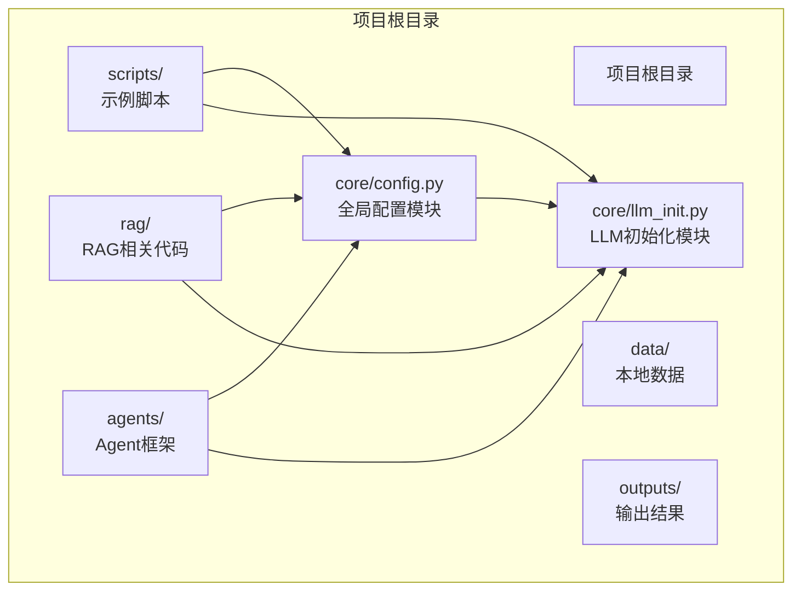
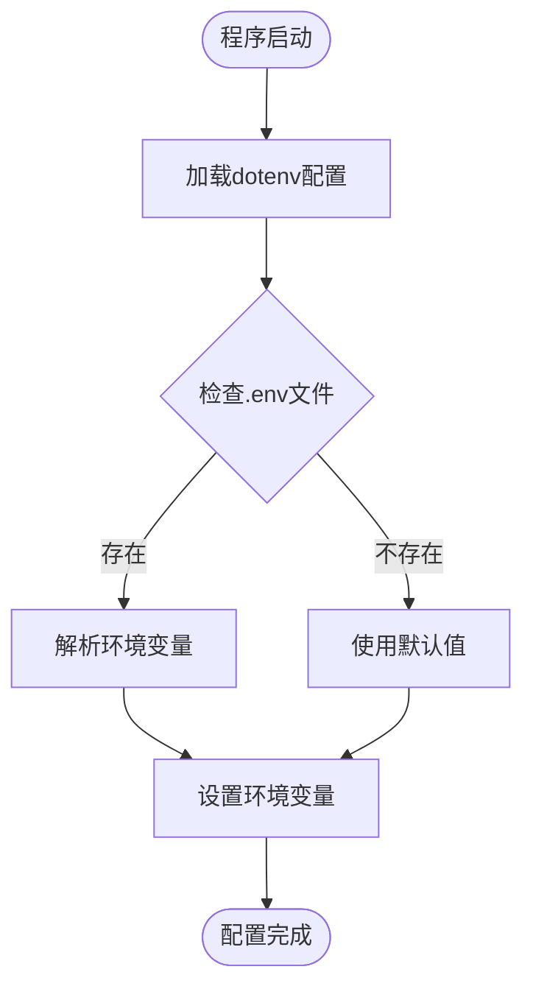
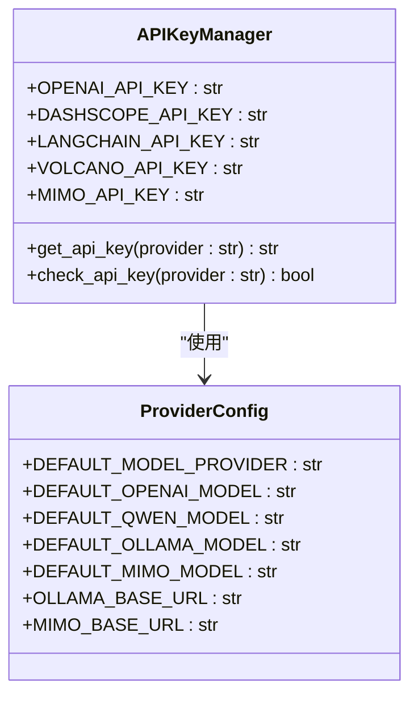
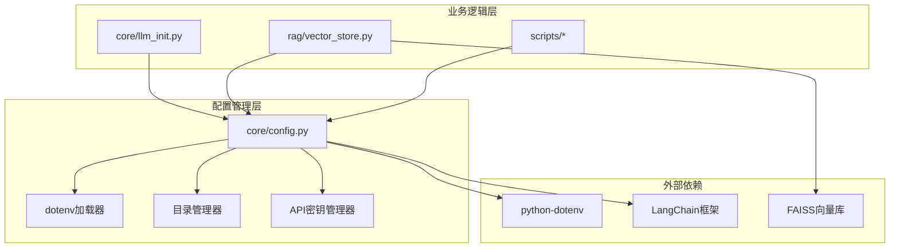
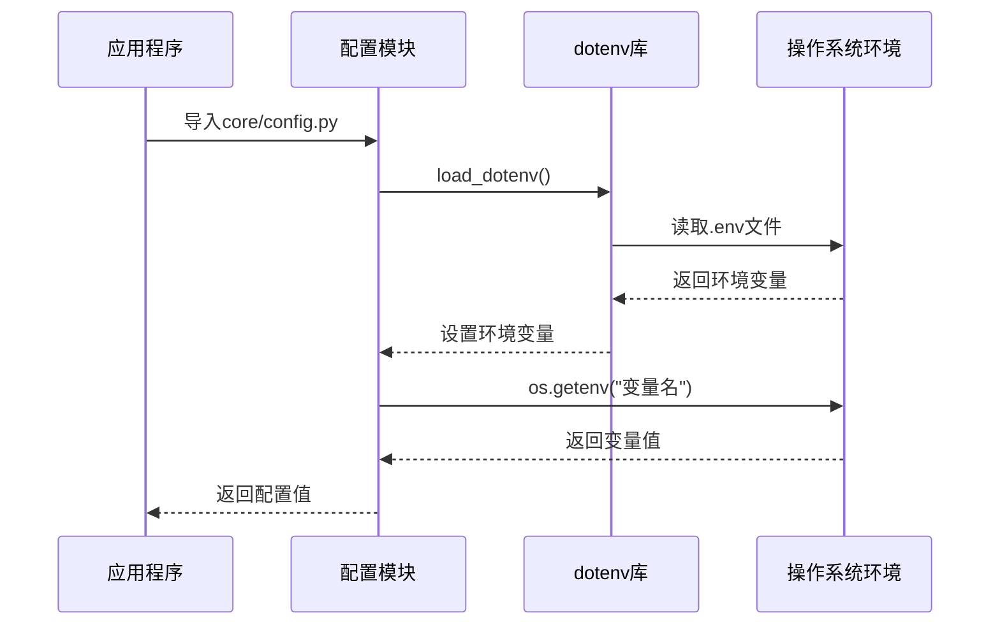
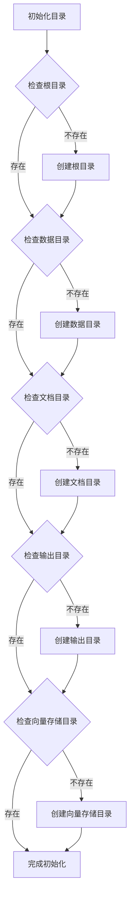
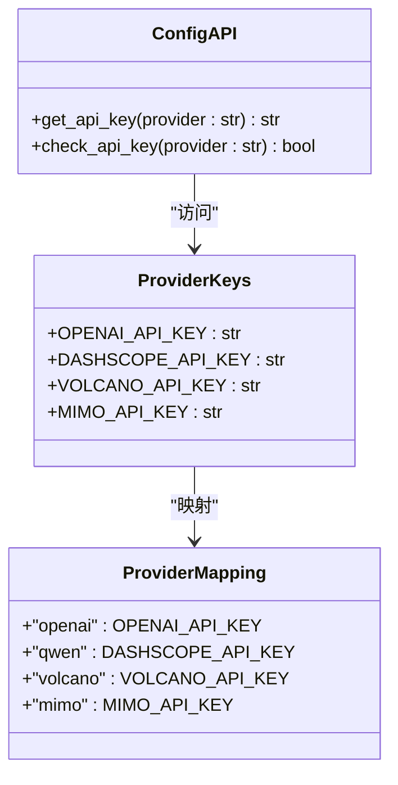
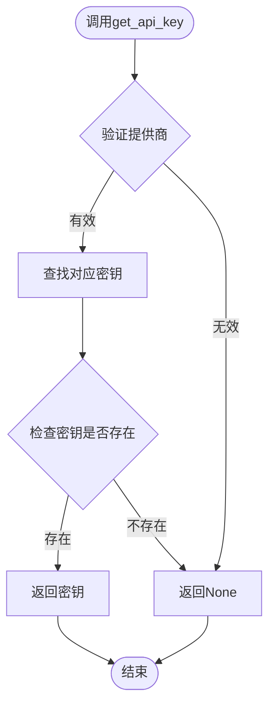
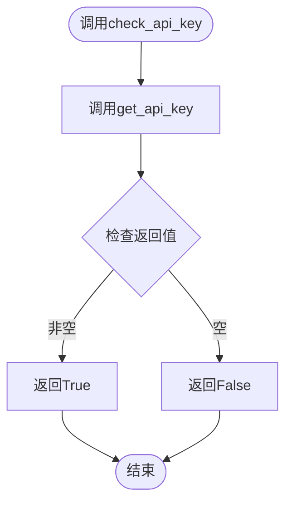
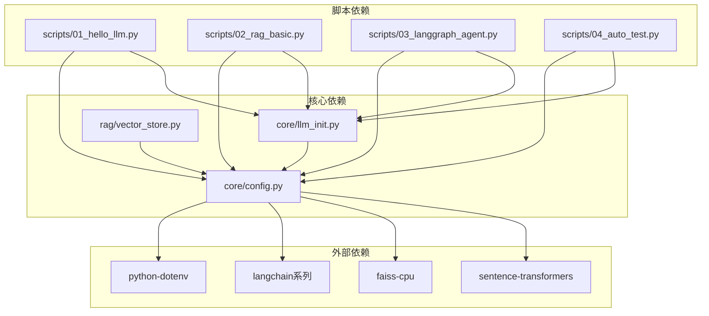

# 配置管理系统

<cite>
**本文档引用的文件**
- [core/config.py](file://core/config.py)
- [core/llm_init.py](file://core/llm_init.py)
- [scripts/01_hello_llm.py](file://scripts/01_hello_llm.py)
- [scripts/02_rag_basic.py](file://scripts/02_rag_basic.py)
- [scripts/03_langgraph_agent.py](file://scripts/03_langgraph_agent.py)
- [scripts/04_auto_test.py](file://scripts/04_auto_test.py)
- [rag/vector_store.py](file://rag/vector_store.py)
- [README.md](file://README.md)
- [requirements.txt](file://requirements.txt)
- [.gitignore](file://.gitignore)
</cite>

## 目录
1. [简介](#简介)
2. [项目结构](#项目结构)
3. [核心组件](#核心组件)
4. [架构概览](#架构概览)
5. [详细组件分析](#详细组件分析)
6. [依赖关系分析](#依赖关系分析)
7. [性能考虑](#性能考虑)
8. [故障排除指南](#故障排除指南)
9. [结论](#结论)

## 简介

配置管理系统是LLM学习项目的基础设施核心，负责统一管理所有环境变量、目录结构、API密钥配置以及默认模型设置。该系统采用dotenv集成机制，确保敏感信息的安全存储和管理，同时提供了灵活的API密钥管理和模型配置功能。

系统支持多种大型语言模型提供商，包括OpenAI、通义千问、火山引擎和MiMo等，并提供了完整的错误处理策略和安全最佳实践。

## 项目结构

LLM学习项目采用模块化的目录结构设计，配置管理系统位于核心模块中：



**图表来源**
- [core/config.py:1-68](file://core/config.py#L1-L68)
- [README.md:7-39](file://README.md#L7-L39)

**章节来源**
- [README.md:7-39](file://README.md#L7-L39)
- [core/config.py:9-22](file://core/config.py#L9-L22)

## 核心组件

### 环境变量加载机制

配置系统通过dotenv库实现环境变量的自动加载，确保敏感信息不会被提交到版本控制系统中。



**图表来源**
- [core/config.py:6-7](file://core/config.py#L6-L7)

### 目录结构管理

系统自动创建和管理关键目录结构，确保数据的有序存储和访问：

| 目录类型 | 路径 | 用途 | 特性 |
|---------|------|------|------|
| 项目根目录 | `PROJECT_ROOT` | 根目录路径 | 基于文件位置推导 |
| 数据目录 | `DATA_DIR` | 本地数据存储 | 自动创建，git忽略 |
| 文档目录 | `DOCS_DIR` | 文档存储 | 子目录结构 |
| 输出目录 | `OUTPUTS_DIR` | 生成结果 | 自动创建 |
| 向量存储 | `VECTOR_STORE_PATH` | FAISS索引存储 | 隐藏目录 |

**章节来源**
- [core/config.py:9-22](file://core/config.py#L9-L22)
- [.gitignore:1-54](file://.gitignore#L1-L54)

### API密钥管理

系统支持多种API密钥的集中管理，包括主流的大语言模型提供商：



**图表来源**
- [core/config.py:24-46](file://core/config.py#L24-L46)
- [core/config.py:53-67](file://core/config.py#L53-L67)

**章节来源**
- [core/config.py:24-46](file://core/config.py#L24-L46)
- [core/config.py:53-67](file://core/config.py#L53-L67)

## 架构概览

配置管理系统采用分层架构设计，确保模块间的松耦合和高内聚：



**图表来源**
- [core/config.py:1-68](file://core/config.py#L1-L68)
- [core/llm_init.py:1-131](file://core/llm_init.py#L1-L131)
- [rag/vector_store.py:1-252](file://rag/vector_store.py#L1-L252)

## 详细组件分析

### 环境变量加载组件

环境变量加载组件负责从`.env`文件中读取配置信息，并将其转换为Python可访问的环境变量。



**图表来源**
- [core/config.py:6-7](file://core/config.py#L6-L7)
- [core/config.py:25-29](file://core/config.py#L25-L29)

### 目录结构管理组件

目录结构管理组件确保项目所需的所有目录都存在且可访问，同时遵循git忽略规则。



**图表来源**
- [core/config.py:19-22](file://core/config.py#L19-L22)

**章节来源**
- [core/config.py:19-22](file://core/config.py#L19-L22)
- [.gitignore:32-37](file://.gitignore#L32-L37)

### API密钥管理组件

API密钥管理组件提供了统一的密钥访问接口，支持多种提供商的密钥获取和验证。



**图表来源**
- [core/config.py:53-67](file://core/config.py#L53-L67)
- [core/config.py:25-29](file://core/config.py#L25-L29)

#### API密钥获取流程



**图表来源**
- [core/config.py:53-62](file://core/config.py#L53-L62)

#### API密钥验证流程



**图表来源**
- [core/config.py:65-67](file://core/config.py#L65-L67)

**章节来源**
- [core/config.py:53-67](file://core/config.py#L53-L67)

### 默认模型配置组件

默认模型配置组件提供了标准化的模型选择和配置机制：

| 模型提供商 | 默认模型 | 环境变量 | 配置用途 |
|-----------|----------|----------|----------|
| OpenAI | `gpt-3.5-turbo` | `OPENAI_API_KEY` | 云端GPT模型 |
| 通义千问 | `qwen-turbo` | `DASHSCOPE_API_KEY` | 国产大模型 |
| Ollama | `llama2` | `OLLAMA_BASE_URL` | 本地模型 |
| MiMo | `mimo-v2-pro` | `MIMO_API_KEY` | 小米AI模型 |

**章节来源**
- [core/config.py:38-46](file://core/config.py#L38-L46)

## 依赖关系分析

配置管理系统与其他模块的依赖关系如下：



**图表来源**
- [requirements.txt:1-34](file://requirements.txt#L1-L34)
- [core/config.py:1-68](file://core/config.py#L1-L68)
- [core/llm_init.py:1-131](file://core/llm_init.py#L1-L131)

**章节来源**
- [requirements.txt:1-34](file://requirements.txt#L1-L34)
- [core/llm_init.py:5-15](file://core/llm_init.py#L5-L15)

## 性能考虑

配置管理系统在性能方面采用了多项优化策略：

### 内存优化
- 环境变量一次性加载，避免重复IO操作
- 目录结构懒加载，仅在需要时创建
- API密钥缓存机制，减少重复查询

### 安全优化
- 敏感信息存储在`.env`文件中，不在代码库中暴露
- git忽略规则确保配置文件不会被意外提交
- API密钥验证机制防止未配置的API调用

### 可扩展性
- 支持新增API提供商的无缝集成
- 模块化设计便于功能扩展
- 配置项的热更新支持

## 故障排除指南

### 常见问题及解决方案

#### 环境变量加载失败
**症状**: 程序启动时报错，提示找不到环境变量
**解决方案**:
1. 检查`.env`文件是否存在
2. 验证`.env`文件格式是否正确
3. 确认文件权限设置

#### API密钥配置错误
**症状**: 调用LLM时出现认证错误
**解决方案**:
1. 使用`check_api_key()`函数验证密钥配置
2. 检查密钥是否过期或被撤销
3. 确认网络连接正常

#### 目录权限问题
**症状**: 无法创建或写入数据目录
**解决方案**:
1. 检查当前用户对项目目录的写权限
2. 确认磁盘空间充足
3. 验证目录路径正确性

### 调试技巧

#### API密钥调试
```python
# 检查特定提供商的密钥状态
from core.config import check_api_key, get_api_key

print(f"OpenAI密钥状态: {check_api_key('openai')}")
print(f"Qwen密钥状态: {check_api_key('qwen')}")

# 获取密钥值（谨慎使用）
api_key = get_api_key('qwen')
if api_key:
    print("密钥已配置")
else:
    print("密钥未配置")
```

#### 目录结构调试
```python
# 检查目录结构
from core.config import DATA_DIR, OUTPUTS_DIR, VECTOR_STORE_PATH

print(f"数据目录: {DATA_DIR}")
print(f"输出目录: {OUTPUTS_DIR}")
print(f"向量存储: {VECTOR_STORE_PATH}")

# 验证目录存在性
import os
print(f"目录存在: {os.path.exists(DATA_DIR)}")
```

**章节来源**
- [scripts/01_hello_llm.py:32-36](file://scripts/01_hello_llm.py#L32-L36)
- [scripts/01_hello_llm.py:82-88](file://scripts/01_hello_llm.py#L82-L88)

## 结论

配置管理系统为LLM学习项目提供了完整、安全、可扩展的基础设施支持。通过dotenv集成、模块化设计和完善的错误处理机制，系统确保了开发效率和安全性。

### 主要优势
- **安全性**: 敏感信息集中管理，防止泄露
- **灵活性**: 支持多种API提供商和模型配置
- **可维护性**: 清晰的模块结构和文档
- **可扩展性**: 易于添加新的API提供商和功能

### 最佳实践建议
1. 始终使用`.env`文件存储敏感信息
2. 定期轮换API密钥
3. 使用`check_api_key()`函数进行密钥验证
4. 遵循git忽略规则，不要提交配置文件
5. 在生产环境中使用更严格的权限控制

该配置管理系统为后续的功能扩展和维护奠定了坚实的基础，是LLM学习项目的重要基础设施。