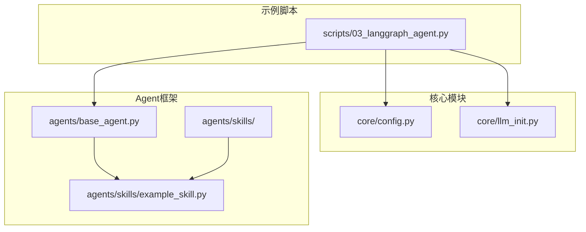
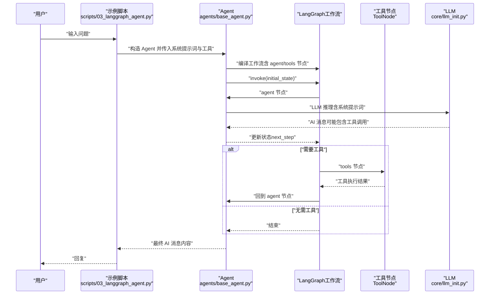
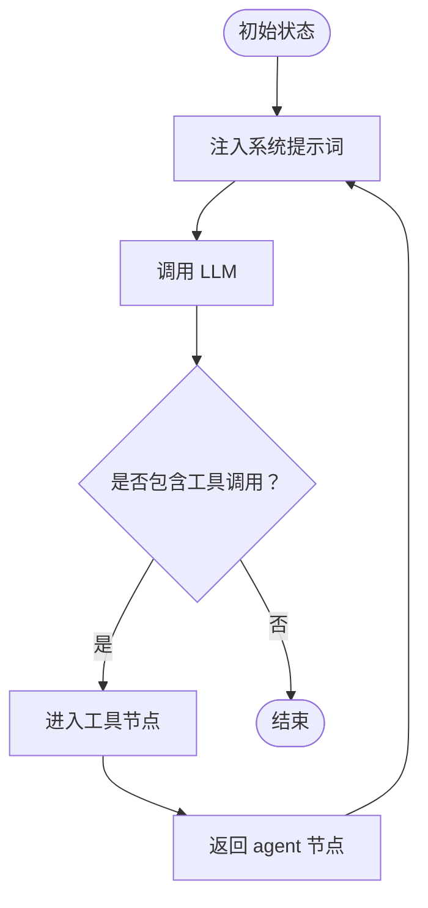
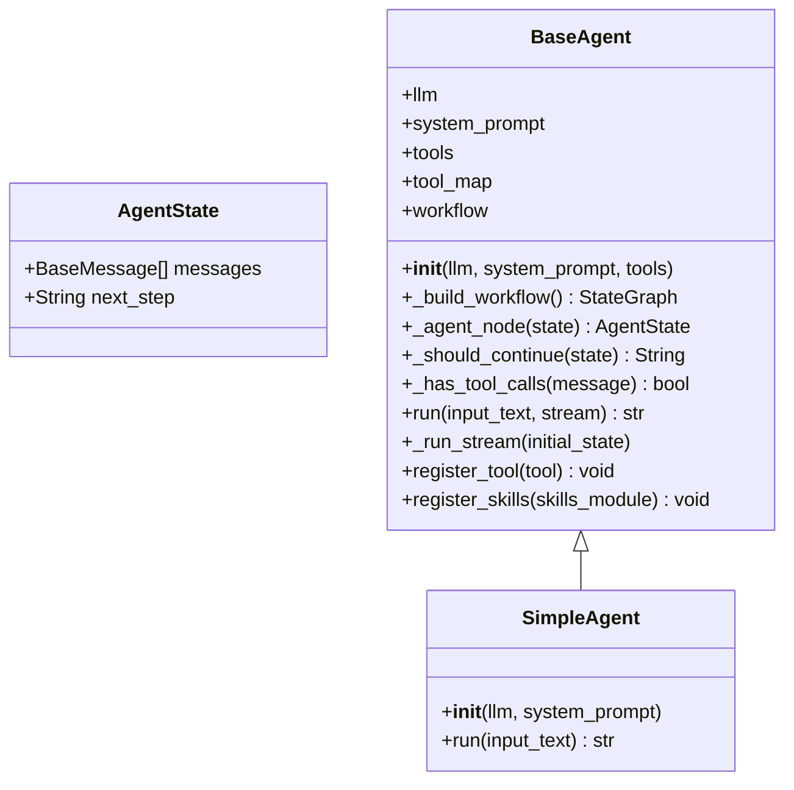
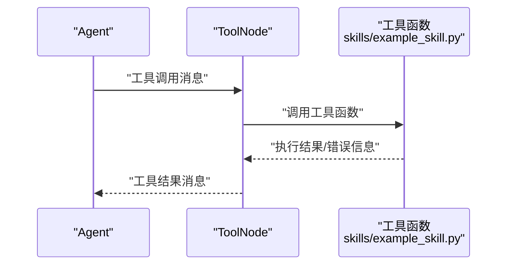
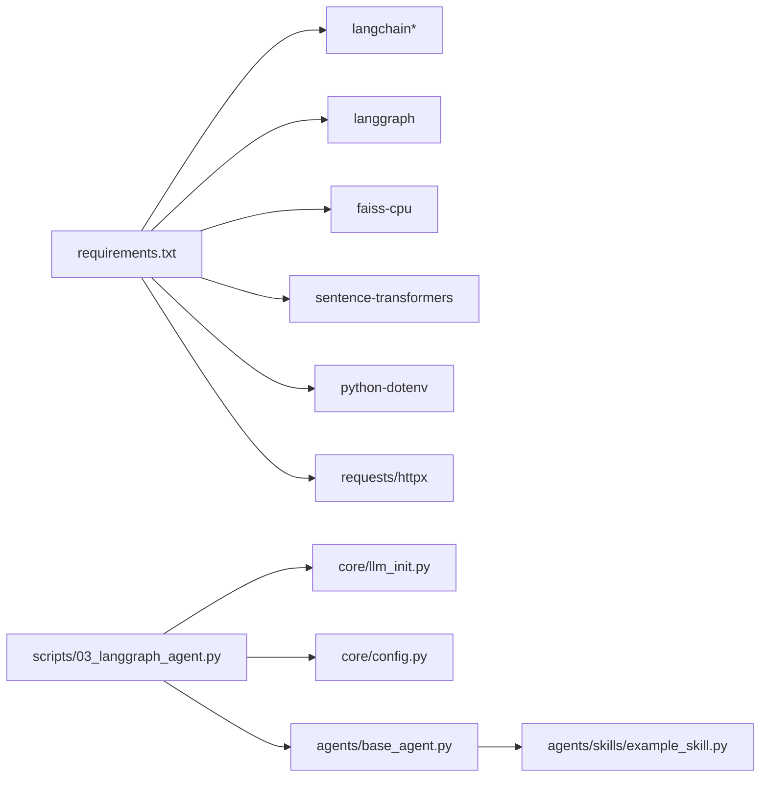

# Agent智能体示例

<cite>
**本文引用的文件**
- [scripts/03_langgraph_agent.py](file://scripts/03_langgraph_agent.py)
- [agents/base_agent.py](file://agents/base_agent.py)
- [agents/skills/example_skill.py](file://agents/skills/example_skill.py)
- [core/config.py](file://core/config.py)
- [core/llm_init.py](file://core/llm_init.py)
- [README.md](file://README.md)
- [requirements.txt](file://requirements.txt)
- [agents/skills/__init__.py](file://agents/skills/__init__.py)
</cite>

## 目录
1. [简介](#简介)
2. [项目结构](#项目结构)
3. [核心组件](#核心组件)
4. [架构总览](#架构总览)
5. [详细组件分析](#详细组件分析)
6. [依赖分析](#依赖分析)
7. [性能考虑](#性能考虑)
8. [故障排查指南](#故障排查指南)
9. [结论](#结论)
10. [附录](#附录)

## 简介
本文件面向开发者，系统性解析 Agent 智能体示例的实现架构，重点围绕 scripts/03_langgraph_agent.py 展开，深入讲解：
- LangGraph 工作流设计原理与状态管理机制
- 决策流程与工具调用链路
- Agent 基类的实现细节与扩展点
- 技能模块开发规范（工具注册、参数校验、错误处理）
- 智能体状态转换图与消息流转示例
- 多步推理过程的实现方法
- 工具开发指南、性能优化策略与调试技巧

## 项目结构
该项目采用“脚本示例 + 核心模块 + Agent框架 + 技能模块”的分层组织方式，便于快速上手与扩展。

图表来源
- [scripts/03_langgraph_agent.py:1-184](file://scripts/03_langgraph_agent.py#L1-L184)
- [core/config.py:1-68](file://core/config.py#L1-L68)
- [core/llm_init.py:1-131](file://core/llm_init.py#L1-L131)
- [agents/base_agent.py:1-178](file://agents/base_agent.py#L1-L178)
- [agents/skills/example_skill.py:1-95](file://agents/skills/example_skill.py#L1-L95)

章节来源
- [README.md:1-80](file://README.md#L1-L80)

## 核心组件
- LangGraph 工作流与状态管理：通过 StateGraph 定义状态节点与条件边，实现“思考-工具调用-反思”的迭代闭环。
- Agent 基类：封装 LLM 调用、系统提示词注入、工具注册与动态工作流编译。
- 技能模块：以工具集合的形式提供具体能力，统一通过 get_tools() 暴露。
- LLM 初始化：统一抽象不同提供商（OpenAI、通义千问、Ollama、MiMo）的模型实例化逻辑。
- 配置管理：集中管理 API Key、默认模型、向量存储路径等全局配置。

章节来源
- [agents/base_agent.py:26-178](file://agents/base_agent.py#L26-L178)
- [agents/skills/example_skill.py:59-82](file://agents/skills/example_skill.py#L59-L82)
- [core/llm_init.py:18-108](file://core/llm_init.py#L18-L108)
- [core/config.py:24-51](file://core/config.py#L24-L51)

## 架构总览
下图展示从示例脚本到 Agent、工具与 LLM 的整体调用链路与状态转换。

图表来源
- [scripts/03_langgraph_agent.py:16-101](file://scripts/03_langgraph_agent.py#L16-L101)
- [agents/base_agent.py:51-99](file://agents/base_agent.py#L51-L99)
- [core/llm_init.py:18-47](file://core/llm_init.py#L18-L47)

## 详细组件分析

### LangGraph 工作流与状态管理
- 状态定义：AgentState 包含消息列表与 next_step 字段，用于控制工作流的继续或结束。
- 节点与边：
  - agent 节点：注入系统提示词，调用 LLM，根据是否包含工具调用决定 next_step。
  - tools 节点：当存在工具时，由 ToolNode 执行工具调用并将结果回传给 agent 节点。
  - 条件边：根据 next_step 决定跳转至 tools 或 END。
- 流式输出：支持 stream 模式，逐条输出中间 AI 消息。

图表来源
- [agents/base_agent.py:76-99](file://agents/base_agent.py#L76-L99)
- [agents/base_agent.py:100-137](file://agents/base_agent.py#L100-L137)

章节来源
- [agents/base_agent.py:12-99](file://agents/base_agent.py#L12-L99)
- [agents/base_agent.py:100-137](file://agents/base_agent.py#L100-L137)

### Agent 基类实现细节
- 构造与工作流编译：保存 LLM、系统提示词与工具，构建 StateGraph 并编译。
- agent 节点：自动注入 SystemMessage；调用 LLM；根据响应中的工具调用标记更新 next_step。
- 工具注册：register_tool 会更新工具映射并在运行时重建工作流，确保新工具立即生效。
- 技能模块注册：register_skills 通过约定的 get_tools() 自动批量注册工具。
- 运行模式：支持同步与流式两种模式，最终返回最后一条 AI 消息内容。

图表来源
- [agents/base_agent.py:12-178](file://agents/base_agent.py#L12-L178)

章节来源
- [agents/base_agent.py:26-178](file://agents/base_agent.py#L26-L178)

### 工具系统与函数调用机制
- 工具定义：技能模块通过 get_tools() 返回 Tool 列表，每个 Tool 包含名称、描述与可调用函数。
- 函数调用：LangGraph 的 ToolNode 在 agent 节点返回包含工具调用的消息后触发，执行对应工具函数并将结果作为新消息加入状态。
- 参数校验与错误处理：示例工具展示了字符串合法性检查与异常捕获，保证工具调用的安全与健壮性。

图表来源
- [agents/skills/example_skill.py:59-82](file://agents/skills/example_skill.py#L59-L82)
- [agents/base_agent.py:58-59](file://agents/base_agent.py#L58-L59)

章节来源
- [agents/skills/example_skill.py:8-57](file://agents/skills/example_skill.py#L8-L57)
- [agents/skills/example_skill.py:59-82](file://agents/skills/example_skill.py#L59-L82)

### 技能模块开发规范
- 规范入口：每个技能模块需提供 get_tools()，返回 Tool 列表。
- 工具命名与描述：工具名称与描述清晰明确，便于 LLM 正确选择与调用。
- 参数校验：在工具函数内部进行输入合法性检查，避免危险操作（如 eval）。
- 错误处理：捕获异常并返回可读的错误信息，避免中断工作流。
- 扩展注册：通过 register_skills 自动批量注册，或使用 register_tool 单独注册。

章节来源
- [agents/skills/example_skill.py:59-82](file://agents/skills/example_skill.py#L59-L82)
- [agents/skills/__init__.py:1-13](file://agents/skills/__init__.py#L1-L13)
- [agents/base_agent.py:150-161](file://agents/base_agent.py#L150-L161)

### 多步推理与状态转换
- 状态字段 next_step 控制工作流走向：continue 表示需要工具，end 表示结束。
- 循环机制：工具执行完成后回到 agent 节点，再次进行推理，形成“思考-工具-反思”的闭环。
- 流式输出：stream 模式下，每一步的 AI 消息都会被逐步产出，便于实时反馈。

章节来源
- [agents/base_agent.py:92-99](file://agents/base_agent.py#L92-L99)
- [agents/base_agent.py:129-137](file://agents/base_agent.py#L129-L137)

### 示例脚本与演示流程
- 简单 Agent（无工具）：直接调用 LLM，适用于无需外部工具的场景。
- 带工具的 Agent：加载工具列表，手动演示工具调用，并模拟完整对话流程。
- 概念说明：通过流程图解释 Agent 的典型工作流程与 LangGraph 的优势。

章节来源
- [scripts/03_langgraph_agent.py:16-101](file://scripts/03_langgraph_agent.py#L16-L101)
- [scripts/03_langgraph_agent.py:103-147](file://scripts/03_langgraph_agent.py#L103-L147)

## 依赖分析
- LangChain/LangGraph：提供 LLM 抽象与工作流编排能力。
- 向量存储与嵌入：FAISS 与 sentence-transformers 用于 RAG 场景（本示例聚焦 Agent）。
- 环境变量与 HTTP 客户端：dotenv、requests、httpx 用于配置与网络访问。
- 模型提供商适配：OpenAI、通义千问、Ollama、MiMo 的统一初始化。

图表来源
- [requirements.txt:1-34](file://requirements.txt#L1-L34)
- [scripts/03_langgraph_agent.py:10-13](file://scripts/03_langgraph_agent.py#L10-L13)
- [core/llm_init.py:1-15](file://core/llm_init.py#L1-L15)
- [agents/base_agent.py:1-10](file://agents/base_agent.py#L1-L10)
- [agents/skills/example_skill.py:1-6](file://agents/skills/example_skill.py#L1-L6)

章节来源
- [requirements.txt:1-34](file://requirements.txt#L1-L34)

## 性能考虑
- 模型选择与温度：根据任务稳定性与创造性需求调整 temperature；优先选择支持 function calling 的模型以发挥工具链路价值。
- 工作流编译缓存：BaseAgent 在注册工具后会重建工作流，建议在应用启动阶段完成工具注册，避免频繁编译。
- 流式输出：在长对话或工具执行耗时较长时启用 stream，提升用户体验。
- 工具安全：对工具输入进行严格校验，避免高危操作；必要时引入沙箱或白名单机制。
- 网络与超时：合理设置 LLM 客户端的超时与重试策略，避免阻塞主线程。

## 故障排查指南
- API Key 未配置：检查 .env 文件中对应 Provider 的 API Key；若缺失，示例脚本会降级为 Ollama，但可能不支持完整工具调用。
- 模型不可用：确认所选模型名称与 Provider 兼容；若初始化失败，尝试更换模型或 Provider。
- 工具调用失败：查看工具函数的异常处理与返回值；确保工具名称与描述与 LLM 的选择一致。
- 工作流卡死：检查 next_step 的更新逻辑与条件边的分支；确认工具节点正确回传结果。
- 调试技巧：开启流式输出观察中间消息；在 Agent 构造时打印工作流图；在工具函数中增加日志记录。

章节来源
- [scripts/03_langgraph_agent.py:155-159](file://scripts/03_langgraph_agent.py#L155-L159)
- [core/config.py:53-67](file://core/config.py#L53-L67)
- [core/llm_init.py:52-53](file://core/llm_init.py#L52-L53)
- [agents/base_agent.py:147-148](file://agents/base_agent.py#L147-L148)

## 结论
本示例通过 LangGraph 将 LLM 的推理能力与工具调用能力有机结合，形成了可扩展、可维护的 Agent 架构。开发者可通过技能模块快速扩展工具集，借助统一的 LLM 初始化与配置管理，轻松适配多种模型提供商。建议在生产环境中进一步完善工具安全、错误处理与可观测性，以支撑更复杂的业务场景。

## 附录

### 工具开发最佳实践清单
- 明确定义工具名称与描述，保持与 LLM 的上下文一致。
- 在工具函数内进行严格的输入校验与异常捕获。
- 返回结构化的结果，便于后续处理与展示。
- 通过 register_skills 或 register_tool 注册工具，确保工作流即时生效。
- 为工具编写单元测试与边界用例，覆盖正常与异常路径。

章节来源
- [agents/skills/example_skill.py:59-82](file://agents/skills/example_skill.py#L59-L82)
- [agents/base_agent.py:138-161](file://agents/base_agent.py#L138-L161)