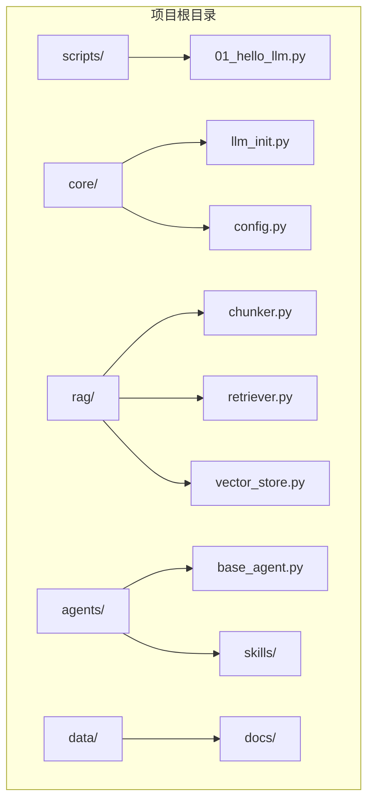
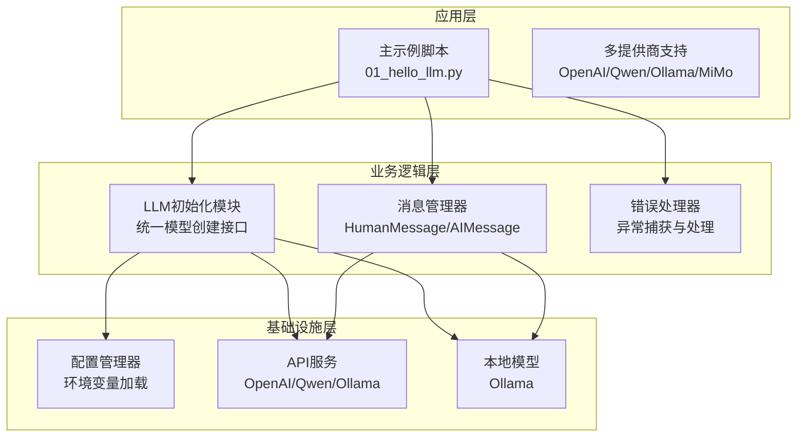
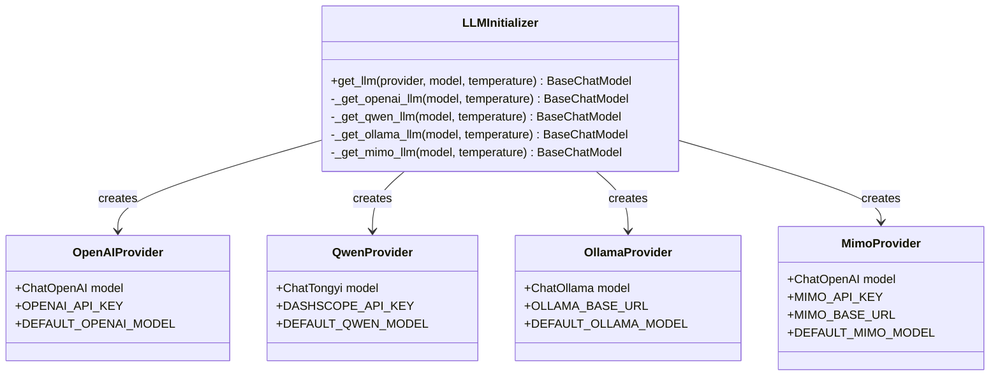
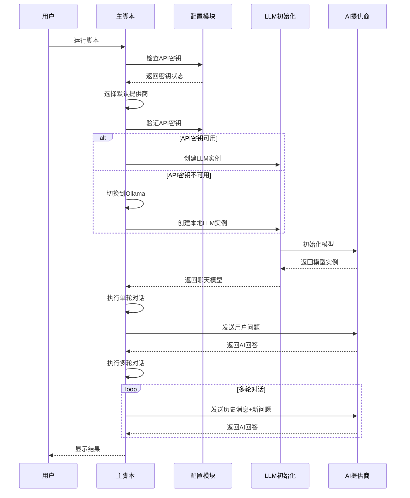
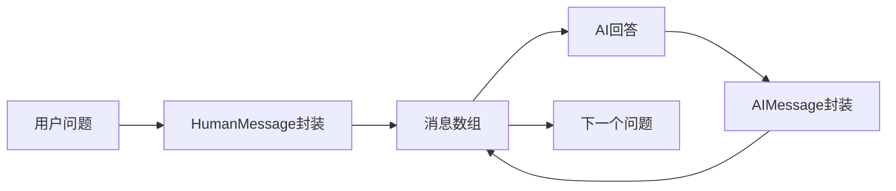
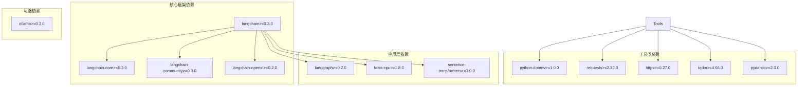

# Hello LLM 基础示例

<cite>
**本文引用的文件**
- [01_hello_llm.py](file://scripts/01_hello_llm.py)
- [llm_init.py](file://core/llm_init.py)
- [config.py](file://core/config.py)
- [README.md](file://README.md)
- [requirements.txt](file://requirements.txt)
- [config.yaml](file://openspec/config.yaml)
</cite>

## 目录
1. [简介](#简介)
2. [项目结构](#项目结构)
3. [核心组件](#核心组件)
4. [架构概览](#架构概览)
5. [详细组件分析](#详细组件分析)
6. [依赖分析](#依赖分析)
7. [性能考虑](#性能考虑)
8. [故障排除指南](#故障排除指南)
9. [结论](#结论)
10. [附录](#附录)

## 简介

Hello LLM 基础示例是一个用于演示大型语言模型(Large Language Model)基础调用的Python脚本。该项目展示了如何使用LangChain框架与多个AI模型提供商进行交互，包括OpenAI、通义千问(Qwen/DashScope)和Ollama本地模型。通过这个示例，开发者可以快速了解LLM的基础使用模式、多提供商模型初始化、API Key验证机制以及错误处理策略。

该项目采用模块化设计，将配置管理、LLM初始化和示例脚本分离，便于维护和扩展。支持温度参数调节、多轮对话消息管理和响应处理等核心功能。

## 项目结构

项目采用清晰的分层架构，主要包含以下模块：



**图表来源**
- [README.md:7-39](file://README.md#L7-L39)

项目的主要组成部分：
- **scripts/**: 包含示例脚本和学习代码
- **core/**: 核心功能模块，包括LLM初始化和配置管理
- **rag/**: 检索增强生成(RAG)相关代码
- **agents/**: LangGraph智能体实现
- **data/** 和 **outputs/**: 数据存储和输出结果目录

**章节来源**
- [README.md:7-39](file://README.md#L7-L39)

## 核心组件

Hello LLM示例的核心由三个主要组件构成：

### 1. LLM初始化模块
负责根据提供商类型创建相应的聊天模型实例，支持多种AI服务提供商的统一接口。

### 2. 配置管理模块  
管理所有环境变量配置，包括API密钥、默认模型设置和基础URL配置。

### 3. 主示例脚本
实现完整的LLM调用流程，包括模型初始化、单轮对话和多轮对话演示。

这些组件通过清晰的职责分离实现了高内聚、低耦合的设计原则，便于单独测试和维护。

**章节来源**
- [llm_init.py:18-48](file://core/llm_init.py#L18-L48)
- [config.py:24-67](file://core/config.py#L24-L67)
- [01_hello_llm.py:15-95](file://scripts/01_hello_llm.py#L15-L95)

## 架构概览

整个系统采用分层架构设计，从上到下分为应用层、业务逻辑层和基础设施层：



**图表来源**
- [01_hello_llm.py:15-95](file://scripts/01_hello_llm.py#L15-L95)
- [llm_init.py:18-108](file://core/llm_init.py#L18-L108)
- [config.py:24-46](file://core/config.py#L24-L46)

系统的关键特性：
- **统一接口**: 通过LLM初始化模块提供一致的模型创建接口
- **多提供商支持**: 支持OpenAI、通义千问、Ollama等多种服务提供商
- **配置驱动**: 所有外部服务配置都通过环境变量管理
- **错误隔离**: 异常处理集中在主脚本中，确保程序稳定性

## 详细组件分析

### LLM初始化模块分析

LLM初始化模块是整个系统的核心，负责根据提供商类型创建相应的聊天模型实例：



**图表来源**
- [llm_init.py:18-108](file://core/llm_init.py#L18-L108)

#### 核心功能实现

1. **提供商选择机制**: 通过字符串匹配确定使用的AI服务提供商
2. **配置验证**: 在创建模型前验证必要的API密钥和配置
3. **模型实例化**: 根据提供商类型创建相应的聊天模型实例
4. **参数传递**: 支持温度参数和其他自定义配置的传递

**章节来源**
- [llm_init.py:18-48](file://core/llm_init.py#L18-L48)
- [llm_init.py:50-108](file://core/llm_init.py#L50-L108)

### 配置管理模块分析

配置管理模块负责处理所有外部依赖的配置信息：

```mermaid
flowchart TD
Start([启动配置加载]) --> LoadEnv[加载.env文件]
LoadEnv --> SetDefaults[设置默认值]
SetDefaults --> ValidateKeys{验证API密钥}
ValidateKeys --> |OpenAI| CheckOpenAI[检查OPENAI_API_KEY]
ValidateKeys --> |Qwen| CheckQwen[检查DASHSCOPE_API_KEY]
ValidateKeys --> |MiMo| CheckMimo[检查MIMO_API_KEY]
ValidateKeys --> |Ollama| SkipOllama[跳过验证(本地模型)]
CheckOpenAI --> |存在| Ready[配置就绪]
CheckOpenAI --> |不存在| ErrorOpenAI[抛出错误]
CheckQwen --> |存在| Ready
CheckQwen --> |不存在| ErrorQwen[抛出错误]
CheckMimo --> |存在| Ready
CheckMimo --> |不存在| ErrorMimo[抛出错误]
SkipOllama --> Ready
ErrorOpenAI --> End([配置失败])
ErrorQwen --> End
ErrorMimo --> End
Ready --> EndConfig([配置完成])
```

**图表来源**
- [config.py:24-67](file://core/config.py#L24-L67)

#### 配置项详解

系统支持以下主要配置项：

| 配置项 | 类型 | 默认值 | 用途 |
|--------|------|--------|------|
| OPENAI_API_KEY | 字符串 | None | OpenAI API密钥 |
| DASHSCOPE_API_KEY | 字符串 | None | 通义千问API密钥 |
| MIMO_API_KEY | 字符串 | None | 小米MiMo API密钥 |
| OLLAMA_BASE_URL | 字符串 | http://localhost:11434 | Ollama服务地址 |
| LANGCHAIN_API_KEY | 字符串 | None | LangChain追踪API密钥 |
| VOLCANO_API_KEY | 字符串 | None | 火山引擎API密钥 |

**章节来源**
- [config.py:24-46](file://core/config.py#L24-L46)
- [config.py:53-67](file://core/config.py#L53-L67)

### 主示例脚本分析

主示例脚本实现了完整的LLM调用流程，包括用户界面、模型初始化和对话管理：



**图表来源**
- [01_hello_llm.py:15-95](file://scripts/01_hello_llm.py#L15-L95)

#### 单轮对话流程

1. **用户输入**: 获取用户的问题
2. **模型调用**: 使用`llm.invoke()`方法发送请求
3. **响应处理**: 提取响应内容并格式化输出
4. **结果展示**: 将AI的回答显示给用户

#### 多轮对话机制

多轮对话通过消息管理实现，使用`HumanMessage`和`AIMessage`类：



**图表来源**
- [01_hello_llm.py:65-76](file://scripts/01_hello_llm.py#L65-L76)

**章节来源**
- [01_hello_llm.py:15-95](file://scripts/01_hello_llm.py#L15-L95)

## 依赖分析

项目依赖采用明确的层次结构，从核心框架到具体实现逐层构建：



**图表来源**
- [requirements.txt:1-34](file://requirements.txt#L1-L34)

### 关键依赖说明

1. **LangChain生态系统**: 提供LLM抽象和消息管理功能
2. **LangGraph**: 支持复杂对话流程和状态管理
3. **FAISS**: 高效向量相似度搜索
4. **Sentence-Transformers**: 文本嵌入生成
5. **环境变量管理**: 通过python-dotenv安全管理API密钥

**章节来源**
- [requirements.txt:1-34](file://requirements.txt#L1-L34)

## 性能考虑

基于当前实现，以下是关键的性能优化建议：

### 1. 模型初始化优化
- **延迟初始化**: 只在需要时创建LLM实例，避免不必要的资源占用
- **连接池管理**: 对于远程API调用，考虑实现连接池以减少建立连接的开销
- **缓存策略**: 对于频繁访问的配置信息，实现内存缓存机制

### 2. 内存管理
- **消息清理**: 在多轮对话中定期清理历史消息，避免内存泄漏
- **批量处理**: 对于大量数据处理，考虑分批处理而非一次性加载

### 3. 网络优化
- **超时设置**: 为API调用设置合理的超时时间
- **重试机制**: 实现指数退避的重试策略
- **并发控制**: 对于多个并发请求，限制最大并发数

### 4. 配置优化
- **默认值优化**: 根据使用场景调整默认模型和温度参数
- **资源监控**: 添加内存和CPU使用情况监控

## 故障排除指南

### 常见问题及解决方案

#### 1. API密钥配置问题
**症状**: 运行时抛出"未配置API密钥"错误
**解决方法**:
1. 检查`.env`文件是否存在于项目根目录
2. 验证API密钥格式是否正确
3. 确认环境变量名称与配置模块中的常量匹配

#### 2. 网络连接问题
**症状**: 远程API调用超时或连接失败
**解决方法**:
1. 检查网络连接状态
2. 验证API服务端点可达性
3. 考虑添加代理配置

#### 3. Ollama本地模型问题
**症状**: 无法连接到本地Ollama服务
**解决方法**:
1. 确认Ollama服务已启动
2. 检查`OLLAMA_BASE_URL`配置
3. 验证本地模型是否已下载

#### 4. 模型初始化失败
**症状**: LLM实例创建失败
**解决方法**:
1. 检查模型名称是否正确
2. 验证提供商支持的模型列表
3. 确认网络访问权限

### 调试技巧

1. **启用详细日志**: 设置环境变量`LANGCHAIN_TRACING_V2=true`
2. **逐步调试**: 使用Python调试器逐步执行关键代码段
3. **单元测试**: 为每个组件编写独立的测试用例
4. **资源监控**: 监控内存和CPU使用情况

**章节来源**
- [01_hello_llm.py:82-88](file://scripts/01_hello_llm.py#L82-L88)
- [config.py:31-34](file://core/config.py#L31-L34)

## 结论

Hello LLM基础示例项目成功展示了现代LLM应用开发的核心模式。通过模块化设计和清晰的职责分离，项目为开发者提供了易于理解和扩展的LLM集成框架。

### 主要成就

1. **多提供商支持**: 统一了不同AI服务提供商的接入方式
2. **配置管理**: 实现了灵活的环境变量配置系统
3. **错误处理**: 提供了完善的异常处理和用户友好的错误提示
4. **示例完整性**: 从单轮对话到多轮对话的完整演示

### 技术亮点

- **模块化架构**: 清晰的分层设计便于维护和扩展
- **配置驱动**: 所有外部依赖通过环境变量管理
- **错误隔离**: 异常处理集中在主入口点
- **文档完善**: 详细的README和代码注释

### 未来发展方向

1. **模型抽象层**: 进一步抽象不同提供商的差异
2. **性能监控**: 添加详细的性能指标收集
3. **测试覆盖**: 增加自动化测试覆盖率
4. **部署优化**: 提供容器化和云部署方案

## 附录

### 环境配置指南

#### 1. 安装依赖
```bash
pip install -r requirements.txt
```

#### 2. 配置环境变量
复制示例配置文件并编辑API密钥：
```bash
cp .env.example .env
# 编辑 .env 文件填入你的API密钥
```

#### 3. 运行示例
```bash
python scripts/01_hello_llm.py
```

### 支持的模型提供商

| 提供商 | 默认模型 | 配置要求 | 使用场景 |
|--------|----------|----------|----------|
| OpenAI | gpt-3.5-turbo | OPENAI_API_KEY | 通用对话、文本生成 |
| 通义千问 | qwen-turbo | DASHSCOPE_API_KEY | 中文场景、企业级应用 |
| Ollama | llama2 | 本地服务 | 离线使用、隐私保护 |
| MiMo | mimo-v2-pro | MIMO_API_KEY | 小米生态集成 |

### 实际运行示例

项目提供了完整的运行示例，包括：
- 单轮对话：简单的问答交互
- 多轮对话：上下文保持的连续对话
- 错误处理：API密钥缺失时的降级处理
- 模型切换：自动从云端模型切换到本地模型

这些示例为初学者提供了理解LLM基础调用模式的完整参考，帮助快速掌握大型语言模型的实际应用方法。