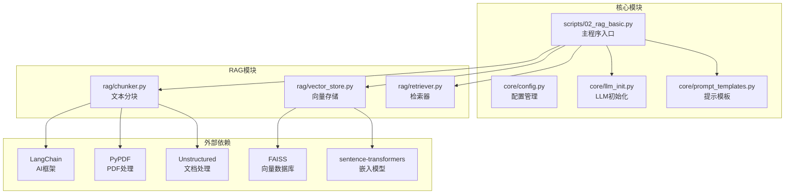
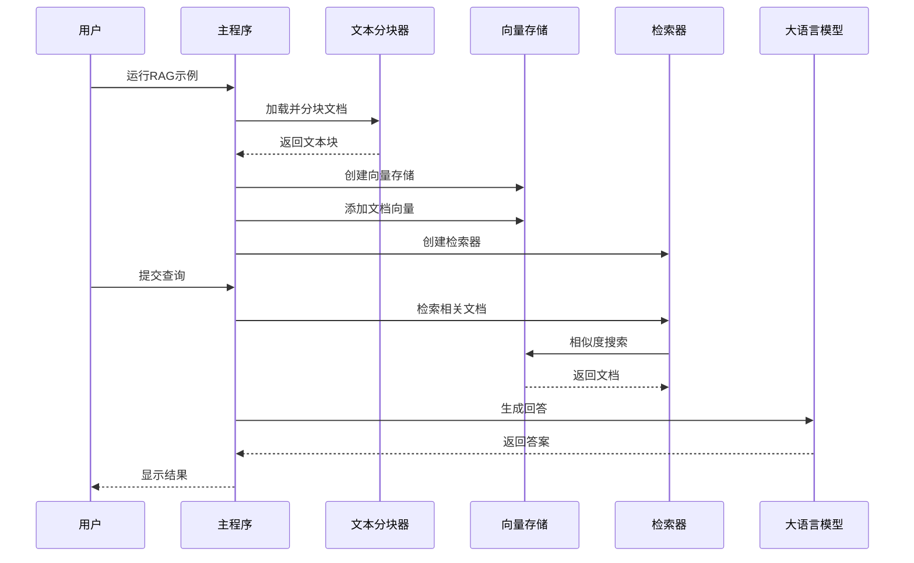
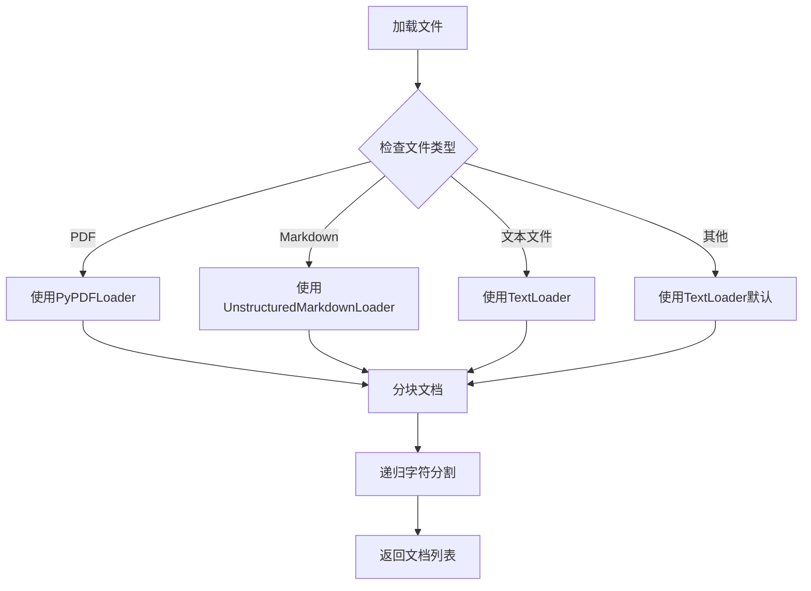
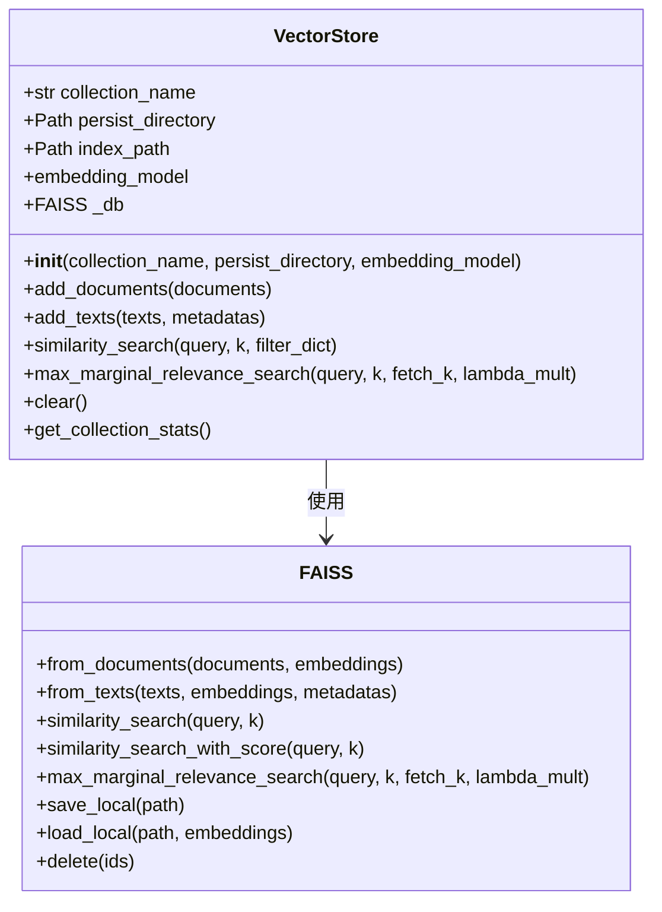
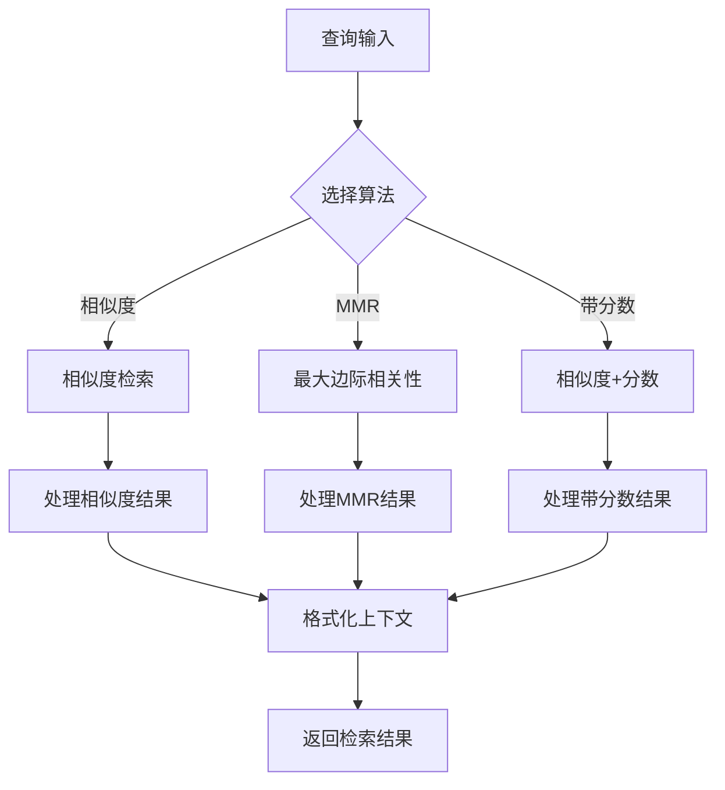
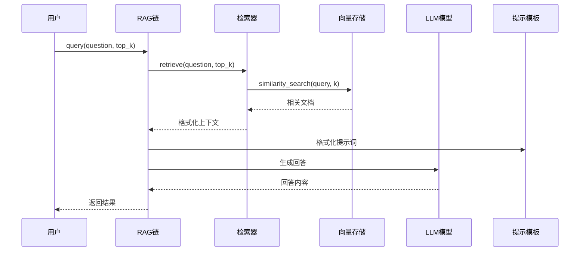
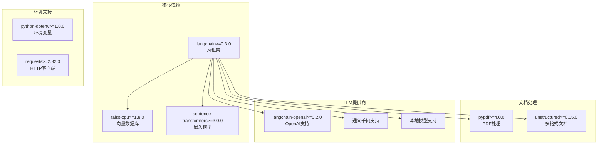
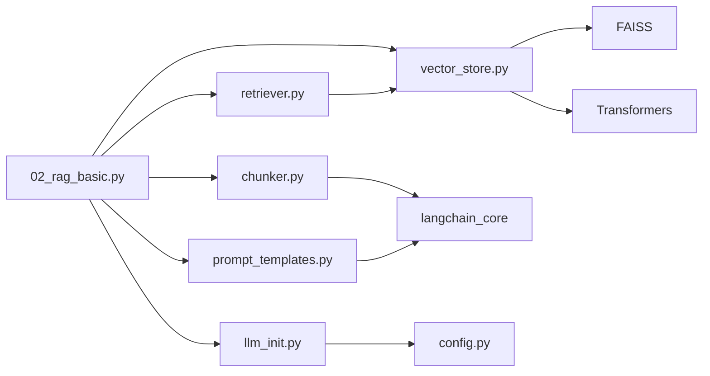

# RAG基础示例

<cite>
**本文档引用的文件**
- [scripts/02_rag_basic.py](file://scripts/02_rag_basic.py)
- [rag/chunker.py](file://rag/chunker.py)
- [rag/retriever.py](file://rag/retriever.py)
- [rag/vector_store.py](file://rag/vector_store.py)
- [core/config.py](file://core/config.py)
- [core/llm_init.py](file://core/llm_init.py)
- [core/prompt_templates.py](file://core/prompt_templates.py)
- [README.md](file://README.md)
- [requirements.txt](file://requirements.txt)
</cite>

## 目录
1. [简介](#简介)
2. [项目结构](#项目结构)
3. [核心组件](#核心组件)
4. [架构概览](#架构概览)
5. [详细组件分析](#详细组件分析)
6. [依赖关系分析](#依赖关系分析)
7. [性能考虑](#性能考虑)
8. [故障排除指南](#故障排除指南)
9. [结论](#结论)

## 简介

本指南详细解析了RAG（检索增强生成）基础示例的完整工作流程。该项目展示了如何构建一个完整的RAG系统，包括文档加载、文本分块、向量嵌入、向量存储和检索问答的每个步骤。系统基于LangChain框架，使用FAISS作为向量存储，支持多种文档格式，并提供了灵活的检索策略和优化选项。

## 项目结构

项目采用模块化设计，将RAG相关的功能分解为独立的组件：

**图表来源**
- [scripts/02_rag_basic.py:1-149](file://scripts/02_rag_basic.py#L1-L149)
- [rag/chunker.py:1-175](file://rag/chunker.py#L1-L175)
- [rag/vector_store.py:1-252](file://rag/vector_store.py#L1-L252)
- [rag/retriever.py:1-203](file://rag/retriever.py#L1-L203)

**章节来源**
- [README.md:1-80](file://README.md#L1-L80)
- [requirements.txt:1-34](file://requirements.txt#L1-L34)

## 核心组件

### 文档加载与分块模块

文档处理模块支持多种文档格式，包括纯文本、PDF和Markdown文件。该模块提供了灵活的分块策略，确保文本在语义完整性的同时保持适当的重叠。

### 向量存储模块

基于FAISS的向量存储实现了高效的相似度搜索功能。支持文档的增删改查操作，具备持久化能力，并提供了多种检索算法。

### 检索器模块

检索器模块封装了各种检索策略，包括基于相似度的检索和MMR（最大边际相关性）算法，确保检索结果的多样性和准确性。

**章节来源**
- [rag/chunker.py:12-175](file://rag/chunker.py#L12-L175)
- [rag/vector_store.py:13-252](file://rag/vector_store.py#L13-L252)
- [rag/retriever.py:17-203](file://rag/retriever.py#L17-L203)

## 架构概览

RAG系统采用分层架构设计，每个组件都有明确的职责分工：

**图表来源**
- [scripts/02_rag_basic.py:44-144](file://scripts/02_rag_basic.py#L44-L144)
- [rag/retriever.py:129-189](file://rag/retriever.py#L129-L189)

## 详细组件分析

### 文档加载与分块组件

#### 文档格式支持策略

系统支持多种文档格式，每种格式都有专门的处理策略：

**图表来源**
- [rag/chunker.py:112-144](file://rag/chunker.py#L112-L144)

#### 分块算法实现

系统采用了两种不同的分块策略：

1. **字符级分块** (`chunk_text`): 基于固定字符长度的简单分块
2. **递归字符分块** (`chunk_documents`): 基于语义层次的智能分块

**章节来源**
- [rag/chunker.py:12-62](file://rag/chunker.py#L12-L62)
- [rag/chunker.py:112-175](file://rag/chunker.py#L112-L175)

### 向量存储组件

#### FAISS集成架构

向量存储模块基于FAISS实现了高效的向量检索功能：

**图表来源**
- [rag/vector_store.py:13-252](file://rag/vector_store.py#L13-L252)

#### 持久化机制

向量存储支持本地持久化，确保重启后数据不会丢失：

**章节来源**
- [rag/vector_store.py:38-58](file://rag/vector_store.py#L38-L58)
- [rag/vector_store.py:108-115](file://rag/vector_store.py#L108-L115)

### 检索器组件

#### 检索算法对比

系统提供了三种不同的检索算法：

1. **相似度检索**: 基于向量相似度的简单检索
2. **MMR检索**: 最大边际相关性算法，平衡相关性和多样性
3. **带分数检索**: 返回相似度分数的检索

**图表来源**
- [rag/retriever.py:29-102](file://rag/retriever.py#L29-L102)

#### 上下文构建最佳实践

检索器提供了灵活的上下文构建功能，支持包含相似度分数的格式化输出：

**章节来源**
- [rag/retriever.py:104-127](file://rag/retriever.py#L104-L127)

### RAG链组件

#### 完整RAG工作流程

RAG链整合了检索和生成两个阶段：

**图表来源**
- [rag/retriever.py:150-189](file://rag/retriever.py#L150-L189)

**章节来源**
- [rag/retriever.py:129-189](file://rag/retriever.py#L129-L189)

## 依赖关系分析

### 外部依赖管理

项目依赖于多个关键库来实现RAG功能：

**图表来源**
- [requirements.txt:1-34](file://requirements.txt#L1-L34)

### 内部模块依赖

**图表来源**
- [scripts/02_rag_basic.py:10-15](file://scripts/02_rag_basic.py#L10-L15)
- [rag/vector_store.py:6-10](file://rag/vector_store.py#L6-L10)

**章节来源**
- [requirements.txt:1-34](file://requirements.txt#L1-L34)
- [core/config.py:48-51](file://core/config.py#L48-L51)

## 性能考虑

### 向量存储优化

1. **索引选择**: 使用FAISS的CPU版本以获得更好的兼容性
2. **批量操作**: 支持批量添加文档，减少I/O开销
3. **持久化策略**: 自动保存索引到本地磁盘，避免重复计算

### 检索性能优化

1. **参数调优**:
   - `top_k`: 控制返回结果数量
   - `fetch_k`: MMR算法的初始检索数量
   - `lambda_mult`: 多样性参数

2. **内存管理**: 懒加载FAISS实例，按需创建和销毁

### 文档分块策略

1. **重叠策略**: 合理设置块重叠，平衡内存使用和语义完整性
2. **分块大小**: 根据文档复杂度调整分块大小

## 故障排除指南

### 常见问题及解决方案

#### API密钥配置问题

**问题**: LLM初始化失败，提示API密钥未配置

**解决方案**:
1. 检查`.env`文件中的API密钥配置
2. 确认环境变量正确加载
3. 验证网络连接和代理设置

#### 向量存储初始化失败

**问题**: FAISS索引创建或加载失败

**解决方案**:
1. 检查向量存储目录权限
2. 确认嵌入模型下载完成
3. 验证磁盘空间充足

#### 检索结果质量不佳

**问题**: 检索结果相关性差

**解决方案**:
1. 调整`chunk_size`和`chunk_overlap`参数
2. 尝试不同的检索算法（MMR vs 相似度）
3. 优化提示模板

#### 性能问题

**问题**: 系统响应缓慢

**解决方案**:
1. 减少`top_k`值
2. 优化文档分块策略
3. 考虑使用GPU版本的FAISS

**章节来源**
- [core/config.py:65-68](file://core/config.py#L65-L68)
- [rag/vector_store.py:42-48](file://rag/vector_store.py#L42-L48)

## 结论

本RAG基础示例展示了构建完整检索增强生成系统的最佳实践。通过模块化的架构设计，系统提供了灵活的文档处理、高效的向量存储和多样化的检索策略。开发者可以根据具体需求调整参数配置，优化性能表现，并扩展支持更多的文档格式和LLM提供商。

该示例为后续构建更复杂的RAG应用奠定了坚实的基础，包括多模态支持、实时更新机制和分布式部署等高级功能。