# 示例脚本详解

<cite>
**本文档引用的文件**
- [01_hello_llm.py](file://scripts/01_hello_llm.py)
- [02_rag_basic.py](file://scripts/02_rag_basic.py)
- [03_langgraph_agent.py](file://scripts/03_langgraph_agent.py)
- [04_auto_test.py](file://scripts/04_auto_test.py)
- [llm_init.py](file://core/llm_init.py)
- [config.py](file://core/config.py)
- [chunker.py](file://rag/chunker.py)
- [vector_store.py](file://rag/vector_store.py)
- [retriever.py](file://rag/retriever.py)
- [base_agent.py](file://agents/base_agent.py)
- [example_skill.py](file://agents/skills/example_skill.py)
- [README.md](file://README.md)
</cite>

## 目录
1. [简介](#简介)
2. [项目结构](#项目结构)
3. [核心组件](#核心组件)
4. [架构概览](#架构概览)
5. [详细组件分析](#详细组件分析)
6. [依赖分析](#依赖分析)
7. [性能考虑](#性能考虑)
8. [故障排除指南](#故障排除指南)
9. [结论](#结论)

## 简介

本项目是一个基于 LangChain 和 LangGraph 的 LLM 学习项目，包含四个精心设计的示例脚本，涵盖了从基础 LLM 调用到高级 RAG 检索增强生成，再到智能体 Agent 的完整学习路径。每个示例都经过精心设计，不仅展示了技术实现，更重要的是提供了深入的原理讲解和最佳实践指导。

项目采用模块化设计，核心功能被清晰地分离到不同的模块中，便于学习和扩展。通过这四个示例，学习者可以从最基础的 LLM 调用开始，逐步掌握复杂的应用场景实现。

## 项目结构

项目采用清晰的分层架构，每个模块都有明确的职责分工：

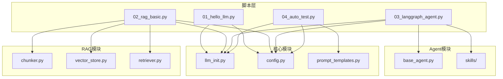

**图表来源**
- [README.md:15-39](file://README.md#L15-L39)

**章节来源**
- [README.md:15-39](file://README.md#L15-L39)

## 核心组件

### LLM 初始化模块

LLM 初始化模块提供了统一的接口来创建不同提供商的 LLM 实例，支持 OpenAI、通义千问、Ollama 和小米 MiMo 等多个提供商。

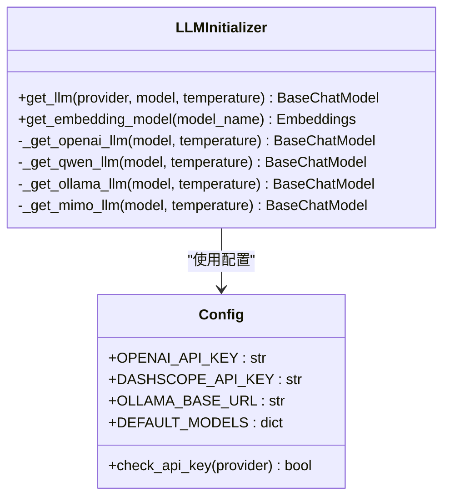

**图表来源**
- [llm_init.py:18-131](file://core/llm_init.py#L18-L131)
- [config.py:24-68](file://core/config.py#L24-L68)

### RAG 核心组件

RAG 模块包含了完整的检索增强生成流程，从文档分块到向量存储，再到检索器和 RAG 链的实现。

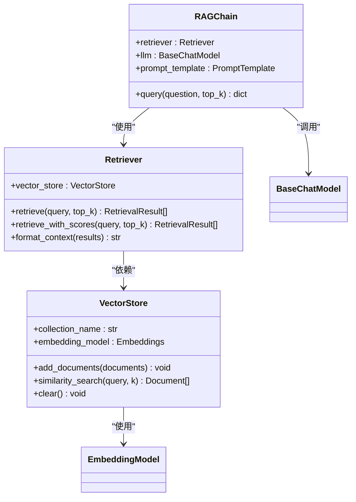

**图表来源**
- [vector_store.py:13-252](file://rag/vector_store.py#L13-L252)
- [retriever.py:17-203](file://rag/retriever.py#L17-L203)

### Agent 基础框架

Agent 模块基于 LangGraph 实现了可扩展的智能体框架，支持工具集成和状态管理。

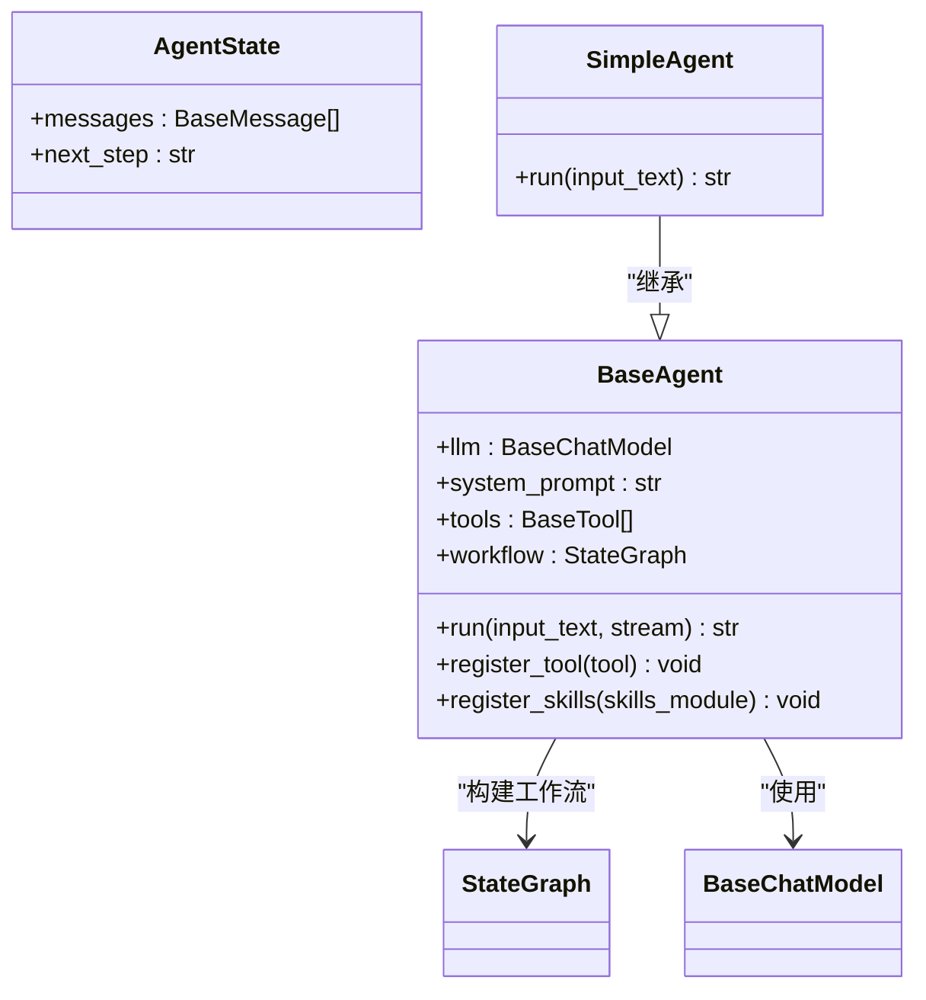

**图表来源**
- [base_agent.py:12-178](file://agents/base_agent.py#L12-L178)

**章节来源**
- [llm_init.py:18-131](file://core/llm_init.py#L18-L131)
- [config.py:24-68](file://core/config.py#L24-L68)
- [vector_store.py:13-252](file://rag/vector_store.py#L13-L252)
- [retriever.py:17-203](file://rag/retriever.py#L17-L203)
- [base_agent.py:12-178](file://agents/base_agent.py#L12-L178)

## 架构概览

整个系统采用分层架构设计，从底层的数据处理到上层的应用逻辑都有清晰的层次划分：

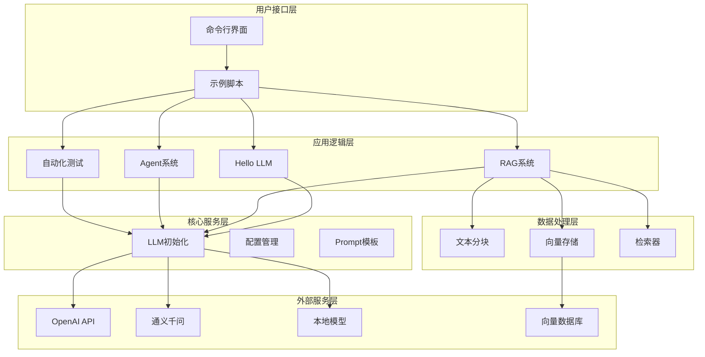

**图表来源**
- [README.md:15-39](file://README.md#L15-L39)
- [llm_init.py:18-131](file://core/llm_init.py#L18-L131)

## 详细组件分析

### Hello LLM 基础示例分析

Hello LLM 示例展示了如何初始化不同提供商的 LLM 并进行基础对话。这个示例是理解整个系统的入口点。

#### LLM 调用流程

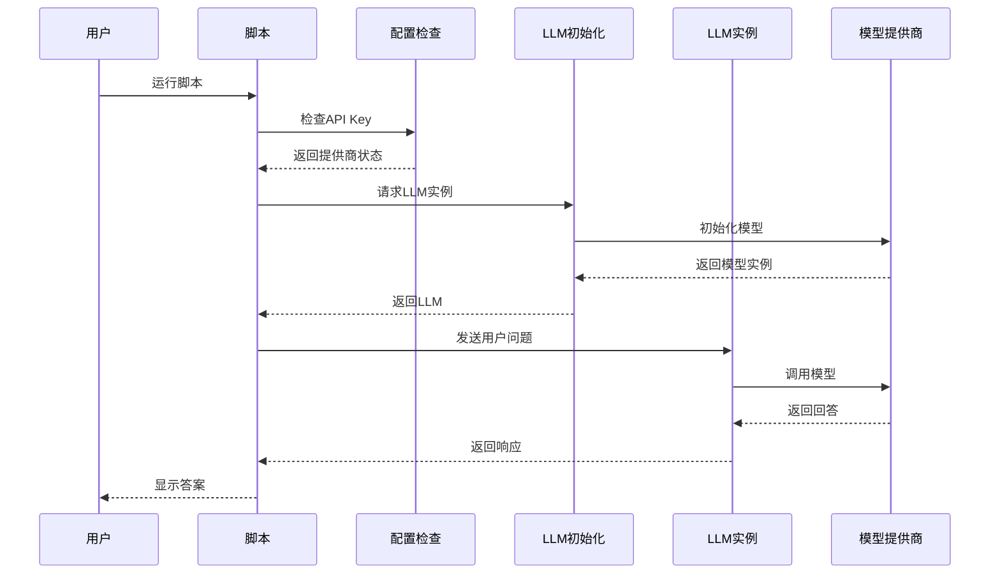

**图表来源**
- [01_hello_llm.py:15-95](file://scripts/01_hello_llm.py#L15-L95)
- [llm_init.py:18-47](file://core/llm_init.py#L18-L47)
- [config.py:65-68](file://core/config.py#L65-L68)

#### 参数配置详解

示例展示了多种配置选项：
- **提供商选择**: 支持 OpenAI、通义千问、Ollama 和小米 MiMo
- **温度参数**: 控制输出的创造性，0.7 是平衡值
- **API Key 管理**: 自动检测和回退机制
- **消息格式**: 使用 LangChain 的消息类型进行多轮对话

#### 响应处理机制

脚本实现了灵活的响应处理：
- **内容提取**: 从响应对象中提取 `content` 属性
- **类型兼容**: 处理不同类型的响应对象
- **长度限制**: 对长回答进行截断显示

**章节来源**
- [01_hello_llm.py:15-95](file://scripts/01_hello_llm.py#L15-L95)
- [llm_init.py:18-47](file://core/llm_init.py#L18-L47)
- [config.py:65-68](file://core/config.py#L65-L68)

### RAG 基础示例深度解析

RAG（检索增强生成）示例展示了完整的检索增强生成工作流程，从文档准备到最终问答的全过程。

#### RAG 完整工作流程

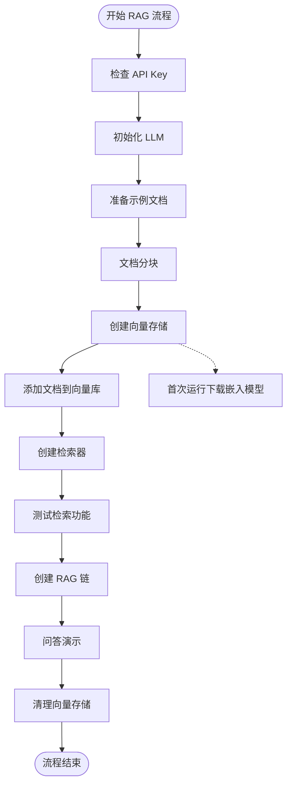

**图表来源**
- [02_rag_basic.py:44-149](file://scripts/02_rag_basic.py#L44-L149)

#### 文档处理管道

RAG 系统的核心在于文档处理管道的设计：

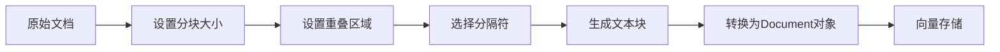

**图表来源**
- [chunker.py:12-61](file://rag/chunker.py#L12-L61)
- [vector_store.py:59-90](file://rag/vector_store.py#L59-L90)

#### 向量存储实现

向量存储模块提供了完整的向量数据库功能：

| 功能 | 方法 | 参数 | 返回值 |
|------|------|------|--------|
| 添加文档 | `add_documents` | `List[Document]` | `None` |
| 相似度搜索 | `similarity_search` | `query: str, k: int` | `List[Document]` |
| MMR 搜索 | `max_marginal_relevance_search` | `query: str, k: int, lambda_mult: float` | `List[Document]` |
| 清空存储 | `clear` | 无 | `None` |

#### 检索问答流程

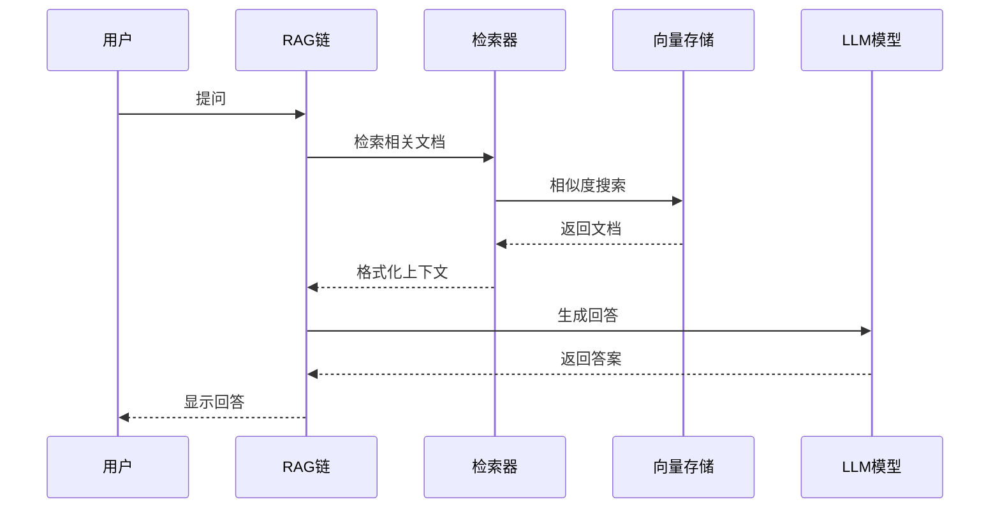

**图表来源**
- [retriever.py:150-189](file://rag/retriever.py#L150-L189)

**章节来源**
- [02_rag_basic.py:44-149](file://scripts/02_rag_basic.py#L44-L149)
- [chunker.py:12-61](file://rag/chunker.py#L12-L61)
- [vector_store.py:59-90](file://rag/vector_store.py#L59-L90)
- [retriever.py:150-189](file://rag/retriever.py#L150-L189)

### Agent 示例智能体实现

Agent 示例展示了如何构建具有工具集成能力的智能体，这是现代 LLM 应用的重要组成部分。

#### Agent 工作流设计

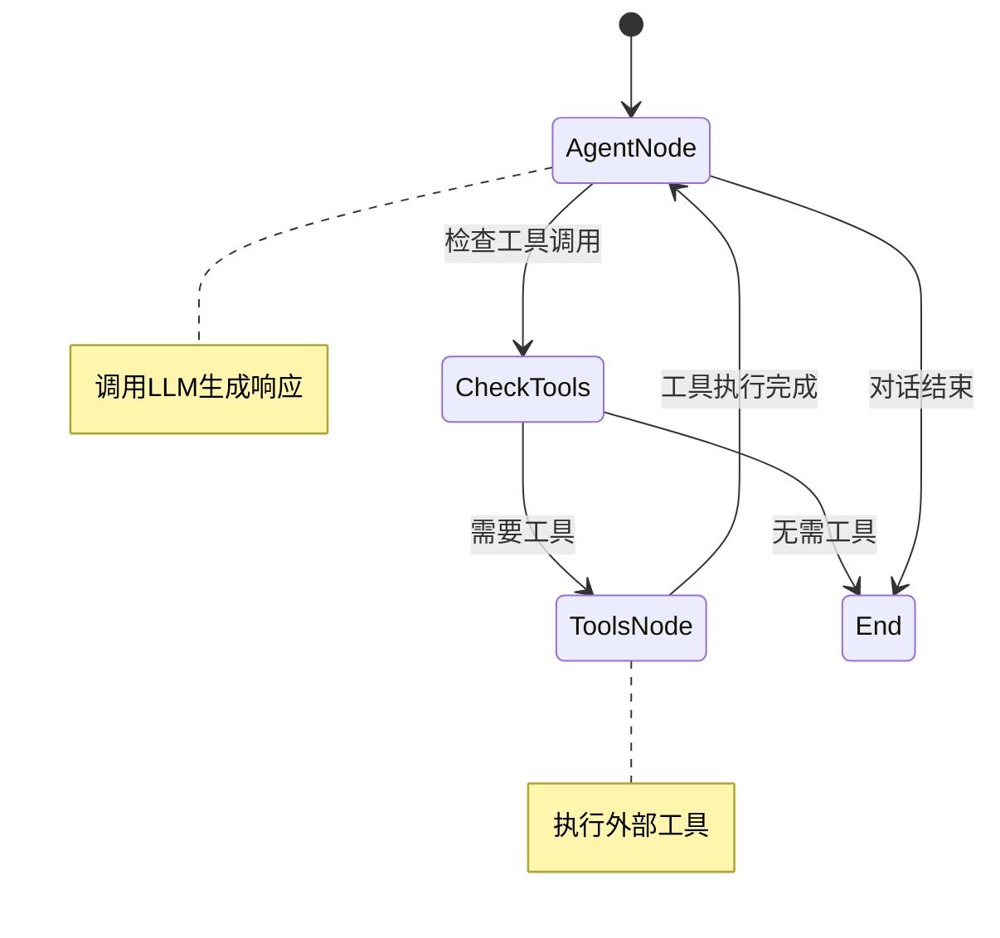

**图表来源**
- [base_agent.py:51-74](file://agents/base_agent.py#L51-L74)

#### 工具集成机制

Agent 系统支持动态工具注册和管理：

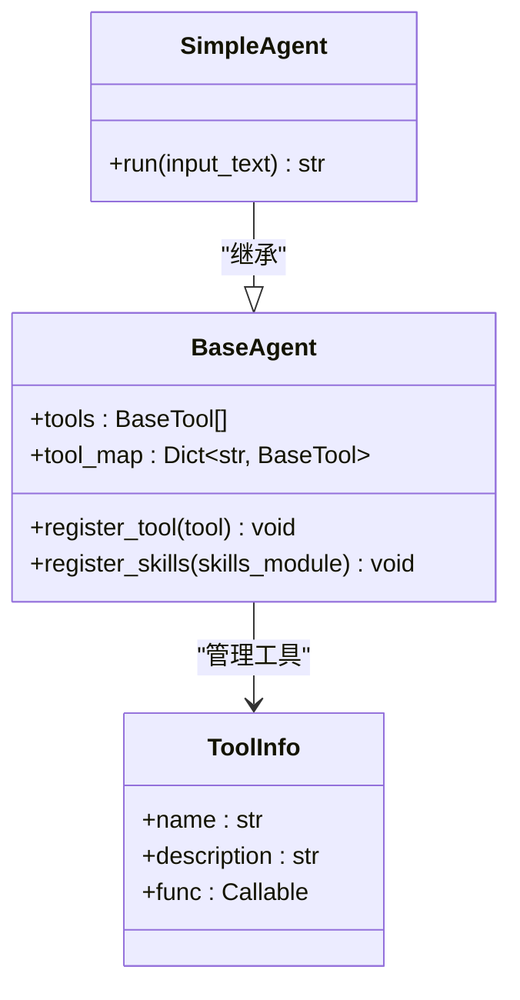

**图表来源**
- [base_agent.py:18-46](file://agents/base_agent.py#L18-L46)
- [base_agent.py:163-178](file://agents/base_agent.py#L163-L178)

#### 示例技能实现

示例技能模块展示了如何创建实用的工具：

| 工具名称 | 功能描述 | 参数 | 返回值 |
|----------|----------|------|--------|
| `get_current_time` | 获取当前时间 | 无 | `str` (格式: YYYY-MM-DD HH:MM:SS) |
| `calculate` | 计算数学表达式 | `expression: str` | `str` (结果或错误信息) |
| `search_knowledge` | 搜索知识库 | `query: str` | `str` (匹配结果或提示信息) |

#### Agent 对话演示

示例展示了两种 Agent 模式：

1. **简单 Agent**: 直接调用 LLM 进行对话
2. **工具 Agent**: 支持外部工具调用的智能体

**章节来源**
- [03_langgraph_agent.py:16-184](file://scripts/03_langgraph_agent.py#L16-L184)
- [base_agent.py:51-178](file://agents/base_agent.py#L51-L178)
- [example_skill.py:59-82](file://agents/skills/example_skill.py#L59-L82)

### 自动化测试示例策略

自动化测试示例展示了如何使用 LLM 来辅助软件测试工作，这是现代开发流程中的重要环节。

#### LLM 辅助测试概念

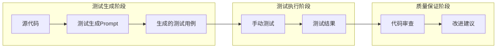

**图表来源**
- [04_auto_test.py:52-243](file://scripts/04_auto_test.py#L52-L243)

#### 测试策略最佳实践

示例展示了三种主要的 LLM 辅助测试场景：

1. **测试用例生成**: 基于代码自动生成测试用例
2. **代码审查**: 使用 LLM 进行代码质量评估
3. **测试执行**: 实际运行测试并报告结果

#### 测试执行流程

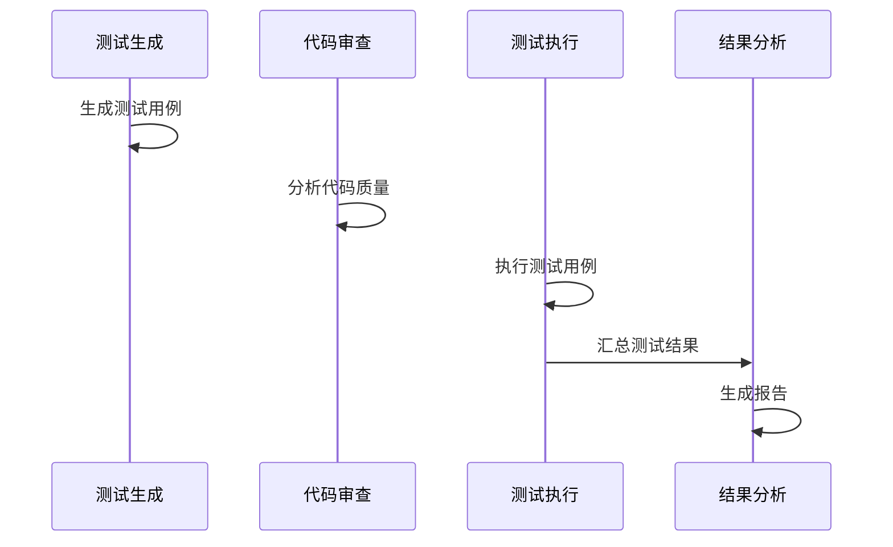

**图表来源**
- [04_auto_test.py:113-174](file://scripts/04_auto_test.py#L113-L174)

**章节来源**
- [04_auto_test.py:52-243](file://scripts/04_auto_test.py#L52-L243)

## 依赖分析

项目采用了清晰的依赖关系设计，确保模块间的松耦合和高内聚。

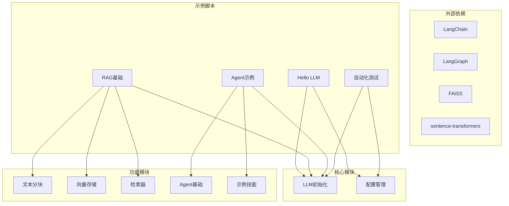

**图表来源**
- [README.md:5](file://README.md#L5)
- [requirements.txt](file://requirements.txt)

**章节来源**
- [README.md:5](file://README.md#L5)

## 性能考虑

### 内存优化策略

1. **向量存储懒加载**: VectorStore 采用懒加载机制，只有在需要时才加载索引
2. **文档分块优化**: 合理设置分块大小和重叠区域，平衡召回率和性能
3. **缓存机制**: 嵌入模型使用 CPU 编码，避免 GPU 内存占用

### 网络性能优化

1. **API Key 缓存**: 配置模块缓存 API Key，减少环境变量访问开销
2. **模型初始化复用**: LLM 实例在进程内复用，避免重复初始化
3. **批量操作**: 向量存储支持批量添加文档，提高写入效率

### 扩展性考虑

1. **插件化设计**: Agent 系统支持动态工具注册
2. **配置驱动**: 大多数参数可通过配置文件调整
3. **模块化架构**: 各功能模块独立，便于替换和扩展

## 故障排除指南

### 常见问题及解决方案

#### API Key 配置问题

**问题**: `未配置 API Key`
**解决方案**: 
1. 检查 `.env` 文件是否存在
2. 确认 API Key 格式正确
3. 验证网络连接正常

#### 模型初始化失败

**问题**: LLM 初始化异常
**解决方案**:
1. 检查提供商支持情况
2. 验证模型名称正确性
3. 确认温度参数范围 (0-1)

#### 向量存储问题

**问题**: FAISS 索引加载失败
**解决方案**:
1. 检查索引文件完整性
2. 验证嵌入模型版本兼容性
3. 清理损坏的索引文件

#### Agent 工具调用失败

**问题**: 工具调用返回错误
**解决方案**:
1. 检查工具函数签名
2. 验证输入参数格式
3. 确认工具权限设置

**章节来源**
- [01_hello_llm.py:82-88](file://scripts/01_hello_llm.py#L82-L88)
- [02_rag_basic.py:138-142](file://scripts/02_rag_basic.py#L138-L142)
- [03_langgraph_agent.py:173-177](file://scripts/03_langgraph_agent.py#L173-L177)

## 结论

本项目通过四个精心设计的示例脚本，为学习者提供了一个完整的 LLM 应用开发学习路径。从基础的 LLM 调用开始，逐步深入到 RAG 检索增强生成和智能体 Agent 的实现，最后展示如何使用 LLM 来辅助自动化测试。

每个示例都体现了以下设计理念：
- **渐进式学习**: 从简单到复杂，循序渐进
- **最佳实践**: 代码结构清晰，注释详细
- **实用性**: 解决实际应用场景中的问题
- **可扩展性**: 模块化设计，易于修改和扩展

通过深入学习这些示例，开发者可以掌握 LLM 应用开发的核心技术和实践技巧，为构建更复杂的 AI 应用打下坚实的基础。