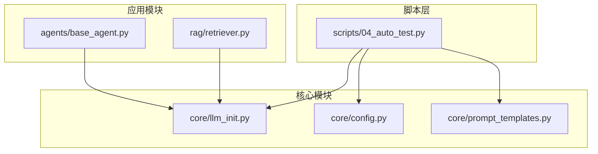
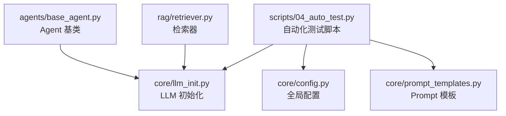
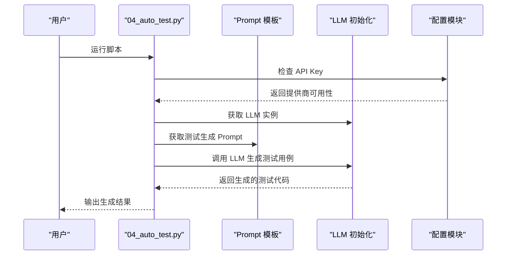
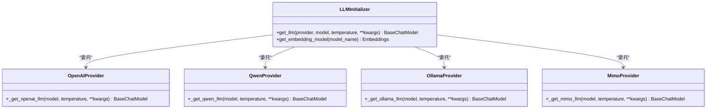
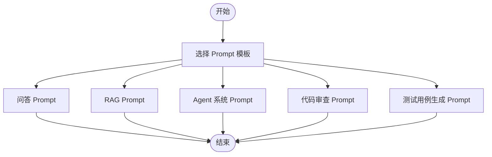
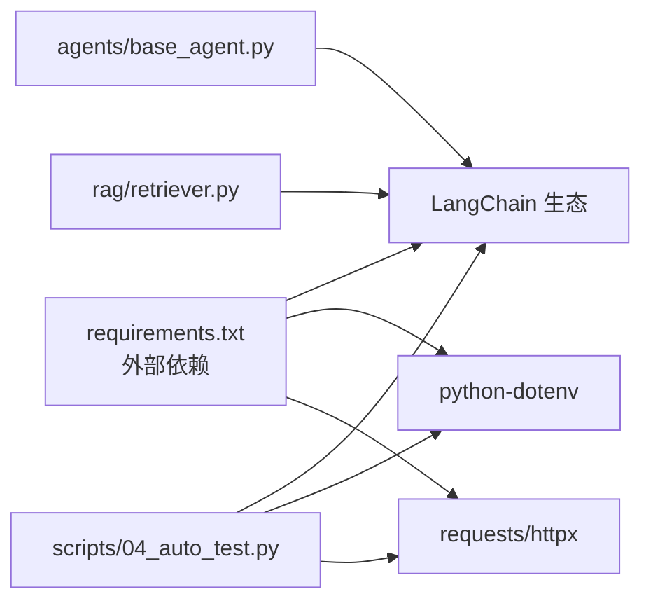

# 自动化测试示例

<cite>
**本文引用的文件**
- [scripts/04_auto_test.py](file://scripts/04_auto_test.py)
- [core/llm_init.py](file://core/llm_init.py)
- [core/config.py](file://core/config.py)
- [core/prompt_templates.py](file://core/prompt_templates.py)
- [README.md](file://README.md)
- [requirements.txt](file://requirements.txt)
- [agents/base_agent.py](file://agents/base_agent.py)
- [rag/retriever.py](file://rag/retriever.py)
</cite>

## 目录
1. [简介](#简介)
2. [项目结构](#项目结构)
3. [核心组件](#核心组件)
4. [架构总览](#架构总览)
5. [详细组件分析](#详细组件分析)
6. [依赖分析](#依赖分析)
7. [性能考虑](#性能考虑)
8. [故障排查指南](#故障排查指南)
9. [结论](#结论)
10. [附录](#附录)

## 简介
本指南围绕自动化测试示例脚本 scripts/04_auto_test.py 展开，系统讲解如何利用 LLM（大语言模型）辅助设计与执行测试，涵盖单元测试、集成测试与端到端测试的设计原则；测试用例编写规范（测试数据准备、断言方法、测试环境配置）；测试覆盖率分析、性能基准测试与回归测试最佳实践；以及测试自动化的实现机制（执行流程、结果报告与持续集成配置）。文档同时结合项目现有核心模块（LLM 初始化、Prompt 模板、配置管理等），给出可操作的落地建议与常见问题解决方案。

## 项目结构
该项目采用“脚本驱动 + 核心模块”的组织方式：
- scripts/：日常学习脚本集合，其中 04_auto_test.py 是本次自动化测试示例
- core/：可复用的核心模块（LLM 初始化、Prompt 模板、全局配置）
- rag/：RAG 相关模块（检索器、向量存储等）
- agents/：LangGraph Agent 基础类与技能模块
- openspec/：OpenSpec 规范相关配置
- README.md / requirements.txt：项目说明与依赖清单

图表来源
- [scripts/04_auto_test.py:1-243](file://scripts/04_auto_test.py#L1-L243)
- [core/llm_init.py:1-131](file://core/llm_init.py#L1-L131)
- [core/config.py:1-68](file://core/config.py#L1-L68)
- [core/prompt_templates.py:1-112](file://core/prompt_templates.py#L1-L112)
- [agents/base_agent.py:1-178](file://agents/base_agent.py#L1-L178)
- [rag/retriever.py:1-203](file://rag/retriever.py#L1-L203)

章节来源
- [README.md:1-80](file://README.md#L1-L80)
- [requirements.txt:1-34](file://requirements.txt#L1-L34)

## 核心组件
- LLM 初始化模块：统一管理不同提供商（OpenAI、通义千问、Ollama、MiMo）的模型实例创建与参数配置，支持温度、模型名等参数传入。
- Prompt 模板库：提供问答、RAG、Agent 系统提示词、代码审查、测试用例生成等模板，便于在不同场景下复用高质量提示词。
- 全局配置模块：集中管理 API Key、默认模型、向量存储路径、目录结构等，提供 API Key 检查与获取能力。
- 自动化测试脚本：演示 LLM 生成测试用例、代码审查、测试执行与概念讲解，展示从 LLM 到测试执行的完整链路。

章节来源
- [core/llm_init.py:18-131](file://core/llm_init.py#L18-L131)
- [core/prompt_templates.py:5-112](file://core/prompt_templates.py#L5-L112)
- [core/config.py:24-68](file://core/config.py#L24-L68)
- [scripts/04_auto_test.py:52-243](file://scripts/04_auto_test.py#L52-L243)

## 架构总览
自动化测试示例的整体架构由“脚本层 + 核心模块 + 应用模块”三层组成。脚本层负责业务演示与测试流程编排；核心模块提供 LLM 与 Prompt 能力；应用模块（Agent/RAG）作为被测对象或测试目标。

图表来源
- [scripts/04_auto_test.py:10-12](file://scripts/04_auto_test.py#L10-L12)
- [core/llm_init.py:18-47](file://core/llm_init.py#L18-L47)
- [core/config.py:24-68](file://core/config.py#L24-L68)
- [core/prompt_templates.py:94-112](file://core/prompt_templates.py#L94-L112)
- [agents/base_agent.py:26-178](file://agents/base_agent.py#L26-L178)
- [rag/retriever.py:17-203](file://rag/retriever.py#L17-L203)

## 详细组件分析

### 自动化测试脚本（04_auto_test.py）
该脚本通过 LLM 生成测试用例、进行代码审查、执行测试并讲解自动化测试概念，形成一个完整的测试自动化闭环。

- 测试用例生成演示
  - 选择合适的 LLM 提供商（优先 OpenAI，其次通义千问，最后回退到 Ollama）
  - 使用测试用例生成 Prompt 模板，将待测代码注入模板并调用 LLM 生成测试代码
  - 输出生成的测试内容，便于后续执行或人工审阅

- 代码审查演示
  - 使用代码审查 Prompt 模板，对一段存在 SQL 注入风险的示例代码进行审查
  - 输出审查意见，帮助识别安全与质量风险

- 测试执行演示
  - 在脚本内定义被测函数（如折扣计算函数），并编写多组测试用例
  - 包含正常值、边界值与异常场景，分别验证数值正确性与异常抛出
  - 统计通过/失败数量，输出测试结果

- 自动化测试概念讲解
  - 介绍 LLM 在测试领域的五种典型作用：测试用例生成、测试代码补全、测试解释、测试文档生成、变异测试
  - 提供最佳实践：LLM 生成的测试需要人工审查、结合传统测试方法、对关键代码仍需人工编写测试、使用 LLM 生成测试草稿再完善

图表来源
- [scripts/04_auto_test.py:52-76](file://scripts/04_auto_test.py#L52-L76)
- [core/prompt_templates.py:94-112](file://core/prompt_templates.py#L94-L112)
- [core/llm_init.py:18-47](file://core/llm_init.py#L18-L47)
- [core/config.py:65-68](file://core/config.py#L65-L68)

章节来源
- [scripts/04_auto_test.py:52-243](file://scripts/04_auto_test.py#L52-L243)

### LLM 初始化模块（core/llm_init.py）
- 功能概述
  - 统一入口 get_llm：根据提供商选择对应初始化函数，支持 OpenAI、通义千问、Ollama、MiMo
  - 参数控制：温度、模型名、额外参数透传
  - 错误处理：未配置 API Key 时抛出明确异常
  - Embedding 模型：提供 HuggingFaceEmbeddings 的封装

- 设计要点
  - 条件分支清晰，便于扩展新的提供商
  - 温度参数用于控制输出确定性，测试场景建议较低温度
  - 与配置模块解耦，通过环境变量读取密钥与默认模型

图表来源
- [core/llm_init.py:18-131](file://core/llm_init.py#L18-L131)

章节来源
- [core/llm_init.py:18-131](file://core/llm_init.py#L18-L131)

### Prompt 模板库（core/prompt_templates.py）
- 模板类型
  - 通用问答、RAG 问答、Agent 系统提示词、代码审查、文本总结、带历史记录的聊天、测试用例生成
- 设计原则
  - 明确角色与约束，确保输出结构化、可执行
  - 针对测试生成场景，强调 pytest 框架、覆盖正常与边界、清晰注释与有意义的函数名

图表来源
- [core/prompt_templates.py:5-112](file://core/prompt_templates.py#L5-L112)

章节来源
- [core/prompt_templates.py:5-112](file://core/prompt_templates.py#L5-L112)

### 全局配置模块（core/config.py）
- 关键职责
  - 环境变量加载与 API Key 管理
  - 默认模型与提供商配置
  - 目录结构（数据、输出）创建
  - API Key 检查与获取

- 与测试的关系
  - 为 LLM 初始化提供密钥与默认模型
  - 为测试脚本提供可用性判断（OpenAI/Qwen/MiMo）

章节来源
- [core/config.py:24-68](file://core/config.py#L24-L68)

### 应用模块（agents/base_agent.py 与 rag/retriever.py）
- Agent 基类
  - 状态图工作流、工具注册、消息流式输出
  - 适合用于集成测试与端到端测试，验证复杂交互逻辑
- 检索器
  - 相似度检索、带分数检索、MMR 多样性检索
  - 适合用于 RAG 场景的集成测试与性能基准测试

章节来源
- [agents/base_agent.py:26-178](file://agents/base_agent.py#L26-L178)
- [rag/retriever.py:17-203](file://rag/retriever.py#L17-L203)

## 依赖分析
- 外部依赖
  - LangChain 生态（OpenAI、社区模型、FAISS、sentence-transformers 等）
  - 环境变量加载（python-dotenv）
  - HTTP 客户端（requests、httpx）
- 内部依赖
  - 04_auto_test.py 依赖 core/llm_init.py、core/config.py、core/prompt_templates.py
  - agents/base_agent.py 与 rag/retriever.py 依赖 core/llm_init.py

图表来源
- [requirements.txt:1-34](file://requirements.txt#L1-L34)
- [scripts/04_auto_test.py:10-12](file://scripts/04_auto_test.py#L10-L12)
- [agents/base_agent.py:5-9](file://agents/base_agent.py#L5-L9)
- [rag/retriever.py:5-7](file://rag/retriever.py#L5-L7)

章节来源
- [requirements.txt:1-34](file://requirements.txt#L1-L34)
- [scripts/04_auto_test.py:10-12](file://scripts/04_auto_test.py#L10-L12)
- [agents/base_agent.py:5-9](file://agents/base_agent.py#L5-L9)
- [rag/retriever.py:5-7](file://rag/retriever.py#L5-L7)

## 性能考虑
- LLM 调用成本与延迟
  - 降低温度可提高确定性，但可能增加推理时间
  - 合理控制 Prompt 长度与上下文，避免不必要的上下文开销
- 测试执行性能
  - 单元测试优先，减少对外部服务的依赖
  - 集成测试中尽量使用内存级向量存储或小规模数据集
- 基准测试建议
  - 使用 pytest-benchmark 或自定义计时器测量关键路径耗时
  - 对 Agent/RAG 场景，分别统计检索与生成阶段的耗时占比

## 故障排查指南
- API Key 未配置
  - 现象：初始化 LLM 时报错或脚本提示未配置 API Key
  - 处理：在 .env 文件中设置对应提供商的 API Key，并确保已加载
  - 参考路径：[core/config.py:24-68](file://core/config.py#L24-L68)、[core/llm_init.py:50-62](file://core/llm_init.py#L50-L62)

- LLM 提供商不可用
  - 现象：脚本回退到 Ollama 或报错
  - 处理：确认网络连通性、Ollama 服务状态或更换提供商
  - 参考路径：[scripts/04_auto_test.py:58-85](file://scripts/04_auto_test.py#L58-L85)

- 测试执行异常
  - 现象：测试用例抛出异常或断言失败
  - 处理：检查被测函数的输入边界、异常类型与断言精度（如浮点比较使用容差）
  - 参考路径：[scripts/04_auto_test.py:129-173](file://scripts/04_auto_test.py#L129-L173)

- 依赖缺失
  - 现象：导入失败或运行时报错
  - 处理：安装 requirements.txt 中声明的依赖
  - 参考路径：[requirements.txt:1-34](file://requirements.txt#L1-L34)

章节来源
- [core/config.py:24-68](file://core/config.py#L24-L68)
- [core/llm_init.py:50-62](file://core/llm_init.py#L50-L62)
- [scripts/04_auto_test.py:58-85](file://scripts/04_auto_test.py#L58-L85)
- [scripts/04_auto_test.py:129-173](file://scripts/04_auto_test.py#L129-L173)
- [requirements.txt:1-34](file://requirements.txt#L1-L34)

## 结论
本指南展示了如何将 LLM 与传统测试方法结合，构建从测试用例生成、代码审查到测试执行的自动化测试体系。通过统一的 LLM 初始化与 Prompt 模板，配合严格的测试数据准备与断言策略，可以在保证质量的同时提升测试效率。建议在实际项目中逐步引入 LLM 辅助测试，并将其纳入持续集成流水线，以实现持续的质量保障。

## 附录

### 测试策略与实现方法
- 单元测试
  - 针对独立函数或小模块，使用 pytest 编写用例，覆盖正常值、边界值与异常场景
  - 使用容差比较浮点结果，避免精度误差导致的失败
  - 参考路径：[scripts/04_auto_test.py:129-173](file://scripts/04_auto_test.py#L129-L173)

- 集成测试
  - 验证模块间协作，如 Agent 的工具调用、RAG 的检索与生成链路
  - 使用小规模数据与内存向量存储，缩短测试时间
  - 参考路径：[agents/base_agent.py:26-178](file://agents/base_agent.py#L26-L178)、[rag/retriever.py:17-203](file://rag/retriever.py#L17-L203)

- 端到端测试
  - 模拟真实用户场景，验证完整业务流程
  - 使用 LLM 生成测试场景与期望输出，结合人工校验
  - 参考路径：[scripts/04_auto_test.py:52-76](file://scripts/04_auto_test.py#L52-L76)

### 测试用例编写规范
- 测试数据准备
  - 明确输入域与预期输出，覆盖正常、边界与异常三类场景
  - 对于浮点运算，使用容差比较而非精确相等
- 断言方法
  - 数值断言：使用容差或区间断言
  - 异常断言：断言抛出的异常类型与消息
- 测试环境配置
  - 通过 .env 配置 API Key，确保脚本可运行
  - 使用 Prompt 模板标准化测试生成与审查流程

### 测试覆盖率分析、性能基准测试与回归测试最佳实践
- 覆盖率
  - 使用 pytest-cov 或 coverage.py 统计行、分支与函数覆盖率
  - 关注关键路径与异常分支的覆盖情况
- 性能基准
  - 使用 pytest-benchmark 或自定义计时器，记录关键函数耗时
  - 对 Agent/RAG 场景分别统计检索与生成阶段耗时
- 回归测试
  - 将历史失败用例纳入回归集，防止回归
  - 结合 CI 自动化执行，确保每次变更都得到验证

### 测试自动化实现机制
- 执行流程
  - 脚本启动 → 检查 API Key → 初始化 LLM → 生成测试用例/代码审查 → 执行测试 → 输出结果
- 结果报告
  - 统计通过/失败数量，输出详细日志，必要时导出报告
- 持续集成配置
  - 在 CI 中安装依赖、加载 .env、执行测试脚本，配置覆盖率与性能阈值