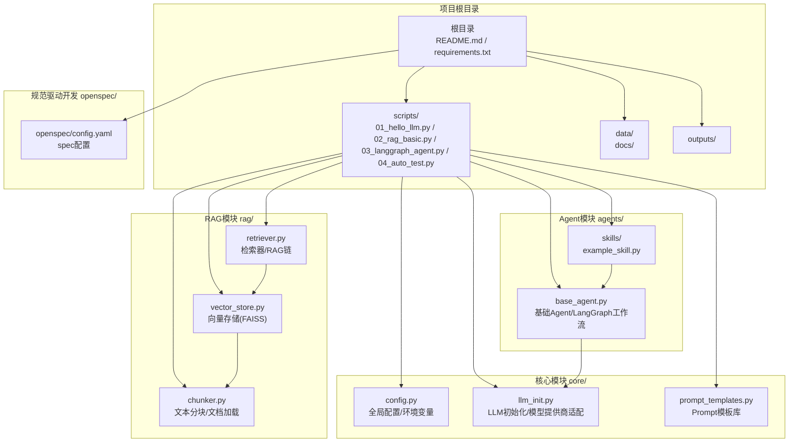
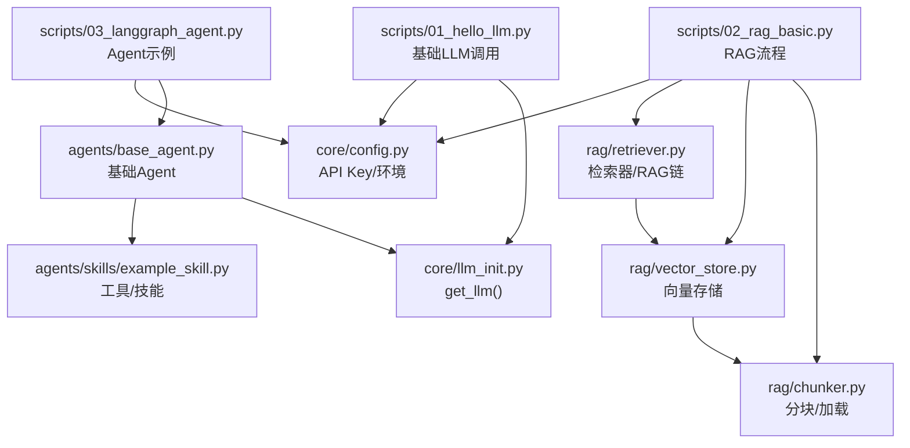
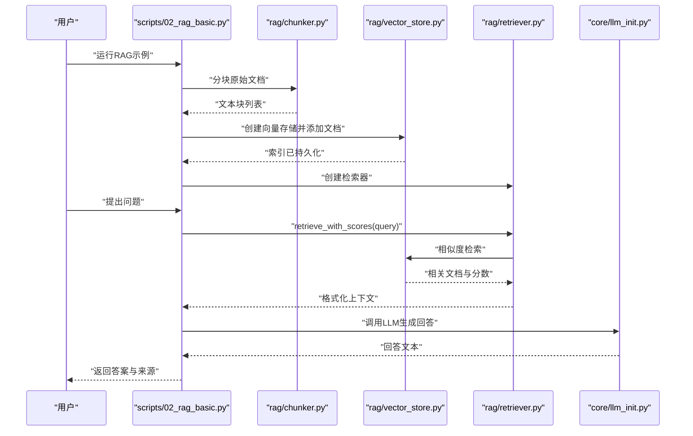
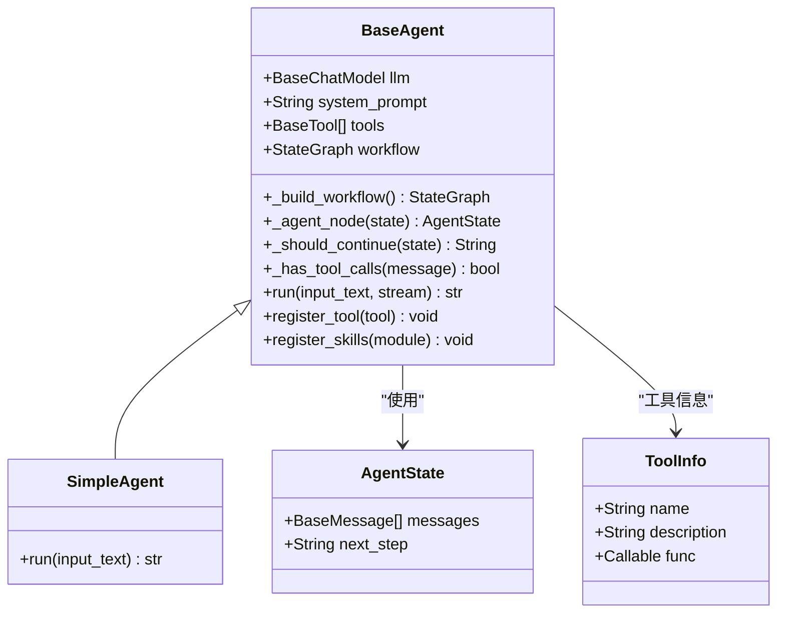
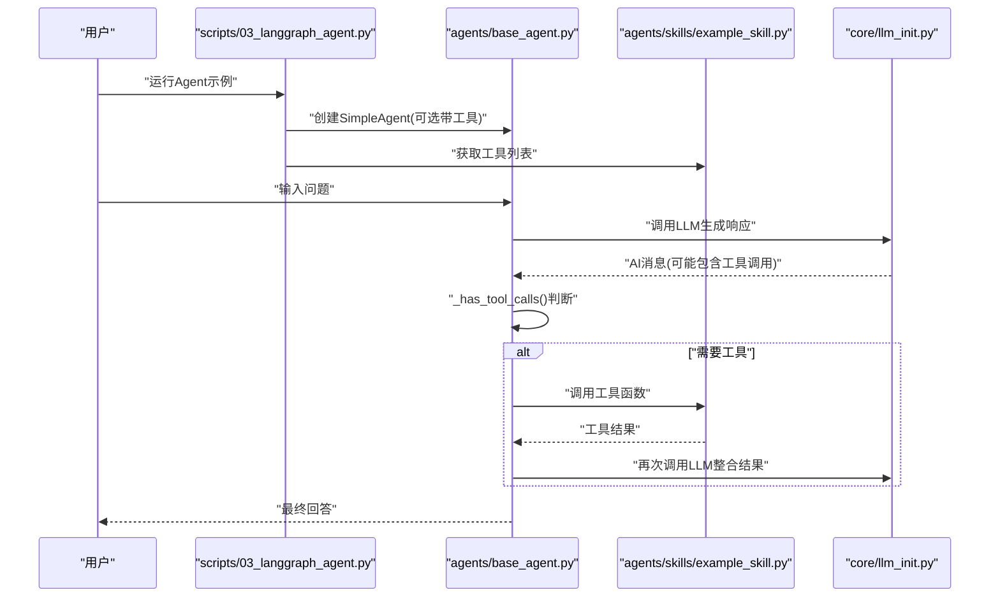
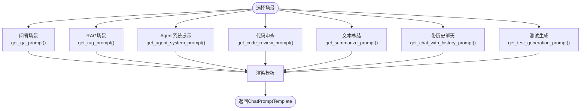
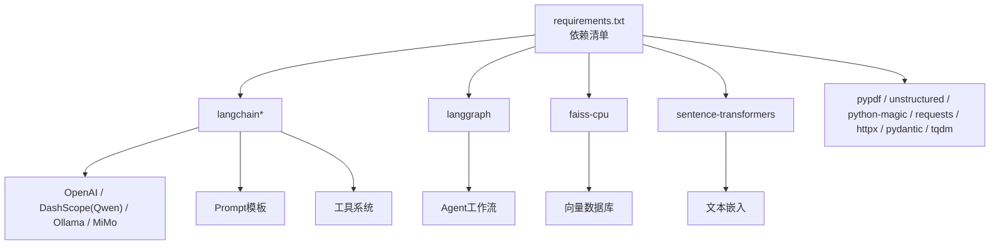

# 项目概述

<cite>
**本文档引用的文件**
- [README.md](file://README.md)
- [requirements.txt](file://requirements.txt)
- [core/config.py](file://core/config.py)
- [core/llm_init.py](file://core/llm_init.py)
- [core/prompt_templates.py](file://core/prompt_templates.py)
- [rag/chunker.py](file://rag/chunker.py)
- [rag/vector_store.py](file://rag/vector_store.py)
- [rag/retriever.py](file://rag/retriever.py)
- [agents/base_agent.py](file://agents/base_agent.py)
- [agents/skills/example_skill.py](file://agents/skills/example_skill.py)
- [scripts/01_hello_llm.py](file://scripts/01_hello_llm.py)
- [scripts/02_rag_basic.py](file://scripts/02_rag_basic.py)
- [scripts/03_langgraph_agent.py](file://scripts/03_langgraph_agent.py)
- [openspec/config.yaml](file://openspec/config.yaml)
</cite>

## 目录
1. [简介](#简介)
2. [项目结构](#项目结构)
3. [核心组件](#核心组件)
4. [架构总览](#架构总览)
5. [详细组件分析](#详细组件分析)
6. [依赖分析](#依赖分析)
7. [性能考虑](#性能考虑)
8. [故障排除指南](#故障排除指南)
9. [结论](#结论)
10. [附录](#附录)

## 简介
本项目是一个以教育为导向的LLM应用开发学习框架，旨在通过循序渐进的示例帮助学习者掌握现代大语言模型应用的核心技术栈与实践方法。项目采用LangChain + LangGraph + FAISS + sentence-transformers技术组合，覆盖RAG（检索增强生成）、Agent（智能体）与Prompt Engineering（提示工程）三大核心功能模块。

项目定位明确：既适合初学者通过基础示例快速上手，也便于有经验的开发者深入理解组件设计、扩展工具与优化性能。项目提供统一的LLM初始化接口、可复用的Prompt模板库、完善的RAG流水线以及基于LangGraph的Agent框架，形成一套完整的学习与实践闭环。

## 项目结构
项目采用按功能域划分的层次化组织方式，主要目录与职责如下：

- 根目录
  - README.md：项目说明与快速开始指南
  - requirements.txt：Python依赖清单
  - .env.example：环境变量模板（需复制为.env并填写密钥）
- scripts/：日常学习脚本，包含四个递进示例
  - 01_hello_llm.py：基础LLM调用
  - 02_rag_basic.py：RAG基础示例
  - 03_langgraph_agent.py：Agent示例
  - 04_auto_test.py：自动化测试示例
- core/：可复用核心代码
  - config.py：全局配置与环境变量管理
  - llm_init.py：LLM统一初始化与模型提供商适配
  - prompt_templates.py：Prompt模板库
- rag/：RAG相关代码
  - chunker.py：文本分块与多格式文档加载
  - vector_store.py：向量存储封装（基于FAISS）
  - retriever.py：检索器与RAG链
- agents/：LangGraph Agent
  - base_agent.py：基础Agent类与工作流编排
  - skills/：技能与工具定义
- data/：本地数据（文档存储）
- outputs/：生成结果输出目录
- openspec/：规范驱动开发配置（spec-driven）

**图表来源**
- [README.md:7-39](file://README.md#L7-L39)
- [core/config.py:1-68](file://core/config.py#L1-L68)
- [core/llm_init.py:1-131](file://core/llm_init.py#L1-L131)
- [rag/chunker.py:1-175](file://rag/chunker.py#L1-L175)
- [rag/vector_store.py:1-252](file://rag/vector_store.py#L1-L252)
- [rag/retriever.py:1-203](file://rag/retriever.py#L1-L203)
- [agents/base_agent.py:1-178](file://agents/base_agent.py#L1-L178)
- [agents/skills/example_skill.py:1-95](file://agents/skills/example_skill.py#L1-L95)
- [openspec/config.yaml:1-21](file://openspec/config.yaml#L1-L21)

**章节来源**
- [README.md:7-39](file://README.md#L7-L39)
- [README.md:41-80](file://README.md#L41-L80)

## 核心组件
本节对项目的关键组件进行深入分析，涵盖职责、接口与典型用法。

- 全局配置与环境变量（core/config.py）
  - 职责：集中管理项目根目录、数据与输出目录；加载环境变量；定义默认模型与向量模型；提供API Key检查与获取辅助函数。
  - 关键点：确保数据与输出目录存在；支持多提供商API Key；默认向量模型为中文场景优化；提供Ollama与MiMo等提供商的基础URL配置。
  - 复杂度：O(1)，常量时间访问与检查。
  - 优化：通过懒加载与缓存策略避免重复解析环境变量。

- LLM统一初始化（core/llm_init.py）
  - 职责：根据提供商与模型名称创建LangChain BaseChatModel实例；支持OpenAI、通义千问、Ollama、MiMo；提供Embedding模型获取。
  - 关键点：按提供商分支初始化对应客户端；校验必要API Key；统一温度参数；Embedding模型使用CPU与归一化配置。
  - 复杂度：初始化开销取决于具体提供商SDK；调用invoke为O(1)。
  - 优化：延迟导入提供商模块以减少启动时间；复用Embedding模型实例。

- Prompt模板库（core/prompt_templates.py）
  - 职责：提供问答、RAG、Agent系统提示、代码审查、总结、带历史聊天、测试生成等模板。
  - 关键点：模板可参数化；Agent系统提示支持动态注入工具描述；MessagesPlaceholder用于历史对话。
  - 复杂度：模板构造O(1)；渲染复杂度与模板长度线性相关。
  - 优化：模板预编译；按需加载不同模板。

- 文本分块与文档加载（rag/chunker.py）
  - 职责：将长文本按字符或递归策略分块；支持PDF、Markdown、文本等多格式加载；提供目录批量处理。
  - 关键点：CharacterTextSplitter用于纯文本；RecursiveCharacterTextSplitter按多种分隔符切分；默认UTF-8编码。
  - 复杂度：分块复杂度O(n)；文件加载依赖具体loader实现。
  - 优化：批量处理与进度显示；针对中文场景优化分隔符顺序。

- 向量存储（rag/vector_store.py）
  - 职责：基于FAISS封装向量数据库；支持文档与文本添加、持久化、相似度检索、MMR多样性检索、统计查询。
  - 关键点：懒加载索引；首次创建与增量添加；支持元数据；MMR参数可调；提供集合清理。
  - 复杂度：首次构建O(n log n)；相似度检索O(log n)；MMR检索O(n log n)。
  - 优化：CPU设备与归一化嵌入提升相似度稳定性；持久化避免重复构建。

- 检索器与RAG链（rag/retriever.py）
  - 职责：检索相关文档并格式化上下文；支持相似度与MMR检索；封装RAG链，连接检索与生成。
  - 关键点：统一检索接口；支持过滤与分数返回；RAG链自动拼接Prompt与调用LLM。
  - 复杂度：检索O(log n)；格式化上下文O(k)。
  - 优化：结果后处理过滤；MMR提升多样性。

- 基础Agent与工具系统（agents/base_agent.py）
  - 职责：基于LangGraph定义状态图；支持工具节点与条件分支；提供流式与非流式执行；注册工具与技能模块。
  - 关键点：AgentState状态管理；工具调用检测；工作流编译与复用；SimpleAgent简化对话。
  - 复杂度：状态图编译一次；每次执行O(t)（t为步数）。
  - 优化：工具注册后重新编译工作流；流式输出逐帧返回。

- 示例技能（agents/skills/example_skill.py）
  - 职责：演示工具定义与注册；提供时间查询、数学计算、知识库搜索等工具。
  - 关键点：工具函数安全校验；统一描述格式；get_tools统一导出。
  - 复杂度：O(1)工具调用；搜索为O(k)遍历。
  - 优化：输入白名单限制；异常捕获与友好提示。

**章节来源**
- [core/config.py:1-68](file://core/config.py#L1-L68)
- [core/llm_init.py:18-131](file://core/llm_init.py#L18-L131)
- [core/prompt_templates.py:5-112](file://core/prompt_templates.py#L5-L112)
- [rag/chunker.py:12-175](file://rag/chunker.py#L12-L175)
- [rag/vector_store.py:13-252](file://rag/vector_store.py#L13-L252)
- [rag/retriever.py:17-203](file://rag/retriever.py#L17-L203)
- [agents/base_agent.py:26-178](file://agents/base_agent.py#L26-L178)
- [agents/skills/example_skill.py:8-95](file://agents/skills/example_skill.py#L8-L95)

## 架构总览
下图展示了从脚本入口到核心组件的调用关系与数据流向，体现项目“示例驱动 + 组件复用”的设计思路。

**图表来源**
- [scripts/01_hello_llm.py:15-95](file://scripts/01_hello_llm.py#L15-L95)
- [scripts/02_rag_basic.py:44-149](file://scripts/02_rag_basic.py#L44-L149)
- [scripts/03_langgraph_agent.py:16-184](file://scripts/03_langgraph_agent.py#L16-L184)
- [core/llm_init.py:18-131](file://core/llm_init.py#L18-L131)
- [rag/chunker.py:12-175](file://rag/chunker.py#L12-L175)
- [rag/vector_store.py:13-252](file://rag/vector_store.py#L13-L252)
- [rag/retriever.py:17-203](file://rag/retriever.py#L17-L203)
- [agents/base_agent.py:26-178](file://agents/base_agent.py#L26-L178)
- [agents/skills/example_skill.py:59-82](file://agents/skills/example_skill.py#L59-L82)
- [core/config.py:24-68](file://core/config.py#L24-L68)

## 详细组件分析

### RAG模块分析
RAG模块由“文档分块 → 向量存储 → 检索 → 生成”四步构成，形成完整的检索增强生成流水线。

**图表来源**
- [scripts/02_rag_basic.py:44-149](file://scripts/02_rag_basic.py#L44-L149)
- [rag/chunker.py:12-175](file://rag/chunker.py#L12-L175)
- [rag/vector_store.py:59-218](file://rag/vector_store.py#L59-L218)
- [rag/retriever.py:29-189](file://rag/retriever.py#L29-L189)
- [core/llm_init.py:18-131](file://core/llm_init.py#L18-L131)

**章节来源**
- [scripts/02_rag_basic.py:44-149](file://scripts/02_rag_basic.py#L44-L149)
- [rag/chunker.py:12-175](file://rag/chunker.py#L12-L175)
- [rag/vector_store.py:13-252](file://rag/vector_store.py#L13-L252)
- [rag/retriever.py:17-203](file://rag/retriever.py#L17-L203)

### Agent模块分析
Agent模块基于LangGraph构建状态图，支持工具节点与条件分支，实现“推理-工具-生成”的闭环。

**图表来源**
- [agents/base_agent.py:12-178](file://agents/base_agent.py#L12-L178)

**图表来源**
- [scripts/03_langgraph_agent.py:16-184](file://scripts/03_langgraph_agent.py#L16-L184)
- [agents/base_agent.py:76-127](file://agents/base_agent.py#L76-L127)
- [agents/skills/example_skill.py:59-82](file://agents/skills/example_skill.py#L59-L82)
- [core/llm_init.py:18-131](file://core/llm_init.py#L18-L131)

**章节来源**
- [agents/base_agent.py:26-178](file://agents/base_agent.py#L26-L178)
- [agents/skills/example_skill.py:8-95](file://agents/skills/example_skill.py#L8-L95)
- [scripts/03_langgraph_agent.py:16-184](file://scripts/03_langgraph_agent.py#L16-L184)

### Prompt Engineering模块分析
Prompt模板库提供多种场景化的模板，支持参数化与历史消息占位符。

**图表来源**
- [core/prompt_templates.py:5-112](file://core/prompt_templates.py#L5-L112)

**章节来源**
- [core/prompt_templates.py:5-112](file://core/prompt_templates.py#L5-L112)

## 依赖分析
项目依赖以LangChain为核心，围绕LLM调用、向量存储与Agent工作流展开，同时引入FAISS与sentence-transformers支撑RAG。

**图表来源**
- [requirements.txt:1-34](file://requirements.txt#L1-L34)

**章节来源**
- [requirements.txt:1-34](file://requirements.txt#L1-L34)

## 性能考虑
- 向量存储与检索
  - FAISS索引首次构建成本较高，建议在增量更新时复用已有索引并及时持久化。
  - 相似度检索与MMR检索的时间复杂度与数据规模相关，合理设置top_k与fetch_k参数。
- Embedding模型
  - 使用CPU与归一化嵌入可提升跨文档相似度稳定性；若资源充足可考虑GPU加速。
- Agent工作流
  - 工作流编译仅发生一次，后续执行避免重复编译；工具调用应尽量幂等与轻量。
- Prompt模板
  - 模板渲染为O(n)与长度线性相关，避免过长上下文；必要时进行截断或摘要。
- I/O与批处理
  - 文档加载与分块支持批量处理与进度显示；建议在大数据集上启用增量写入与断点续传。

## 故障排除指南
- API Key配置
  - 现象：初始化LLM时报错提示未配置API Key。
  - 处理：检查.env文件中对应提供商的API Key是否正确；使用check_api_key进行验证。
- 网络与代理
  - 现象：调用OpenAI/Qwen失败或超时。
  - 处理：确认网络连通性；如需代理，请在系统环境或SDK层正确配置。
- Ollama本地模型
  - 现象：Ollama初始化失败或模型不可用。
  - 处理：确认本地Ollama服务已启动；检查OLLAMA_BASE_URL配置；拉取所需模型镜像。
- 向量存储异常
  - 现象：FAISS索引加载失败或无法保存。
  - 处理：检查VECTOR_STORE_PATH权限；删除损坏索引后重建；确保Embedding模型可用。
- Agent工具调用
  - 现象：工具调用未生效或报错。
  - 处理：确认模型支持function calling；检查工具描述与签名；对敏感函数增加输入校验。

**章节来源**
- [core/config.py:24-68](file://core/config.py#L24-L68)
- [core/llm_init.py:50-108](file://core/llm_init.py#L50-L108)
- [scripts/01_hello_llm.py:82-90](file://scripts/01_hello_llm.py#L82-L90)
- [rag/vector_store.py:42-57](file://rag/vector_store.py#L42-L57)

## 结论
本项目以“示例驱动 + 组件复用”为核心理念，围绕LangChain生态构建了完整的LLM应用学习框架。通过统一的LLM初始化、Prompt模板库、RAG流水线与Agent工作流，学习者可以在实践中逐步掌握从基础调用到复杂应用的全流程技能。项目结构清晰、依赖明确、扩展性强，既适合入门学习，也为进一步定制与生产化奠定了坚实基础。

## 附录
- 快速开始
  - 安装依赖：pip install -r requirements.txt
  - 配置环境变量：cp .env.example .env，填写API Key
  - 运行示例：python scripts/01_hello_llm.py
- 学习路线
  - 基础：01_hello_llm.py → 熟悉LLM调用
  - RAG：02_rag_basic.py → 掌握检索增强生成
  - Agent：03_langgraph_agent.py → 体验智能体与工具
  - 实战：修改示例，实现自定义功能
- 支持的模型提供商
  - OpenAI：GPT-4、GPT-3.5-turbo
  - 通义千问：qwen-turbo、qwen-plus、qwen-max
  - Ollama：本地模型（需自行安装Ollama）
  - MiMo：兼容OpenAI格式的API（可选）

**章节来源**
- [README.md:41-80](file://README.md#L41-L80)
- [requirements.txt:1-34](file://requirements.txt#L1-L34)
- [openspec/config.yaml:1-21](file://openspec/config.yaml#L1-L21)