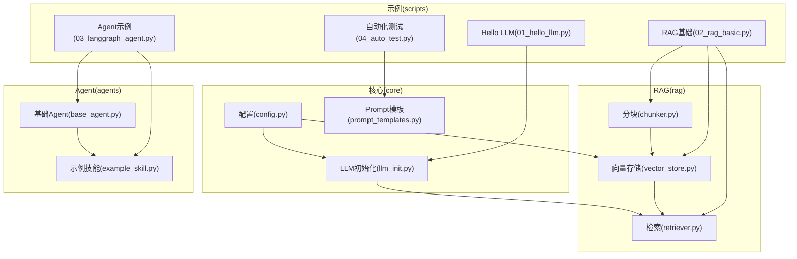
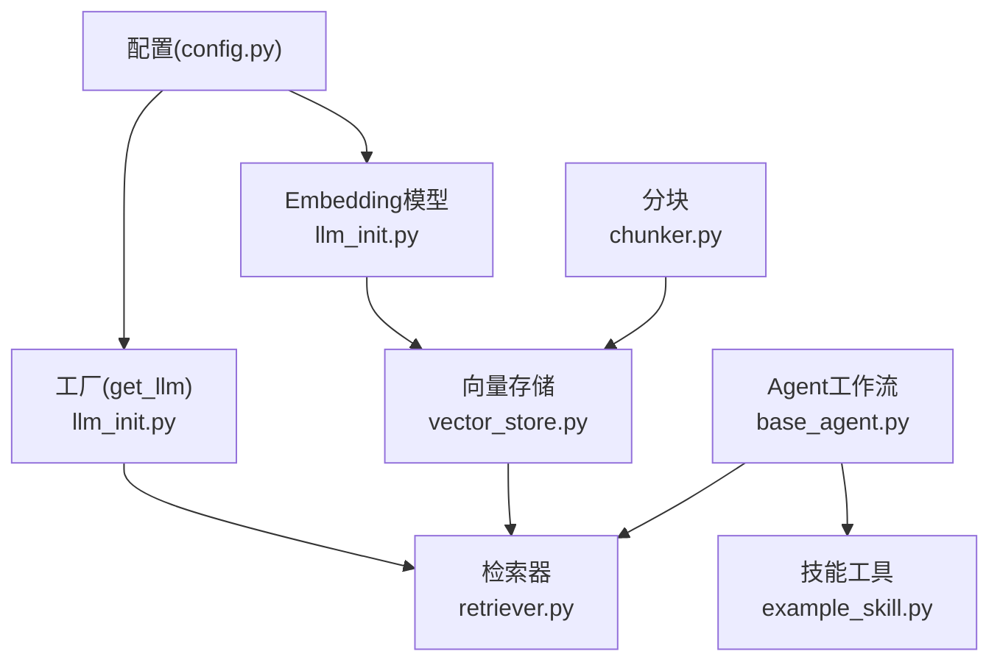
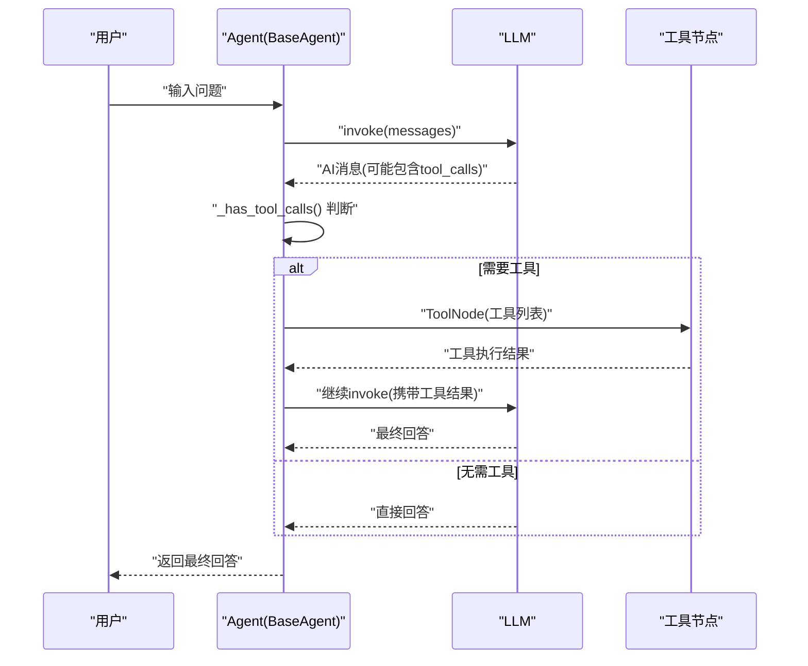
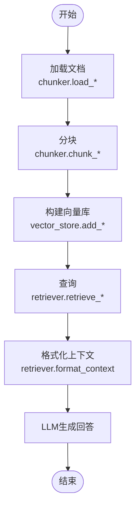
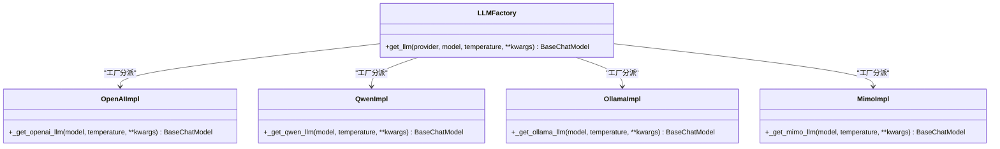
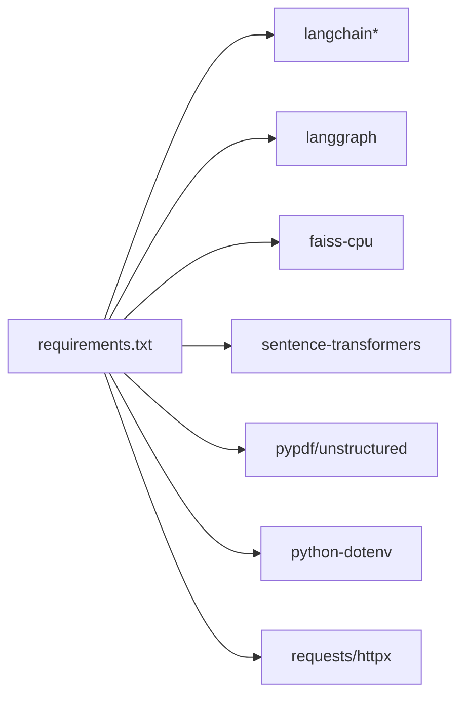

# 扩展开发指南

<cite>
**本文引用的文件**
- [README.md](file://README.md)
- [requirements.txt](file://requirements.txt)
- [core/config.py](file://core/config.py)
- [core/llm_init.py](file://core/llm_init.py)
- [core/prompt_templates.py](file://core/prompt_templates.py)
- [agents/base_agent.py](file://agents/base_agent.py)
- [agents/skills/example_skill.py](file://agents/skills/example_skill.py)
- [rag/chunker.py](file://rag/chunker.py)
- [rag/vector_store.py](file://rag/vector_store.py)
- [rag/retriever.py](file://rag/retriever.py)
- [scripts/01_hello_llm.py](file://scripts/01_hello_llm.py)
- [scripts/02_rag_basic.py](file://scripts/02_rag_basic.py)
- [scripts/03_langgraph_agent.py](file://scripts/03_langgraph_agent.py)
- [scripts/04_auto_test.py](file://scripts/04_auto_test.py)
</cite>

## 目录
1. [简介](#简介)
2. [项目结构](#项目结构)
3. [核心组件](#核心组件)
4. [架构总览](#架构总览)
5. [详细组件分析](#详细组件分析)
6. [依赖分析](#依赖分析)
7. [性能考量](#性能考量)
8. [故障排查指南](#故障排查指南)
9. [结论](#结论)
10. [附录](#附录)

## 简介
本指南面向希望在现有 LLM 学习项目基础上进行扩展与二次开发的工程师，系统讲解扩展架构与插件机制，涵盖 Agent 技能系统、RAG 模块扩展、工具注册机制，并深入分析工厂模式、策略模式、适配器模式在项目中的应用。同时提供新功能集成方法（新提供商接入、自定义工具开发、模块扩展策略）、代码审查与质量保证流程（单元测试、集成测试、性能基准测试），以及企业级部署的安全与合规建议。

## 项目结构
项目采用按功能域划分的模块化组织方式，核心模块包括：
- core：统一配置与 LLM 初始化、Prompt 模板库
- rag：RAG 相关的文本分块、向量存储、检索器
- agents：Agent 基类与技能工具体系
- scripts：示例脚本，演示基础 LLM 调用、RAG、Agent、自动化测试

图表来源
- [core/config.py:1-68](file://core/config.py#L1-L68)
- [core/llm_init.py:1-131](file://core/llm_init.py#L1-L131)
- [core/prompt_templates.py:1-112](file://core/prompt_templates.py#L1-L112)
- [rag/chunker.py:1-175](file://rag/chunker.py#L1-L175)
- [rag/vector_store.py:1-252](file://rag/vector_store.py#L1-L252)
- [rag/retriever.py:1-203](file://rag/retriever.py#L1-L203)
- [agents/base_agent.py:1-178](file://agents/base_agent.py#L1-L178)
- [agents/skills/example_skill.py:1-95](file://agents/skills/example_skill.py#L1-L95)
- [scripts/01_hello_llm.py:1-95](file://scripts/01_hello_llm.py#L1-L95)
- [scripts/02_rag_basic.py:1-149](file://scripts/02_rag_basic.py#L1-L149)
- [scripts/03_langgraph_agent.py:1-184](file://scripts/03_langgraph_agent.py#L1-L184)
- [scripts/04_auto_test.py:1-243](file://scripts/04_auto_test.py#L1-L243)

章节来源
- [README.md:1-80](file://README.md#L1-L80)

## 核心组件
- 配置与环境：集中管理 API Key、默认模型、向量存储路径、LangSmith 开关等，提供键值查询与校验。
- LLM 初始化：统一工厂入口，按提供商动态创建不同 SDK 的聊天模型实例，支持温度等参数透传。
- Prompt 模板：提供 QA、RAG、Agent 系统提示、代码审查、总结、带历史对话等模板。
- RAG 模块：文本分块、向量存储（FAISS）、检索器（相似度、MMR、过滤后处理）、RAG 链。
- Agent 框架：基于 LangGraph 的状态机工作流，支持工具节点、条件边、流式输出；提供技能注册机制。
- 示例脚本：演示 LLM 调用、RAG 全流程、Agent 工具使用、LLM 辅助测试与代码审查。

章节来源
- [core/config.py:1-68](file://core/config.py#L1-L68)
- [core/llm_init.py:18-131](file://core/llm_init.py#L18-L131)
- [core/prompt_templates.py:5-112](file://core/prompt_templates.py#L5-L112)
- [rag/chunker.py:12-175](file://rag/chunker.py#L12-L175)
- [rag/vector_store.py:13-252](file://rag/vector_store.py#L13-L252)
- [rag/retriever.py:17-203](file://rag/retriever.py#L17-L203)
- [agents/base_agent.py:26-178](file://agents/base_agent.py#L26-L178)
- [agents/skills/example_skill.py:59-95](file://agents/skills/example_skill.py#L59-L95)
- [scripts/01_hello_llm.py:15-95](file://scripts/01_hello_llm.py#L15-L95)
- [scripts/02_rag_basic.py:44-149](file://scripts/02_rag_basic.py#L44-L149)
- [scripts/03_langgraph_agent.py:16-184](file://scripts/03_langgraph_agent.py#L16-L184)
- [scripts/04_auto_test.py:52-243](file://scripts/04_auto_test.py#L52-L243)

## 架构总览
整体采用“配置驱动 + 工厂 + 组件化”的扩展架构：
- 配置层：集中管理环境变量与默认值，屏蔽提供商差异。
- 初始化层：工厂方法根据 provider 选择具体实现，统一对外接口。
- 组件层：RAG 三件套（分块 → 向量存储 → 检索）与 Agent 工作流解耦，便于替换与扩展。
- 扩展层：Agent 技能注册、RAG 检索策略扩展、LLM 提供商适配。

图表来源
- [core/config.py:24-68](file://core/config.py#L24-L68)
- [core/llm_init.py:18-131](file://core/llm_init.py#L18-L131)
- [rag/chunker.py:12-175](file://rag/chunker.py#L12-L175)
- [rag/vector_store.py:13-252](file://rag/vector_store.py#L13-L252)
- [rag/retriever.py:17-203](file://rag/retriever.py#L17-L203)
- [agents/base_agent.py:26-178](file://agents/base_agent.py#L26-L178)
- [agents/skills/example_skill.py:59-95](file://agents/skills/example_skill.py#L59-L95)

## 详细组件分析

### Agent 技能系统与工具注册机制
- 设计要点
  - 工具抽象：基于 LangChain 的工具接口，统一 name/description/func。
  - 工作流编排：使用 StateGraph 定义节点与条件边，支持工具节点与条件分支。
  - 注册机制：支持运行时注册工具，动态重建工作流，实现热扩展。
  - 技能模块：通过约定的 get_tools 接口批量注册工具，便于插件化管理。
- 关键流程（工具调用）

图表来源
- [agents/base_agent.py:76-128](file://agents/base_agent.py#L76-L128)
- [agents/base_agent.py:138-161](file://agents/base_agent.py#L138-L161)
- [agents/skills/example_skill.py:59-95](file://agents/skills/example_skill.py#L59-L95)

章节来源
- [agents/base_agent.py:26-178](file://agents/base_agent.py#L26-L178)
- [agents/skills/example_skill.py:1-95](file://agents/skills/example_skill.py#L1-L95)

### RAG 模块扩展
- 文本分块：支持字符级与递归字符级分块，按文件类型自动选择加载器。
- 向量存储：基于 FAISS，支持懒加载、增量添加、持久化、统计信息。
- 检索策略：相似度检索、带分数检索、MMR 多样性检索；提供过滤后处理。
- RAG 链：组合检索器与 LLM，支持 Prompt 模板注入与上下文返回。
- 扩展点
  - 新分块策略：新增分块函数并在加载流程中选择。
  - 新向量库：实现与 FAISS 相同接口的适配器，替换底层存储。
  - 新检索策略：在 Retriever 中新增方法，或通过工厂/策略模式注入。
- 复杂度概览
  - 相似度检索：O(k) 返回候选，实际取决于 FAISS 内部实现。
  - MMR：O(k·d) 与维度 d 相关，lambda_mult 控制多样性。
  - 向量存储持久化：I/O 成本与索引大小相关。

图表来源
- [rag/chunker.py:64-175](file://rag/chunker.py#L64-L175)
- [rag/vector_store.py:59-218](file://rag/vector_store.py#L59-L218)
- [rag/retriever.py:29-127](file://rag/retriever.py#L29-L127)

章节来源
- [rag/chunker.py:12-175](file://rag/chunker.py#L12-L175)
- [rag/vector_store.py:13-252](file://rag/vector_store.py#L13-L252)
- [rag/retriever.py:17-203](file://rag/retriever.py#L17-L203)

### LLM 提供商接入与工厂模式
- 工厂方法：统一入口 get_llm，按 provider 分派至不同实现，隐藏 SDK 差异。
- 策略模式：不同提供商（OpenAI、Qwen、Ollama、MiMo）作为策略，可替换与扩展。
- 适配器模式：对第三方 SDK 的封装，统一返回 BaseChatModel 接口。
- 扩展新提供商
  - 在工厂中新增分支，实现 _get_xxx_llm。
  - 在配置中新增 API Key 读取与校验逻辑。
  - 在示例脚本中验证可用性。

图表来源
- [core/llm_init.py:18-108](file://core/llm_init.py#L18-L108)
- [core/config.py:24-68](file://core/config.py#L24-L68)

章节来源
- [core/llm_init.py:18-131](file://core/llm_init.py#L18-L131)
- [core/config.py:1-68](file://core/config.py#L1-L68)

### Prompt 模板与策略模式
- 模板库：QA、RAG、Agent 系统提示、代码审查、总结、带历史对话、测试生成。
- 策略模式：根据不同场景选择不同模板，便于扩展新的提示策略与注入变量。

章节来源
- [core/prompt_templates.py:5-112](file://core/prompt_templates.py#L5-L112)

## 依赖分析
- 第三方依赖集中在 requirements.txt，覆盖 LangChain 生态、LangGraph、FAISS、sentence-transformers、PDF/Markdown 加载器、dotenv、HTTP 客户端等。
- 组件耦合
  - core 与 rag/agents 为弱耦合，通过接口与工厂交互。
  - rag 内部分块/向量存储/检索器职责清晰，便于替换。
  - agents 与 skills 通过工具接口解耦，支持热插拔。

图表来源
- [requirements.txt:1-34](file://requirements.txt#L1-L34)

章节来源
- [requirements.txt:1-34](file://requirements.txt#L1-L34)

## 性能考量
- 向量检索
  - FAISS 索引规模与维度影响查询性能，建议合理设置 top_k 与 filter 后处理策略。
  - MMR 增加计算复杂度，lambda_mult 越大越偏向多样性，需权衡性能。
- 文本分块
  - chunk_size 与 overlap 影响召回与上下文长度，需结合下游模型上下文窗口调整。
- LLM 调用
  - 温度与采样参数影响稳定性与延迟，生产环境建议固定参数。
- 持久化与懒加载
  - 向量存储懒加载避免冷启动开销，但首次查询会触发加载；建议预热或缓存策略。

[本节为通用性能建议，不直接分析具体文件]

## 故障排查指南
- API Key 与提供商不可用
  - 检查 .env 配置与 core.config 中的键读取；示例脚本会自动回退到 Ollama。
- LLM 初始化失败
  - 工厂方法会在缺少必要 Key 时抛出异常，需核对配置与网络。
- Agent 工具调用
  - 确认工具描述与名称一致；工具节点仅在 LLM 支持 function calling 时生效。
- RAG 检索为空
  - 检查分块是否正确、向量库是否持久化、过滤条件是否过于严格。
- 自动化测试与代码审查
  - LLM 输出不稳定，建议固定温度并人工复核生成内容。

章节来源
- [scripts/01_hello_llm.py:32-88](file://scripts/01_hello_llm.py#L32-L88)
- [core/llm_init.py:50-108](file://core/llm_init.py#L50-L108)
- [agents/base_agent.py:138-161](file://agents/base_agent.py#L138-L161)
- [rag/vector_store.py:40-57](file://rag/vector_store.py#L40-L57)
- [scripts/04_auto_test.py:52-243](file://scripts/04_auto_test.py#L52-L243)

## 结论
本项目通过“配置驱动 + 工厂 + 组件化”的架构，实现了 LLM 提供商、RAG 模块与 Agent 工具系统的可扩展设计。工厂模式、策略模式与适配器模式贯穿其中，使得新增提供商、自定义工具与模块扩展变得简单可控。配合完善的示例脚本与模板库，开发者可以快速落地新功能，并在企业级环境中安全、稳定地演进。

[本节为总结性内容，不直接分析具体文件]

## 附录

### 新功能集成方法

- 新提供商接入
  - 在工厂中新增分支与初始化函数，参考现有 OpenAI/Qwen/Ollama/MiMo 实现。
  - 在配置中新增 API Key 读取与校验逻辑。
  - 在示例脚本中验证可用性与回退策略。
  
  章节来源
  - [core/llm_init.py:18-108](file://core/llm_init.py#L18-L108)
  - [core/config.py:24-68](file://core/config.py#L24-L68)
  - [scripts/01_hello_llm.py:20-37](file://scripts/01_hello_llm.py#L20-L37)

- 自定义工具开发
  - 遵循工具接口规范，提供 name/description/func。
  - 通过技能模块的 get_tools 批量注册，或直接注册到 Agent。
  - 在 Agent 中启用工具节点，确保模型支持 function calling。
  
  章节来源
  - [agents/skills/example_skill.py:59-95](file://agents/skills/example_skill.py#L59-L95)
  - [agents/base_agent.py:138-161](file://agents/base_agent.py#L138-L161)

- 模块扩展策略
  - RAG：新增分块策略或替换向量库适配器；在检索器中扩展检索策略。
  - Agent：通过工厂注入新的工具集或工作流节点。
  - Prompt：在模板库中新增策略，按场景选择。
  
  章节来源
  - [rag/chunker.py:12-175](file://rag/chunker.py#L12-L175)
  - [rag/vector_store.py:13-252](file://rag/vector_store.py#L13-L252)
  - [rag/retriever.py:17-203](file://rag/retriever.py#L17-L203)
  - [core/prompt_templates.py:5-112](file://core/prompt_templates.py#L5-L112)

### 代码审查与质量保证

- 单元测试
  - 对工具函数与纯函数进行单元测试，覆盖正常与边界情况。
  - 使用 pytest 框架，保持测试命名与断言清晰。
  
  章节来源
  - [scripts/04_auto_test.py:129-174](file://scripts/04_auto_test.py#L129-L174)

- 集成测试
  - 覆盖完整流程：分块 → 向量存储 → 检索 → 生成 → Agent 工具调用。
  - 使用示例脚本作为集成测试入口，逐步替换为自动化测试。
  
  章节来源
  - [scripts/02_rag_basic.py:44-149](file://scripts/02_rag_basic.py#L44-L149)
  - [scripts/03_langgraph_agent.py:16-184](file://scripts/03_langgraph_agent.py#L16-L184)

- 性能基准测试
  - 建立检索延迟、吞吐量、内存占用基线。
  - 针对不同 chunk_size、top_k、MMR 参数进行对比实验。
  
  章节来源
  - [rag/vector_store.py:116-218](file://rag/vector_store.py#L116-L218)
  - [rag/retriever.py:29-127](file://rag/retriever.py#L29-L127)

- LLM 辅助测试与代码审查
  - 使用 Prompt 模板生成测试用例草稿与审查意见，再人工完善。
  
  章节来源
  - [core/prompt_templates.py:48-112](file://core/prompt_templates.py#L48-L112)
  - [scripts/04_auto_test.py:52-243](file://scripts/04_auto_test.py#L52-L243)

### 企业级部署安全与合规

- 环境变量与密钥管理
  - 所有 API Key 通过 .env 管理，禁止提交到版本库；生产环境使用密钥管理服务。
  
  章节来源
  - [README.md:49-54](file://README.md#L49-L54)
  - [core/config.py:24-30](file://core/config.py#L24-L30)

- 网络与代理
  - 明确提供商访问域名与端口，必要时配置代理；对 Ollama 本地服务进行端口与权限控制。
  
  章节来源
  - [core/llm_init.py:80-89](file://core/llm_init.py#L80-L89)
  - [core/config.py:35-36](file://core/config.py#L35-L36)

- 数据与日志
  - 数据目录与输出目录分离，定期清理；对日志中的敏感信息脱敏。
  
  章节来源
  - [core/config.py:12-17](file://core/config.py#L12-L17)

- 合规与审计
  - 启用 LangSmith 跟踪（如需要）；对模型输出与工具调用建立审计日志。
  
  章节来源
  - [core/config.py:31-34](file://core/config.py#L31-L34)