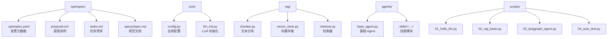
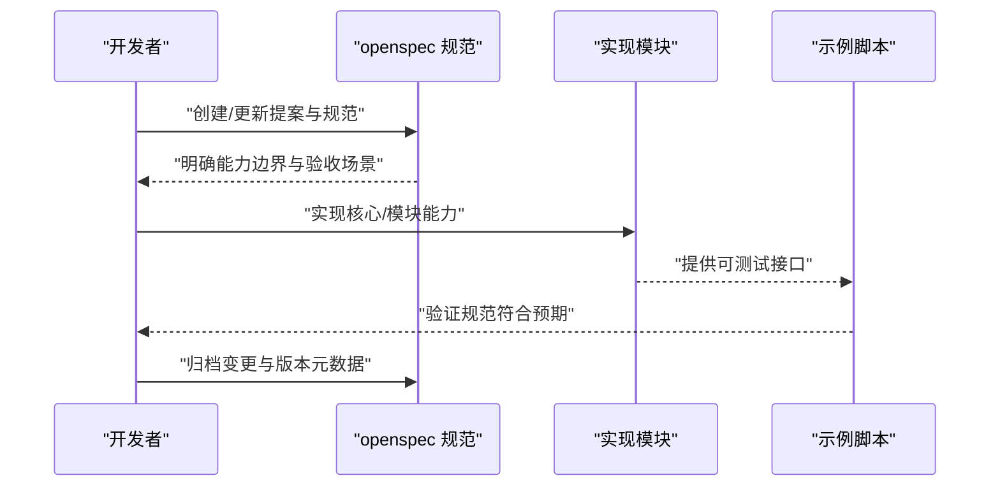
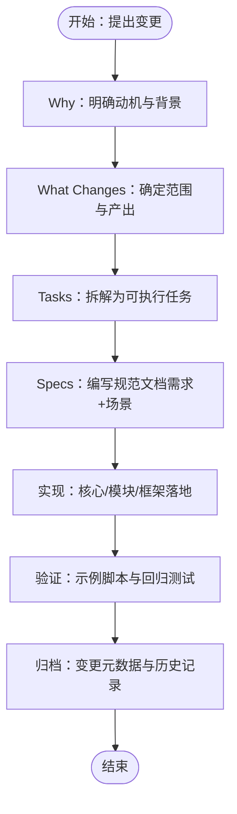
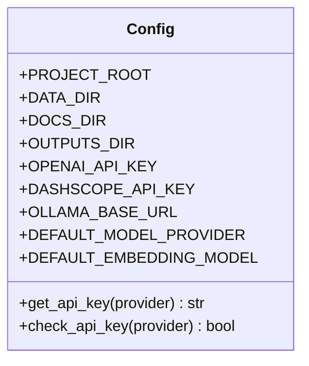
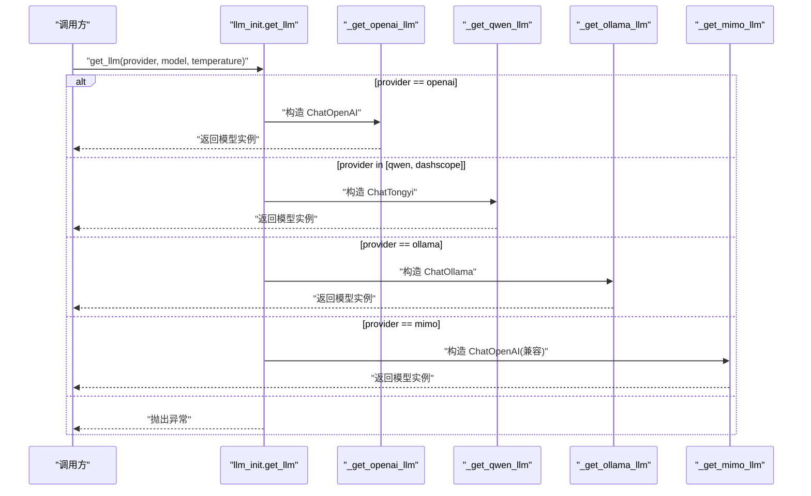
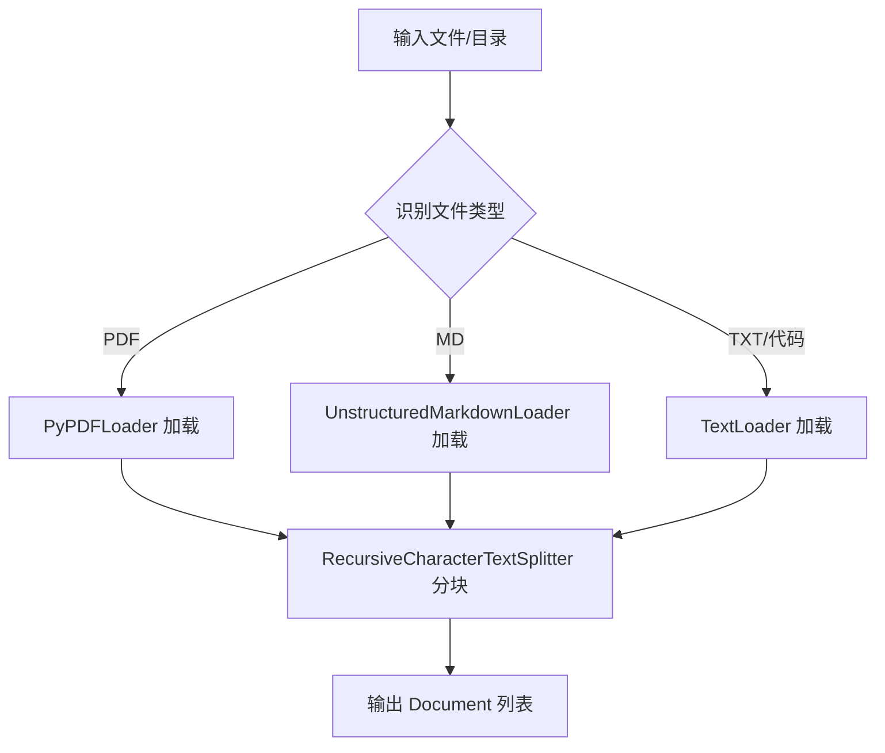
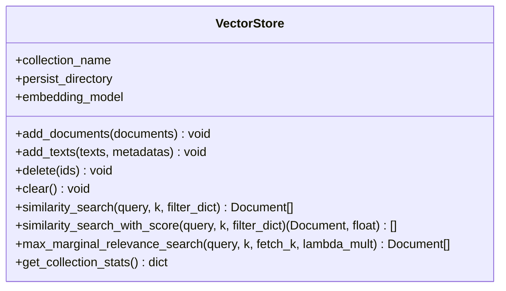
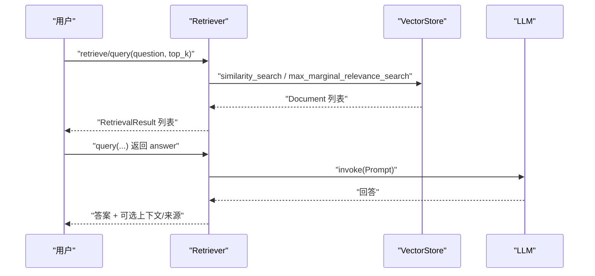
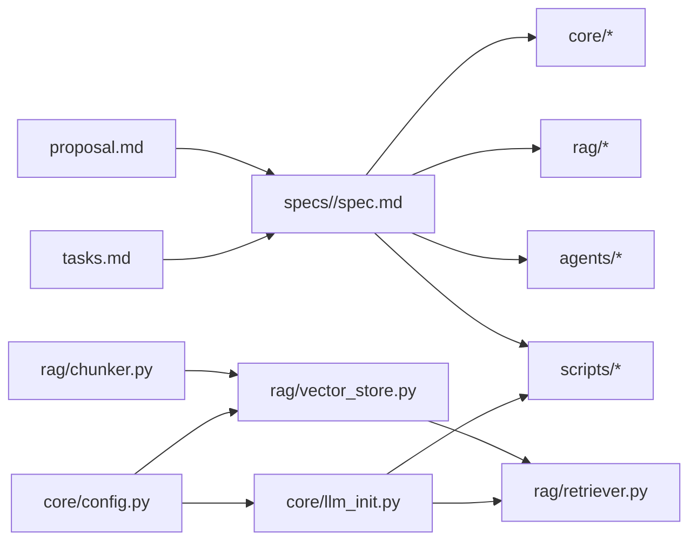

# 规格管理系统

<cite>
**本文引用的文件**
- [README.md](file://README.md)
- [openspec/config.yaml](file://openspec/config.yaml)
- [.openspec.yaml](file://openspec/changes/archive/2026-03-24-init-llm-project/.openspec.yaml)
- [proposal.md](file://openspec/changes/archive/2026-03-24-init-llm-project/proposal.md)
- [tasks.md](file://openspec/changes/archive/2026-03-24-init-llm-project/tasks.md)
- [spec.md（项目结构）](file://openspec/changes/archive/2026-03-24-init-llm-project/specs/project-structure/spec.md)
- [spec.md（核心模块）](file://openspec/changes/archive/2026-03-24-init-llm-project/specs/core-modules/spec.md)
- [spec.md（RAG 模块）](file://openspec/changes/archive/2026-03-24-init-llm-project/specs/rag-modules/spec.md)
- [spec.md（Agent 框架）](file://openspec/changes/archive/2026-03-24-init-llm-project/specs/agent-framework/spec.md)
- [spec.md（示例脚本）](file://openspec/changes/archive/2026-03-24-init-llm-project/specs/demo-scripts/spec.md)
- [config.py](file://core/config.py)
- [llm_init.py](file://core/llm_init.py)
- [chunker.py](file://rag/chunker.py)
- [vector_store.py](file://rag/vector_store.py)
- [retriever.py](file://rag/retriever.py)
</cite>

## 目录
1. [简介](#简介)
2. [项目结构](#项目结构)
3. [核心组件](#核心组件)
4. [架构总览](#架构总览)
5. [详细组件分析](#详细组件分析)
6. [依赖关系分析](#依赖关系分析)
7. [性能考量](#性能考量)
8. [故障排查指南](#故障排查指南)
9. [结论](#结论)
10. [附录](#附录)

## 简介
本文件为“规格管理系统”的技术文档，围绕 openspec 设计理念与实现机制展开，系统性阐述变更记录管理、版本控制策略、提案生命周期管理；解析项目规范文档的结构与用途（技术决策记录、架构演进跟踪、变更影响评估）；并总结配置管理系统的高级特性（动态配置更新、环境特定配置、配置验证机制）。同时提供规格文档的编写指南（标准格式、审批流程、发布策略），并结合仓库中的提案与变更记录示例，展示如何使用该系统进行项目治理与版本控制。

## 项目结构
该项目采用“功能域+规范驱动”的组织方式：
- openspec：规格与变更管理目录，包含变更归档、提案、任务清单与规范文档
- core：可复用核心能力（配置、LLM 初始化、Prompt 模板）
- rag：RAG 相关实现（分块、向量存储、检索器）
- agents：LangGraph Agent 框架与技能系统
- scripts：示例脚本与自动化测试
- README.md：项目说明与快速开始

图表来源
- [README.md:1-80](file://README.md#L1-L80)
- [openspec/changes/archive/2026-03-24-init-llm-project/.openspec.yaml:1-3](file://openspec/changes/archive/2026-03-24-init-llm-project/.openspec.yaml#L1-L3)
- [openspec/changes/archive/2026-03-24-init-llm-project/proposal.md:1-31](file://openspec/changes/archive/2026-03-24-init-llm-project/proposal.md#L1-L31)
- [openspec/changes/archive/2026-03-24-init-llm-project/tasks.md:1-42](file://openspec/changes/archive/2026-03-24-init-llm-project/tasks.md#L1-L42)
- [openspec/changes/archive/2026-03-24-init-llm-project/specs/project-structure/spec.md:1-42](file://openspec/changes/archive/2026-03-24-init-llm-project/specs/project-structure/spec.md#L1-L42)
- [openspec/changes/archive/2026-03-24-init-llm-project/specs/core-modules/spec.md:1-47](file://openspec/changes/archive/2026-03-24-init-llm-project/specs/core-modules/spec.md#L1-L47)
- [openspec/changes/archive/2026-03-24-init-llm-project/specs/rag-modules/spec.md:1-47](file://openspec/changes/archive/2026-03-24-init-llm-project/specs/rag-modules/spec.md#L1-L47)
- [openspec/changes/archive/2026-03-24-init-llm-project/specs/agent-framework/spec.md:1-31](file://openspec/changes/archive/2026-03-24-init-llm-project/specs/agent-framework/spec.md#L1-L31)
- [openspec/changes/archive/2026-03-24-init-llm-project/specs/demo-scripts/spec.md:1-42](file://openspec/changes/archive/2026-03-24-init-llm-project/specs/demo-scripts/spec.md#L1-L42)

章节来源
- [README.md:1-80](file://README.md#L1-L80)

## 核心组件
- 规格驱动配置（openspec/config.yaml）：定义项目上下文与特定制品的规则，支撑 AI 在生成产物时遵循约定。
- 变更元数据（.openspec.yaml）：记录变更创建时间与 schema 版本，确保变更可追溯。
- 提案（proposal.md）：说明变更动机、范围与能力影响，形成治理共识。
- 任务清单（tasks.md）：将提案拆解为可执行任务，便于跟踪与验收。
- 规范文档（specs/<artifact>/spec.md）：以“需求+场景”形式描述能力边界与行为契约，支撑设计评审与回归验证。

章节来源
- [openspec/config.yaml:1-21](file://openspec/config.yaml#L1-L21)
- [.openspec.yaml:1-3](file://openspec/changes/archive/2026-03-24-init-llm-project/.openspec.yaml#L1-L3)
- [proposal.md:1-31](file://openspec/changes/archive/2026-03-24-init-llm-project/proposal.md#L1-L31)
- [tasks.md:1-42](file://openspec/changes/archive/2026-03-24-init-llm-project/tasks.md#L1-L42)
- [spec.md（项目结构）:1-42](file://openspec/changes/archive/2026-03-24-init-llm-project/specs/project-structure/spec.md#L1-L42)
- [spec.md（核心模块）:1-47](file://openspec/changes/archive/2026-03-24-init-llm-project/specs/core-modules/spec.md#L1-L47)
- [spec.md（RAG 模块）:1-47](file://openspec/changes/archive/2026-03-24-init-llm-project/specs/rag-modules/spec.md#L1-L47)
- [spec.md（Agent 框架）:1-31](file://openspec/changes/archive/2026-03-24-init-llm-project/specs/agent-framework/spec.md#L1-L31)
- [spec.md（示例脚本）:1-42](file://openspec/changes/archive/2026-03-24-init-llm-project/specs/demo-scripts/spec.md#L1-L42)

## 架构总览
openspec 体系通过“提案—任务—规范—实现”的闭环，将治理与工程实践贯通：
- 提案阶段：明确 Why/What/Impact，产出能力清单与影响评估
- 任务阶段：将提案转化为可追踪的实施任务
- 规范阶段：以规范文档固化能力边界与行为契约
- 实现阶段：核心模块（core）、RAG 模块（rag）、Agent 框架（agents）与示例脚本（scripts）落地

图表来源
- [proposal.md:1-31](file://openspec/changes/archive/2026-03-24-init-llm-project/proposal.md#L1-L31)
- [tasks.md:1-42](file://openspec/changes/archive/2026-03-24-init-llm-project/tasks.md#L1-L42)
- [spec.md（核心模块）:1-47](file://openspec/changes/archive/2026-03-24-init-llm-project/specs/core-modules/spec.md#L1-L47)
- [spec.md（RAG 模块）:1-47](file://openspec/changes/archive/2026-03-24-init-llm-project/specs/rag-modules/spec.md#L1-L47)
- [spec.md（Agent 框架）:1-31](file://openspec/changes/archive/2026-03-24-init-llm-project/specs/agent-framework/spec.md#L1-L31)
- [spec.md（示例脚本）:1-42](file://openspec/changes/archive/2026-03-24-init-llm-project/specs/demo-scripts/spec.md#L1-L42)

## 详细组件分析

### 开源规范与变更管理（openspec）
- 设计理念
  - 规格驱动：通过 config.yaml 定义上下文与规则，使 AI 生成产物符合团队约定
  - 变更归档：以日期命名的变更目录保存提案、任务与规范，形成可追溯的历史
  - 生命周期：从提案到任务再到规范与实现，闭环治理
- 关键文件
  - openspec/config.yaml：项目上下文与制品规则
  - .openspec.yaml：变更元数据（schema、创建时间）
  - proposal.md：变更动机、范围与能力影响
  - tasks.md：实施任务分解与完成状态
  - specs/<artifact>/spec.md：能力需求与验收场景

图表来源
- [proposal.md:1-31](file://openspec/changes/archive/2026-03-24-init-llm-project/proposal.md#L1-L31)
- [tasks.md:1-42](file://openspec/changes/archive/2026-03-24-init-llm-project/tasks.md#L1-L42)
- [.openspec.yaml:1-3](file://openspec/changes/archive/2026-03-24-init-llm-project/.openspec.yaml#L1-L3)
- [openspec/config.yaml:1-21](file://openspec/config.yaml#L1-L21)

章节来源
- [openspec/config.yaml:1-21](file://openspec/config.yaml#L1-L21)
- [.openspec.yaml:1-3](file://openspec/changes/archive/2026-03-24-init-llm-project/.openspec.yaml#L1-L3)
- [proposal.md:1-31](file://openspec/changes/archive/2026-03-24-init-llm-project/proposal.md#L1-L31)
- [tasks.md:1-42](file://openspec/changes/archive/2026-03-24-init-llm-project/tasks.md#L1-L42)

### 核心配置系统（core/config.py）
- 功能要点
  - 环境变量加载与校验：自动从 .env 加载密钥与服务地址
  - 路径管理：项目根、数据、输出目录的统一管理与自动创建
  - API Key 与 Provider 配置：支持多提供商（OpenAI、通义千问、Ollama、MiMo）
  - 默认模型与嵌入模型：提供默认值，便于快速上手
- 验证机制
  - 提供 get_api_key 与 check_api_key，便于在初始化前进行可用性检查

图表来源
- [config.py:1-68](file://core/config.py#L1-L68)

章节来源
- [config.py:1-68](file://core/config.py#L1-L68)

### LLM 初始化系统（core/llm_init.py）
- 功能要点
  - 统一入口：get_llm(provider, model, temperature, **kwargs)
  - 多提供商适配：OpenAI、通义千问、Ollama、MiMo
  - 嵌入模型：get_embedding_model 支持 HuggingFaceEmbeddings
  - 异常处理：对未配置的 API Key 进行显式报错
- 设计优势
  - 低耦合：通过 provider 参数切换实现
  - 易扩展：新增提供商只需在内部分支中补充

图表来源
- [llm_init.py:18-131](file://core/llm_init.py#L18-L131)
- [config.py:24-46](file://core/config.py#L24-L46)

章节来源
- [llm_init.py:18-131](file://core/llm_init.py#L18-L131)
- [config.py:24-46](file://core/config.py#L24-L46)

### 文本分块系统（rag/chunker.py）
- 功能要点
  - 多策略分块：字符数分块、递归分块、重叠分块
  - 多格式加载：txt、pdf、md 等
  - 目录批量处理：支持目录扫描与批量分块
- 场景化能力
  - 支持按需调整 chunk_size 与重叠，平衡召回与上下文长度

图表来源
- [chunker.py:112-175](file://rag/chunker.py#L112-L175)

章节来源
- [chunker.py:112-175](file://rag/chunker.py#L112-L175)

### 向量存储系统（rag/vector_store.py）
- 功能要点
  - 基于 FAISS 的封装：支持懒加载、持久化、增量添加
  - 增强能力：相似度搜索、带分数搜索、MMR 搜索
  - 清理与统计：支持删除标记、清空集合、统计信息
- 性能与限制
  - FAISS 原生不支持按 ID 删除，采用标记删除并保存索引
  - 过滤通过后处理实现，复杂过滤建议在上层聚合后再检索

图表来源
- [vector_store.py:13-252](file://rag/vector_store.py#L13-L252)

章节来源
- [vector_store.py:13-252](file://rag/vector_store.py#L13-L252)

### 检索器系统（rag/retriever.py）
- 功能要点
  - 统一封装：相似度检索、带分数检索、MMR 检索
  - 结果格式化：支持带分数的上下文拼接
  - RAG 链：将检索与 LLM 串联，支持返回上下文与来源
- 与向量存储协作
  - 通过 VectorStore 的多种检索策略，满足不同召回与多样性需求

图表来源
- [retriever.py:17-203](file://rag/retriever.py#L17-L203)
- [vector_store.py:116-218](file://rag/vector_store.py#L116-L218)

章节来源
- [retriever.py:17-203](file://rag/retriever.py#L17-L203)
- [vector_store.py:116-218](file://rag/vector_store.py#L116-L218)

### 示例脚本与规范对照（scripts 与 specs 对照）
- 示例脚本覆盖
  - Hello LLM：环境变量加载、LLM 初始化、简单对话
  - RAG 基础：文档加载、向量存储、检索与问答
  - Agent：Agent 创建、工具注册、多步任务执行
  - 自动化测试：LLM 生成测试用例、执行与报告
- 规范对照
  - 每个脚本与其对应规范（specs/<artifact>/spec.md）一一对应，确保行为可验证

章节来源
- [spec.md（示例脚本）:1-42](file://openspec/changes/archive/2026-03-24-init-llm-project/specs/demo-scripts/spec.md#L1-L42)

## 依赖关系分析
- 规格到实现的依赖
  - 规范文档（specs）约束实现模块（core/rag/agents/scripts）
  - 提案与任务（proposal/tasks）驱动规范与实现的迭代
- 实现模块间的依赖
  - rag/chunker.py 为 rag/vector_store.py 与 rag/retriever.py 提供输入
  - core/llm_init.py 为 rag/retriever.py 与 scripts 提供 LLM 能力
  - core/config.py 为上述模块提供统一的配置与校验

图表来源
- [proposal.md:1-31](file://openspec/changes/archive/2026-03-24-init-llm-project/proposal.md#L1-L31)
- [tasks.md:1-42](file://openspec/changes/archive/2026-03-24-init-llm-project/tasks.md#L1-L42)
- [spec.md（项目结构）:1-42](file://openspec/changes/archive/2026-03-24-init-llm-project/specs/project-structure/spec.md#L1-L42)
- [spec.md（核心模块）:1-47](file://openspec/changes/archive/2026-03-24-init-llm-project/specs/core-modules/spec.md#L1-L47)
- [spec.md（RAG 模块）:1-47](file://openspec/changes/archive/2026-03-24-init-llm-project/specs/rag-modules/spec.md#L1-L47)
- [spec.md（Agent 框架）:1-31](file://openspec/changes/archive/2026-03-24-init-llm-project/specs/agent-framework/spec.md#L1-L31)
- [spec.md（示例脚本）:1-42](file://openspec/changes/archive/2026-03-24-init-llm-project/specs/demo-scripts/spec.md#L1-L42)
- [chunker.py:112-175](file://rag/chunker.py#L112-L175)
- [vector_store.py:13-252](file://rag/vector_store.py#L13-L252)
- [retriever.py:17-203](file://rag/retriever.py#L17-L203)
- [llm_init.py:18-131](file://core/llm_init.py#L18-L131)
- [config.py:1-68](file://core/config.py#L1-L68)

章节来源
- [chunker.py:112-175](file://rag/chunker.py#L112-L175)
- [vector_store.py:13-252](file://rag/vector_store.py#L13-L252)
- [retriever.py:17-203](file://rag/retriever.py#L17-L203)
- [llm_init.py:18-131](file://core/llm_init.py#L18-L131)
- [config.py:1-68](file://core/config.py#L1-L68)

## 性能考量
- 向量检索
  - 相似度搜索与 MMR 搜索的时间复杂度与 top_k、fetch_k 参数密切相关
  - 建议在大规模集合上优先使用 MMR 以提升多样性
- 分块策略
  - 合理设置 chunk_size 与重叠，避免过小导致上下文碎片化或过大导致检索稀疏
- 持久化与懒加载
  - 向量存储采用懒加载与本地持久化，减少冷启动开销
- API Key 与网络调用
  - 在初始化阶段尽早校验 API Key，避免运行期失败

## 故障排查指南
- API Key 未配置
  - 现象：初始化 LLM 抛出未配置错误
  - 排查：检查 .env 中对应 Provider 的 KEY 是否正确
  - 参考：[llm_init.py:50-108](file://core/llm_init.py#L50-L108)，[config.py:24-46](file://core/config.py#L24-L46)
- 向量索引缺失或损坏
  - 现象：相似度搜索返回空或异常
  - 排查：确认 persist_directory 下的索引文件是否存在；必要时清空后重建
  - 参考：[vector_store.py:38-58](file://rag/vector_store.py#L38-L58)，[vector_store.py:108-115](file://rag/vector_store.py#L108-L115)
- 检索结果过滤无效
  - 现象：filter_dict 未生效
  - 说明：FAISS 原生不支持过滤，当前实现为后处理过滤，复杂过滤建议在上层聚合
  - 参考：[vector_store.py:136-151](file://rag/vector_store.py#L136-L151)，[vector_store.py:173-188](file://rag/vector_store.py#L173-L188)
- 示例脚本无法运行
  - 现象：脚本报错或无输出
  - 排查：确认依赖安装、环境变量配置、数据/输出目录权限
  - 参考：[README.md:43-80](file://README.md#L43-L80)

章节来源
- [llm_init.py:50-108](file://core/llm_init.py#L50-L108)
- [config.py:24-46](file://core/config.py#L24-L46)
- [vector_store.py:38-58](file://rag/vector_store.py#L38-L58)
- [vector_store.py:108-115](file://rag/vector_store.py#L108-L115)
- [vector_store.py:136-151](file://rag/vector_store.py#L136-L151)
- [vector_store.py:173-188](file://rag/vector_store.py#L173-L188)
- [README.md:43-80](file://README.md#L43-L80)

## 结论
本项目通过 openspec 将“治理—规范—实现”有机融合，形成可追溯、可验证、可演进的规格管理体系。核心模块（core）、RAG 模块（rag）、Agent 框架（agents）与示例脚本（scripts）在统一配置与 LLM 初始化能力下协同工作，既满足快速原型开发，又具备工程化落地的稳定性。建议在后续迭代中持续完善规范文档与示例脚本，强化变更影响评估与回归测试，进一步提升项目的可维护性与可扩展性。

## 附录

### 规格文档编写指南
- 标准格式
  - 需求段落：明确“能力要求 + 场景 + 验收条件”
  - 场景段落：以“当…则…”描述输入、触发与期望输出
- 审批流程
  - 提案阶段：由提出者撰写 proposal.md 并在团队内评审
  - 任务阶段：将提案拆解为 tasks.md，明确责任人与里程碑
  - 规范阶段：编写 specs/<artifact>/spec.md，纳入设计评审
  - 实现阶段：实现与测试并行，确保规范可验证
- 发布策略
  - 变更归档：以日期命名目录，保留 proposal、tasks、spec 与实现
  - 版本控制：通过 .openspec.yaml 记录创建时间与 schema，便于回溯

章节来源
- [proposal.md:1-31](file://openspec/changes/archive/2026-03-24-init-llm-project/proposal.md#L1-L31)
- [tasks.md:1-42](file://openspec/changes/archive/2026-03-24-init-llm-project/tasks.md#L1-L42)
- [.openspec.yaml:1-3](file://openspec/changes/archive/2026-03-24-init-llm-project/.openspec.yaml#L1-L3)
- [spec.md（项目结构）:1-42](file://openspec/changes/archive/2026-03-24-init-llm-project/specs/project-structure/spec.md#L1-L42)
- [spec.md（核心模块）:1-47](file://openspec/changes/archive/2026-03-24-init-llm-project/specs/core-modules/spec.md#L1-L47)
- [spec.md（RAG 模块）:1-47](file://openspec/changes/archive/2026-03-24-init-llm-project/specs/rag-modules/spec.md#L1-L47)
- [spec.md（Agent 框架）:1-31](file://openspec/changes/archive/2026-03-24-init-llm-project/specs/agent-framework/spec.md#L1-L31)
- [spec.md（示例脚本）:1-42](file://openspec/changes/archive/2026-03-24-init-llm-project/specs/demo-scripts/spec.md#L1-L42)

### 变更记录与提案示例
- 变更记录
  - 归档目录：openspec/changes/archive/<date>-<slug>/
  - 元数据：.openspec.yaml（schema、created）
  - 内容：proposal.md、tasks.md、specs/<artifact>/spec.md
- 提案示例
  - 本次初始化提案：明确项目结构、核心模块、RAG 模块、Agent 框架与示例脚本的范围与影响
  - 任务示例：将提案拆解为具体任务，标注完成状态，便于跟踪

章节来源
- [.openspec.yaml:1-3](file://openspec/changes/archive/2026-03-24-init-llm-project/.openspec.yaml#L1-L3)
- [proposal.md:1-31](file://openspec/changes/archive/2026-03-24-init-llm-project/proposal.md#L1-L31)
- [tasks.md:1-42](file://openspec/changes/archive/2026-03-24-init-llm-project/tasks.md#L1-L42)
- [spec.md（项目结构）:1-42](file://openspec/changes/archive/2026-03-24-init-llm-project/specs/project-structure/spec.md#L1-L42)
- [spec.md（核心模块）:1-47](file://openspec/changes/archive/2026-03-24-init-llm-project/specs/core-modules/spec.md#L1-L47)
- [spec.md（RAG 模块）:1-47](file://openspec/changes/archive/2026-03-24-init-llm-project/specs/rag-modules/spec.md#L1-L47)
- [spec.md（Agent 框架）:1-31](file://openspec/changes/archive/2026-03-24-init-llm-project/specs/agent-framework/spec.md#L1-L31)
- [spec.md（示例脚本）:1-42](file://openspec/changes/archive/2026-03-24-init-llm-project/specs/demo-scripts/spec.md#L1-L42)