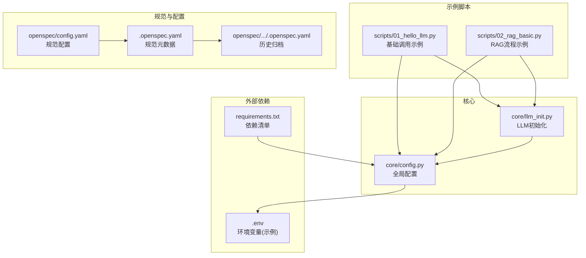
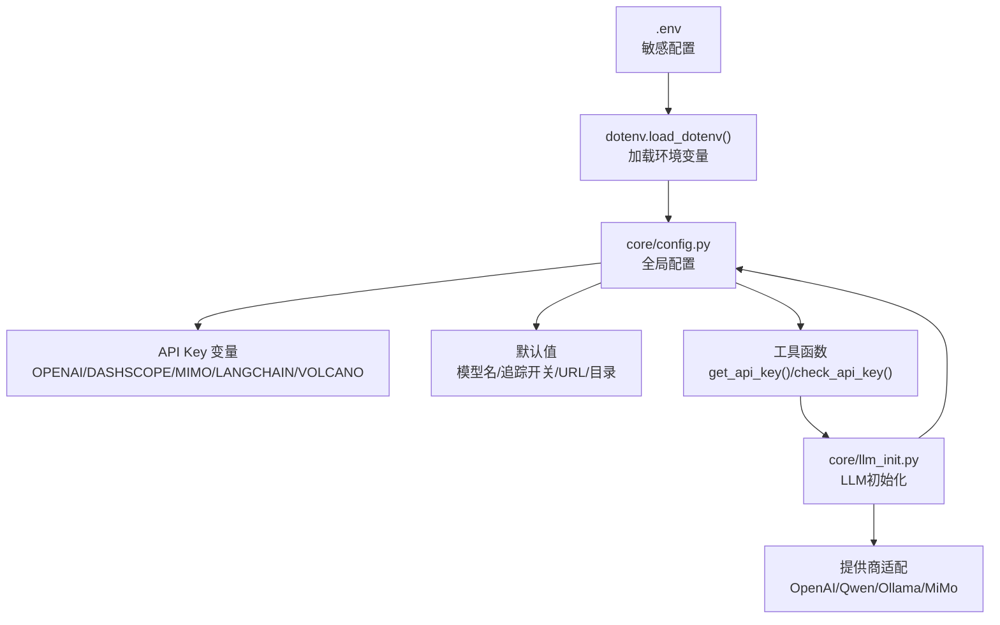
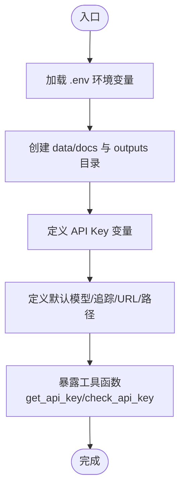
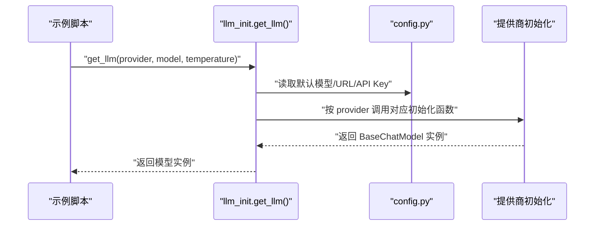
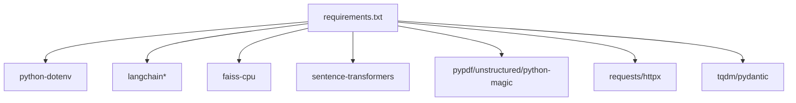

# 配置管理系统

<cite>
**本文引用的文件**
- [core/config.py](file://core/config.py)
- [core/llm_init.py](file://core/llm_init.py)
- [scripts/01_hello_llm.py](file://scripts/01_hello_llm.py)
- [scripts/02_rag_basic.py](file://scripts/02_rag_basic.py)
- [README.md](file://README.md)
- [requirements.txt](file://requirements.txt)
- [openspec/config.yaml](file://openspec/config.yaml)
- [openspec/.openspec.yaml](file://openspec/.openspec.yaml)
- [openspec/changes/archive/2026-03-24-init-llm-project/.openspec.yaml](file://openspec/changes/archive/2026-03-24-init-llm-project/.openspec.yaml)
</cite>

## 目录
1. [简介](#简介)
2. [项目结构](#项目结构)
3. [核心组件](#核心组件)
4. [架构总览](#架构总览)
5. [详细组件分析](#详细组件分析)
6. [依赖分析](#依赖分析)
7. [性能考虑](#性能考虑)
8. [故障排除指南](#故障排除指南)
9. [结论](#结论)
10. [附录](#附录)

## 简介
本项目是一个基于 Python 的 LLM 学习与实践项目，配置管理系统围绕全局配置模块设计，采用环境变量驱动的配置加载机制，支持多提供商模型（OpenAI、通义千问、Ollama、MiMo）以及 LangSmith 追踪、向量存储等核心能力。系统通过统一的配置模块集中管理 API Key、默认模型、目录结构与基础 URL，并提供便捷的 API Key 校验与获取工具，确保在不同环境中快速切换与安全隔离。

## 项目结构
项目采用按功能域划分的组织方式：
- core：核心可复用模块，包含全局配置与 LLM 统一初始化
- rag：RAG 相关组件（文本分块、向量存储、检索器）
- agents：LangGraph Agent 基础类与技能
- scripts：示例脚本，演示基础 LLM 调用与 RAG 流程
- openspec：规范驱动开发相关配置与变更归档
- 根目录：README、依赖清单、数据与输出目录

图表来源
- [core/config.py:1-68](file://core/config.py#L1-L68)
- [core/llm_init.py:1-131](file://core/llm_init.py#L1-L131)
- [scripts/01_hello_llm.py:1-95](file://scripts/01_hello_llm.py#L1-L95)
- [scripts/02_rag_basic.py:1-149](file://scripts/02_rag_basic.py#L1-L149)
- [openspec/config.yaml:1-21](file://openspec/config.yaml#L1-L21)
- [openspec/.openspec.yaml:1-3](file://openspec/.openspec.yaml#L1-L3)
- [openspec/changes/archive/2026-03-24-init-llm-project/.openspec.yaml:1-3](file://openspec/changes/archive/2026-03-24-init-llm-project/.openspec.yaml#L1-L3)
- [requirements.txt:1-34](file://requirements.txt#L1-L34)

章节来源
- [README.md:1-80](file://README.md#L1-L80)

## 核心组件
- 全局配置模块：负责环境变量加载、目录结构初始化、API Key 与默认模型配置、LangSmith 追踪开关、Ollama 基础 URL、MiMo 基础 URL 与向量存储路径等
- LLM 统一初始化模块：根据提供商动态选择模型初始化路径，校验必要 API Key，封装 OpenAI、通义千问、Ollama、MiMo 的接入
- 示例脚本：展示配置在实际业务中的使用，包括基础调用与 RAG 流程

章节来源
- [core/config.py:1-68](file://core/config.py#L1-L68)
- [core/llm_init.py:1-131](file://core/llm_init.py#L1-L131)
- [scripts/01_hello_llm.py:1-95](file://scripts/01_hello_llm.py#L1-L95)
- [scripts/02_rag_basic.py:1-149](file://scripts/02_rag_basic.py#L1-L149)

## 架构总览
配置系统采用“环境变量驱动 + 默认值 + 工具函数”的三层设计：
- 环境变量层：通过 dotenv 加载 .env 文件，提供敏感信息与运行时参数
- 默认值层：在配置模块中为可选参数提供合理默认值，降低配置复杂度
- 工具函数层：提供 API Key 获取与校验、目录创建等辅助能力，保证模块间解耦

图表来源
- [core/config.py:1-68](file://core/config.py#L1-L68)
- [core/llm_init.py:1-131](file://core/llm_init.py#L1-L131)

## 详细组件分析

### 全局配置模块（core/config.py）
- 环境变量加载：启动时自动加载 .env 文件，确保后续通过 os.getenv 获取的值来自真实环境
- 目录结构：自动创建 data/docs 与 outputs 目录，确保运行时文件系统可用
- API Key 管理：集中声明多个提供商的 API Key 变量，便于统一访问与校验
- 追踪与项目：LangSmith 追踪开关与项目名，支持可选配置
- 服务端点：Ollama 与 MiMo 的基础 URL 提供默认值，便于本地或第三方对接
- 默认模型：为各提供商提供默认模型名，简化调用方参数传递
- 向量存储：FAISS 向量存储路径与默认中文嵌入模型名
- 工具函数：
  - get_api_key(provider)：按提供商返回对应 API Key
  - check_api_key(provider)：判断提供商 API Key 是否已配置

图表来源
- [core/config.py:1-68](file://core/config.py#L1-L68)

章节来源
- [core/config.py:1-68](file://core/config.py#L1-L68)

### LLM 统一初始化模块（core/llm_init.py）
- 提供器选择：根据 provider 参数选择初始化路径，支持 openai、qwen/dashscope、ollama、mimo
- API Key 校验：对需要密钥的提供商进行前置校验，避免运行时报错
- 模型封装：分别封装 OpenAI、通义千问、Ollama、MiMo 的初始化逻辑，统一返回 LangChain 聊天模型实例
- 嵌入模型：提供默认中文嵌入模型，支持 CPU 设备与向量归一化

图表来源
- [core/llm_init.py:18-108](file://core/llm_init.py#L18-L108)
- [core/config.py:24-46](file://core/config.py#L24-L46)

章节来源
- [core/llm_init.py:1-131](file://core/llm_init.py#L1-L131)

### 示例脚本中的配置使用（scripts/01_hello_llm.py、scripts/02_rag_basic.py）
- 基础调用：展示如何通过 check_api_key 判断提供商可用性，并在不可用时回退到本地 Ollama
- RAG 流程：在 RAG 场景中同样遵循相同的 API Key 校验与提供商选择逻辑，确保流程一致性

章节来源
- [scripts/01_hello_llm.py:15-95](file://scripts/01_hello_llm.py#L15-L95)
- [scripts/02_rag_basic.py:44-149](file://scripts/02_rag_basic.py#L44-L149)

### 规范驱动配置（openspec/config.yaml 与 .openspec.yaml）
- 规范驱动：通过 schema 字段声明规范驱动开发模式，确保项目结构与生成物的一致性
- 上下文与规则：可在 config.yaml 中定义项目上下文与特定产物的规则，便于团队协作与质量控制
- 历史归档：.openspec.yaml 记录创建时间与版本信息，便于追溯与审计

章节来源
- [openspec/config.yaml:1-21](file://openspec/config.yaml#L1-L21)
- [openspec/.openspec.yaml:1-3](file://openspec/.openspec.yaml#L1-L3)
- [openspec/changes/archive/2026-03-24-init-llm-project/.openspec.yaml:1-3](file://openspec/changes/archive/2026-03-24-init-llm-project/.openspec.yaml#L1-L3)

## 依赖分析
- 环境变量加载：python-dotenv 提供 .env 文件解析能力
- LLM 生态：langchain、langchain-community、langchain-openai 等提供模型与链式调用能力
- 向量存储：faiss-cpu 提供本地向量检索能力
- 嵌入模型：sentence-transformers 提供文本嵌入能力
- 文档处理：pypdf、unstructured、python-magic 提供多格式文档加载
- HTTP 客户端：requests、httpx 提供网络请求能力
- 工具库：tqdm、pydantic 提供进度与数据校验能力

图表来源
- [requirements.txt:1-34](file://requirements.txt#L1-L34)

章节来源
- [requirements.txt:1-34](file://requirements.txt#L1-L34)

## 性能考虑
- 目录预创建：在配置模块中一次性创建所需目录，避免运行时频繁 IO
- 默认值缓存：将默认模型名、URL 等常量定义在模块级，减少重复计算
- 条件初始化：仅在需要时导入具体提供商模块，降低启动开销
- 嵌入模型优化：CPU 设备与向量归一化参数在配置中固定，确保一致的性能特征

## 故障排除指南
- API Key 未配置
  - 现象：初始化提供商时报错，提示未配置相应 API Key
  - 排查：检查 .env 文件是否包含对应 PROVIDER_API_KEY；确认环境变量已加载
  - 处理：在 .env 中填入正确的密钥，或在运行前导出环境变量
- Ollama 本地服务未启动
  - 现象：使用 ollama 提供商时报连接错误
  - 排查：确认本地 Ollama 服务已启动，且 OLLAMA_BASE_URL 指向正确地址
  - 处理：启动 Ollama 服务或调整基础 URL
- LangSmith 追踪异常
  - 现象：追踪功能未生效
  - 排查：检查 LANGCHAIN_TRACING_V2 是否为 true，LANGCHAIN_PROJECT 是否正确
  - 处理：按需开启追踪或修正项目名
- 目录权限问题
  - 现象：无法写入 data/docs 或 outputs
  - 排查：确认当前用户对项目目录具有读写权限
  - 处理：修改目录权限或以管理员身份运行

章节来源
- [core/llm_init.py:50-108](file://core/llm_init.py#L50-L108)
- [core/config.py:31-36](file://core/config.py#L31-L36)

## 结论
本配置管理系统通过环境变量驱动与默认值策略，实现了跨环境的灵活部署与安全隔离。配合统一的 LLM 初始化模块与工具函数，显著降低了配置复杂度与使用门槛。建议在生产环境中严格管理 .env 文件，定期备份与轮换密钥，并结合规范驱动配置提升团队协作效率。

## 附录

### 配置优先级策略
- 环境变量优先：os.getenv 会优先读取系统环境变量，其次读取 .env 文件中的键值
- 默认值兜底：当环境变量未设置时，使用配置模块中提供的默认值
- 运行时覆盖：可通过 setenv 或直接赋值临时覆盖，但不建议长期使用

章节来源
- [core/config.py:6-7](file://core/config.py#L6-L7)
- [core/config.py:25-46](file://core/config.py#L25-L46)

### 配置验证规则
- API Key 校验：通过 check_api_key(provider) 判断是否已配置
- 运行时校验：在初始化提供商时再次校验必要字段，确保可用性
- 建议：在 CI/CD 中增加配置检查步骤，防止部署失败

章节来源
- [core/config.py:53-67](file://core/config.py#L53-L67)
- [core/llm_init.py:50-108](file://core/llm_init.py#L50-L108)

### 扩展机制
- 添加新的提供商
  - 在配置模块中新增 API Key 变量与默认值
  - 在 LLM 初始化模块中添加对应的初始化函数与分支逻辑
  - 在示例脚本中补充使用说明与回退策略
- 配置热更新
  - 当前实现为模块级常量，不支持运行时热更新
  - 建议通过外部配置中心或重载模块的方式实现热更新
- 配置加密存储
  - 建议使用环境变量或密钥管理服务（如 AWS Secrets Manager、Vault）存储敏感信息
  - 对于本地开发，可使用 .env 文件，但务必加入 .gitignore

章节来源
- [core/config.py:24-46](file://core/config.py#L24-L46)
- [core/llm_init.py:18-108](file://core/llm_init.py#L18-L108)
- [README.md:49-54](file://README.md#L49-L54)

### 最佳实践
- 敏感信息保护
  - 将 .env 文件加入 .gitignore，不在版本库中提交
  - 使用只读权限限制 .env 文件访问
- 配置备份与恢复
  - 定期备份 .env 文件与关键配置
  - 在新环境部署时，先恢复配置再启动服务
- 配置迁移策略
  - 新增配置项时，提供默认值并兼容旧版本
  - 通过环境变量与配置文件双通道，平滑过渡

章节来源
- [README.md:75-80](file://README.md#L75-L80)

### 实际配置示例与使用场景
- 基础 LLM 调用
  - 选择提供商：openai/qwen/ollama
  - API Key 校验：使用 check_api_key(provider) 判断可用性
  - 回退策略：若 API Key 未配置则回退到本地 Ollama
- RAG 流程
  - 与基础调用相同，额外涉及向量存储与检索器初始化
  - 建议在 RAG 场景中优先使用本地 Ollama 以降低外部依赖风险

章节来源
- [scripts/01_hello_llm.py:15-95](file://scripts/01_hello_llm.py#L15-L95)
- [scripts/02_rag_basic.py:44-149](file://scripts/02_rag_basic.py#L44-L149)