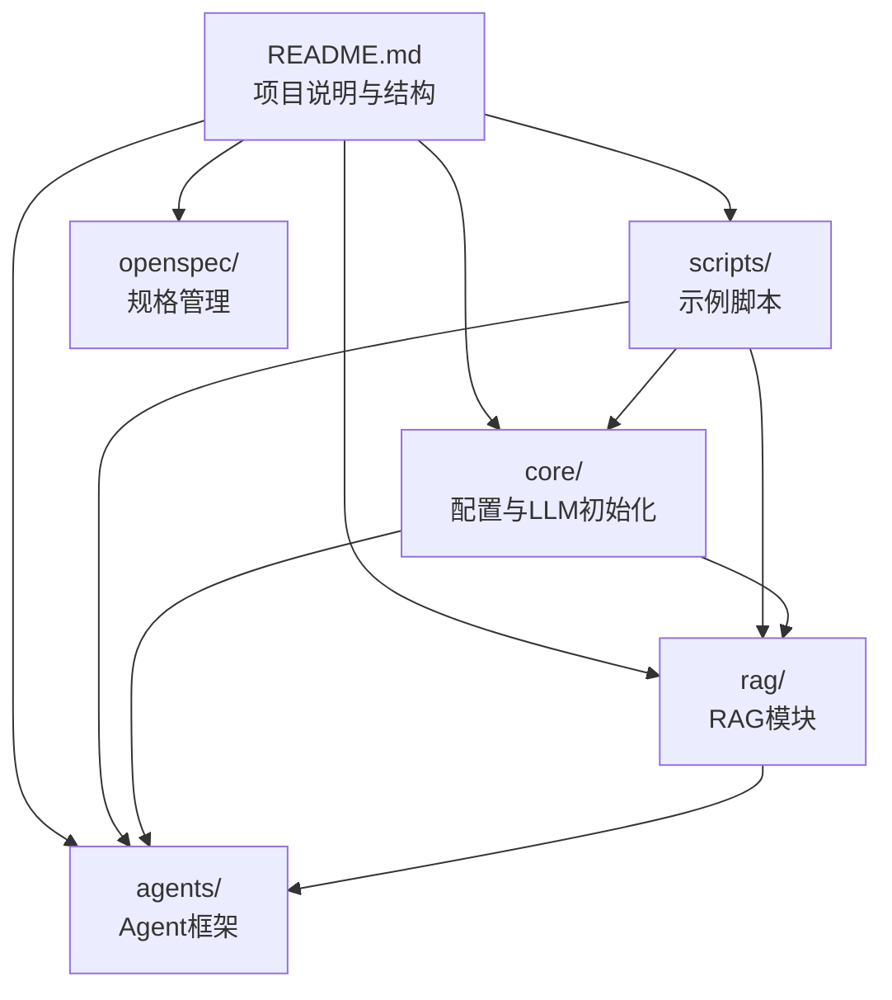
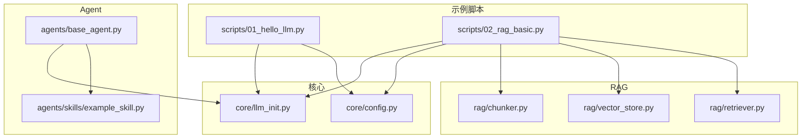
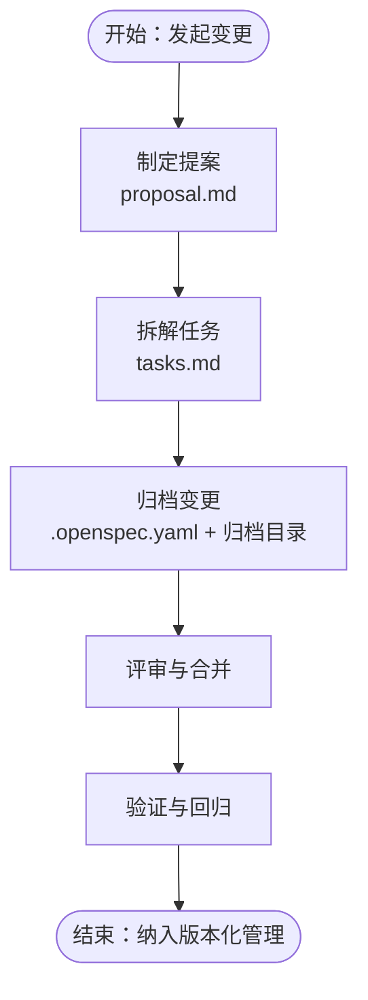
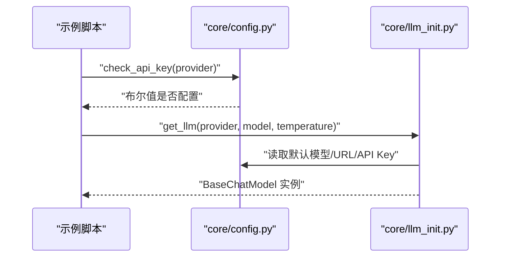
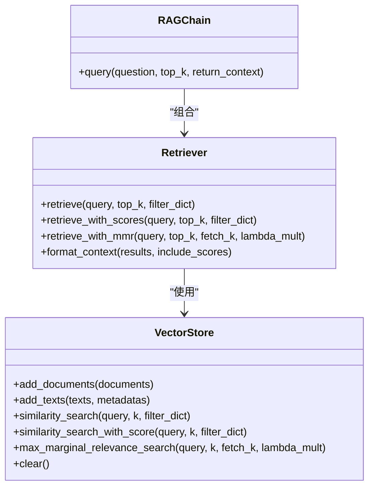
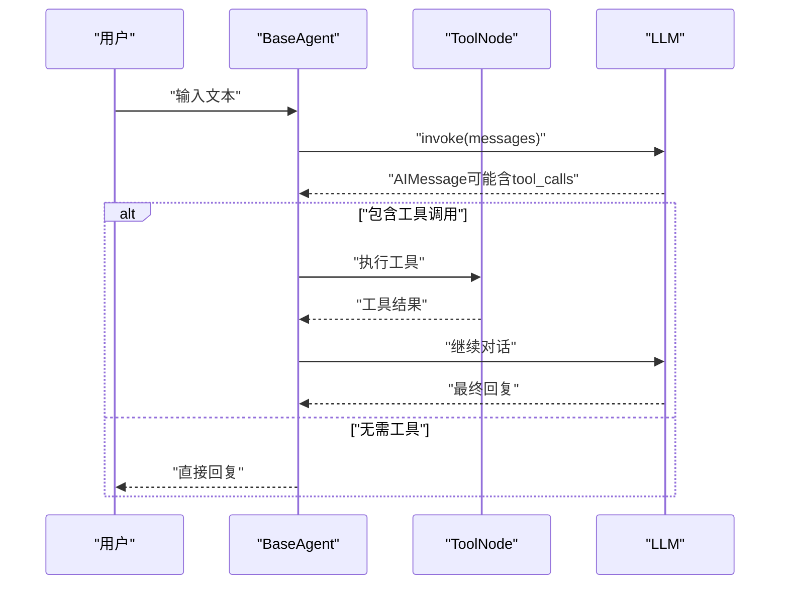
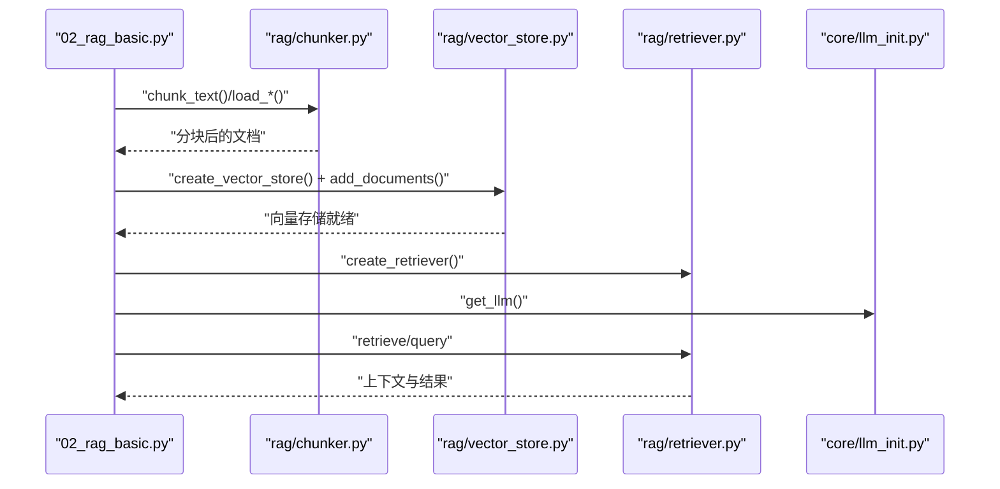
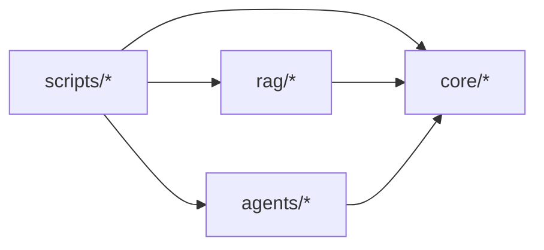

# 高级功能特性

<cite>
**本文引用的文件**
- [README.md](file://README.md)
- [openspec/config.yaml](file://openspec/config.yaml)
- [openspec/changes/archive/2026-03-24-init-llm-project/.openspec.yaml](file://openspec/changes/archive/2026-03-24-init-llm-project/.openspec.yaml)
- [openspec/changes/archive/2026-03-24-init-llm-project/proposal.md](file://openspec/changes/archive/2026-03-24-init-llm-project/proposal.md)
- [openspec/changes/archive/2026-03-24-init-llm-project/tasks.md](file://openspec/changes/archive/2026-03-24-init-llm-project/tasks.md)
- [core/config.py](file://core/config.py)
- [core/llm_init.py](file://core/llm_init.py)
- [scripts/01_hello_llm.py](file://scripts/01_hello_llm.py)
- [scripts/02_rag_basic.py](file://scripts/02_rag_basic.py)
- [rag/chunker.py](file://rag/chunker.py)
- [rag/vector_store.py](file://rag/vector_store.py)
- [rag/retriever.py](file://rag/retriever.py)
- [agents/base_agent.py](file://agents/base_agent.py)
- [agents/skills/example_skill.py](file://agents/skills/example_skill.py)
</cite>

## 目录
1. [简介](#简介)
2. [项目结构](#项目结构)
3. [核心组件](#核心组件)
4. [架构总览](#架构总览)
5. [详细组件分析](#详细组件分析)
6. [依赖关系分析](#依赖关系分析)
7. [性能考量](#性能考量)
8. [故障排查指南](#故障排查指南)
9. [结论](#结论)
10. [附录](#附录)

## 简介
本项目围绕“高级功能特性”展开，重点覆盖以下方面：
- 规格管理系统（openspec）：以变更记录、版本控制、提案管理为核心的规范驱动实践，确保项目演进可追踪、可审计。
- 项目规范文档：技术决策记录与架构演进跟踪，支撑团队共识与知识沉淀。
- 配置管理系统：动态配置更新、环境特定配置、配置验证，保障多环境一致性与安全性。
- 扩展开发指南：新功能集成、第三方服务接入、性能优化策略。
- 代码审查与质量保证：流程与标准，配合持续集成配置。
- 企业级部署：安全与合规指导。

本文件在不泄露具体代码内容的前提下，对上述主题进行系统化、可视化、可操作的说明，并提供与仓库实际文件一一对应的来源标注。

## 项目结构
项目采用“功能域+层次化”的组织方式，核心模块包括：
- core：统一配置与 LLM 初始化
- rag：RAG 相关的文本分块、向量存储、检索器
- agents：LangGraph Agent 基础类与技能系统
- scripts：示例脚本，演示基础 LLM 调用、RAG、Agent、自动化测试
- openspec：规格管理与变更记录，包含提案、任务清单与配置

图表来源
- [README.md:1-80](file://README.md#L1-L80)

章节来源
- [README.md:1-80](file://README.md#L1-L80)

## 核心组件
本节聚焦高级功能特性中的关键构件及其职责边界。

- 规格管理系统（openspec）
  - 变更记录：以归档目录形式保存每次变更的提案、任务清单与元数据文件，形成可追溯的演进轨迹。
  - 版本控制：通过归档路径中的日期戳体现版本化管理，便于回溯与对比。
  - 提案管理：以 proposal.md 描述变更动机、范围、能力影响等，支撑技术决策记录。
  - 任务清单：以 tasks.md 明确实施步骤与验收项，确保落地执行。
  - 配置：openspec/config.yaml 提供规范驱动的上下文与规则定义，可扩展为 AI 辅助生成的约束。

- 配置管理系统
  - 环境变量加载与校验：统一从 .env 加载密钥与开关，提供 API Key 校验函数。
  - 模型与服务配置：集中定义默认模型、基础 URL、嵌入模型等，便于跨模块共享。
  - 动态更新与验证：通过模块级配置暴露检查与获取函数，便于在运行期进行条件分支与告警。

- RAG 系统
  - 文本分块：支持多种文件类型与分块策略，适配不同场景的数据预处理。
  - 向量存储：基于 FAISS 的封装，支持懒加载、持久化、相似度与 MMR 检索。
  - 检索器与 RAG 链：统一检索接口与上下文格式化，支持 Prompt 模板注入。

- Agent 框架
  - 基础 Agent：基于 LangGraph StateGraph 的工作流编排，支持工具节点与条件边。
  - 技能系统：以工具注册与动态工作流重建实现可插拔扩展。

章节来源
- [openspec/config.yaml:1-21](file://openspec/config.yaml#L1-L21)
- [openspec/changes/archive/2026-03-24-init-llm-project/.openspec.yaml:1-3](file://openspec/changes/archive/2026-03-24-init-llm-project/.openspec.yaml#L1-L3)
- [openspec/changes/archive/2026-03-24-init-llm-project/proposal.md:1-31](file://openspec/changes/archive/2026-03-24-init-llm-project/proposal.md#L1-L31)
- [openspec/changes/archive/2026-03-24-init-llm-project/tasks.md:1-42](file://openspec/changes/archive/2026-03-24-init-llm-project/tasks.md#L1-L42)
- [core/config.py:1-68](file://core/config.py#L1-L68)
- [core/llm_init.py:1-131](file://core/llm_init.py#L1-L131)
- [rag/chunker.py:1-175](file://rag/chunker.py#L1-L175)
- [rag/vector_store.py:1-252](file://rag/vector_store.py#L1-L252)
- [rag/retriever.py:1-203](file://rag/retriever.py#L1-L203)
- [agents/base_agent.py:1-178](file://agents/base_agent.py#L1-L178)
- [agents/skills/example_skill.py:1-95](file://agents/skills/example_skill.py#L1-L95)

## 架构总览
下图展示从示例脚本到核心模块、RAG 与 Agent 的整体调用关系，体现“规范驱动 + 统一配置 + 可插拔模块”的设计思路。

图表来源
- [scripts/01_hello_llm.py:1-95](file://scripts/01_hello_llm.py#L1-L95)
- [scripts/02_rag_basic.py:1-149](file://scripts/02_rag_basic.py#L1-L149)
- [core/config.py:1-68](file://core/config.py#L1-L68)
- [core/llm_init.py:1-131](file://core/llm_init.py#L1-L131)
- [rag/chunker.py:1-175](file://rag/chunker.py#L1-L175)
- [rag/vector_store.py:1-252](file://rag/vector_store.py#L1-L252)
- [rag/retriever.py:1-203](file://rag/retriever.py#L1-L203)
- [agents/base_agent.py:1-178](file://agents/base_agent.py#L1-L178)
- [agents/skills/example_skill.py:1-95](file://agents/skills/example_skill.py#L1-L95)

## 详细组件分析

### 规格管理系统（openspec）设计与实现
- 设计理念
  - 规范驱动：通过 .openspec.yaml 与 config.yaml 明确 schema 与上下文，使 AI 辅助生成与评审具备一致基线。
  - 变更可追溯：以归档目录保存每次变更的完整上下文（提案、任务、元数据），形成“历史快照”。
  - 决策透明：proposal.md 与 tasks.md 将“为什么改、改什么、影响面、验收项”结构化，便于跨角色协作。
- 实现机制
  - 归档结构：以日期命名的变更目录承载本次变更的全部产物，便于版本化管理与回滚。
  - 元数据：.openspec.yaml 记录 schema 与创建时间，便于工具识别与处理。
  - 规则扩展：openspec/config.yaml 支持 per-artifact 规则，可针对 proposal、tasks 等设定约束。
- 价值与落地
  - 技术决策记录：将“技术方案—实施步骤—效果评估”闭环沉淀。
  - 架构演进跟踪：通过归档与元数据，形成可查询的演进轨迹，支撑审计与复盘。

图表来源
- [openspec/changes/archive/2026-03-24-init-llm-project/proposal.md:1-31](file://openspec/changes/archive/2026-03-24-init-llm-project/proposal.md#L1-L31)
- [openspec/changes/archive/2026-03-24-init-llm-project/tasks.md:1-42](file://openspec/changes/archive/2026-03-24-init-llm-project/tasks.md#L1-L42)
- [openspec/changes/archive/2026-03-24-init-llm-project/.openspec.yaml:1-3](file://openspec/changes/archive/2026-03-24-init-llm-project/.openspec.yaml#L1-L3)
- [openspec/config.yaml:1-21](file://openspec/config.yaml#L1-L21)

章节来源
- [openspec/changes/archive/2026-03-24-init-llm-project/proposal.md:1-31](file://openspec/changes/archive/2026-03-24-init-llm-project/proposal.md#L1-L31)
- [openspec/changes/archive/2026-03-24-init-llm-project/tasks.md:1-42](file://openspec/changes/archive/2026-03-24-init-llm-project/tasks.md#L1-L42)
- [openspec/changes/archive/2026-03-24-init-llm-project/.openspec.yaml:1-3](file://openspec/changes/archive/2026-03-24-init-llm-project/.openspec.yaml#L1-L3)
- [openspec/config.yaml:1-21](file://openspec/config.yaml#L1-L21)

### 配置管理系统（动态更新、环境特定、验证）
- 动态配置更新
  - 通过环境变量加载与模块级配置导出，可在进程内按需刷新或切换 Provider。
  - LLM 初始化层根据 Provider 与模型名动态构造实例，便于在运行期调整。
- 环境特定配置
  - API Key、基础 URL、默认模型、嵌入模型等集中管理，支持多 Provider（OpenAI、通义、Ollama、MiMo）。
  - LangSmith 开关、Ollama 地址、向量存储路径等均来自环境变量，便于不同环境差异化。
- 配置验证
  - 提供 API Key 校验函数，避免无效调用；在初始化阶段抛出明确异常，便于快速定位问题。

图表来源
- [core/config.py:1-68](file://core/config.py#L1-L68)
- [core/llm_init.py:1-131](file://core/llm_init.py#L1-L131)
- [scripts/01_hello_llm.py:1-95](file://scripts/01_hello_llm.py#L1-L95)

章节来源
- [core/config.py:1-68](file://core/config.py#L1-L68)
- [core/llm_init.py:1-131](file://core/llm_init.py#L1-L131)
- [scripts/01_hello_llm.py:1-95](file://scripts/01_hello_llm.py#L1-L95)

### RAG 模块（分块、向量存储、检索器）
- 文本分块（rag/chunker.py）
  - 支持字符级与递归字符级分块，适配不同文档结构。
  - 提供多种文件加载器（文本、PDF、Markdown），并按类型自动选择加载策略。
- 向量存储（rag/vector_store.py）
  - 基于 FAISS 的封装，支持懒加载、增量添加、持久化与清理。
  - 提供相似度搜索与 MMR 搜索，满足召回与多样性的需求。
- 检索器与 RAG 链（rag/retriever.py）
  - 统一检索接口与上下文格式化，支持 Prompt 模板注入，便于扩展与定制。

图表来源
- [rag/vector_store.py:1-252](file://rag/vector_store.py#L1-L252)
- [rag/retriever.py:1-203](file://rag/retriever.py#L1-L203)

章节来源
- [rag/chunker.py:1-175](file://rag/chunker.py#L1-L175)
- [rag/vector_store.py:1-252](file://rag/vector_store.py#L1-L252)
- [rag/retriever.py:1-203](file://rag/retriever.py#L1-L203)

### Agent 框架（工作流编排与技能系统）
- 基础 Agent（agents/base_agent.py）
  - 基于 LangGraph StateGraph 的工作流，支持工具节点与条件边。
  - 提供流式与非流式运行模式，便于交互与可观测性。
- 技能系统（agents/skills/example_skill.py）
  - 以工具注册为核心，支持动态扩展与工作流重建。
  - 示例工具涵盖时间获取、数学计算、知识检索，体现“最小可用”的扩展模式。

图表来源
- [agents/base_agent.py:1-178](file://agents/base_agent.py#L1-L178)
- [agents/skills/example_skill.py:1-95](file://agents/skills/example_skill.py#L1-L95)

章节来源
- [agents/base_agent.py:1-178](file://agents/base_agent.py#L1-L178)
- [agents/skills/example_skill.py:1-95](file://agents/skills/example_skill.py#L1-L95)

### 示例脚本（基础 LLM 调用与 RAG）
- 基础 LLM 调用（scripts/01_hello_llm.py）
  - 展示 Provider 选择、API Key 校验、多轮对话与错误处理。
- RAG 基础示例（scripts/02_rag_basic.py）
  - 完整演示：文档准备、分块、向量存储、检索、RAG 问答与清理。

图表来源
- [scripts/02_rag_basic.py:1-149](file://scripts/02_rag_basic.py#L1-L149)
- [rag/chunker.py:1-175](file://rag/chunker.py#L1-L175)
- [rag/vector_store.py:1-252](file://rag/vector_store.py#L1-L252)
- [rag/retriever.py:1-203](file://rag/retriever.py#L1-L203)
- [core/llm_init.py:1-131](file://core/llm_init.py#L1-L131)

章节来源
- [scripts/01_hello_llm.py:1-95](file://scripts/01_hello_llm.py#L1-L95)
- [scripts/02_rag_basic.py:1-149](file://scripts/02_rag_basic.py#L1-L149)

## 依赖关系分析
- 模块耦合
  - scripts 依赖 core 与 rag/agents 的公共接口，保持高层调用与底层实现解耦。
  - rag 模块内部通过 VectorStore 与 Retriever 解耦，便于替换检索策略或存储后端。
  - agents 框架通过工具注册与工作流重建，实现“静态定义 + 动态扩展”的平衡。
- 外部依赖
  - LangChain 生态（OpenAI、通义、Ollama、MiMo）、FAISS、PyPDFLoader 等。
- 潜在风险
  - FAISS 删除与过滤的限制（需重建索引或后处理），应在上层接口中显式文档化。
  - 环境变量缺失导致的初始化失败，需在入口处统一拦截并给出指引。

图表来源
- [scripts/01_hello_llm.py:1-95](file://scripts/01_hello_llm.py#L1-L95)
- [scripts/02_rag_basic.py:1-149](file://scripts/02_rag_basic.py#L1-L149)
- [core/config.py:1-68](file://core/config.py#L1-L68)
- [core/llm_init.py:1-131](file://core/llm_init.py#L1-L131)
- [rag/chunker.py:1-175](file://rag/chunker.py#L1-L175)
- [rag/vector_store.py:1-252](file://rag/vector_store.py#L1-L252)
- [rag/retriever.py:1-203](file://rag/retriever.py#L1-L203)
- [agents/base_agent.py:1-178](file://agents/base_agent.py#L1-L178)
- [agents/skills/example_skill.py:1-95](file://agents/skills/example_skill.py#L1-L95)

章节来源
- [scripts/01_hello_llm.py:1-95](file://scripts/01_hello_llm.py#L1-L95)
- [scripts/02_rag_basic.py:1-149](file://scripts/02_rag_basic.py#L1-L149)
- [rag/vector_store.py:1-252](file://rag/vector_store.py#L1-L252)

## 性能考量
- 向量检索
  - 相似度搜索与 MMR 搜索的时间复杂度与参数（k、fetch_k、lambda_mult）密切相关，建议在生产环境进行 A/B 测试与指标监控。
  - 对于大规模集合，优先考虑分片与索引优化策略。
- 文本分块
  - 分块大小与重叠会影响检索精度与召回率，需结合业务场景调优。
- LLM 初始化
  - 在多 Provider 间切换时，注意网络延迟与鉴权开销，必要时引入连接池与缓存。
- Agent 工作流
  - 工具调用与消息序列增长可能导致上下文膨胀，建议在链路中加入上下文压缩与截断策略。

## 故障排查指南
- 环境变量与 API Key
  - 现象：初始化 LLM 抛出异常或提示未配置。
  - 排查：确认 .env 中对应 Provider 的 API Key 已设置；使用配置模块提供的校验函数进行验证。
- 网络与本地服务
  - 现象：Ollama 初始化失败或超时。
  - 排查：确认本地服务地址与端口；检查防火墙与代理设置。
- 向量存储异常
  - 现象：FAISS 加载失败或检索结果为空。
  - 排查：确认索引文件存在且可读；若执行过删除操作，需重建索引；检查嵌入模型下载与缓存路径。
- Agent 工具调用
  - 现象：工具未被识别或调用失败。
  - 排查：确认工具已注册并重建工作流；检查工具签名与返回值格式。

章节来源
- [core/config.py:1-68](file://core/config.py#L1-L68)
- [core/llm_init.py:1-131](file://core/llm_init.py#L1-L131)
- [rag/vector_store.py:1-252](file://rag/vector_store.py#L1-L252)
- [agents/base_agent.py:1-178](file://agents/base_agent.py#L1-L178)

## 结论
本项目通过“规范驱动 + 统一配置 + 可插拔模块”的架构，实现了从基础 LLM 调用到 RAG 与 Agent 的完整能力闭环。openspec 体系为技术决策与演进提供了可追溯的证据链；配置系统保障了多环境一致性与安全性；RAG 与 Agent 模块则体现了工程化落地的可维护性与扩展性。建议在后续迭代中进一步完善 CI/CD 流水线、安全扫描与合规检查，以满足企业级交付要求。

## 附录
- 扩展开发指南（要点）
  - 新功能集成：遵循 core → rag/agents 的依赖边界，优先在模块内抽象接口，再在 scripts 中验证。
  - 第三方服务接入：统一在 core/llm_init.py 中新增 Provider 分支，并配套配置与校验。
  - 性能优化策略：对检索与生成链路进行指标埋点与采样，结合 A/B 测试确定最优参数。
- 代码审查与质量保证（要点）
  - 审查重点：变更对配置与依赖的影响、异常路径与日志、Agent 工具的安全性与幂等性。
  - 质量标准：单元测试覆盖率、关键路径回归测试、文档与注释完整性。
- 持续集成配置（建议）
  - 触发条件：PR/MR 自动触发基础测试与安全扫描。
  - 关键步骤：依赖安装、环境变量注入、示例脚本端到端验证、静态检查与覆盖率报告。
- 企业级部署安全与合规（建议）
  - 密钥管理：使用受控的密钥服务，禁用明文存储；定期轮换。
  - 网络隔离：对第三方服务访问进行白名单与出口策略控制。
  - 日志与审计：开启必要的调用日志与错误追踪，保留合规所需的操作记录。
  - 数据保护：对向量索引与中间结果进行访问控制与加密存储。